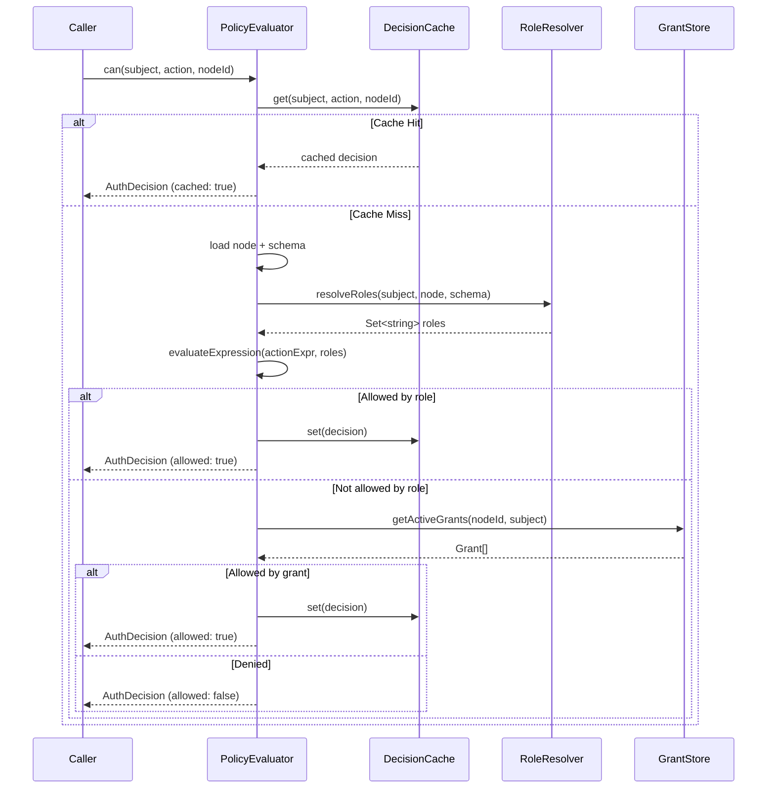

# 03: Authorization Engine

> Build the `PolicyEvaluator` that resolves roles, evaluates expressions, checks grants, and produces deterministic `AuthDecision` results with structured traces.

**Duration:** 5 days  
**Dependencies:** [02-schema-authorization-model.md](./02-schema-authorization-model.md)  
**Packages:** `packages/data/src/auth`

## Why This Step Exists

The evaluator is the heart of the authorization system. It takes a subject (DID), action, and resource (node), resolves the subject's roles from schema policy and node data, evaluates the action expression, checks UCAN grants, and returns a deterministic decision with an explainable trace.

## Responsibilities

1. **Role Resolution** — Determine what roles a DID holds for a given node.
2. **Expression Evaluation** — Evaluate the action's `AuthExpression` against resolved roles.
3. **Grant Checking** — Check if any active UCAN grant authorizes the action.
4. **Node Policy** — Apply node-level deny rules if present.
5. **Decision Caching** — Cache decisions with event-driven invalidation.
6. **Trace Generation** — Produce structured traces for the `explain()` API.

## Implementation

### 1. PolicyEvaluator Interface

```typescript
export interface PolicyEvaluator {
  /** Check if subject can perform action on resource */
  can(input: AuthCheckInput): Promise<AuthDecision>

  /** Check with full trace for debugging */
  explain(input: AuthCheckInput): Promise<AuthTrace>

  /** Invalidate cached decisions for a resource */
  invalidate(nodeId: string): void

  /** Invalidate all cached decisions for a subject */
  invalidateSubject(did: DID): void
}

export interface AuthCheckInput {
  subject: DID
  action: AuthAction
  nodeId: string
  /** Optional: pre-loaded node to avoid re-fetching */
  node?: Node
  /** Optional: patch for field-level checks on update */
  patch?: Record<string, unknown>
}
```

### 2. Role Resolution

```typescript
export interface RoleResolver {
  /** Resolve all roles a DID holds for a given node */
  resolveRoles(did: DID, node: Node, schema: Schema): Promise<Set<string>>
}

export class DefaultRoleResolver implements RoleResolver {
  constructor(
    private store: NodeStoreReader,
    private maxDepth: number = 3,
    private maxNodes: number = 100
  ) {}

  async resolveRoles(did: DID, node: Node, schema: Schema): Promise<Set<string>> {
    const roles = new Set<string>()
    const auth = deserializeAuthorization(schema.authorization!)

    for (const [roleName, resolver] of Object.entries(auth.roles)) {
      const hasRole = await this.checkRole(did, resolver, node, 0, new Set())
      if (hasRole) roles.add(roleName)
    }

    return roles
  }

  private async checkRole(
    did: DID,
    resolver: RoleResolverDef,
    node: Node,
    depth: number,
    visited: Set<string>
  ): Promise<boolean> {
    // Safety: depth and visited-set limits
    if (depth > this.maxDepth) return false
    if (visited.size > this.maxNodes) return false
    if (visited.has(node.id)) return false
    visited.add(node.id)

    switch (resolver._tag) {
      case 'creator':
        return did === node.createdBy

      case 'property': {
        const value = (node as Record<string, unknown>)[resolver.propertyName]
        if (Array.isArray(value)) return value.includes(did)
        return value === did
      }

      case 'relation': {
        // Traverse relation to target node, check role there
        const targetId = (node as Record<string, unknown>)[resolver.relationName]
        if (!targetId || typeof targetId !== 'string') return false

        const targetNode = await this.store.get(targetId)
        if (!targetNode) return false

        const targetSchema = await this.store.getSchema(targetNode.schemaId)
        if (!targetSchema?.authorization) return false

        const targetAuth = deserializeAuthorization(targetSchema.authorization)
        const targetResolver = targetAuth.roles[resolver.targetRole]
        if (!targetResolver) return false

        return this.checkRole(did, targetResolver, targetNode, depth + 1, visited)
      }
    }
  }
}
```

### 3. Expression Evaluation

Pure function — no side effects, deterministic:

```typescript
export function evaluateExpression(
  expr: AuthExpression,
  roles: Set<string>,
  isAuthenticated: boolean
): boolean {
  switch (expr._tag) {
    case 'allow':
      return expr.roles.some((r) => roles.has(r))

    case 'deny':
      return expr.roles.some((r) => roles.has(r))

    case 'and':
      return expr.exprs.every((e) => evaluateExpression(e, roles, isAuthenticated))

    case 'or':
      return expr.exprs.some((e) => evaluateExpression(e, roles, isAuthenticated))

    case 'not':
      return !evaluateExpression(expr.expr, roles, isAuthenticated)

    case 'roleRef':
      return roles.has(expr.role)

    case 'public':
      return true

    case 'authenticated':
      return isAuthenticated
  }
}
```

### 4. Full Evaluation Pipeline

```typescript
export class DefaultPolicyEvaluator implements PolicyEvaluator {
  private cache: DecisionCache
  private roleResolver: DefaultRoleResolver
  private grantStore: GrantStoreReader

  async can(input: AuthCheckInput): Promise<AuthDecision> {
    const start = performance.now()

    // 1. Check cache
    const cached = this.cache.get(input.subject, input.action, input.nodeId)
    if (cached) return { ...cached, cached: true, duration: performance.now() - start }

    // 2. Load node and schema
    const node = input.node ?? (await this.store.get(input.nodeId))
    if (!node) return this.deny(input, ['DENY_NOT_AUTHENTICATED'], start)

    const schema = await this.store.getSchema(node.schemaId)
    const authMode = getAuthMode(schema)

    // 3. Legacy mode: owner-only
    if (authMode === 'legacy') {
      const allowed = node.createdBy === input.subject
      return this.decision(input, allowed, allowed ? ['owner'] : [], start)
    }

    const auth = deserializeAuthorization(schema.authorization!)

    // 4. Check node-level explicit deny
    // (if node has deny rules stored as node properties)

    // 5. Resolve roles
    const roles = await this.roleResolver.resolveRoles(input.subject, node, schema)

    // 6. Evaluate action expression
    const actionExpr = auth.actions[input.action]
    if (!actionExpr) {
      // No rule for this action = deny by default
      return this.deny(input, ['DENY_NO_ROLE_MATCH'], start)
    }

    const allowedByRole = evaluateExpression(actionExpr, roles, !!input.subject)
    if (allowedByRole) {
      const decision = this.decision(input, true, [...roles], start)
      this.cache.set(input.subject, input.action, input.nodeId, decision)
      return decision
    }

    // 7. Check UCAN grants
    const grants = await this.grantStore.getActiveGrants(input.nodeId, input.subject)
    for (const grant of grants) {
      if (grant.actions.includes(input.action)) {
        const decision = this.decision(input, true, [...roles], start, [grant.id])
        this.cache.set(input.subject, input.action, input.nodeId, decision)
        return decision
      }
    }

    // 8. Deny
    return this.deny(input, ['DENY_NO_ROLE_MATCH', 'DENY_NO_GRANT'], start)
  }

  async explain(input: AuthCheckInput): Promise<AuthTrace> {
    // Same pipeline but records each step
    const steps: AuthTraceStep[] = []
    // ... (same logic with step recording) ...
    const decision = await this.can(input)
    return { ...decision, steps }
  }
}
```

### 5. Decision Cache

```typescript
export class DecisionCache {
  private cache = new Map<string, AuthDecision>()
  private maxSize = 10_000
  private defaultTTL = 30_000 // 30 seconds

  private key(subject: DID, action: string, nodeId: string): string {
    return `${subject}:${action}:${nodeId}`
  }

  get(subject: DID, action: string, nodeId: string): AuthDecision | null {
    const entry = this.cache.get(this.key(subject, action, nodeId))
    if (!entry) return null
    if (Date.now() - entry.evaluatedAt > this.defaultTTL) {
      this.cache.delete(this.key(subject, action, nodeId))
      return null
    }
    return entry
  }

  set(subject: DID, action: string, nodeId: string, decision: AuthDecision): void {
    if (this.cache.size >= this.maxSize) {
      // Evict oldest
      const oldest = this.cache.keys().next().value
      if (oldest) this.cache.delete(oldest)
    }
    this.cache.set(this.key(subject, action, nodeId), decision)
  }

  /** Invalidate all decisions for a node (on mutation) */
  invalidateNode(nodeId: string): void {
    for (const [key] of this.cache) {
      if (key.endsWith(`:${nodeId}`)) this.cache.delete(key)
    }
  }

  /** Invalidate all decisions for a subject (on grant/revoke) */
  invalidateSubject(did: DID): void {
    for (const [key] of this.cache) {
      if (key.startsWith(`${did}:`)) this.cache.delete(key)
    }
  }
}
```

## Evaluation Pipeline Diagram



## Tests

- Role resolution: creator role matches `createdBy`.
- Role resolution: property role matches DID in person property.
- Role resolution: relation role traverses to target node and checks role there.
- Role resolution: cycle detection terminates safely.
- Role resolution: depth limit (3) terminates safely.
- Role resolution: max-nodes limit (100) terminates safely.
- Expression evaluation: `allow('a', 'b')` with roles `{a}` → true.
- Expression evaluation: `and(allow('a'), allow('b'))` with roles `{a}` → false.
- Expression evaluation: `not(allow('banned'))` with roles `{}` → true.
- Expression evaluation: `PUBLIC` → always true.
- Full pipeline: owner can always write their own node.
- Full pipeline: non-owner without role → denied.
- Full pipeline: grantee with active grant → allowed.
- Full pipeline: grantee with expired grant → denied.
- Cache: second call returns cached result.
- Cache: invalidation clears relevant entries.
- Explain: returns structured trace with all steps.
- Determinism: same inputs produce same output across runs.

## Checklist

- [ ] `PolicyEvaluator` interface defined.
- [ ] `DefaultRoleResolver` with property, creator, and relation resolution.
- [ ] Cycle detection and depth/node limits in relation traversal.
- [ ] `evaluateExpression` pure function for all AST node types.
- [ ] `DefaultPolicyEvaluator` full pipeline implemented.
- [ ] `explain()` returns structured `AuthTrace`.
- [ ] `DecisionCache` with TTL, LRU eviction, and event invalidation.
- [ ] Field-level constraint checking for update patches.
- [ ] All tests passing.

---

[Back to README](./README.md) | [Previous: Schema Authorization Model](./02-schema-authorization-model.md) | [Next: NodeStore Enforcement →](./04-nodestore-enforcement.md)
