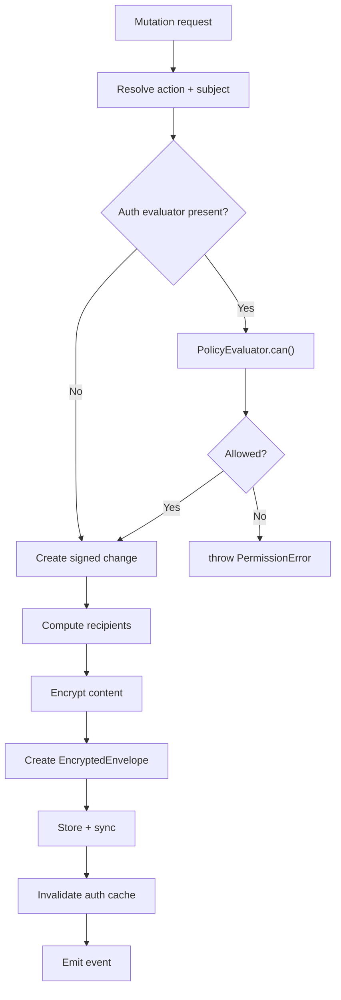

# 04: NodeStore Enforcement

> Wire authorization checks and transparent encryption into all NodeStore mutation paths, including remote sync apply.

**Duration:** 3 days  
**Dependencies:** [03-authorization-engine.md](./03-authorization-engine.md)  
**Packages:** `packages/data/src/store`

## Why This Step Exists

The NodeStore is the single gateway for all data mutations. Every `create`, `update`, `delete`, `restore`, and `applyRemoteChange` must pass through the authorization evaluator and produce encrypted envelopes. This step makes authorization and encryption invisible to application code — developers call `store.create()` and get encrypted, authorized data automatically.

## Current Baseline

- `NodeStore` performs signature/hash validation for remote changes.
- No authorization gate for any CRUD operation.
- No encryption layer — content is stored in plaintext.

## Implementation

### 1. Add Auth Dependencies to NodeStore

```typescript
export interface NodeStoreOptions {
  // ... existing fields ...

  /** Authorization evaluator (required for enforce mode) */
  authEvaluator?: PolicyEvaluator

  /** Public key resolver for encryption */
  publicKeyResolver?: PublicKeyResolver

  /** Content key cache for decryption */
  contentKeyCache?: ContentKeyCache

  /** Authorization mode override */
  authMode?: AuthMode
}
```

### 2. Enforce Local Mutation Paths

```typescript
class NodeStore {
  async create<S extends DefinedSchema>(
    schema: S,
    properties: InferCreateProps<S['_properties']>
  ): Promise<InferNode<S['_properties']>> {
    // 1. Auth check: can subject create nodes of this schema?
    if (this.authEvaluator) {
      const decision = await this.authEvaluator.can({
        subject: this.authorDID,
        action: 'write',
        nodeId: '', // New node, check schema-level
        node: { schemaId: schema.schema['@id'], createdBy: this.authorDID } as Node
      })
      if (!decision.allowed) {
        throw new PermissionError(decision)
      }
    }

    // 2. Create node (existing logic)
    const node = schema.create(properties, {
      id: createNodeId(),
      createdBy: this.authorDID
    })

    // 3. Compute recipients and encrypt
    if (this.publicKeyResolver && schema.schema.authorization) {
      const recipients = await computeRecipients(schema.schema, node, this)
      const envelope = await this.encryptNode(node, recipients)
      await this.storeEnvelope(envelope)
    }

    // 4. Create signed change and persist
    const change = await this.createSignedChange('create', node)
    await this.adapter.saveChange(change)

    return node
  }

  async update<S extends DefinedSchema>(
    schema: S,
    nodeId: string,
    patch: Partial<InferCreateProps<S['_properties']>>
  ): Promise<InferNode<S['_properties']>> {
    // 1. Auth check: can subject write this node?
    if (this.authEvaluator) {
      const decision = await this.authEvaluator.can({
        subject: this.authorDID,
        action: 'write',
        nodeId,
        patch
      })
      if (!decision.allowed) {
        throw new PermissionError(decision)
      }
    }

    // 2. Apply update (existing logic)
    const updated = await this.applyUpdate(schema, nodeId, patch)

    // 3. Recompute recipients if authorization-relevant properties changed
    if (this.isAuthRelevantChange(schema, patch)) {
      await this.recomputeAndUpdateRecipients(schema.schema, updated)
    }

    return updated
  }

  async remove(nodeId: string): Promise<void> {
    // 1. Auth check: can subject delete this node?
    if (this.authEvaluator) {
      const decision = await this.authEvaluator.can({
        subject: this.authorDID,
        action: 'delete',
        nodeId
      })
      if (!decision.allowed) {
        throw new PermissionError(decision)
      }
    }

    // 2. Soft delete (existing logic)
    await this.softDelete(nodeId)
  }
}
```

### 3. Enforce Remote Apply Path

```typescript
class NodeStore {
  async applyRemoteChange(change: SignedChange): Promise<void> {
    // 1. Cryptographic verification (existing)
    const verified = await this.verifyChange(change)
    if (!verified) {
      this.emit('change:rejected', { change, reason: 'invalid-signature' })
      return
    }

    // 2. Authorization check
    if (this.authEvaluator) {
      const action = this.inferActionFromChange(change)
      const decision = await this.authEvaluator.can({
        subject: change.authorDID,
        action,
        nodeId: change.payload.nodeId
      })

      if (!decision.allowed) {
        this.emit('change:rejected', {
          change,
          reason: 'unauthorized',
          decision
        })
        return // Silently reject unauthorized changes
      }
    }

    // 3. Apply change (existing logic)
    await this.applyVerifiedChange(change)

    // 4. Invalidate auth cache for this node
    this.authEvaluator?.invalidate(change.payload.nodeId)
  }

  private inferActionFromChange(change: SignedChange): AuthAction {
    switch (change.payload.type) {
      case 'create':
        return 'write'
      case 'update':
        return 'write'
      case 'delete':
        return 'delete'
      case 'restore':
        return 'write'
      default:
        return 'write'
    }
  }
}
```

### 4. Transparent Encryption/Decryption

```typescript
class NodeStore {
  /** Encrypt a node for storage/sync */
  private async encryptNode(node: Node, recipients: DID[]): Promise<EncryptedEnvelope> {
    const publicKeys = await this.publicKeyResolver!.resolveBatch(recipients)
    const content = this.serializeNodeContent(node)

    return createEncryptedEnvelope(content, this.extractMetadata(node), publicKeys, this.signingKey)
  }

  /** Decrypt a node from an encrypted envelope */
  private async decryptNode(envelope: EncryptedEnvelope): Promise<Node> {
    // 1. Check if we have the content key cached
    let contentKey = this.contentKeyCache?.get(envelope.id)

    if (!contentKey) {
      // 2. Try to unwrap the key for our DID
      const wrappedKey = envelope.encryptedKeys[this.authorDID]
      if (!wrappedKey) {
        throw new PermissionError({
          allowed: false,
          action: 'read',
          subject: this.authorDID,
          resource: envelope.id,
          reasons: ['DENY_NO_ROLE_MATCH']
        })
      }

      contentKey = unwrapKey(wrappedKey, this.encryptionPrivateKey)
      this.contentKeyCache?.set(envelope.id, contentKey)
    }

    // 3. Decrypt content
    const plaintext = decryptWithNonce(envelope.ciphertext, envelope.nonce, contentKey)
    return this.deserializeNodeContent(plaintext, envelope)
  }
}
```

### 5. Transaction Batch Authorization

All-or-nothing semantics:

```typescript
class NodeStore {
  async transaction(ops: BatchOperation[]): Promise<void> {
    if (this.authEvaluator) {
      // Check auth for ALL operations upfront
      const checks = await Promise.all(
        ops.map((op) =>
          this.authEvaluator!.can({
            subject: this.authorDID,
            action: op.type === 'delete' ? 'delete' : 'write',
            nodeId: op.nodeId,
            patch: op.patch
          })
        )
      )

      const denied = checks.filter((c) => !c.allowed)
      if (denied.length > 0) {
        throw new PermissionError({
          code: 'BATCH_PARTIAL_DENY',
          failedOps: denied,
          message: `${denied.length} of ${ops.length} operations denied`
        })
      }
    }

    // All checks passed, apply atomically
    await this.applyBatch(ops)
  }
}
```

### 6. PermissionError

```typescript
export class PermissionError extends Error {
  readonly code: string
  readonly action: AuthAction
  readonly nodeId: string
  readonly subject: DID
  readonly reasons: AuthDenyReason[]
  readonly decision?: AuthDecision

  constructor(
    decision: AuthDecision | { code: string; failedOps: AuthDecision[]; message: string }
  ) {
    super(
      'decision' in decision && 'action' in decision
        ? `Permission denied: ${decision.subject} cannot ${decision.action} on ${decision.resource}`
        : (decision as { message: string }).message
    )
    this.name = 'PermissionError'
    // ... assign fields ...
  }
}
```

## Mutation Flow



## Tests

- Local create: authorized user succeeds.
- Local create: unauthorized user throws `PermissionError`.
- Local update: editor can update.
- Local update: viewer cannot update.
- Local delete: admin can delete.
- Local delete: editor cannot delete.
- Remote apply: authorized change applied.
- Remote apply: unauthorized change silently rejected + event emitted.
- Transaction: all authorized → all applied.
- Transaction: one denied → none applied + `PermissionError`.
- Encryption: created node produces valid `EncryptedEnvelope`.
- Decryption: authorized recipient can decrypt.
- Decryption: unauthorized DID cannot decrypt (no wrapped key).
- Content key caching: second read uses cached key.
- Recipient recomputation: adding editor triggers recipient update.
- Legacy mode: no auth evaluator → no checks (backward compatible).

## Checklist

- [ ] `NodeStoreOptions` extended with auth dependencies.
- [ ] `create` path guarded by `can()`.
- [ ] `update` path guarded by `can()` with field-level patch.
- [ ] `delete` path guarded by `can()`.
- [ ] `applyRemoteChange` guarded after cryptographic verification.
- [ ] Transparent encryption on write path.
- [ ] Transparent decryption on read path.
- [ ] Content key caching for repeated reads.
- [ ] Recipient recomputation on auth-relevant property changes.
- [ ] Transaction batch uses all-or-nothing semantics.
- [ ] `PermissionError` with structured decision data.
- [ ] Auth cache invalidation on mutations.
- [ ] All tests passing.

---

[Back to README](./README.md) | [Previous: Authorization Engine](./03-authorization-engine.md) | [Next: Grants and Delegation →](./05-grants-and-delegation.md)
