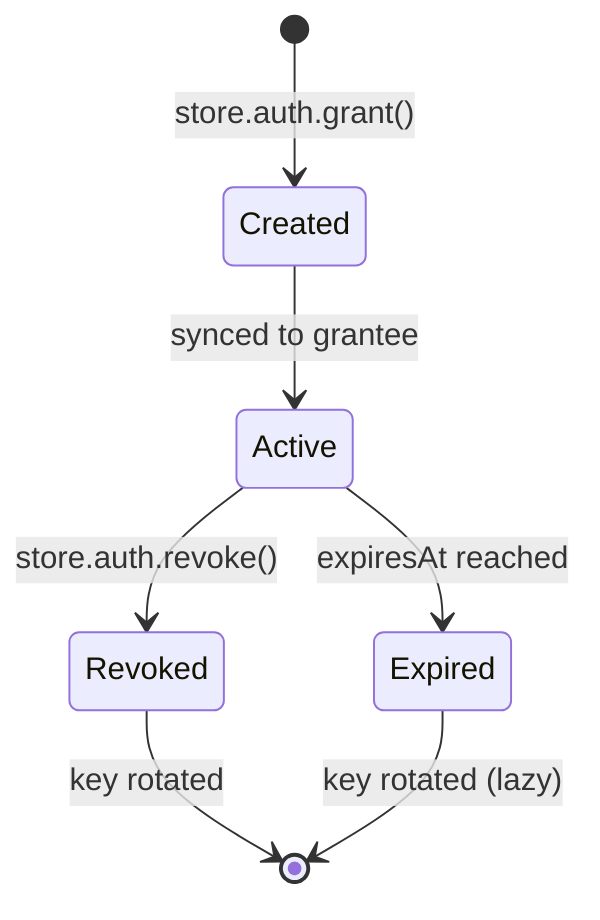
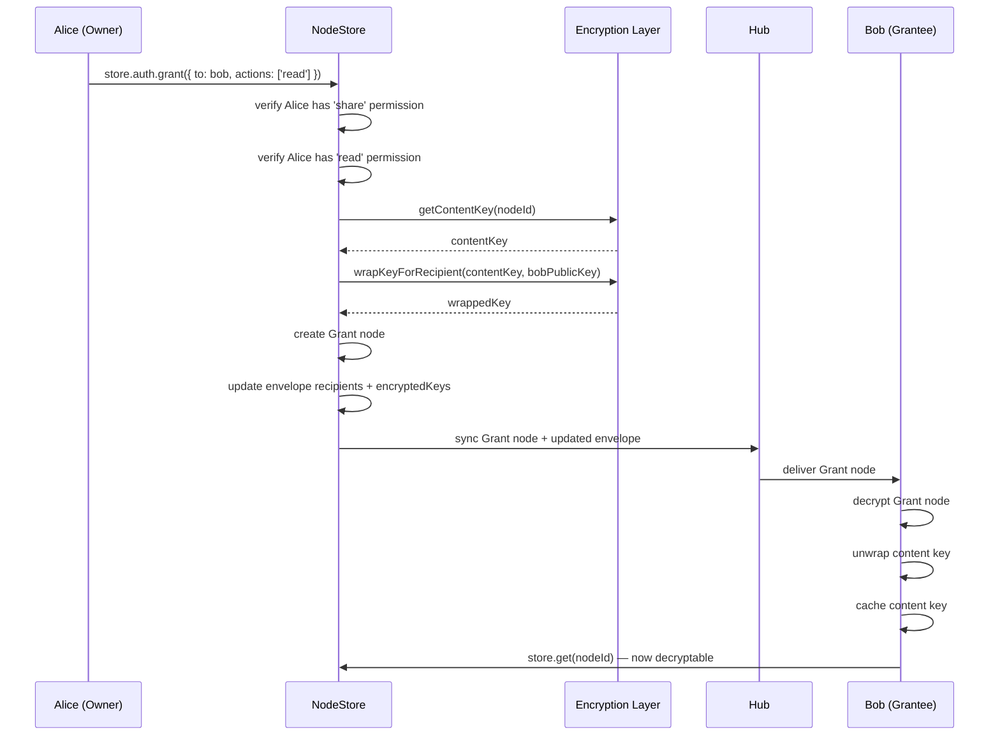

# 05: Grants and Delegation

> Implement the `store.auth` API for granting, revoking, and listing access using grants-as-nodes and UCAN delegation chains, with key distribution via encrypted envelopes.

**Duration:** 5 days  
**Dependencies:** [04-nodestore-enforcement.md](./04-nodestore-enforcement.md)  
**Packages:** `packages/data`, `packages/identity`

## Why This Step Exists

Grants are how users share access to specific nodes. A grant does three things simultaneously:

1. **Creates a Grant node** — a regular node that syncs via existing CRDT infrastructure.
2. **Distributes the content key** — wraps the node's content key for the grantee.
3. **Updates the recipients list** — adds the grantee to the encrypted envelope's recipients.

This step also integrates with existing UCAN infrastructure in `@xnetjs/identity` for cryptographic delegation chains.

## Implementation

### 1. Grant Schema

Grants are regular nodes using a built-in schema:

```typescript
import { defineSchema, text, number, person } from '@xnetjs/data'
import { allow, role } from '@xnetjs/data/auth'

export const GrantSchema = defineSchema({
  name: 'Grant',
  namespace: 'xnet://xnet.fyi/',
  properties: {
    /** Who issued this grant */
    issuer: person({ required: true }),
    /** Who receives access */
    grantee: person({ required: true }),
    /** Target node ID */
    resource: text({ required: true }),
    /** Target schema IRI */
    resourceSchema: text({ required: true }),
    /** Granted actions */
    actions: text({ required: true }), // JSON array: '["read","write"]'
    /** Expiration timestamp (0 = no expiry) */
    expiresAt: number(),
    /** Revocation timestamp (0 = not revoked) */
    revokedAt: number(),
    /** Who revoked (if revoked) */
    revokedBy: person(),
    /** UCAN token for portable delegation */
    ucanToken: text()
  },
  authorization: {
    roles: {
      owner: role.creator(),
      issuer: role.property('issuer'),
      grantee: role.property('grantee')
    },
    actions: {
      read: allow('issuer', 'grantee', 'owner'),
      write: allow('issuer', 'owner'), // Only issuer can modify
      delete: allow('issuer', 'owner'),
      share: allow('issuer', 'owner')
    }
  }
})
```

### 2. Store Auth API

```typescript
export interface StoreAuthAPI {
  /** Check if current user can perform action */
  can(input: {
    action: AuthAction
    nodeId: string
    patch?: Record<string, unknown>
  }): Promise<AuthDecision>

  /** Explain a decision (for debugging / AI agents) */
  explain(input: { action: AuthAction; nodeId: string }): Promise<AuthTrace>

  /** Grant access to another DID */
  grant(input: GrantInput): Promise<Grant>

  /** Revoke a grant */
  revoke(input: { grantId: string }): Promise<void>

  /** List active grants for a node */
  listGrants(input: { nodeId: string }): Promise<Grant[]>

  /** List grants issued by current user */
  listIssuedGrants(): Promise<Grant[]>

  /** List grants received by current user */
  listReceivedGrants(): Promise<Grant[]>
}

export interface GrantInput {
  /** Recipient DID */
  to: DID
  /** Actions to grant */
  actions: AuthAction[]
  /** Target node ID */
  resource: string
  /** Expiration (ISO duration or timestamp) */
  expiresIn?: string | number
}

export interface Grant {
  id: string
  issuer: DID
  grantee: DID
  resource: string
  resourceSchema: SchemaIRI
  actions: AuthAction[]
  expiresAt: number
  revokedAt?: number
  revokedBy?: DID
  ucanToken?: string
  createdAt: number
}
```

### 3. Grant Creation Flow

```typescript
class StoreAuth implements StoreAuthAPI {
  async grant(input: GrantInput): Promise<Grant> {
    // 1. Verify grantor has 'share' permission on the resource
    const canShare = await this.evaluator.can({
      subject: this.store.authorDID,
      action: 'share',
      nodeId: input.resource
    })
    if (!canShare.allowed) {
      throw new PermissionError(canShare)
    }

    // 2. Verify grantor has the actions they're granting (no escalation)
    for (const action of input.actions) {
      const canAction = await this.evaluator.can({
        subject: this.store.authorDID,
        action,
        nodeId: input.resource
      })
      if (!canAction.allowed) {
        throw new PermissionError({
          ...canAction,
          reasons: ['DENY_NO_ROLE_MATCH']
          // "Cannot grant 'write' — you don't have 'write' yourself"
        })
      }
    }

    // 3. Create UCAN token for portable delegation
    const ucanToken = await this.createDelegationUCAN(input)

    // 4. Get the resource node's content key
    const contentKey = await this.store.getContentKey(input.resource)

    // 5. Wrap content key for grantee
    const granteePublicKey = await this.publicKeyResolver.resolve(input.to)
    if (!granteePublicKey) {
      throw new Error(`Cannot resolve public key for ${input.to}`)
    }

    // 6. Create Grant node
    const grantNode = await this.store.create(GrantSchema, {
      issuer: this.store.authorDID,
      grantee: input.to,
      resource: input.resource,
      resourceSchema: (await this.store.get(input.resource)).schemaId,
      actions: JSON.stringify(input.actions),
      expiresAt: this.computeExpiration(input.expiresIn),
      revokedAt: 0,
      ucanToken
    })

    // 7. Update resource node's recipients list + encrypted keys
    await this.addRecipient(input.resource, input.to, contentKey, granteePublicKey)

    // 8. Invalidate auth cache
    this.evaluator.invalidateSubject(input.to)

    return this.toGrant(grantNode)
  }
}
```

### 4. Revocation Flow

```typescript
class StoreAuth implements StoreAuthAPI {
  async revoke(input: { grantId: string }): Promise<void> {
    // 1. Load grant
    const grant = await this.store.get(GrantSchema, input.grantId)
    if (!grant) throw new Error('Grant not found')

    // 2. Verify revoker has authority
    const canRevoke =
      grant.issuer === this.store.authorDID ||
      (
        await this.evaluator.can({
          subject: this.store.authorDID,
          action: 'share',
          nodeId: grant.resource
        })
      ).allowed

    if (!canRevoke) {
      throw new PermissionError({
        /* ... */
      })
    }

    // 3. Mark grant as revoked
    await this.store.update(GrantSchema, input.grantId, {
      revokedAt: Date.now(),
      revokedBy: this.store.authorDID
    })

    // 4. Key rotation: generate new content key and re-encrypt
    await this.rotateContentKey(grant.resource, grant.grantee)

    // 5. Invalidate caches
    this.evaluator.invalidateSubject(grant.grantee)
    this.evaluator.invalidate(grant.resource)
  }

  private async rotateContentKey(nodeId: string, excludeDid: DID): Promise<void> {
    // 1. Generate new content key
    const newKey = generateContentKey()

    // 2. Get current authorized recipients (excluding revoked)
    const node = await this.store.get(nodeId)
    const schema = await this.store.getSchema(node.schemaId)
    const recipients = await computeRecipients(schema, node, this.store)
    const filtered = recipients.filter((did) => did !== excludeDid)

    // 3. Re-encrypt content with new key
    const content = await this.store.getDecryptedContent(nodeId)
    const publicKeys = await this.publicKeyResolver.resolveBatch(filtered)

    const envelope = createEncryptedEnvelope(
      content,
      this.store.extractMetadata(node),
      publicKeys,
      this.store.signingKey
    )

    // 4. Store updated envelope
    await this.store.storeEnvelope(envelope)
  }
}
```

### 5. UCAN Integration

Bridge to existing `@xnetjs/identity` UCAN infrastructure:

```typescript
class StoreAuth {
  private async createDelegationUCAN(input: GrantInput): Promise<string> {
    const capabilities = input.actions.map((action) => ({
      with: `xnet://${this.store.authorDID}/node/${input.resource}`,
      can: `xnet/${action}`
    }))

    const expiration = this.computeExpiration(input.expiresIn)

    return createUCAN({
      issuer: this.store.authorDID,
      issuerKey: this.store.signingKey,
      audience: input.to,
      capabilities,
      expiration: Math.floor(expiration / 1000)
    })
  }
}
```

### 6. Revocation Consistency Modes

```typescript
export type RevocationConsistency = 'eventual' | 'strict'

/**
 * eventual (default): Use last-known revocation state. Fast, offline-friendly.
 * strict: Require fresh revocation watermark. Blocks on network if stale.
 */
export interface RevocationConfig {
  mode: RevocationConsistency
  /** Max age of revocation data before considered stale (ms) */
  maxStaleness: number // default: 30_000 (30s)
}
```

## Grant Lifecycle



## Key Distribution Flow



## Tests

- Grant creation: authorized grantor succeeds.
- Grant creation: unauthorized grantor throws `PermissionError`.
- Grant creation: cannot escalate (grant actions you don't have).
- Grant creation: produces valid UCAN token.
- Grant creation: wraps content key for grantee.
- Grant creation: updates recipients list on resource envelope.
- Revocation: issuer can revoke.
- Revocation: resource admin can revoke.
- Revocation: random user cannot revoke.
- Revocation: triggers key rotation.
- Revocation: excludes revoked DID from new recipients.
- Key rotation: old key no longer decrypts new envelope.
- Key rotation: remaining recipients can still decrypt.
- Grant listing: returns active grants for a node.
- Grant listing: excludes revoked and expired grants.
- UCAN token: valid signature and proof chain.
- UCAN token: attenuation prevents escalation.
- Sync: Grant node syncs to grantee via CRDT.
- Offline: cached content key works offline.

## Checklist

- [ ] `GrantSchema` defined as built-in schema.
- [ ] `StoreAuthAPI` interface implemented on NodeStore.
- [ ] `store.auth.grant()` with key distribution.
- [ ] `store.auth.revoke()` with key rotation.
- [ ] `store.auth.listGrants()` with active/expired/revoked filtering.
- [ ] UCAN token creation via `@xnetjs/identity`.
- [ ] Attenuation enforcement (no privilege escalation).
- [ ] Revocation consistency modes (`eventual` / `strict`).
- [ ] Content key caching for grantees.
- [ ] Auth cache invalidation on grant/revoke.
- [ ] All tests passing.

---

[Back to README](./README.md) | [Previous: NodeStore Enforcement](./04-nodestore-enforcement.md) | [Next: Hub and Peer Filtering →](./06-hub-and-peer-filtering.md)
