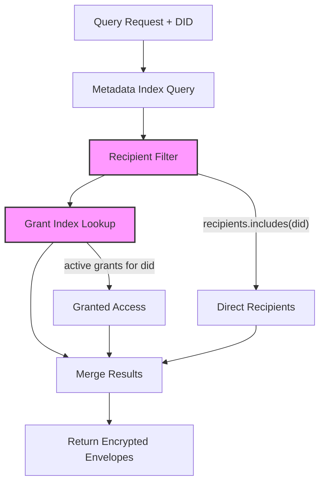
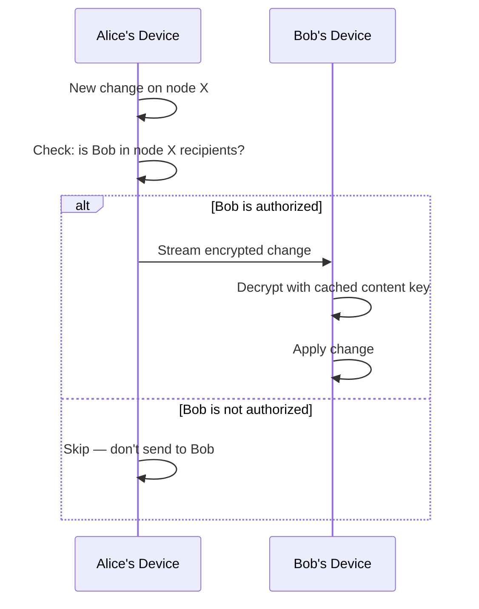

# 06: Hub and Peer Filtering

> Implement automatic authorization filtering on the hub and selective replication between peers, using recipient lists from encrypted envelopes.

**Duration:** 5 days  
**Dependencies:** [05-grants-and-delegation.md](./05-grants-and-delegation.md)  
**Packages:** `packages/hub`, `packages/network`, `packages/core`

## Why This Step Exists

The hub and peer sync layer must automatically filter data so that:

1. **Hub queries** only return envelopes the requesting DID can decrypt.
2. **Peer sync** only streams changes the receiving peer is authorized to see.
3. **Developers never manually filter** — authorization is transparent.

The hub is a "dumb filter" — it checks recipient lists in public metadata, never evaluates complex authorization rules, and never decrypts content.

## Implementation

### 1. Hub Metadata Index

The hub extracts and indexes public metadata from encrypted envelopes:

```typescript
// Hub storage schema (SQLite)
interface HubMetadataIndex {
  /** Node ID */
  id: string
  /** Schema IRI */
  schema: string
  /** Creator DID */
  createdBy: string
  /** Creation timestamp */
  createdAt: number
  /** Last update timestamp */
  updatedAt: number
  /** Lamport clock */
  lamport: number
  /** JSON array of recipient DIDs */
  recipients: string  // '["did:key:z6Mk...", "did:key:z6Mn..."]'
  /** JSON object of public properties */
  publicProps: string  // '{"title": "Buy milk", "status": "todo"}'
}

// Index creation
CREATE TABLE node_metadata (
  id TEXT PRIMARY KEY,
  schema TEXT NOT NULL,
  created_by TEXT NOT NULL,
  created_at INTEGER NOT NULL,
  updated_at INTEGER NOT NULL,
  lamport INTEGER NOT NULL,
  recipients TEXT NOT NULL,
  public_props TEXT
);

CREATE INDEX idx_schema ON node_metadata(schema);
CREATE INDEX idx_created_by ON node_metadata(created_by);
CREATE INDEX idx_updated_at ON node_metadata(updated_at);

-- Recipient lookup: JSON array search
CREATE INDEX idx_recipients ON node_metadata(recipients);
```

### 2. Hub Query Authorization Filter

```typescript
export async function executeAuthorizedQuery(
  did: DID,
  query: HubQuery,
  db: Database
): Promise<AuthorizedQueryResult> {
  // 1. Build base query from metadata index
  let sql = `SELECT * FROM node_metadata WHERE 1=1`
  const params: unknown[] = []

  if (query.schema) {
    sql += ` AND schema = ?`
    params.push(query.schema)
  }

  if (query.createdBy) {
    sql += ` AND created_by = ?`
    params.push(query.createdBy)
  }

  // ... other filters on public metadata ...

  // 2. Authorization filter: only return nodes where DID is a recipient
  sql += ` AND (
    recipients LIKE ? OR
    created_by = ?
  )`
  params.push(`%"${did}"%`, did)

  // 3. Execute query
  const candidates = await db.all(sql, params)

  // 4. Check active grants for nodes where DID is not a direct recipient
  const grantedNodeIds = await getGrantedNodeIds(did, db)
  const additionalNodes = await db.all(
    `SELECT * FROM node_metadata WHERE id IN (${grantedNodeIds.map(() => '?').join(',')})`,
    grantedNodeIds
  )

  const allResults = [...candidates, ...additionalNodes]

  // 5. Return encrypted envelopes
  const envelopes = await Promise.all(
    allResults.map((meta) => db.get(`SELECT envelope FROM node_envelopes WHERE id = ?`, meta.id))
  )

  return {
    results: envelopes.filter(Boolean),
    meta: {
      totalMatched: allResults.length,
      authorizedCount: allResults.length
      // Note: we don't know totalUnauthorized because we never query them
    }
  }
}
```

### 3. Hub Grant Index

Maintain a fast lookup for active grants:

```typescript
// Grant index table
CREATE TABLE grant_index (
  grant_id TEXT PRIMARY KEY,
  grantee TEXT NOT NULL,
  resource TEXT NOT NULL,
  actions TEXT NOT NULL,
  expires_at INTEGER NOT NULL,
  revoked_at INTEGER DEFAULT 0,
  created_at INTEGER NOT NULL
);

CREATE INDEX idx_grant_grantee ON grant_index(grantee);
CREATE INDEX idx_grant_resource ON grant_index(resource);
CREATE INDEX idx_grant_active ON grant_index(grantee, revoked_at, expires_at);

/** Get node IDs that a DID has active grants for */
async function getGrantedNodeIds(did: DID, db: Database): Promise<string[]> {
  const now = Date.now()
  const grants = await db.all(
    `SELECT DISTINCT resource FROM grant_index
     WHERE grantee = ?
     AND revoked_at = 0
     AND (expires_at = 0 OR expires_at > ?)`,
    [did, now],
  )
  return grants.map(g => g.resource)
}
```

### 4. Hub Action Bridge

Map hub-level actions to canonical authorization actions:

```typescript
export const HUB_ACTION_MAP: Record<string, AuthAction> = {
  'hub/query': 'read',
  'hub/subscribe': 'read',
  'hub/relay': 'write',
  'hub/admin': 'admin',
  'hub/connect': 'read' // Basic connection = read access
}

/** Verify hub-level UCAN capabilities */
export function verifyHubCapability(ucanPayload: UCANPayload, hubAction: string): boolean {
  const canonicalAction = HUB_ACTION_MAP[hubAction]
  if (!canonicalAction) return false

  return ucanPayload.att.some(
    (cap) =>
      cap.can === `xnet/${canonicalAction}` ||
      cap.can === 'xnet/*' ||
      cap.can === `xnet/${hubAction}`
  )
}
```

### 5. Peer Selective Sync

When peers sync directly (P2P), they should only send changes the receiving peer can decrypt:

```typescript
export class AuthorizedSyncProvider {
  /** Filter changes before sending to a peer */
  filterChangesForPeer(changes: SignedChange[], peerDid: DID): SignedChange[] {
    return changes.filter((change) => {
      // Check if peer is in the recipients list of the envelope
      const envelope = this.getEnvelope(change.payload.nodeId)
      if (!envelope) return false

      return envelope.recipients.includes(peerDid)
    })
  }

  /** Subscribe to changes, filtered by authorization */
  subscribeForPeer(peerDid: DID, callback: (change: SignedChange) => void): () => void {
    return this.store.subscribe((change) => {
      const envelope = this.getEnvelope(change.payload.nodeId)
      if (envelope?.recipients.includes(peerDid)) {
        callback(change)
      }
    })
  }
}
```

### 6. Structured Denial Responses

Hub returns structured auth failure payloads:

```typescript
export interface HubAuthError {
  code: 'UNAUTHORIZED' | 'FORBIDDEN' | 'TOKEN_EXPIRED' | 'TOKEN_REVOKED'
  message: string
  action: string
  resource?: string
  /** Debug info (only in development mode) */
  debug?: {
    reason: AuthDenyReason
    trace?: AuthTraceStep[]
  }
}
```

### 7. Drift Detection Tests

Contract tests ensure hub and store action constants stay in sync:

```typescript
import { AUTH_ACTIONS } from '@xnetjs/core'
import { HUB_ACTION_MAP } from '@xnetjs/hub'

describe('Hub/Store Action Drift', () => {
  it('every hub action maps to a valid canonical action', () => {
    for (const [hubAction, canonical] of Object.entries(HUB_ACTION_MAP)) {
      expect(AUTH_ACTIONS).toContain(canonical)
    }
  })

  it('every canonical action has at least one hub mapping', () => {
    const mappedActions = new Set(Object.values(HUB_ACTION_MAP))
    for (const action of ['read', 'write', 'admin']) {
      expect(mappedActions).toContain(action)
    }
  })
})
```

## Hub Query Flow



## Peer Sync Flow



## Tests

- Hub query: returns only nodes where DID is in recipients.
- Hub query: includes nodes from active grants.
- Hub query: excludes nodes with revoked grants.
- Hub query: excludes nodes with expired grants.
- Hub query: schema filter + auth filter combined correctly.
- Hub query: public metadata filters work (createdBy, schema, time range).
- Hub action bridge: all hub actions map to valid canonical actions.
- Hub action bridge: UCAN capability verification works.
- Peer sync: authorized changes are streamed.
- Peer sync: unauthorized changes are filtered out.
- Drift detection: hub/store action constants are in sync.
- Structured errors: unauthorized requests get proper error codes.
- Performance: 100-node result set filtered in < 50ms.

## Checklist

- [ ] Hub metadata index schema created.
- [ ] Hub query authorization filter implemented.
- [ ] Hub grant index for fast active-grant lookup.
- [ ] Hub action bridge mapping finalized.
- [ ] UCAN capability verification for hub actions.
- [ ] Peer selective sync filtering by recipients.
- [ ] Structured hub auth error responses.
- [ ] Drift detection contract tests.
- [ ] Query result metadata (counts) exposed.
- [ ] Performance benchmarks for hub query filtering.
- [ ] All tests passing.

---

[Back to README](./README.md) | [Previous: Grants and Delegation](./05-grants-and-delegation.md) | [Next: DX, DevTools, and Validation →](./07-dx-devtools-and-validation.md)
