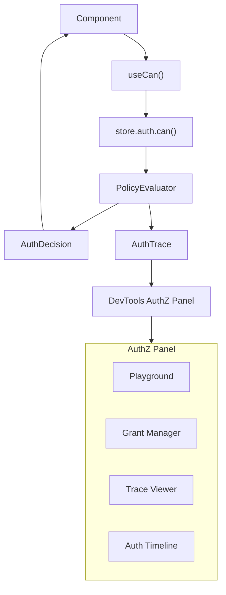

# 07: DX, DevTools, and Validation

> Ship React hooks, DevTools AuthZ panel, developer recipes, and AI/agent-friendly validation APIs.

**Duration:** 5 days  
**Dependencies:** [06-hub-and-peer-filtering.md](./06-hub-and-peer-filtering.md)  
**Packages:** `packages/react`, `packages/devtools`, `packages/data`

## Why This Step Exists

Authorization is only useful if developers can easily use it, debug it, and validate it. This step provides:

1. **React hooks** — `useCan()`, `useGrants()` for permission-aware UI.
2. **DevTools panel** — Live authorization state, permission playground, trace viewer.
3. **AI/agent validation** — Structured `explain()` API and schema introspection.
4. **Developer recipes** — Cookbook examples for common patterns.

## Implementation

### 1. React Hooks (`packages/react`)

#### `useCan` Hook

```typescript
export interface UseCanResult {
  canRead: boolean
  canWrite: boolean
  canDelete: boolean
  canShare: boolean
  loading: boolean
  error: Error | null
  /** Freshness metadata */
  isFresh: boolean
  evaluatedAt: number
}

export function useCan(nodeId: string): UseCanResult {
  const store = useStore()
  const [state, setState] = useState<UseCanResult>({
    canRead: false,
    canWrite: false,
    canDelete: false,
    canShare: false,
    loading: true,
    error: null,
    isFresh: false,
    evaluatedAt: 0
  })

  useEffect(() => {
    let cancelled = false

    async function check() {
      try {
        const [read, write, del, share] = await Promise.all([
          store.auth.can({ action: 'read', nodeId }),
          store.auth.can({ action: 'write', nodeId }),
          store.auth.can({ action: 'delete', nodeId }),
          store.auth.can({ action: 'share', nodeId })
        ])

        if (!cancelled) {
          setState({
            canRead: read.allowed,
            canWrite: write.allowed,
            canDelete: del.allowed,
            canShare: share.allowed,
            loading: false,
            error: null,
            isFresh: !read.cached,
            evaluatedAt: read.evaluatedAt
          })
        }
      } catch (err) {
        if (!cancelled) {
          setState((prev) => ({ ...prev, loading: false, error: err as Error }))
        }
      }
    }

    check()

    // Re-check on node changes or grant changes
    const unsub = store.subscribe(nodeId, () => check())

    return () => {
      cancelled = true
      unsub()
    }
  }, [store, nodeId])

  return state
}
```

#### Schema-Bound `useCan` (Type-Safe Actions)

```typescript
export function useCanForSchema<
  S extends { authorization: AuthorizationDefinition },
  A extends SchemaAction<S>
>(
  schema: S,
  nodeId: string,
  actions: readonly A[]
): {
  can: Record<A, boolean>
  loading: boolean
  isFresh: boolean
  evaluatedAt: number
} {
  // ... implementation with typed action keys ...
}
```

#### `useGrants` Hook

```typescript
export interface UseGrantsResult {
  grants: Grant[]
  loading: boolean
  error: Error | null
  /** Grant access to another DID */
  grant: (input: GrantInput) => Promise<Grant>
  /** Revoke a grant */
  revoke: (grantId: string) => Promise<void>
}

export function useGrants(nodeId: string): UseGrantsResult {
  const store = useStore()
  const [grants, setGrants] = useState<Grant[]>([])
  const [loading, setLoading] = useState(true)
  const [error, setError] = useState<Error | null>(null)

  useEffect(() => {
    let cancelled = false

    async function load() {
      try {
        const result = await store.auth.listGrants({ nodeId })
        if (!cancelled) {
          setGrants(result)
          setLoading(false)
        }
      } catch (err) {
        if (!cancelled) setError(err as Error)
      }
    }

    load()
    const unsub = store.subscribe(nodeId, () => load())
    return () => {
      cancelled = true
      unsub()
    }
  }, [store, nodeId])

  const grantFn = useCallback(
    (input: GrantInput) => store.auth.grant({ ...input, resource: nodeId }),
    [store, nodeId]
  )

  const revokeFn = useCallback((grantId: string) => store.auth.revoke({ grantId }), [store])

  return { grants, loading, error, grant: grantFn, revoke: revokeFn }
}
```

### 2. DevTools AuthZ Panel (`packages/devtools`)

Add a dedicated `AuthZ` tab to the DevTools shell:

#### Panel Registration

```typescript
// Add to panel registry
export const DEVTOOLS_PANELS = [
  // ... existing panels ...
  { id: 'authz', label: 'AuthZ', icon: ShieldIcon }
] as const

export type DevtoolsPanelId = (typeof DEVTOOLS_PANELS)[number]['id']
```

#### AuthZ Panel Component

```tsx
export function AuthZPanel() {
  return (
    <div className="flex flex-col h-full">
      <Tabs defaultValue="playground">
        <TabsList>
          <TabsTrigger value="playground">Playground</TabsTrigger>
          <TabsTrigger value="grants">Grants</TabsTrigger>
          <TabsTrigger value="trace">Trace Viewer</TabsTrigger>
          <TabsTrigger value="timeline">Timeline</TabsTrigger>
        </TabsList>

        <TabsContent value="playground">
          <PermissionPlayground />
        </TabsContent>

        <TabsContent value="grants">
          <GrantManager />
        </TabsContent>

        <TabsContent value="trace">
          <TraceViewer />
        </TabsContent>

        <TabsContent value="timeline">
          <AuthTimeline />
        </TabsContent>
      </Tabs>
    </div>
  )
}
```

#### Permission Playground

Interactive tool for testing authorization checks:

```tsx
function PermissionPlayground() {
  const [subject, setSubject] = useState('')
  const [action, setAction] = useState<AuthAction>('read')
  const [nodeId, setNodeId] = useState('')
  const [result, setResult] = useState<AuthTrace | null>(null)

  const handleCheck = async () => {
    const trace = await store.auth.explain({ action, nodeId })
    setResult(trace)
  }

  return (
    <div className="space-y-4 p-4">
      <div className="grid grid-cols-3 gap-2">
        <Input label="Subject DID" value={subject} onChange={setSubject} />
        <Select label="Action" value={action} options={AUTH_ACTIONS} onChange={setAction} />
        <Input label="Node ID" value={nodeId} onChange={setNodeId} />
      </div>
      <Button onClick={handleCheck}>Check Permission</Button>

      {result && (
        <div className="mt-4">
          <Badge variant={result.allowed ? 'success' : 'destructive'}>
            {result.allowed ? 'ALLOWED' : 'DENIED'}
          </Badge>
          <div className="mt-2 text-sm">
            <p>Roles: {result.roles.join(', ') || 'none'}</p>
            <p>Grants: {result.grants.join(', ') || 'none'}</p>
            <p>Duration: {result.duration.toFixed(2)}ms</p>
            {result.reasons.length > 0 && (
              <p className="text-red-500">Reasons: {result.reasons.join(', ')}</p>
            )}
          </div>

          <h4 className="mt-4 font-semibold">Evaluation Steps</h4>
          {result.steps.map((step, i) => (
            <TraceStepRow key={i} step={step} />
          ))}
        </div>
      )}
    </div>
  )
}
```

#### Auth Timeline

Shows recent authorization decisions in real-time:

```tsx
function AuthTimeline() {
  const events = useAuthEvents() // Subscribe to auth decision events

  return (
    <div className="space-y-1 p-4 font-mono text-xs">
      {events.map((event, i) => (
        <div key={i} className="flex items-center gap-2">
          <span className="text-muted-foreground">{formatTime(event.evaluatedAt)}</span>
          <Badge variant={event.allowed ? 'outline' : 'destructive'} className="text-xs">
            {event.allowed ? '✓' : '✗'}
          </Badge>
          <span>{event.action}</span>
          <span className="text-muted-foreground">{event.resource.slice(0, 8)}...</span>
          <span className="text-muted-foreground">{event.cached ? '(cached)' : ''}</span>
        </div>
      ))}
    </div>
  )
}
```

### 3. AI/Agent Validation API

The `explain()` API is designed for both human debugging and AI agent consumption:

```typescript
// AI agents can validate authorization rules programmatically
const trace = await store.auth.explain({
  action: 'write',
  nodeId: taskId
})

// Structured output for AI consumption
console.log(JSON.stringify(trace, null, 2))
// {
//   "allowed": true,
//   "action": "write",
//   "subject": "did:key:z6Mk...",
//   "resource": "abc123",
//   "roles": ["editor"],
//   "grants": [],
//   "reasons": [],
//   "cached": false,
//   "evaluatedAt": 1707500000000,
//   "duration": 2.3,
//   "steps": [
//     { "phase": "node-deny", "input": {}, "output": { "denied": false }, "duration": 0.1 },
//     { "phase": "role-resolve", "input": { "did": "..." }, "output": { "roles": ["editor"] }, "duration": 1.5 },
//     { "phase": "schema-eval", "input": { "expr": "allow(editor,admin,owner)" }, "output": { "match": true }, "duration": 0.3 }
//   ]
// }

// Schema introspection for AI
const schema = getSchema('xnet://myapp/Task')
const auth = schema.authorization
// AI can inspect: what roles exist? what actions are defined? what are the rules?
```

### 4. Developer Recipes

#### Gated Button

```tsx
function EditButton({ nodeId }: { nodeId: string }) {
  const { canWrite } = useCan(nodeId)
  return canWrite ? <Button>Edit</Button> : null
}
```

#### Optimistic Update with Preflight

```tsx
function TaskStatusToggle({ taskId }: { taskId: string }) {
  const { canWrite } = useCan(taskId)
  const { update } = useMutate()

  const toggle = async () => {
    if (!canWrite) {
      toast.error('You do not have permission to update this task')
      return
    }
    await update(TaskSchema, taskId, { status: 'done' })
  }

  return (
    <Button onClick={toggle} disabled={!canWrite}>
      Complete
    </Button>
  )
}
```

#### Share Dialog

```tsx
function ShareDialog({ nodeId }: { nodeId: string }) {
  const { canShare } = useCan(nodeId)
  const { grants, grant, revoke } = useGrants(nodeId)

  if (!canShare) return null

  return (
    <Dialog>
      <DialogTrigger asChild>
        <Button>Share</Button>
      </DialogTrigger>
      <DialogContent>
        <h3>Shared with</h3>
        {grants.map((g) => (
          <div key={g.id} className="flex items-center justify-between">
            <span>{g.grantee}</span>
            <span>{g.actions.join(', ')}</span>
            <Button variant="ghost" onClick={() => revoke(g.id)}>
              Revoke
            </Button>
          </div>
        ))}
        <ShareForm onShare={(did, actions) => grant({ to: did, actions, resource: nodeId })} />
      </DialogContent>
    </Dialog>
  )
}
```

## DevTools Integration Diagram



## Tests

- `useCan`: returns correct booleans for authorized/unauthorized user.
- `useCan`: re-evaluates on node change.
- `useCan`: re-evaluates on grant change.
- `useCan`: loading state transitions correctly.
- `useGrants`: lists active grants.
- `useGrants`: grant function creates grant.
- `useGrants`: revoke function revokes grant.
- `useCanForSchema`: type-safe action keys compile correctly.
- `useCanForSchema`: invalid action key fails at compile time.
- DevTools: AuthZ panel renders without errors.
- DevTools: Playground produces correct trace output.
- `explain()`: returns structured trace with all phases.
- `explain()`: JSON-serializable output for AI consumption.
- Schema introspection: authorization block is accessible and parseable.

## Checklist

- [ ] `useCan` hook implemented with loading/error/freshness state.
- [ ] `useCanForSchema` with typed action keys.
- [ ] `useGrants` hook with grant/revoke callbacks.
- [ ] DevTools `AuthZ` tab registered in panel registry.
- [ ] Permission Playground component.
- [ ] Trace Viewer component.
- [ ] Grant Manager component.
- [ ] Auth Timeline component.
- [ ] `explain()` API returns AI-friendly structured traces.
- [ ] Developer recipes documented with code examples.
- [ ] Hook freshness semantics documented for `eventual` and `strict` modes.
- [ ] All tests passing.

---

[Back to README](./README.md) | [Previous: Hub and Peer Filtering](./06-hub-and-peer-filtering.md) | [Next: Performance and Security →](./08-performance-and-security.md)
