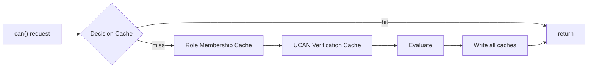
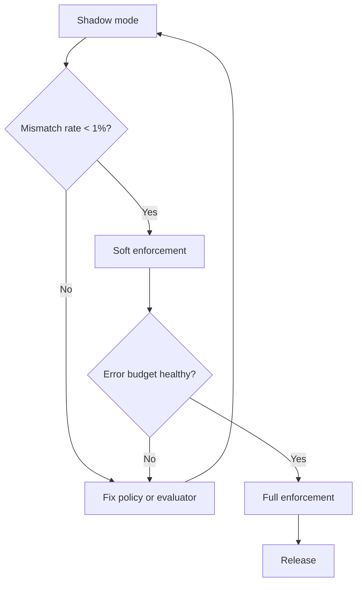

# 08: Performance and Security

> Meet latency targets with layered caches, harden against adversarial inputs, run staged rollout, and define release gates.

**Duration:** 5 days  
**Dependencies:** [07-dx-devtools-and-validation.md](./07-dx-devtools-and-validation.md)  
**Packages:** cross-cutting (`data`, `identity`, `hub`, `react`, `devtools`)

## Why This Step Exists

Authorization checks are in the critical path of every read and write. This step ensures they're fast enough for real-time UX, secure against adversarial inputs, and rolled out safely.

## Performance Targets

| Operation                          | Target P50 | Target P99 |
| ---------------------------------- | ---------- | ---------- |
| `can()` warm (cached)              | < 1ms      | < 5ms      |
| `can()` cold (uncached)            | < 10ms     | < 50ms     |
| `grant()`                          | < 20ms     | < 100ms    |
| `revoke()` with key rotation       | < 100ms    | < 500ms    |
| Hub query auth filter (100 nodes)  | < 50ms     | < 200ms    |
| Hub query auth filter (1000 nodes) | < 200ms    | < 1000ms   |
| Envelope encryption                | < 5ms      | < 20ms     |
| Envelope decryption                | < 2ms      | < 10ms     |

## Implementation

### 1. Layered Cache Architecture



#### Decision Cache (L1)

Caches final `AuthDecision` results:

```typescript
// Key: subject:action:nodeId
// TTL: 30 seconds (configurable)
// Invalidation: on node mutation, grant/revoke, schema change
// Max size: 10,000 entries (LRU eviction)
```

#### Role Membership Cache (L2)

Caches resolved role sets:

```typescript
// Key: subject:nodeId
// TTL: 60 seconds
// Invalidation: on node property mutation, relation change
// Max size: 5,000 entries
```

#### Content Key Cache (L3)

Caches unwrapped content keys:

```typescript
// Key: nodeId
// TTL: until revocation or key rotation
// Invalidation: on revocation event
// Max size: 50,000 entries
```

#### UCAN Verification Cache (L4)

Caches verified UCAN proof chains:

```typescript
// Key: token hash
// TTL: until token expiration
// Invalidation: on revocation
// Max size: 10,000 entries
```

### 2. Event-Driven Invalidation

```typescript
class CacheInvalidator {
  constructor(
    private decisionCache: DecisionCache,
    private roleCache: RoleMembershipCache,
    private keyCache: ContentKeyCache
  ) {}

  /** Called when a node is mutated */
  onNodeMutation(nodeId: string, changedProps: string[]): void {
    this.decisionCache.invalidateNode(nodeId)

    // Only invalidate role cache if auth-relevant properties changed
    if (this.isAuthRelevantProps(changedProps)) {
      this.roleCache.invalidateNode(nodeId)
    }
  }

  /** Called when a grant is created or revoked */
  onGrantChange(grantee: DID, resource: string): void {
    this.decisionCache.invalidateSubject(grantee)
    this.decisionCache.invalidateNode(resource)
  }

  /** Called when a revocation triggers key rotation */
  onKeyRotation(nodeId: string): void {
    this.keyCache.invalidate(nodeId)
  }
}
```

### 3. Benchmark Fixtures

Fixed benchmark fixtures checked into the repo for reproducible comparisons:

```typescript
// benchmarks/auth-fixtures.ts
export const FIXTURES = {
  small: {
    nodes: 1_000,
    maxRelationDepth: 2,
    maxProofDepth: 2,
    grantCount: 100,
    revocationRate: 0.05
  },
  medium: {
    nodes: 10_000,
    maxRelationDepth: 3,
    maxProofDepth: 4,
    grantCount: 1_000,
    revocationRate: 0.1
  },
  large: {
    nodes: 100_000,
    maxRelationDepth: 5,
    maxProofDepth: 6,
    grantCount: 10_000,
    revocationRate: 0.15
  }
}
```

### 4. Benchmark Suite

```typescript
import { bench, describe } from 'vitest'

describe('Authorization Performance', () => {
  bench('can() warm - simple role check', async () => {
    await evaluator.can({ subject: ownerDid, action: 'write', nodeId })
  })

  bench('can() cold - relation traversal depth 2', async () => {
    evaluator.invalidate(nodeId)
    await evaluator.can({ subject: editorDid, action: 'write', nodeId })
  })

  bench('grant() with key wrapping', async () => {
    await storeAuth.grant({ to: newDid, actions: ['read'], resource: nodeId })
  })

  bench('hub query filter - 100 nodes', async () => {
    await executeAuthorizedQuery(userDid, { schema: 'xnet://test/Task' }, db)
  })

  bench('envelope encrypt', async () => {
    createEncryptedEnvelope(content, metadata, recipientKeys, signingKey)
  })

  bench('envelope decrypt', async () => {
    decryptEnvelope(envelope, privateKey)
  })
})
```

## Security Hardening

### 1. Conformance Test Matrix

Must-cover scenarios:

- [ ] Deny beats allow in all combinations.
- [ ] Delegation attenuation cannot escalate.
- [ ] Revocation invalidates descendant delegations.
- [ ] Relation traversal cycles terminate safely.
- [ ] Remote unauthorized change rejection is deterministic.
- [ ] Hub query filtering excludes unauthorized nodes.
- [ ] Expired grants are not honored.
- [ ] Key rotation prevents revoked user from decrypting new content.
- [ ] Envelope signature verification catches tampering.

### 2. Adversarial and Fuzz Testing

```typescript
describe('Adversarial Tests', () => {
  it('rejects deeply nested expression trees', () => {
    // Build expression with 1000 nested levels
    let expr: AuthExpression = allow('owner')
    for (let i = 0; i < 1000; i++) {
      expr = and(expr, allow('owner'))
    }
    // Should be rejected at schema validation time
    expect(() => validateAuthorization({ actions: { read: expr }, roles: {} }, {})).toThrow(
      'AUTH_SCHEMA_EXPR_LIMIT_EXCEEDED'
    )
  })

  it('rejects relation traversal storms', async () => {
    // Create circular relation graph
    // A -> B -> C -> A
    // Evaluator should terminate within limits
    const decision = await evaluator.can({
      subject: userDid,
      action: 'read',
      nodeId: nodeA
    })
    // Should complete (not hang) and deny
    expect(decision.allowed).toBe(false)
  })

  it('rejects replay of revoked UCAN tokens', async () => {
    const grant = await storeAuth.grant({ to: bobDid, actions: ['read'], resource: nodeId })
    await storeAuth.revoke({ grantId: grant.id })

    // Try to use the revoked UCAN
    const decision = await evaluator.can({
      subject: bobDid,
      action: 'read',
      nodeId
    })
    expect(decision.allowed).toBe(false)
    expect(decision.reasons).toContain('DENY_UCAN_REVOKED')
  })

  it('prevents privilege escalation via grant', async () => {
    // Bob has 'read' access, tries to grant 'write'
    await expect(
      storeAuth.grant({ to: carolDid, actions: ['write'], resource: nodeId })
    ).rejects.toThrow('PermissionError')
  })
})
```

### 3. Abuse Limits

Every limit has a deterministic error code and metrics counter:

| Limit                         | Default | Error Code                        |
| ----------------------------- | ------- | --------------------------------- |
| Expression node count         | 50      | `AUTH_SCHEMA_EXPR_LIMIT_EXCEEDED` |
| Relation traversal depth      | 3       | `DENY_DEPTH_EXCEEDED`             |
| Relation traversal max nodes  | 100     | `DENY_DEPTH_EXCEEDED`             |
| UCAN proof chain depth        | 6       | `DENY_UCAN_INVALID`               |
| Grant constraint payload size | 4 KB    | `AUTH_SCHEMA_INVALID_FIELD_REF`   |

## Rollout Strategy

### Stage A: Shadow Evaluation



1. **Shadow mode**: Run evaluator alongside existing behavior, log mismatches.
2. **Soft enforcement**: Enforce on non-destructive paths (share actions), warn on others.
3. **Full enforcement**: Enable on all mutation paths + hub relay/query.

### Stage B: Feature Flags

```typescript
// Global feature flag
export const AUTH_FEATURE_FLAGS = {
  /** Enable authorization checks on local mutations */
  enforceLocal: false,
  /** Enable authorization checks on remote changes */
  enforceRemote: false,
  /** Enable hub query filtering */
  enforceHub: false,
  /** Enable encryption */
  enforceEncryption: false,
  /** Log authorization decisions for debugging */
  logDecisions: true
}
```

### Stage C: Operational Playbook

- **Fast rollback**: Set `enforceLocal: false` to disable all local auth checks.
- **Troubleshooting**: Use DevTools AuthZ panel to inspect decisions.
- **Monitoring**: Dashboard for deny rate, cache hit rate, revocation propagation lag.

## Release Gates

- [ ] All conformance tests pass.
- [ ] All adversarial/fuzz tests pass.
- [ ] Performance targets met in CI benchmarks.
- [ ] Hub query filtering correctly excludes unauthorized data.
- [ ] No high-severity findings from security review.
- [ ] Hub/store action mapping tests green.
- [ ] Developer docs and migration examples published.
- [ ] Feature flags allow staged rollout.
- [ ] Rollback procedure documented and tested.

## Memory Overhead

| Component               | Memory per 10K nodes | Notes                         |
| ----------------------- | -------------------- | ----------------------------- |
| Decision cache          | ~500 KB              | 50 cached results/node        |
| Role membership cache   | ~200 KB              | 20 role checks/node           |
| Content key cache       | ~320 KB              | 32 bytes/key                  |
| UCAN verification cache | ~1 MB                | ~100 bytes/token              |
| **Total**               | **~2 MB**            | Acceptable for desktop/mobile |

## Checklist

- [ ] Decision cache with LRU eviction and TTL.
- [ ] Role membership cache with event invalidation.
- [ ] Content key cache with revocation invalidation.
- [ ] UCAN verification cache with expiration.
- [ ] Event-driven cache invalidation wired to store events.
- [ ] Benchmark fixtures committed to repo.
- [ ] Benchmark suite with target assertions.
- [ ] Conformance test matrix complete.
- [ ] Adversarial and fuzz tests passing.
- [ ] Abuse limits enforced with deterministic error codes.
- [ ] Feature flags for staged rollout.
- [ ] Rollback procedure documented.
- [ ] Performance targets met in CI.

---

[Back to README](./README.md) | [Previous: DX, DevTools, and Validation](./07-dx-devtools-and-validation.md) | [Next: Yjs Document Authorization →](./09-yjs-document-authorization.md)
