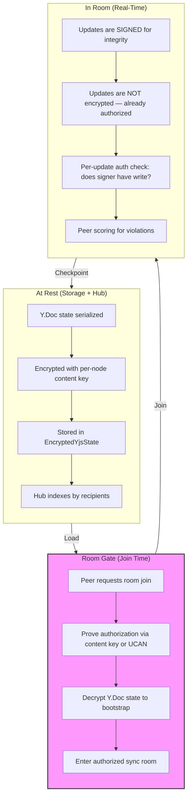
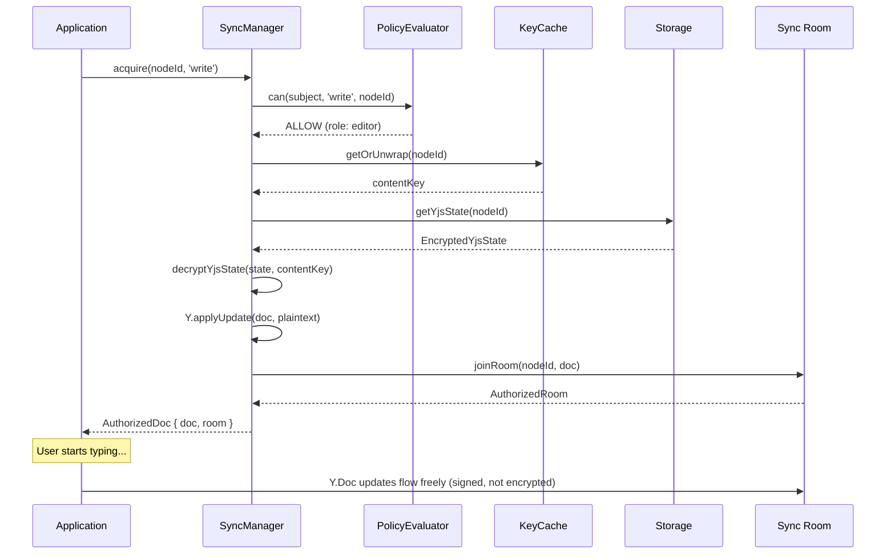
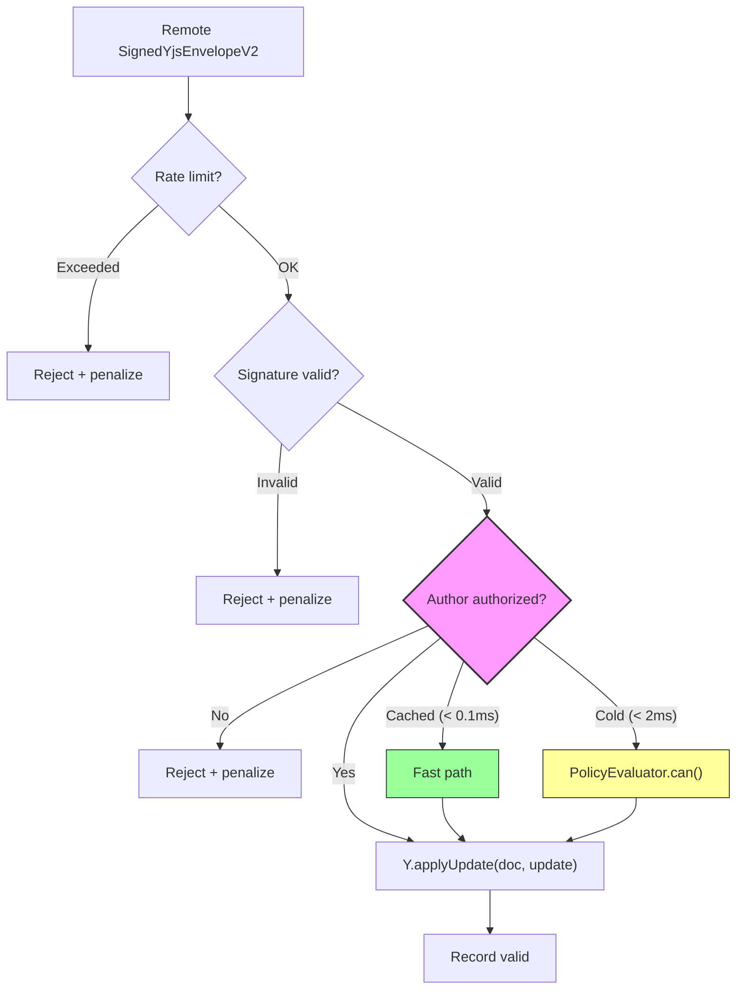
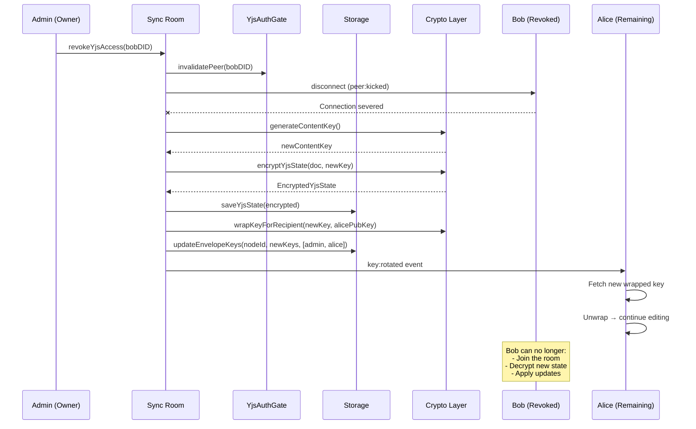
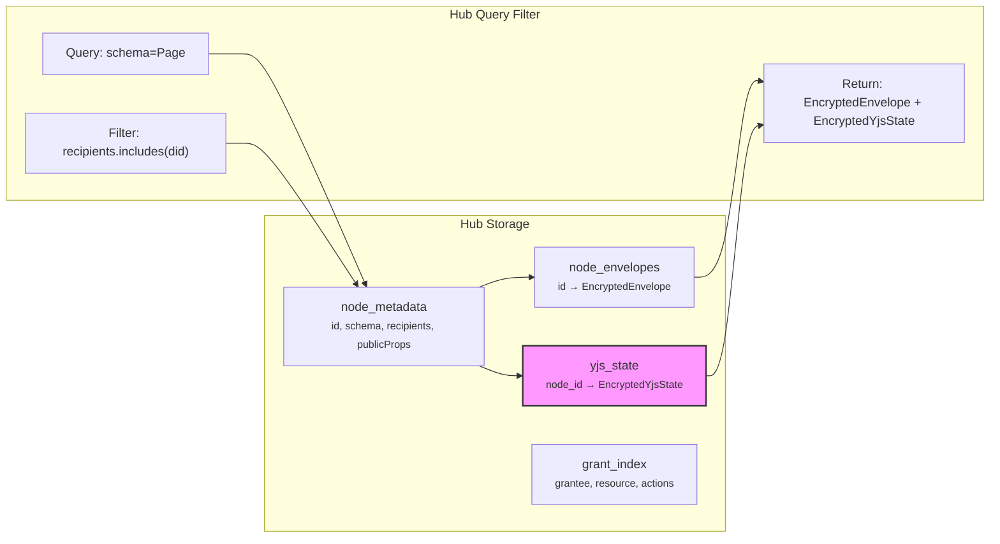
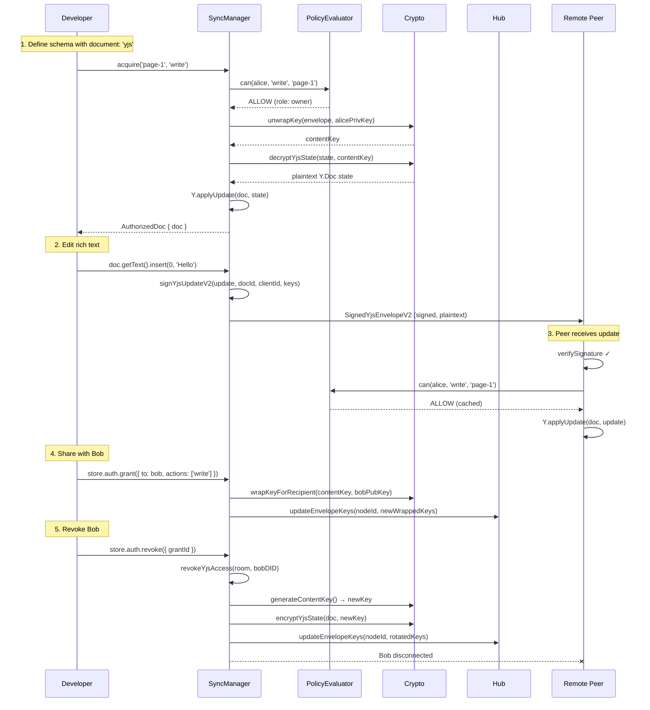
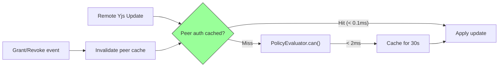

# 09: Yjs Document Authorization

> Extend the encryption-first authorization model to cover Yjs collaborative documents — encrypted at rest, room-gated in transit, with zero per-keystroke overhead and seamless DX.

**Duration:** 5 days  
**Dependencies:** [04-nodestore-enforcement.md](./04-nodestore-enforcement.md), [06-hub-and-peer-filtering.md](./06-hub-and-peer-filtering.md)  
**Packages:** `packages/sync`, `packages/data`, `packages/crypto`, `packages/react`, `packages/network`

## Why This Step Exists

Steps 01–08 build a complete authorization system for **structured node data** — properties flow through NodeStore, get encrypted into `EncryptedEnvelope`, and are filtered by recipients on the hub. But xNet has a **second data path** that those steps don't cover:

```
STRUCTURED DATA (covered by Steps 01–08):
  store.create/update/delete → Change<T> → EncryptedEnvelope → Hub

YJS DOCUMENTS (NOT covered — THIS step):
  Y.Doc.on('update') → SignedYjsEnvelope → WebRTC/WebSocket → Peers
```

Five built-in schemas use `document: 'yjs'` today: **Page, Task, Database, DatabaseRow, Canvas**. Every one of these has a Y.Doc containing rich text, canvas objects, or database cell content that currently flows **unencrypted and unauthorized** between peers.

### What exists today

| Layer             | Status | Details                                            |
| ----------------- | ------ | -------------------------------------------------- |
| Signing           | ✅     | Ed25519 + ML-DSA via `SignedYjsEnvelopeV2`         |
| Rate limiting     | ✅     | 30/sec, 600/min per peer                           |
| Peer scoring      | ✅     | Auto-block after violations                        |
| ClientID binding  | ✅     | DID↔clientID attestation                           |
| **Encryption**    | ❌     | Updates are plaintext                              |
| **Authorization** | ❌     | No permission check before applying remote updates |
| **Hub filtering** | ❌     | No encrypted Y.Doc state storage                   |

### Why the node model doesn't work directly

The `EncryptedEnvelope` model encrypts a node as a single blob. Yjs is different:

1. **Streaming** — Updates arrive at 5/sec per user during active editing. Encrypting each one with X25519 key wrapping would add ~1ms overhead per update, which is unacceptable at scale.
2. **Append-only** — You can't re-encrypt a CRDT history without breaking peers' state vectors.
3. **CRDT merge requires plaintext** — Yjs must see raw update bytes to merge; it can't merge ciphertext.
4. **State vectors leak structure** — Even without content, sync protocol metadata reveals document shape.

This step introduces a **two-tier model**: encrypt at rest, authorize at the room boundary, and let signed updates flow freely within authorized rooms.

## Core Design: Room-Gated Authorization



**The analogy**: A locked room. The lock is the content key. Once you're inside (authorized), conversation flows freely. You sign everything you say (integrity), but you don't encrypt it per-sentence (performance). If someone's access is revoked, you change the lock, kick them out, and give new keys to everyone remaining.

## Implementation

### 1. Encrypted Yjs State (`packages/crypto`)

Y.Doc state at rest uses the **same content key** as the node's `EncryptedEnvelope`:

```typescript
/**
 * Encrypted Y.Doc state for storage and hub sync.
 * Uses the same per-node content key as EncryptedEnvelope.
 */
export interface EncryptedYjsState {
  /** Node ID this Y.Doc belongs to */
  nodeId: string

  /** Format version */
  version: 1

  /** Encrypted Y.Doc state: XChaCha20(Y.encodeStateAsUpdate(doc)) */
  encryptedState: Uint8Array

  /** Nonce for XChaCha20 */
  nonce: Uint8Array

  /**
   * Unencrypted state vector for sync protocol.
   * Reveals which clients have contributed (by clientID) but NOT content.
   * Required so peers can compute missing updates without decrypting.
   */
  stateVector: Uint8Array

  /** BLAKE3 hash of plaintext state (for integrity on decrypt) */
  stateHash: Uint8Array

  /** Timestamp of last checkpoint */
  checkpointedAt: number

  /** Number of updates since last checkpoint */
  updatesSinceCheckpoint: number
}

/** Encrypt a Y.Doc state for storage */
export function encryptYjsState(
  doc: Y.Doc,
  nodeId: string,
  contentKey: Uint8Array
): EncryptedYjsState {
  const state = Y.encodeStateAsUpdate(doc)
  const stateVector = Y.encodeStateVector(doc)
  const stateHash = hash(state, 'blake3')
  const { ciphertext, nonce } = encryptWithNonce(state, contentKey)

  return {
    nodeId,
    version: 1,
    encryptedState: ciphertext,
    nonce,
    stateVector,
    stateHash,
    checkpointedAt: Date.now(),
    updatesSinceCheckpoint: 0
  }
}

/** Decrypt a Y.Doc state from storage */
export function decryptYjsState(encrypted: EncryptedYjsState, contentKey: Uint8Array): Uint8Array {
  const state = decryptWithNonce(encrypted.encryptedState, encrypted.nonce, contentKey)

  // Verify integrity
  const computedHash = hash(state, 'blake3')
  if (!constantTimeEqual(computedHash, encrypted.stateHash)) {
    throw new IntegrityError('Y.Doc state hash mismatch — possible tampering')
  }

  return state
}
```

### 2. Room Authorization Gate (`packages/sync`)

The `SyncManager.acquire()` method becomes the authorization checkpoint:

```typescript
export class AuthorizedSyncManager {
  private authorizedRooms = new Map<string, AuthorizedRoom>()

  /**
   * Acquire a Y.Doc for editing. This is the authorization gate.
   *
   * 1. Check read permission (can the user see this node?)
   * 2. Obtain content key (unwrap from EncryptedEnvelope)
   * 3. Decrypt Y.Doc state
   * 4. Join sync room (only if write permission)
   * 5. Return Y.Doc handle
   */
  async acquire(nodeId: string, mode: 'read' | 'write' = 'write'): Promise<AuthorizedDoc> {
    // 1. Authorization check
    const action = mode === 'write' ? 'write' : 'read'
    const decision = await this.evaluator.can({
      subject: this.authorDID,
      action,
      nodeId
    })

    if (!decision.allowed) {
      throw new PermissionError(decision)
    }

    // 2. Get content key (cached or unwrap from envelope)
    const contentKey = await this.keyCache.getOrUnwrap(nodeId, this.encryptionPrivateKey)

    // 3. Load and decrypt Y.Doc state
    const encrypted = await this.storage.getYjsState(nodeId)
    const doc = new Y.Doc({ guid: nodeId, gc: false })

    if (encrypted) {
      const state = decryptYjsState(encrypted, contentKey)
      Y.applyUpdate(doc, state)
    }

    // 4. Join sync room (if write mode)
    let room: AuthorizedRoom | undefined
    if (mode === 'write') {
      room = await this.joinRoom(nodeId, doc, contentKey)
    }

    // 5. Return authorized handle
    return {
      doc,
      nodeId,
      mode,
      contentKey,
      room,
      release: () => this.release(nodeId)
    }
  }

  private async joinRoom(
    nodeId: string,
    doc: Y.Doc,
    contentKey: Uint8Array
  ): Promise<AuthorizedRoom> {
    const room: AuthorizedRoom = {
      nodeId,
      doc,
      contentKey,
      authorizedPeers: new Set([this.authorDID]),
      authGate: new YjsAuthGate(this.evaluator, nodeId),
      createdAt: Date.now()
    }

    this.authorizedRooms.set(nodeId, room)
    return room
  }
}

export interface AuthorizedDoc {
  doc: Y.Doc
  nodeId: string
  mode: 'read' | 'write'
  contentKey: Uint8Array
  room?: AuthorizedRoom
  release: () => void
}

export interface AuthorizedRoom {
  nodeId: string
  doc: Y.Doc
  contentKey: Uint8Array
  authorizedPeers: Set<DID>
  authGate: YjsAuthGate
  createdAt: number
}
```



### 3. Yjs Auth Gate (`packages/sync`)

Every incoming remote Yjs update passes through the auth gate:

```typescript
/**
 * Authorization gate for incoming Yjs updates.
 * Sits between the network layer and Y.applyUpdate().
 */
export class YjsAuthGate {
  /** Cache of recent authorization decisions per peer */
  private peerAuthCache = new Map<DID, { allowed: boolean; expiresAt: number }>()

  /** Cache TTL — how long a peer's auth decision is trusted */
  private static CACHE_TTL = 30_000 // 30 seconds

  constructor(
    private evaluator: PolicyEvaluator,
    private nodeId: string
  ) {}

  /**
   * Check if a signed Yjs update should be applied.
   *
   * Fast path: cached decision (< 0.1ms)
   * Slow path: full evaluation (< 2ms)
   */
  async canApplyUpdate(envelope: SignedYjsEnvelopeV2): Promise<YjsAuthDecision> {
    const authorDID = envelope.meta.authorDID

    // 1. Fast path: check cache
    const cached = this.peerAuthCache.get(authorDID)
    if (cached && cached.expiresAt > Date.now()) {
      return {
        allowed: cached.allowed,
        authorDID,
        cached: true,
        reason: cached.allowed ? undefined : 'DENY_CACHED'
      }
    }

    // 2. Slow path: evaluate
    const decision = await this.evaluator.can({
      subject: authorDID,
      action: 'write',
      nodeId: this.nodeId
    })

    // 3. Cache the result
    this.peerAuthCache.set(authorDID, {
      allowed: decision.allowed,
      expiresAt: Date.now() + YjsAuthGate.CACHE_TTL
    })

    return {
      allowed: decision.allowed,
      authorDID,
      cached: false,
      reason: decision.allowed ? undefined : decision.reasons[0]
    }
  }

  /** Invalidate cache for a specific peer (on grant/revoke) */
  invalidatePeer(did: DID): void {
    this.peerAuthCache.delete(did)
  }

  /** Invalidate all cached decisions (on key rotation) */
  invalidateAll(): void {
    this.peerAuthCache.clear()
  }
}

export interface YjsAuthDecision {
  allowed: boolean
  authorDID: DID
  cached: boolean
  reason?: AuthDenyReason | 'DENY_CACHED'
}
```

### 4. Integration into Sync Pipeline

Wire the auth gate into the existing Yjs sync flow:

```typescript
/**
 * Authorized Yjs sync provider.
 * Wraps the existing sync provider with authorization checks.
 */
export class AuthorizedYjsSyncProvider {
  constructor(
    private room: AuthorizedRoom,
    private peerScorer: YjsPeerScorer,
    private rateLimiter: YjsRateLimiter
  ) {}

  /**
   * Handle an incoming signed Yjs update from a remote peer.
   * This is the complete verification pipeline.
   */
  async handleRemoteUpdate(envelope: SignedYjsEnvelopeV2): Promise<void> {
    const peerId = envelope.meta.authorDID

    // 1. Rate limit check (existing)
    if (!this.rateLimiter.allow(peerId)) {
      this.peerScorer.recordViolation(peerId, 'rate_exceeded')
      return
    }

    // 2. Signature verification (existing)
    const sigResult = await verifyYjsEnvelopeV2(envelope)
    if (!sigResult.valid) {
      this.peerScorer.recordViolation(peerId, 'invalid_signature')
      return
    }

    // 3. Authorization check (NEW)
    const authResult = await this.room.authGate.canApplyUpdate(envelope)
    if (!authResult.allowed) {
      this.peerScorer.recordViolation(peerId, 'unauthorized_update')
      this.emit('update:rejected', { peerId, reason: 'unauthorized', nodeId: this.room.nodeId })
      return
    }

    // 4. Apply update (existing)
    Y.applyUpdate(this.room.doc, envelope.update, 'remote')
    this.peerScorer.recordValid(peerId)
  }
}
```



### 5. Revocation for Y.Doc Rooms

When a peer's access is revoked, the room must be secured:

```typescript
/**
 * Handle revocation for a Y.Doc sync room.
 */
export async function revokeYjsAccess(
  room: AuthorizedRoom,
  revokedDID: DID,
  store: NodeStore,
  publicKeyResolver: PublicKeyResolver
): Promise<void> {
  // 1. Remove peer from authorized set
  room.authorizedPeers.delete(revokedDID)

  // 2. Invalidate auth cache for revoked peer
  room.authGate.invalidatePeer(revokedDID)

  // 3. Disconnect revoked peer from room
  room.doc.emit('peer:kicked', [revokedDID])

  // 4. Generate new content key
  const newContentKey = generateContentKey()

  // 5. Re-encrypt current Y.Doc state with new key
  const newEncryptedState = encryptYjsState(room.doc, room.nodeId, newContentKey)
  await store.adapter.saveYjsState(newEncryptedState)

  // 6. Wrap new key for remaining recipients
  const remainingDIDs = [...room.authorizedPeers]
  const publicKeys = await publicKeyResolver.resolveBatch(remainingDIDs)
  const newWrappedKeys: Record<string, WrappedKey> = {}
  for (const [did, pubKey] of publicKeys) {
    newWrappedKeys[did] = wrapKeyForRecipient(newContentKey, pubKey)
  }

  // 7. Update node envelope with new keys
  await store.updateEnvelopeKeys(room.nodeId, newWrappedKeys, remainingDIDs)

  // 8. Update room content key
  room.contentKey = newContentKey

  // 9. Notify remaining peers of key rotation
  room.doc.emit('key:rotated', [room.nodeId])
}
```



### 6. Schema Integration

Schemas with `document: 'yjs'` get authorization that covers **both** structured properties and the Y.Doc:

```typescript
const PageSchema = defineSchema({
  name: 'Page',
  namespace: 'xnet://myapp/',
  properties: {
    title: text({ required: true }),
    editors: person({ multiple: true }),
    project: relation({ schema: 'xnet://myapp/Project' })
  },
  document: 'yjs', // ← Enables Y.Doc for rich text body
  authorization: {
    roles: {
      owner: role.creator(),
      editor: role.property('editors'),
      projectAdmin: role.relation('project', 'admin'),
      projectViewer: role.relation('project', 'viewer')
    },
    actions: {
      // These apply to BOTH structured properties AND the Y.Doc
      read: allow('owner', 'editor', 'projectAdmin', 'projectViewer'),
      write: allow('owner', 'editor', 'projectAdmin'),
      delete: allow('owner', 'projectAdmin'),
      share: allow('owner', 'projectAdmin')
    }
  }
})
```

The authorization model is identical for both data paths. The **same roles and actions** govern:

- `store.update(PageSchema, id, { title: 'New Title' })` — structured property update
- `doc.getText('content').insert(0, 'Hello')` — Y.Doc rich text edit

Both check `can(subject, 'write', nodeId)` using the same `PolicyEvaluator`. The only difference is **where** the check happens:

- Structured: Inside `NodeStore.update()` (Step 04)
- Y.Doc: Inside `SyncManager.acquire()` (room join) and `YjsAuthGate.canApplyUpdate()` (per-update)

### 7. Hub Storage of Encrypted Y.Doc State

The hub stores encrypted Y.Doc snapshots alongside encrypted node envelopes:

```typescript
// Hub storage schema — additions for Yjs
CREATE TABLE yjs_state (
  node_id TEXT PRIMARY KEY,
  version INTEGER NOT NULL,
  encrypted_state BLOB NOT NULL,
  nonce BLOB NOT NULL,
  state_vector BLOB NOT NULL,
  state_hash BLOB NOT NULL,
  checkpointed_at INTEGER NOT NULL,
  updates_since_checkpoint INTEGER NOT NULL DEFAULT 0,
  FOREIGN KEY (node_id) REFERENCES node_metadata(id)
);

-- Hub uses same recipient filtering as nodes
-- A peer can fetch Y.Doc state only if they're in the node's recipients list
```



### 8. Periodic Checkpoint

Y.Doc state grows as updates accumulate. Periodic checkpointing compacts and re-encrypts:

```typescript
export class YjsCheckpointer {
  /** Checkpoint triggers */
  private static MAX_UPDATES = 100
  private static MAX_AGE_MS = 60 * 60 * 1000 // 1 hour

  /**
   * Check if a Y.Doc needs checkpointing.
   */
  shouldCheckpoint(state: EncryptedYjsState): boolean {
    const age = Date.now() - state.checkpointedAt
    return (
      state.updatesSinceCheckpoint >= YjsCheckpointer.MAX_UPDATES ||
      age >= YjsCheckpointer.MAX_AGE_MS
    )
  }

  /**
   * Checkpoint a Y.Doc: compact state + re-encrypt.
   */
  async checkpoint(doc: Y.Doc, nodeId: string, contentKey: Uint8Array): Promise<EncryptedYjsState> {
    return encryptYjsState(doc, nodeId, contentKey)
  }
}
```

## Full Lifecycle



## Performance

### Targets

| Operation                  | Target P50 | Target P99 | Notes                                  |
| -------------------------- | ---------- | ---------- | -------------------------------------- |
| Room join (auth + decrypt) | < 50ms     | < 150ms    | One-time cost per document open        |
| Y.Doc state decrypt (1MB)  | < 5ms      | < 10ms     | XChaCha20 is ~1GB/s                    |
| Per-update auth (cached)   | < 0.1ms    | < 0.5ms    | Map lookup — must NOT slow typing      |
| Per-update auth (cold)     | < 2ms      | < 5ms      | Rare — only first update from new peer |
| Revocation + re-encrypt    | < 200ms    | < 500ms    | Async — not on editing critical path   |
| Checkpoint encrypt (1MB)   | < 10ms     | < 20ms     | Periodic, background                   |
| Key rotation + distribute  | < 100ms    | < 300ms    | Per-recipient wrapping is parallel     |

### Why Per-Update Encryption Is Impractical

| Approach                      | Cost per update | At 5 updates/sec × 4 peers | Verdict                      |
| ----------------------------- | --------------- | -------------------------- | ---------------------------- |
| XChaCha20 encrypt each update | ~0.05ms         | ~1ms/sec                   | Marginal but adds up         |
| X25519 key wrap per update    | ~1ms            | ~20ms/sec                  | Too expensive                |
| Re-derive shared secret       | ~0.5ms          | ~10ms/sec                  | Still expensive              |
| **Room-gated (this plan)**    | **0ms**         | **0ms**                    | **Zero per-update overhead** |

The room-gated model provides equivalent security:

- **Confidentiality**: Only peers who passed the auth gate can join the room. No eavesdropping.
- **Integrity**: Every update is signed. Tampered updates are rejected.
- **Authorization**: The auth gate checks `can(subject, 'write', nodeId)` before room join. Per-update checks are cached and nearly free.
- **Revocation**: Revoking a peer kicks them from the room immediately. New content key prevents re-join.

### Cache Strategy



The per-peer auth cache has a 30-second TTL. This means:

- **During active editing**: Cache is warm, auth check is a Map lookup (~0.05ms)
- **After revocation**: Cache is invalidated immediately via event, next update triggers fresh eval
- **Worst case**: 1 cold evaluation per peer per 30 seconds (~2ms)

## Developer Experience

### Zero Auth Code for Rich Text

Developers write normal schema + component code. Authorization is invisible:

```typescript
// Schema: authorization applies to both properties AND Y.Doc
const PageSchema = defineSchema({
  name: 'Page',
  namespace: 'xnet://myapp/',
  properties: {
    title: text({ required: true }),
    editors: person({ multiple: true })
  },
  document: 'yjs',
  authorization: {
    roles: {
      owner: role.creator(),
      editor: role.property('editors')
    },
    actions: {
      read: allow('owner', 'editor'),
      write: allow('owner', 'editor'),
      delete: allow('owner'),
      share: allow('owner')
    }
  }
})

// Component: useNode handles auth + Y.Doc acquisition transparently
function PageEditor({ pageId }: { pageId: string }) {
  const { data, doc, update } = useNode(PageSchema, pageId)
  // ↑ Auth check happened inside useNode.
  //   If denied, doc is null and data is undefined.

  if (!doc) return <NoAccess />

  return (
    <>
      <TitleInput value={data.title} onChange={(t) => update({ title: t })} />
      <RichTextEditor doc={doc} />
    </>
  )
}
```

### `useCanEdit` Hook

Permission-aware hook for gating edit UI:

```typescript
export interface UseCanEditResult {
  /** Can the user edit this document's rich text content? */
  canEdit: boolean
  /** Can the user read but not edit? */
  canView: boolean
  /** Is the authorization check still loading? */
  loading: boolean
  /** Error during auth check */
  error: Error | null
  /** Current user's roles on this node */
  roles: string[]
}

export function useCanEdit(nodeId: string): UseCanEditResult {
  const store = useStore()
  const [state, setState] = useState<UseCanEditResult>({
    canEdit: false,
    canView: false,
    loading: true,
    error: null,
    roles: []
  })

  useEffect(() => {
    let cancelled = false

    async function check() {
      try {
        const [read, write] = await Promise.all([
          store.auth.can({ action: 'read', nodeId }),
          store.auth.can({ action: 'write', nodeId })
        ])

        if (!cancelled) {
          setState({
            canEdit: write.allowed,
            canView: read.allowed && !write.allowed,
            loading: false,
            error: null,
            roles: [...new Set([...read.roles, ...write.roles])]
          })
        }
      } catch (err) {
        if (!cancelled) {
          setState((prev) => ({ ...prev, loading: false, error: err as Error }))
        }
      }
    }

    check()
    const unsub = store.subscribe(nodeId, () => check())
    return () => {
      cancelled = true
      unsub()
    }
  }, [store, nodeId])

  return state
}
```

Usage:

```tsx
function PageToolbar({ pageId }: { pageId: string }) {
  const { canEdit, canView, loading } = useCanEdit(pageId)

  if (loading) return <Spinner />

  return (
    <div>
      {canEdit && <EditToggle />}
      {canView && !canEdit && <ViewOnlyBadge />}
      {!canView && <NoAccessMessage />}
    </div>
  )
}
```

### DevTools Integration

The AuthZ panel (Step 07) is extended with Y.Doc-specific state:

```tsx
function YjsAuthPanel({ nodeId }: { nodeId: string }) {
  const room = useAuthorizedRoom(nodeId)

  if (!room) return <p className="text-muted-foreground">No active Y.Doc room</p>

  return (
    <div className="space-y-4 p-4">
      <h4 className="font-semibold">Y.Doc Room: {nodeId.slice(0, 8)}...</h4>

      {/* Authorized Peers */}
      <div>
        <h5 className="text-sm font-medium">Authorized Peers</h5>
        {[...room.authorizedPeers].map((did) => (
          <div key={did} className="flex items-center gap-2 text-sm">
            <Badge variant="outline">{did.slice(0, 16)}...</Badge>
            <span className="text-muted-foreground">
              {room.authGate.getCachedDecision(did)?.allowed ? '✓ cached' : '? uncached'}
            </span>
          </div>
        ))}
      </div>

      {/* Room Stats */}
      <div className="grid grid-cols-2 gap-2 text-sm">
        <div>Room age: {formatDuration(Date.now() - room.createdAt)}</div>
        <div>Content key age: {formatDuration(Date.now() - room.keyRotatedAt)}</div>
        <div>Updates applied: {room.updateCount}</div>
        <div>Updates rejected: {room.rejectedCount}</div>
      </div>
    </div>
  )
}
```

### Error Messages

Clear, actionable errors when authorization fails:

```typescript
// Acquiring a Y.Doc without permission
try {
  const { doc } = await syncManager.acquire('page-123', 'write')
} catch (err) {
  if (err instanceof PermissionError) {
    // err.message: "Permission denied: did:key:z6Mk... cannot write on page-123"
    // err.action: 'write'
    // err.roles: [] (user has no roles)
    // err.reasons: ['DENY_NO_ROLE_MATCH']
  }
}

// Remote peer's update rejected (logged, not thrown)
syncProvider.on('update:rejected', ({ peerId, reason, nodeId }) => {
  console.warn(`Rejected Yjs update from ${peerId} on ${nodeId}: ${reason}`)
})
```

## Tests

### Unit Tests

- `encryptYjsState` → round-trip: encrypt → decrypt → states match.
- `encryptYjsState` → integrity: tampered ciphertext throws `IntegrityError`.
- `encryptYjsState` → wrong key: decrypt with wrong key throws.
- `decryptYjsState` → verifies BLAKE3 hash on decrypt.
- `YjsAuthGate.canApplyUpdate` → authorized peer returns `allowed: true`.
- `YjsAuthGate.canApplyUpdate` → unauthorized peer returns `allowed: false`.
- `YjsAuthGate.canApplyUpdate` → cached decision returned within TTL.
- `YjsAuthGate.canApplyUpdate` → cache miss triggers fresh evaluation.
- `YjsAuthGate.invalidatePeer` → evicts cached decision.
- `YjsAuthGate.invalidateAll` → clears entire cache.
- `AuthorizedSyncManager.acquire` → authorized user gets Y.Doc.
- `AuthorizedSyncManager.acquire` → unauthorized user throws `PermissionError`.
- `AuthorizedSyncManager.acquire('read')` → read-only mode, no room join.
- `AuthorizedYjsSyncProvider.handleRemoteUpdate` → authorized update applied.
- `AuthorizedYjsSyncProvider.handleRemoteUpdate` → unauthorized update rejected + peer penalized.
- `AuthorizedYjsSyncProvider.handleRemoteUpdate` → rate-limited update rejected.
- `revokeYjsAccess` → revoked peer removed from room.
- `revokeYjsAccess` → new content key generated.
- `revokeYjsAccess` → Y.Doc state re-encrypted with new key.
- `revokeYjsAccess` → remaining peers can still edit.
- `revokeYjsAccess` → revoked peer cannot re-join.

### Integration Tests

- End-to-end: create page → edit rich text → share → recipient can edit → revoke → recipient cannot edit.
- Hub round-trip: encrypt Y.Doc state → store on hub → retrieve (authorized) → decrypt.
- Hub filtering: unauthorized peer cannot fetch `EncryptedYjsState`.
- Peer sync: two authorized peers can collaboratively edit via signed updates.
- Peer sync: unauthorized peer's updates are rejected by auth gate.
- Checkpoint: after 100 updates, Y.Doc state is compacted and re-encrypted.
- Key rotation: after revocation, old content key cannot decrypt new state.

### Performance Tests

- `YjsAuthGate.canApplyUpdate` cached: < 0.1ms p50.
- `YjsAuthGate.canApplyUpdate` cold: < 2ms p50.
- `encryptYjsState` (1MB doc): < 10ms p50.
- `decryptYjsState` (1MB doc): < 5ms p50.
- Room join (auth + decrypt): < 50ms p50.
- Revocation + re-encrypt: < 200ms p50.

## Checklist

- [ ] `EncryptedYjsState` type defined in `packages/crypto`.
- [ ] `encryptYjsState()` and `decryptYjsState()` implemented with BLAKE3 integrity check.
- [ ] `AuthorizedSyncManager.acquire()` gates Y.Doc access with `PolicyEvaluator.can()`.
- [ ] `AuthorizedRoom` type tracks authorized peers and auth gate per room.
- [ ] `YjsAuthGate` implemented with per-peer cached authorization decisions.
- [ ] `YjsAuthGate` cache TTL is 30 seconds, invalidated on grant/revoke events.
- [ ] `AuthorizedYjsSyncProvider.handleRemoteUpdate()` wired into existing pipeline (rate limit → verify → **auth gate** → apply).
- [ ] Unauthorized Yjs updates trigger peer scoring penalty (`unauthorized_update` violation).
- [ ] `revokeYjsAccess()` generates new content key, re-encrypts state, kicks peer.
- [ ] Key rotation wraps new key for remaining recipients and updates envelope.
- [ ] Hub stores `EncryptedYjsState` alongside `EncryptedEnvelope`.
- [ ] Hub query returns `EncryptedYjsState` only if DID is in recipients list.
- [ ] `YjsCheckpointer` compacts Y.Doc state every 100 updates or 1 hour.
- [ ] Schema with `document: 'yjs'` uses same `authorization` block for both properties and Y.Doc.
- [ ] `useCanEdit()` hook implemented with read/write distinction.
- [ ] DevTools AuthZ panel shows Y.Doc room state (peers, key age, update counts).
- [ ] Error messages for Y.Doc auth failures are clear and actionable.
- [ ] All unit tests passing.
- [ ] All integration tests passing.
- [ ] Performance targets met in benchmarks.

---

[Back to README](./README.md) | [Previous: Performance and Security](./08-performance-and-security.md)
