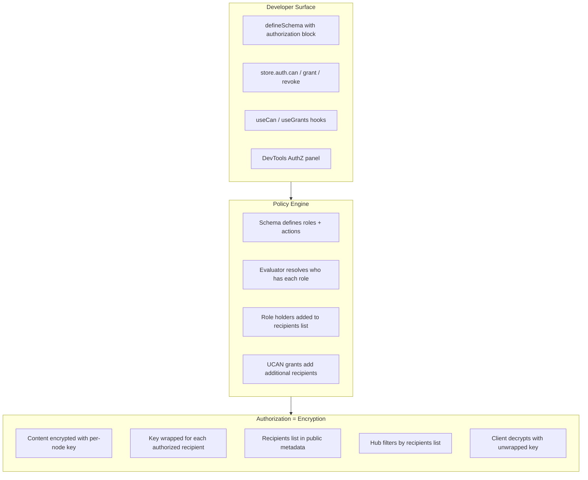
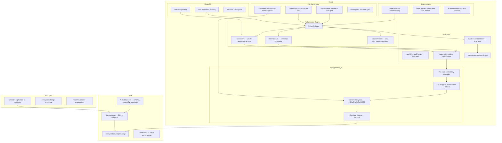
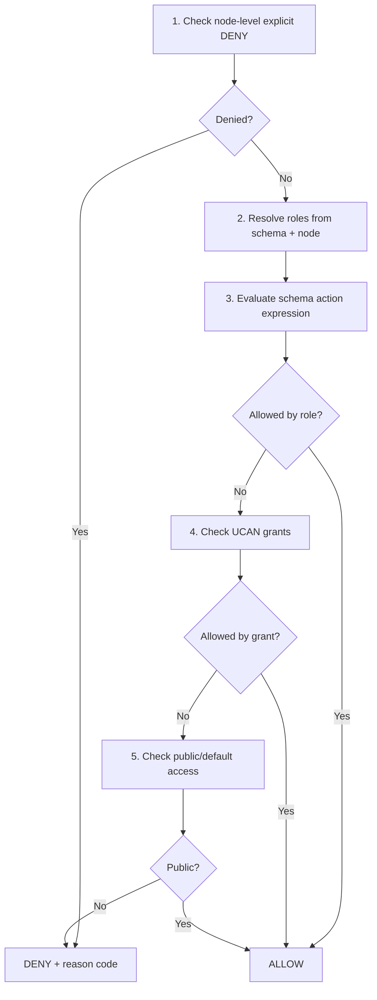
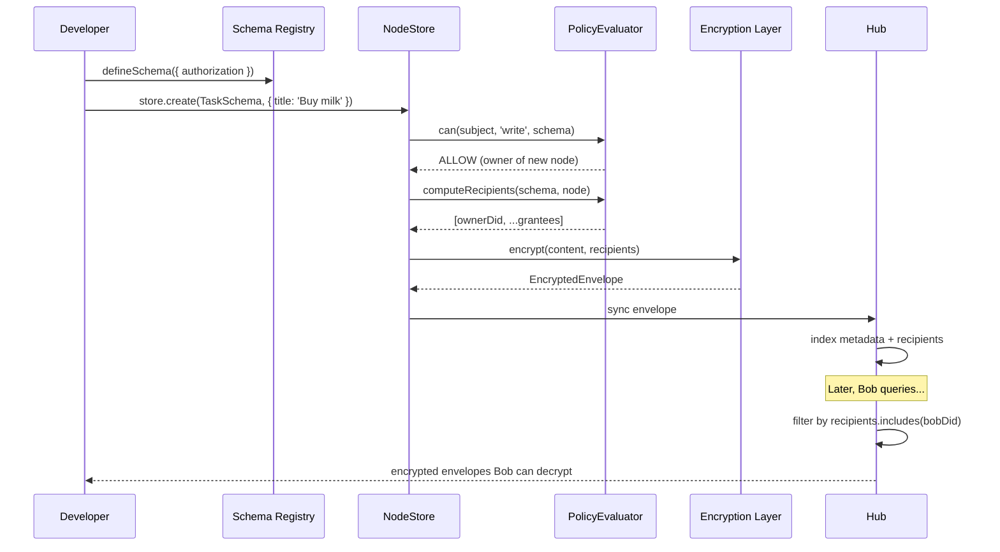

# xNet Implementation Plan - Step 03.98: Authorization Revised

> A coherent, encryption-first authorization system that unifies schema policy, encrypted envelopes, UCAN delegation, and hub filtering into a single developer-friendly API with full type safety, devtools integration, and automatic federated filtering.

## Why This Plan Exists

Plan 03.97 and explorations 0076–0085 produced excellent foundational thinking but left several tensions unresolved:

1. **Encryption was bolted on** — Step 00 defined encryption architecture, but the remaining steps treated it as a parallel concern rather than the core primitive that authorization depends on.
2. **Too many moving parts** — 12 step files with overlapping concerns (types in step 02 and 11, caching in steps 04 and 09, hub filtering in steps 00 and 07).
3. **DSL complexity vs. DX** — The expression parser/compiler (step 03) added significant complexity for marginal benefit over typed builders.
4. **Hub filtering was underspecified** — The plan said "hub checks recipient lists" but didn't detail how grants, schema policy, and encrypted envelopes interact to produce those lists automatically.
5. **AI/agent validation was missing** — No consideration for how AI agents or automated tools validate authorization rules.

This revised plan consolidates everything into a tighter, more coherent design where **encryption is the authorization primitive** and everything else flows from it.

## Core Insight: Encryption IS Authorization

In a decentralized system, the only meaningful access control is **the ability to decrypt**. This plan makes that the foundation:

```
Can you decrypt it? → You can read it.
Are you in the recipients list? → The hub will serve it to you.
Does the schema say you can write? → The client will let you create a signed change.
```

Everything else — roles, relations, UCAN delegation — is machinery for determining **who gets added to the recipients list** and **who gets the content key**.

This applies to **both data paths**: structured node properties (encrypted in `EncryptedEnvelope`) and collaborative Y.Doc content (encrypted at rest in `EncryptedYjsState`, room-gated in transit). See [Step 09](./09-yjs-document-authorization.md) for how Yjs documents are covered.



## Design Principles

### 1. Encryption-First

Every node is encrypted. Authorization decisions determine who gets decryption keys. The hub never sees plaintext — it only checks recipient lists in public metadata.

### 2. Schema-Driven Policy

Developers declare authorization rules in `defineSchema()`. The schema is the single source of truth for what roles exist and what they can do. No scattered imperative checks.

### 3. Typed Builders Over String DSL

Instead of a string parser (`'editor | admin | owner'`), use typed builder functions (`allow('editor', 'admin', 'owner')`). This gives compile-time validation, IDE autocomplete, and eliminates the need for a runtime parser. String literals are supported only for simple single-role cases.

### 4. Automatic Recipient Management

When a node is created or permissions change, the system automatically computes the recipients list from schema policy + grants, wraps the content key for each recipient, and updates the encrypted envelope. Developers never manually manage recipient lists.

### 5. Hub as Dumb Filter

The hub stores encrypted envelopes and filters by recipient lists. It never evaluates complex authorization rules. All policy evaluation happens client-side. This keeps the hub simple, fast, and trustless.

### 6. Grants as Nodes

Access grants are regular nodes using the Grant schema. They sync via existing CRDT infrastructure, have audit trails through node history, and revocation is just a node update.

### 7. AI/Agent Friendly

Authorization rules are structured data (not opaque strings), making them introspectable by AI agents. The `explain()` API returns structured traces. Schema validation produces deterministic error codes.

## Architecture Overview



## Canonical Action Matrix

Single source of truth for action naming across all surfaces:

| Domain | Operation           | Canonical Action | Notes                              |
| ------ | ------------------- | ---------------- | ---------------------------------- |
| Store  | `create`            | `write`          | Schema-level create check          |
| Store  | `update`            | `write`          | + optional field-level constraints |
| Store  | `delete`            | `delete`         | Soft or hard delete                |
| Store  | `restore`           | `write`          | Defaults to write action           |
| Store  | `get`, `query`      | `read`           | Gated by decryption capability     |
| Store  | `grant`, `revoke`   | `share`          | Delegation management              |
| Store  | transaction batch   | per-op           | All-or-nothing semantics           |
| Sync   | `applyRemoteChange` | derived          | Inferred from change type          |
| Yjs    | `acquire(write)`    | `write`          | Room join gate (Step 09)           |
| Yjs    | `acquire(read)`     | `read`           | Decrypt Y.Doc state only           |
| Yjs    | `remoteYjsUpdate`   | `write`          | Per-update auth gate (cached)      |
| Hub    | `hub/query`         | `read`           | Filtered by recipients list        |
| Hub    | `hub/relay`         | `write`          | Relay encrypted envelopes          |
| Hub    | `hub/admin`         | `admin`          | Hub operational controls           |

## Encrypted Node Envelope

Every node is wrapped in an envelope with public metadata and encrypted content:

```typescript
interface EncryptedEnvelope {
  // ─── Public Metadata (unencrypted, signed) ──────────────
  id: string
  schema: SchemaIRI
  createdBy: DID
  createdAt: number
  updatedAt: number
  lamport: number
  recipients: DID[] // Who can decrypt
  publicProps?: Record<string, unknown> // Opt-in public fields

  // ─── Encrypted Content ──────────────────────────────────
  encryptedKeys: Record<DID, WrappedKey> // Per-recipient wrapped content key
  ciphertext: Uint8Array // XChaCha20-Poly1305
  nonce: Uint8Array

  // ─── Integrity ──────────────────────────────────────────
  signature: Uint8Array // Ed25519 over entire envelope
}
```

## Developer API Surface

### Schema Definition

```typescript
import { defineSchema, text, person, relation } from '@xnet/data'
import { allow, deny, role, relation as rel } from '@xnet/data/auth'

const TaskSchema = defineSchema({
  name: 'Task',
  namespace: 'xnet://myapp/',
  properties: {
    title: text({ required: true }),
    assignee: person(),
    project: relation({ schema: 'xnet://myapp/Project' }),
    editors: person({ multiple: true })
  },
  authorization: {
    roles: {
      owner: role.creator(),
      assignee: role.property('assignee'),
      editor: role.property('editors'),
      admin: role.relation('project', 'admin'),
      viewer: role.relation('project', 'viewer')
    },
    actions: {
      read: allow('viewer', 'editor', 'admin', 'owner', 'assignee'),
      write: allow('editor', 'admin', 'owner'),
      delete: allow('admin', 'owner'),
      share: allow('admin', 'owner')
    },
    publicProps: ['title'] // Unencrypted for hub search
  }
})
```

### Store API

```typescript
// Check permission
const decision = await store.auth.can({ action: 'write', nodeId })
// → { allowed: true, roles: ['editor'], cached: true }

// Explain a decision (for debugging / AI agents)
const trace = await store.auth.explain({ action: 'write', nodeId })
// → { allowed: true, steps: [...], roles: ['editor'], grants: [], duration: 0.3 }

// Grant access
await store.auth.grant({
  to: bobDid,
  action: 'write',
  resource: taskId,
  expiresIn: '7d'
})

// Revoke access
await store.auth.revoke({ grantId })

// List grants
const grants = await store.auth.listGrants({ nodeId: taskId })
```

### React Hooks

```tsx
function TaskCard({ taskId }: { taskId: string }) {
  const { canWrite, canDelete, canShare, loading } = useCan(taskId)
  const { grants, grant, revoke } = useGrants(taskId)

  return (
    <div>
      {canWrite && <EditButton />}
      {canDelete && <DeleteButton />}
      {canShare && <ShareDialog grants={grants} onGrant={grant} onRevoke={revoke} />}
    </div>
  )
}
```

## Evaluation Order

Authorization checks follow a strict, deterministic order:



**Deny always wins.** If any layer produces an explicit deny, the request is denied regardless of other allows.

## Phases

| Phase | Focus                                                            | Steps                                                                        | Duration |
| ----- | ---------------------------------------------------------------- | ---------------------------------------------------------------------------- | -------- |
| 1     | **Foundation** — Types, encryption, schema model                 | [01](./01-types-and-encryption.md), [02](./02-schema-authorization-model.md) | 8 days   |
| 2     | **Engine** — Evaluator, role resolution, NodeStore enforcement   | [03](./03-authorization-engine.md), [04](./04-nodestore-enforcement.md)      | 8 days   |
| 3     | **Delegation** — Grants, UCAN bridge, revocation                 | [05](./05-grants-and-delegation.md)                                          | 5 days   |
| 4     | **Federation** — Hub filtering, peer selective sync              | [06](./06-hub-and-peer-filtering.md)                                         | 5 days   |
| 5     | **DX** — React hooks, DevTools, recipes, AI validation           | [07](./07-dx-devtools-and-validation.md)                                     | 5 days   |
| 6     | **Hardening** — Performance, security, rollout                   | [08](./08-performance-and-security.md)                                       | 5 days   |
| 7     | **Yjs** — Y.Doc encryption, room-gated sync, per-update auth, DX | [09](./09-yjs-document-authorization.md)                                     | 5 days   |

## End-to-End Flow



## Decision Baseline (Locked)

These decisions from prior explorations are **final**:

- **One evaluator** combining schema policy, relation-derived roles, and UCAN delegation.
- **Groups as nodes** — no `group()` primitive; use `relation()` traversal.
- **Schema policy is default authority** — node policy can constrain/deny, not silently override.
- **Typed builders** for auth expressions — string DSL only for single-role literals.
- **Explicit deny precedence** over all allows.
- **Grants as nodes** — sync, sign, audit via existing NodeStore infrastructure.
- **Per-node content keys** — with optional schema-level key sharing for performance.
- **Eager key rotation on revocation** — with lazy batching as optimization.
- **Eventual consistency** for revocation by default — strict mode opt-in.
- **Room-gated Yjs model** — encrypt at rest, authorize at room join, signed (not encrypted) updates in room.

## Global Validation Gates

- [ ] All mutating paths enforce authorization deterministically.
- [ ] Every node is encrypted with per-node content key before leaving client.
- [ ] Y.Doc state is encrypted at rest with per-node content key (`EncryptedYjsState`).
- [ ] Y.Doc sync rooms are gated by authorization — unauthorized peers cannot join.
- [ ] Remote Yjs updates are checked against `PolicyEvaluator` before applying.
- [ ] Hub filters query results by recipient lists without decrypting.
- [ ] Delegation chains enforce attenuation and expiration.
- [ ] Decision traces are structured and explainable.
- [ ] Benchmarks hit target budgets (warm `can()` < 1ms p50, cold < 10ms p50).
- [ ] Conformance tests cover deny precedence, traversal limits, conflict edges.
- [ ] DevTools AuthZ panel shows live authorization state.
- [ ] Type-level tests validate schema auth typing guarantees.
- [ ] AI agents can validate authorization rules via `explain()` API.

## Risks and Mitigations

| Risk                                    | Impact                                | Mitigation                                                                                                              |
| --------------------------------------- | ------------------------------------- | ----------------------------------------------------------------------------------------------------------------------- |
| Key rotation on revocation is expensive | High latency for large recipient sets | Batch revocations, lazy rotation for low-risk schemas                                                                   |
| Relation traversal cycles               | Non-termination                       | Visited-set + max-depth (default 3) + max-nodes (100)                                                                   |
| Metadata leaks social graph             | Privacy concern                       | Minimize publicProps, document tradeoffs                                                                                |
| Expression complexity                   | Slow checks                           | Typed builders with compile-time limits, no arbitrary DSL                                                               |
| Revocation lag offline                  | Temporary over-permission             | Explicit consistency modes, short token TTLs                                                                            |
| Hub recipient index grows large         | Query performance                     | Bloom filter optimization, periodic compaction                                                                          |
| Yjs room-gated trust boundary           | Peers in room see plaintext updates   | Room join requires content key proof; per-update auth gate rejects unauthorized signers; revocation kicks + rotates key |

## Success Criteria

- One typed API surface for authorization across schema, store, hub, and React.
- Enforcement parity between local and replicated changes.
- No authorization bypass in fuzz and adversarial tests.
- Hub query filtering is transparent — developers write normal queries, unauthorized data is automatically excluded.
- Migration guide enables adoption without custom forks.
- AI agents can introspect and validate authorization rules programmatically.

---

[Back to Plans](../) | [Start with Step 01 →](./01-types-and-encryption.md) | [Yjs Authorization →](./09-yjs-document-authorization.md)
