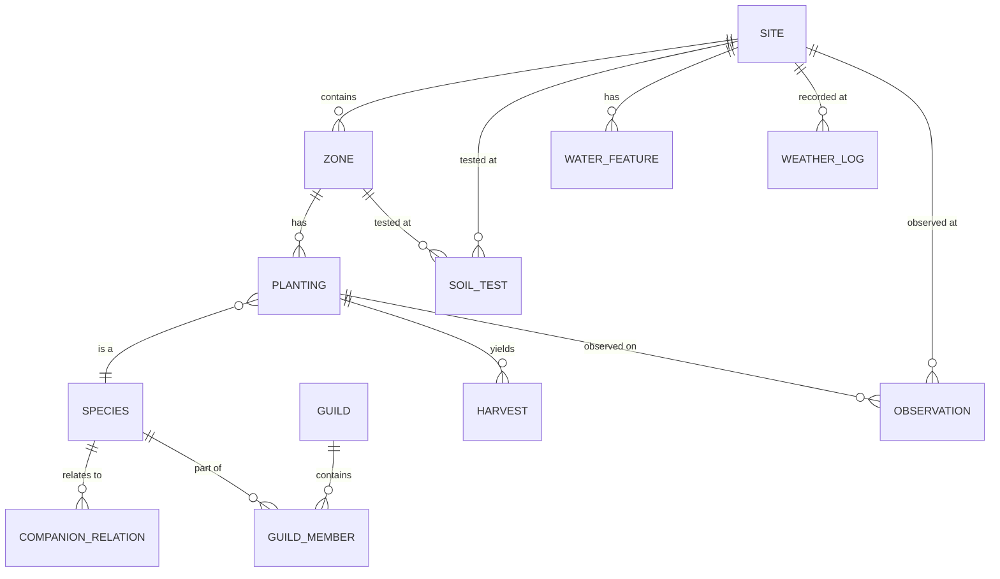

# 01: Farming Schemas

> Core data model: all schema definitions for regenerative farming, food forests, and permaculture.

**Dependencies:** `@xnetjs/data` (defineSchema, property types), `@xnetjs/plugins` (schema registration)

## Overview

This step defines 12 schemas under the `xnet://farming/` namespace that model the full lifecycle of a regenerative farm — from site layout through species, guilds, soil, water, plantings, harvests, and observations.



## Implementation

### 1. Plugin Registration

```typescript
// packages/farming/src/index.ts

import { definePlugin } from '@xnetjs/plugins'
import * as schemas from './schemas'

export const FarmingPlugin = definePlugin({
  id: 'farming',
  name: 'Regenerative Farming',
  version: '0.1.0',
  schemas: Object.values(schemas),
  namespace: 'xnet://farming/'
})
```

### 2. Site & Zone Schemas

```typescript
// packages/farming/src/schemas/site.ts

import { defineSchema, text, number, select, date, file, geo } from '@xnetjs/data'

export const SiteSchema = defineSchema({
  name: 'Site',
  namespace: 'xnet://farming/',
  document: 'yjs',
  properties: {
    name: text({ required: true }),
    location: geo(),
    area: number(), // hectares
    climate: select({
      options: [
        { id: 'tropical', name: 'Tropical' },
        { id: 'subtropical', name: 'Subtropical' },
        { id: 'temperate', name: 'Temperate' },
        { id: 'arid', name: 'Arid' },
        { id: 'mediterranean', name: 'Mediterranean' },
        { id: 'continental', name: 'Continental' },
        { id: 'boreal', name: 'Boreal' }
      ] as const
    }),
    hardinessZone: text(),
    annualRainfall: number(), // mm
    elevation: number(), // meters
    aspect: select({
      options: [
        { id: 'n', name: 'North' },
        { id: 's', name: 'South' },
        { id: 'e', name: 'East' },
        { id: 'w', name: 'West' },
        { id: 'flat', name: 'Flat' }
      ] as const
    }),
    startDate: date(),
    photo: file()
  }
})

export const ZoneSchema = defineSchema({
  name: 'Zone',
  namespace: 'xnet://farming/',
  document: 'yjs',
  properties: {
    name: text({ required: true }),
    siteId: relation({ schema: SiteSchema }),
    zoneNumber: select({
      options: [
        { id: '0', name: 'Zone 0 — Home/Processing' },
        { id: '1', name: 'Zone 1 — Intensive Garden' },
        { id: '2', name: 'Zone 2 — Food Forest/Orchard' },
        { id: '3', name: 'Zone 3 — Farm/Broadacre' },
        { id: '4', name: 'Zone 4 — Semi-wild/Managed Forest' },
        { id: '5', name: 'Zone 5 — Wilderness/Conservation' }
      ] as const
    }),
    area: number(),
    photo: file()
  }
})
```

### 3. Species Schema

```typescript
// packages/farming/src/schemas/species.ts

export const SpeciesSchema = defineSchema({
  name: 'Species',
  namespace: 'xnet://farming/',
  document: 'yjs', // detailed growing notes, traditional uses
  properties: {
    commonName: text({ required: true }),
    scientificName: text({ required: true }),
    family: text(),
    forestLayer: select({
      options: [
        { id: 'canopy', name: 'Canopy (tall trees, 10-30m)' },
        { id: 'understory', name: 'Understory (small trees, 4-10m)' },
        { id: 'shrub', name: 'Shrub Layer (1-4m)' },
        { id: 'herbaceous', name: 'Herbaceous (perennials, 0-1m)' },
        { id: 'groundcover', name: 'Ground Cover (<0.3m)' },
        { id: 'vine', name: 'Vine/Climber' },
        { id: 'root', name: 'Root/Tuber' },
        { id: 'mycelial', name: 'Mycelial/Fungal' }
      ] as const
    }),
    functions: multiSelect({
      options: [
        { id: 'nitrogen_fixer', name: 'Nitrogen Fixer' },
        { id: 'dynamic_accumulator', name: 'Dynamic Accumulator' },
        { id: 'pollinator_attractor', name: 'Pollinator Attractor' },
        { id: 'pest_confuser', name: 'Pest Confuser' },
        { id: 'ground_cover', name: 'Living Mulch' },
        { id: 'windbreak', name: 'Windbreak' },
        { id: 'shade_provider', name: 'Shade Provider' },
        { id: 'food_human', name: 'Human Food' },
        { id: 'food_animal', name: 'Animal Forage' },
        { id: 'medicine', name: 'Medicinal' },
        { id: 'fiber', name: 'Fiber/Material' },
        { id: 'fuel', name: 'Fuel/Biomass' },
        { id: 'soil_builder', name: 'Soil Builder' }
      ] as const
    }),
    hardinessMin: number(),
    hardinessMax: number(),
    waterNeeds: select({
      options: [
        { id: 'xeric', name: 'Xeric (very low)' },
        { id: 'low', name: 'Low' },
        { id: 'moderate', name: 'Moderate' },
        { id: 'high', name: 'High' },
        { id: 'aquatic', name: 'Aquatic' }
      ] as const
    }),
    sunNeeds: select({
      options: [
        { id: 'full_sun', name: 'Full Sun' },
        { id: 'part_shade', name: 'Part Shade' },
        { id: 'full_shade', name: 'Full Shade' }
      ] as const
    }),
    matureHeight: number(), // meters
    spread: number(), // meters
    yearsToProduction: number(),
    lifespan: number(), // years
    edibleParts: multiSelect({
      options: [
        { id: 'fruit', name: 'Fruit' },
        { id: 'leaves', name: 'Leaves' },
        { id: 'seeds', name: 'Seeds/Nuts' },
        { id: 'roots', name: 'Roots/Tubers' },
        { id: 'flowers', name: 'Flowers' },
        { id: 'bark', name: 'Bark/Sap' },
        { id: 'shoots', name: 'Shoots' }
      ] as const
    }),
    propagation: multiSelect({
      options: [
        { id: 'seed', name: 'Seed' },
        { id: 'cutting', name: 'Cutting' },
        { id: 'division', name: 'Division' },
        { id: 'layering', name: 'Layering' },
        { id: 'grafting', name: 'Grafting' },
        { id: 'spore', name: 'Spore' }
      ] as const
    }),
    wfoId: text(), // World Flora Online cross-reference
    photo: file()
  }
})

export const CompanionRelationSchema = defineSchema({
  name: 'CompanionRelation',
  namespace: 'xnet://farming/',
  properties: {
    speciesA: relation({ schema: SpeciesSchema }),
    speciesB: relation({ schema: SpeciesSchema }),
    relationship: select({
      options: [
        { id: 'beneficial', name: 'Beneficial' },
        { id: 'antagonistic', name: 'Antagonistic' },
        { id: 'neutral', name: 'Neutral' }
      ] as const
    }),
    mechanism: text(),
    source: text(),
    confidence: select({
      options: [
        { id: 'anecdotal', name: 'Anecdotal' },
        { id: 'observed', name: 'Observed (personal)' },
        { id: 'replicated', name: 'Replicated (community)' },
        { id: 'scientific', name: 'Scientific Literature' }
      ] as const
    })
  }
})
```

### 4. Guild Schemas

```typescript
// packages/farming/src/schemas/guild.ts

export const GuildSchema = defineSchema({
  name: 'Guild',
  namespace: 'xnet://farming/',
  document: 'yjs',
  properties: {
    name: text({ required: true }),
    centralSpecies: relation({ schema: SpeciesSchema }),
    climate: select({ options: [] as const }), // same options as Site.climate
    description: text(),
    spacing: number(), // meters diameter
    yearsToEstablish: number(),
    source: text(),
    photo: file()
  }
})

export const GuildMemberSchema = defineSchema({
  name: 'GuildMember',
  namespace: 'xnet://farming/',
  properties: {
    guildId: relation({ schema: GuildSchema }),
    species: relation({ schema: SpeciesSchema }),
    role: select({
      options: [
        { id: 'central', name: 'Central/Primary' },
        { id: 'nitrogen_fixer', name: 'Nitrogen Fixer' },
        { id: 'mulch', name: 'Mulch/Chop-and-Drop' },
        { id: 'pollinator', name: 'Pollinator Attractor' },
        { id: 'pest_repellent', name: 'Pest Repellent' },
        { id: 'ground_cover', name: 'Ground Cover' },
        { id: 'nutrient_accumulator', name: 'Nutrient Accumulator' },
        { id: 'structural', name: 'Trellis/Support' }
      ] as const
    }),
    quantity: number(),
    placementNotes: text()
  }
})
```

### 5. Soil Test Schema

```typescript
// packages/farming/src/schemas/soil.ts

export const SoilTestSchema = defineSchema({
  name: 'SoilTest',
  namespace: 'xnet://farming/',
  document: 'yjs',
  properties: {
    siteId: relation({ schema: SiteSchema }),
    zoneId: relation({ schema: ZoneSchema }),
    testDate: date({ required: true }),
    depth: number(), // cm
    // Chemical
    ph: number(),
    organicMatter: number(), // percentage
    nitrogen: number(), // ppm
    phosphorus: number(), // ppm
    potassium: number(), // ppm
    calcium: number(), // ppm
    magnesium: number(), // ppm
    cec: number(), // meq/100g
    // Physical
    texture: select({
      options: [
        { id: 'sand', name: 'Sand' },
        { id: 'loamy_sand', name: 'Loamy Sand' },
        { id: 'sandy_loam', name: 'Sandy Loam' },
        { id: 'loam', name: 'Loam' },
        { id: 'silt_loam', name: 'Silt Loam' },
        { id: 'clay_loam', name: 'Clay Loam' },
        { id: 'clay', name: 'Clay' }
      ] as const
    }),
    bulkDensity: number(), // g/cm³
    infiltrationRate: number(), // mm/hr
    aggregateStability: number(), // percentage
    // Biological
    microbialBiomass: number(), // μg C/g soil
    fungalBacterialRatio: number(),
    earthwormCount: number(), // per m²
    respirationRate: number(), // mg CO₂/kg/day
    // Carbon
    totalCarbon: number(), // tonnes/hectare
    carbonSequestrationRate: number(), // tonnes/hectare/year
    // Metadata
    lab: text(),
    method: text(),
    photo: file()
  }
})
```

### 6. Water Feature Schema

```typescript
// packages/farming/src/schemas/water.ts

export const WaterFeatureSchema = defineSchema({
  name: 'WaterFeature',
  namespace: 'xnet://farming/',
  document: 'yjs',
  properties: {
    name: text({ required: true }),
    siteId: relation({ schema: SiteSchema }),
    type: select({
      options: [
        { id: 'swale', name: 'Swale' },
        { id: 'pond', name: 'Pond/Dam' },
        { id: 'rain_garden', name: 'Rain Garden' },
        { id: 'hugelkultur', name: 'Hugelkultur' },
        { id: 'keyline', name: 'Keyline' },
        { id: 'irrigation', name: 'Irrigation System' },
        { id: 'rainwater_tank', name: 'Rainwater Tank' },
        { id: 'greywater', name: 'Greywater System' },
        { id: 'spring', name: 'Natural Spring' },
        { id: 'well', name: 'Well/Bore' },
        { id: 'stream', name: 'Stream/Creek' }
      ] as const
    }),
    capacity: number(), // liters
    flowRate: number(), // liters/min
    lengthMeters: number(),
    status: select({
      options: [
        { id: 'planned', name: 'Planned' },
        { id: 'under_construction', name: 'Under Construction' },
        { id: 'active', name: 'Active' },
        { id: 'maintenance', name: 'Needs Maintenance' }
      ] as const
    }),
    installDate: date(),
    photo: file()
  }
})
```

### 7. Planting & Harvest Schemas

```typescript
// packages/farming/src/schemas/planting.ts

export const PlantingSchema = defineSchema({
  name: 'Planting',
  namespace: 'xnet://farming/',
  properties: {
    species: relation({ schema: SpeciesSchema }),
    siteId: relation({ schema: SiteSchema }),
    zoneId: relation({ schema: ZoneSchema }),
    guildId: relation({ schema: GuildSchema }),
    plantDate: date({ required: true }),
    quantity: number(),
    source: select({
      options: [
        { id: 'seed', name: 'From Seed' },
        { id: 'cutting', name: 'Cutting/Clone' },
        { id: 'transplant', name: 'Transplant' },
        { id: 'division', name: 'Division' },
        { id: 'volunteer', name: 'Volunteer/Self-seeded' },
        { id: 'existing', name: 'Pre-existing' }
      ] as const
    }),
    status: select({
      options: [
        { id: 'germinating', name: 'Germinating' },
        { id: 'establishing', name: 'Establishing' },
        { id: 'growing', name: 'Growing' },
        { id: 'producing', name: 'Producing' },
        { id: 'dormant', name: 'Dormant' },
        { id: 'declined', name: 'Declined' },
        { id: 'dead', name: 'Dead' },
        { id: 'removed', name: 'Removed' }
      ] as const
    }),
    notes: text()
  }
})

export const HarvestSchema = defineSchema({
  name: 'Harvest',
  namespace: 'xnet://farming/',
  properties: {
    plantingId: relation({ schema: PlantingSchema }),
    harvestDate: date({ required: true }),
    quantity: number(),
    unit: select({
      options: [
        { id: 'kg', name: 'Kilograms' },
        { id: 'count', name: 'Count/Pieces' },
        { id: 'bunches', name: 'Bunches' },
        { id: 'liters', name: 'Liters' }
      ] as const
    }),
    quality: select({
      options: [
        { id: 'excellent', name: 'Excellent' },
        { id: 'good', name: 'Good' },
        { id: 'fair', name: 'Fair' },
        { id: 'poor', name: 'Poor' }
      ] as const
    }),
    destination: select({
      options: [
        { id: 'home', name: 'Home Use' },
        { id: 'market', name: 'Market/Sale' },
        { id: 'preserve', name: 'Preserved/Stored' },
        { id: 'seed_save', name: 'Seed Saving' },
        { id: 'compost', name: 'Compost/Return' },
        { id: 'share', name: 'Shared/Gift' },
        { id: 'animal_feed', name: 'Animal Feed' }
      ] as const
    }),
    notes: text()
  }
})
```

### 8. Observation & Weather Schemas

```typescript
// packages/farming/src/schemas/observation.ts

export const ObservationSchema = defineSchema({
  name: 'Observation',
  namespace: 'xnet://farming/',
  document: 'yjs',
  properties: {
    siteId: relation({ schema: SiteSchema }),
    plantingId: relation({ schema: PlantingSchema }),
    observationDate: date({ required: true }),
    category: select({
      options: [
        { id: 'pest', name: 'Pest/Disease' },
        { id: 'beneficial', name: 'Beneficial Insect' },
        { id: 'pollinator', name: 'Pollinator' },
        { id: 'bird', name: 'Bird' },
        { id: 'mammal', name: 'Mammal' },
        { id: 'fungi', name: 'Fungi' },
        { id: 'weather', name: 'Weather Event' },
        { id: 'phenology', name: 'Phenology (bloom, leaf-out)' },
        { id: 'soil', name: 'Soil Observation' },
        { id: 'general', name: 'General Note' }
      ] as const
    }),
    species: text(),
    count: number(),
    photo: file(),
    actionTaken: text()
  }
})

export const WeatherLogSchema = defineSchema({
  name: 'WeatherLog',
  namespace: 'xnet://farming/',
  properties: {
    siteId: relation({ schema: SiteSchema }),
    logDate: date({ required: true }),
    tempHigh: number(), // °C
    tempLow: number(),
    rainfall: number(), // mm
    humidity: number(), // percentage
    windSpeed: number(), // km/h
    frostEvent: checkbox(),
    notes: text()
  }
})
```

### 9. Schema Index

```typescript
// packages/farming/src/schemas/index.ts

export { SiteSchema, ZoneSchema } from './site'
export { SpeciesSchema, CompanionRelationSchema } from './species'
export { GuildSchema, GuildMemberSchema } from './guild'
export { SoilTestSchema } from './soil'
export { WaterFeatureSchema } from './water'
export { PlantingSchema, HarvestSchema } from './planting'
export { ObservationSchema, WeatherLogSchema } from './observation'
```

## Package Structure

```
packages/
  farming/
    src/
      schemas/
        site.ts
        species.ts
        guild.ts
        soil.ts
        water.ts
        planting.ts
        observation.ts
        index.ts
      index.ts           # Plugin definition + schema exports
    package.json
    tsconfig.json
```

## Testing

```typescript
describe('Farming Schemas', () => {
  it('registers all 12 schemas under xnet://farming/ namespace')
  it('creates a Site with all required fields')
  it('creates Zone linked to Site')
  it('creates Species with forest layer and functions')
  it('creates CompanionRelation between two species')
  it('creates Guild with central species and members')
  it('creates SoilTest with chemical/physical/biological fields')
  it('creates WaterFeature with type and capacity')
  it('creates Planting linked to species, site, zone, guild')
  it('creates Harvest linked to planting with quantity and unit')
  it('creates Observation with category and photo')
  it('creates WeatherLog with temperature and rainfall')
  it('queries species by forest layer')
  it('queries plantings by status')
  it('queries soil tests by site and date range')
})
```

## Checklist

- [ ] Create `packages/farming/` package with package.json, tsconfig
- [ ] Implement SiteSchema and ZoneSchema
- [ ] Implement SpeciesSchema and CompanionRelationSchema
- [ ] Implement GuildSchema and GuildMemberSchema
- [ ] Implement SoilTestSchema
- [ ] Implement WaterFeatureSchema
- [ ] Implement PlantingSchema and HarvestSchema
- [ ] Implement ObservationSchema and WeatherLogSchema
- [ ] Create plugin registration entry point
- [ ] Verify all schemas create/query via existing Table/Board views
- [ ] Write unit tests for all schema CRUD operations
- [ ] Write tests for relation queries (plantings by site, harvests by species)

---

[Back to README](./README.md) | [Next: Species Database](./02-species-database.md)
