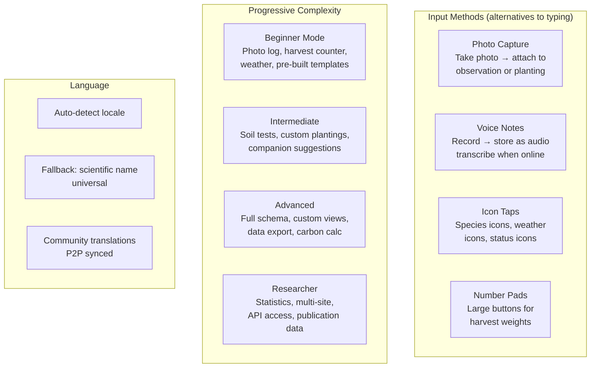

# 10: Accessibility

> Multilingual schemas, icon-based UI, voice/photo input, and progressive complexity for global farmer accessibility.

**Dependencies:** Steps 01-08 (all schemas and views), `@xnetjs/react` (hooks), Expo (mobile)

## Overview

773 million adults worldwide are illiterate. 2.9 billion lack reliable internet. Most farming tools assume both literacy and connectivity. This step ensures xNet farming works for everyone — from a subsistence farmer with a basic smartphone to a research agronomist.



## Implementation

### 1. Multilingual Property System

```typescript
// packages/farming/src/i18n/multilingual.ts

/**
 * xNet schemas support language-suffixed properties natively.
 * No schema changes needed — just add properties like `commonName:sw`.
 */

export function getLocalizedProperty(node: NodeState, property: string, locale: string): string {
  // Try exact locale match: commonName:pt-BR
  const exactKey = `${property}:${locale}`
  if (node[exactKey]) return node[exactKey] as string

  // Try language only: commonName:pt
  const langKey = `${property}:${locale.split('-')[0]}`
  if (node[langKey]) return node[langKey] as string

  // Fallback to default (English or base property)
  return (node[property] as string) ?? ''
}

export function getSpeciesName(species: SpeciesNode, locale: string): string {
  const localized = getLocalizedProperty(species, 'commonName', locale)
  if (localized) return localized
  // Ultimate fallback: scientific name (universal)
  return species.scientificName
}

/** Supported locales for farming module */
export const FARMING_LOCALES = [
  { code: 'en', name: 'English', dir: 'ltr' },
  { code: 'es', name: 'Español', dir: 'ltr' },
  { code: 'pt', name: 'Português', dir: 'ltr' },
  { code: 'fr', name: 'Français', dir: 'ltr' },
  { code: 'sw', name: 'Kiswahili', dir: 'ltr' },
  { code: 'hi', name: 'हिन्दी', dir: 'ltr' },
  { code: 'ar', name: 'العربية', dir: 'rtl' },
  { code: 'zh', name: '中文', dir: 'ltr' },
  { code: 'id', name: 'Bahasa Indonesia', dir: 'ltr' },
  { code: 'tl', name: 'Filipino', dir: 'ltr' },
  { code: 'am', name: 'አማርኛ', dir: 'ltr' },
  { code: 'yo', name: 'Yorùbá', dir: 'ltr' },
  { code: 'qu', name: 'Quechua', dir: 'ltr' }
]
```

### 2. Icon-Based UI Components

```typescript
// packages/farming/src/views/accessible/IconGrid.tsx

export interface IconOption {
  id: string
  icon: string           // emoji or icon name
  label: string          // shown below icon (can be hidden in low-literacy mode)
  color?: string
}

/**
 * Large tap-target grid of icons for non-text selection.
 * Used for: species selection, observation categories, weather, harvest destination.
 */
export function IconGrid({
  options,
  selected,
  onSelect,
  columns = 3,
  showLabels = true
}: {
  options: IconOption[]
  selected?: string
  onSelect: (id: string) => void
  columns?: number
  showLabels?: boolean
}) {
  return (
    <div className="icon-grid" style={{ gridTemplateColumns: `repeat(${columns}, 1fr)` }}>
      {options.map(opt => (
        <button
          key={opt.id}
          className={`icon-option ${selected === opt.id ? 'selected' : ''}`}
          onClick={() => onSelect(opt.id)}
          style={{ backgroundColor: opt.color }}
        >
          <span className="icon-emoji">{opt.icon}</span>
          {showLabels && <span className="icon-label">{opt.label}</span>}
        </button>
      ))}
    </div>
  )
}

/** Observation category icons (no text needed to understand) */
export const OBSERVATION_ICONS: IconOption[] = [
  { id: 'pest', icon: '🐛', label: 'Pest', color: '#fee2e2' },
  { id: 'beneficial', icon: '🐝', label: 'Beneficial', color: '#fef3c7' },
  { id: 'pollinator', icon: '🦋', label: 'Pollinator', color: '#dbeafe' },
  { id: 'bird', icon: '🐦', label: 'Bird', color: '#e0e7ff' },
  { id: 'fungi', icon: '🍄', label: 'Fungi', color: '#f3e8ff' },
  { id: 'weather', icon: '🌧️', label: 'Weather', color: '#e0f2fe' },
  { id: 'phenology', icon: '🌸', label: 'Bloom', color: '#fce7f3' },
  { id: 'soil', icon: '🪱', label: 'Soil', color: '#ecfccb' },
  { id: 'general', icon: '📝', label: 'Note', color: '#f5f5f4' }
]

/** Weather quick-log icons */
export const WEATHER_ICONS: IconOption[] = [
  { id: 'sunny', icon: '☀️', label: 'Sunny' },
  { id: 'cloudy', icon: '☁️', label: 'Cloudy' },
  { id: 'rain_light', icon: '🌦️', label: 'Light Rain' },
  { id: 'rain_heavy', icon: '🌧️', label: 'Heavy Rain' },
  { id: 'storm', icon: '⛈️', label: 'Storm' },
  { id: 'frost', icon: '🥶', label: 'Frost' },
  { id: 'hot', icon: '🔥', label: 'Very Hot' },
  { id: 'wind', icon: '💨', label: 'Windy' }
]
```

### 3. Voice Note Capture

```typescript
// packages/farming/src/views/accessible/VoiceNote.tsx

export function VoiceNoteButton({
  onRecorded
}: {
  onRecorded: (audioBlob: Blob, duration: number) => void
}) {
  const [recording, setRecording] = useState(false)
  const [duration, setDuration] = useState(0)
  const mediaRecorderRef = useRef<MediaRecorder | null>(null)

  const startRecording = async () => {
    const stream = await navigator.mediaDevices.getUserMedia({ audio: true })
    const recorder = new MediaRecorder(stream, { mimeType: 'audio/webm' })
    const chunks: Blob[] = []

    recorder.ondataavailable = (e) => chunks.push(e.data)
    recorder.onstop = () => {
      const blob = new Blob(chunks, { type: 'audio/webm' })
      onRecorded(blob, duration)
      stream.getTracks().forEach(t => t.stop())
    }

    mediaRecorderRef.current = recorder
    recorder.start()
    setRecording(true)
  }

  const stopRecording = () => {
    mediaRecorderRef.current?.stop()
    setRecording(false)
  }

  return (
    <button
      className={`voice-note-button ${recording ? 'recording' : ''}`}
      onPointerDown={startRecording}
      onPointerUp={stopRecording}
    >
      {recording ? `🔴 ${duration}s` : '🎤'}
    </button>
  )
}
```

### 4. Progressive Complexity Manager

```typescript
// packages/farming/src/accessibility/complexity.ts

export type ComplexityLevel = 'beginner' | 'intermediate' | 'advanced' | 'researcher'

export interface ComplexityConfig {
  level: ComplexityLevel
  visibleSchemas: string[]
  visibleProperties: Record<string, string[]> // schema → visible properties
  showLabels: boolean
  showScientificNames: boolean
  enableVoiceNotes: boolean
  enablePhotoOnly: boolean // beginner: just take photos
  enableDataExport: boolean
}

export const COMPLEXITY_CONFIGS: Record<ComplexityLevel, ComplexityConfig> = {
  beginner: {
    level: 'beginner',
    visibleSchemas: ['Planting', 'Harvest', 'Observation', 'WeatherLog'],
    visibleProperties: {
      Planting: ['species', 'plantDate', 'quantity', 'status'],
      Harvest: ['plantingId', 'harvestDate', 'quantity', 'unit'],
      Observation: ['category', 'photo', 'observationDate'],
      WeatherLog: ['logDate', 'rainfall', 'frostEvent']
    },
    showLabels: false, // icons only
    showScientificNames: false,
    enableVoiceNotes: true,
    enablePhotoOnly: true,
    enableDataExport: false
  },
  intermediate: {
    level: 'intermediate',
    visibleSchemas: ['Site', 'Planting', 'Harvest', 'Observation', 'SoilTest', 'Species', 'Guild'],
    visibleProperties: {
      SoilTest: ['testDate', 'ph', 'organicMatter', 'earthwormCount', 'texture'],
      Species: ['commonName', 'forestLayer', 'functions', 'waterNeeds', 'sunNeeds']
    },
    showLabels: true,
    showScientificNames: false,
    enableVoiceNotes: true,
    enablePhotoOnly: false,
    enableDataExport: false
  },
  advanced: {
    level: 'advanced',
    visibleSchemas: 'all',
    visibleProperties: 'all',
    showLabels: true,
    showScientificNames: true,
    enableVoiceNotes: true,
    enablePhotoOnly: false,
    enableDataExport: true
  },
  researcher: {
    level: 'researcher',
    visibleSchemas: 'all',
    visibleProperties: 'all',
    showLabels: true,
    showScientificNames: true,
    enableVoiceNotes: true,
    enablePhotoOnly: false,
    enableDataExport: true
  }
}
```

## Checklist

- [ ] Implement multilingual property resolution (locale → fallback → scientific name)
- [ ] Build IconGrid component (large touch targets, optional labels)
- [ ] Define icon sets for observations, weather, harvest, species layers
- [ ] Build VoiceNoteButton (hold-to-record, release to stop)
- [ ] Store voice notes as file attachments on Observation nodes
- [ ] Implement progressive complexity manager (4 levels)
- [ ] Build beginner mode (photo + icon only, no text entry required)
- [ ] Build complexity selector in settings
- [ ] Hide advanced fields based on complexity level
- [ ] Support RTL languages (Arabic)
- [ ] Build large number pad for harvest quantity entry
- [ ] Test accessibility on low-end Android devices (small screens)
- [ ] Community translation contribution flow (add names in your language)

---

[Back to README](./README.md) | [Previous: Knowledge Sharing](./09-knowledge-sharing.md) | [Next: AI Integrations](./11-ai-integrations.md)
