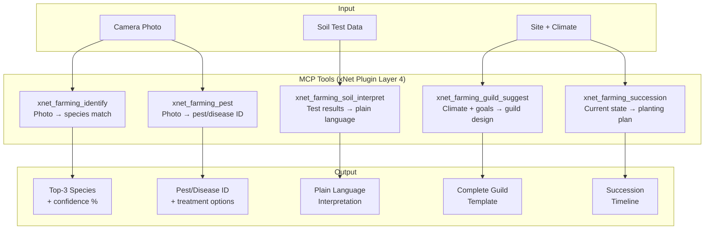

# 11: AI Integrations

> Plant/pest identification from photos, soil test interpretation, guild suggestions, and succession planning via MCP.

**Dependencies:** Steps 01-08 (schemas + data), `@xnet/plugins` (MCP integration from plan03_5)

## Overview

AI enhances the farming module but is never required. All core features work without it. When available (online or local model), AI provides plant/pest identification, soil interpretation in plain language, and intelligent guild suggestions.



## Implementation

### 1. MCP Tool Definitions

```typescript
// packages/farming/src/ai/mcp-tools.ts

export const FARMING_MCP_TOOLS = [
  {
    name: 'xnet_farming_identify',
    description:
      'Identify a plant species from a photo. Returns top matches with confidence scores.',
    inputSchema: {
      type: 'object',
      properties: {
        image: { type: 'string', description: 'Base64-encoded image or file path' },
        context: {
          type: 'object',
          properties: {
            climate: { type: 'string', description: 'Climate zone of the site' },
            hardinessZone: { type: 'string', description: 'USDA hardiness zone' },
            layer: { type: 'string', description: 'Expected forest layer (if known)' }
          }
        }
      },
      required: ['image']
    }
  },
  {
    name: 'xnet_farming_pest',
    description: 'Identify a pest, disease, or deficiency from a photo of affected plant tissue.',
    inputSchema: {
      type: 'object',
      properties: {
        image: { type: 'string', description: 'Base64-encoded image of affected tissue' },
        hostSpecies: { type: 'string', description: 'Scientific name of the affected plant' },
        symptoms: { type: 'array', items: { type: 'string' }, description: 'Observed symptoms' }
      },
      required: ['image']
    }
  },
  {
    name: 'xnet_farming_soil_interpret',
    description: 'Interpret soil test results in plain language with actionable recommendations.',
    inputSchema: {
      type: 'object',
      properties: {
        ph: { type: 'number' },
        organicMatter: { type: 'number', description: 'Percentage' },
        nitrogen: { type: 'number', description: 'ppm' },
        phosphorus: { type: 'number', description: 'ppm' },
        potassium: { type: 'number', description: 'ppm' },
        texture: { type: 'string' },
        earthwormCount: { type: 'number', description: 'Per m²' },
        climate: { type: 'string' },
        currentPlantings: { type: 'array', items: { type: 'string' } },
        goals: {
          type: 'array',
          items: { type: 'string' },
          description: 'e.g., food_forest, annual_garden, carbon_sequestration'
        }
      },
      required: ['ph', 'organicMatter']
    }
  },
  {
    name: 'xnet_farming_guild_suggest',
    description: 'Suggest a complete plant guild design for given climate and goals.',
    inputSchema: {
      type: 'object',
      properties: {
        climate: { type: 'string', description: 'Climate type' },
        hardinessZone: { type: 'string' },
        centralSpecies: { type: 'string', description: 'Desired central tree (optional)' },
        goals: {
          type: 'array',
          items: { type: 'string' },
          description: 'food, medicine, carbon, wildlife, etc.'
        },
        constraints: {
          type: 'object',
          properties: {
            maxHeight: { type: 'number' },
            availableArea: { type: 'number', description: 'Square meters' },
            soilType: { type: 'string' },
            waterAvailability: { type: 'string' }
          }
        },
        existingSpecies: {
          type: 'array',
          items: { type: 'string' },
          description: 'Already planted species'
        }
      },
      required: ['climate']
    }
  },
  {
    name: 'xnet_farming_succession',
    description:
      'Generate a succession planting timeline for establishing a food forest from current state.',
    inputSchema: {
      type: 'object',
      properties: {
        currentState: {
          type: 'string',
          description: 'bare_ground, lawn, annual_garden, young_orchard, etc.'
        },
        climate: { type: 'string' },
        area: { type: 'number', description: 'Hectares' },
        budget: { type: 'string', description: 'low, medium, high' },
        timeline: { type: 'number', description: 'Years to maturity goal' },
        goals: { type: 'array', items: { type: 'string' } }
      },
      required: ['currentState', 'climate']
    }
  }
]
```

### 2. Plant ID Integration

```typescript
// packages/farming/src/ai/plant-id.ts

export interface PlantIDResult {
  matches: Array<{
    scientificName: string
    commonName: string
    confidence: number // 0-100
    matchedSpeciesId?: NodeId // if in our DB
    description: string
  }>
  metadata: {
    processingTime: number
    modelUsed: string
    imageQuality: 'good' | 'fair' | 'poor'
  }
}

export async function identifyPlant(
  imageBlob: Blob,
  context: { climate?: string; hardinessZone?: string },
  mcpClient: MCPClient
): Promise<PlantIDResult> {
  const base64 = await blobToBase64(imageBlob)

  const response = await mcpClient.callTool('xnet_farming_identify', {
    image: base64,
    context
  })

  const result = JSON.parse(response.content) as PlantIDResult

  // Cross-reference with local species DB
  for (const match of result.matches) {
    const localSpecies = await findSpeciesByScientificName(match.scientificName)
    if (localSpecies) {
      match.matchedSpeciesId = localSpecies.id
    }
  }

  return result
}
```

### 3. Photo ID UI Component

```typescript
// packages/farming/src/views/PlantIDCamera.tsx

export function PlantIDCamera({ onIdentified }: { onIdentified: (speciesId: NodeId) => void }) {
  const [photo, setPhoto] = useState<Blob | null>(null)
  const [result, setResult] = useState<PlantIDResult | null>(null)
  const [loading, setLoading] = useState(false)

  const captureAndIdentify = async (blob: Blob) => {
    setPhoto(blob)
    setLoading(true)
    try {
      const id = await identifyPlant(blob, { climate: siteClimate }, mcpClient)
      setResult(id)
    } finally {
      setLoading(false)
    }
  }

  return (
    <div className="plant-id">
      {!photo && <CameraCapture onCapture={captureAndIdentify} />}

      {loading && <div className="identifying">Identifying...</div>}

      {result && (
        <div className="id-results">
          {result.matches.map((match, i) => (
            <div key={i} className="id-match" onClick={() => match.matchedSpeciesId && onIdentified(match.matchedSpeciesId)}>
              <span className="match-name">{match.commonName}</span>
              <span className="match-scientific">{match.scientificName}</span>
              <span className="match-confidence">{match.confidence}%</span>
              {match.matchedSpeciesId && <span className="in-db">In your database</span>}
            </div>
          ))}
          <button onClick={() => { setPhoto(null); setResult(null) }}>Try Again</button>
        </div>
      )}
    </div>
  )
}
```

### 4. Offline Fallback

```typescript
// packages/farming/src/ai/offline.ts

/**
 * When AI is unavailable (offline), provide basic identification
 * using local species DB filtering.
 */
export async function offlinePlantMatch(
  observations: {
    layer?: ForestLayer
    leafType?: 'broad' | 'needle' | 'compound' | 'grass'
    flowerColor?: string
    height?: 'low' | 'medium' | 'tall'
  },
  store: NodeStore
): Promise<SpeciesNode[]> {
  const filters: Record<string, unknown> = {}
  if (observations.layer) filters.forestLayer = observations.layer
  if (observations.height) {
    // Map height to numeric range
    const ranges = { low: [0, 1], medium: [1, 5], tall: [5, 30] }
    // Query within range
  }

  return store.query(SpeciesSchema, { where: filters, limit: 10 })
}
```

## Checklist

- [ ] Define MCP tool schemas for all 5 farming AI tools
- [ ] Implement plant ID integration (photo → MCP → results → DB cross-ref)
- [ ] Implement pest/disease ID with symptom context
- [ ] Implement soil interpretation (test data → plain language + recommendations)
- [ ] Implement guild suggestion (climate + goals → complete template)
- [ ] Implement succession planner (current state → year-by-year timeline)
- [ ] Build PlantIDCamera component (capture → identify → select)
- [ ] Build PestIDCamera with symptom tag input
- [ ] Build SoilAIPanel (one-tap interpret button on soil test detail)
- [ ] Build GuildAIPanel (goal checkboxes → generate guild)
- [ ] Implement offline fallback (filter local DB by observed characteristics)
- [ ] Handle AI unavailability gracefully (show manual alternatives)
- [ ] Write tests for MCP tool input/output schemas

---

[Back to README](./README.md) | [Previous: Accessibility](./10-accessibility.md) | [Next: Community & Scale](./12-community-scale.md)
