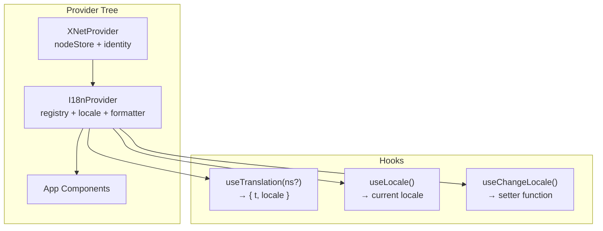

# 03: React Integration

> I18nProvider, useTranslation hook, and Trans component for React apps

**Duration:** 2-3 days  
**Dependencies:** Steps 01-02, `@xnetjs/react`

## Overview

Add i18n hooks to `@xnetjs/react` that integrate with the `@xnetjs/i18n` registry and Lingui's runtime. The provider wraps `XNetProvider` and makes translations available throughout the tree.



## I18nProvider

```tsx
// packages/react/src/i18n/I18nProvider.tsx
import React, { createContext, useContext, useState, useEffect, type ReactNode } from 'react'
import { I18nRegistry, I18nFormatter, LocaleDetector, CatalogLoader } from '@xnetjs/i18n'
import type { Locale, Namespace, MessageValues } from '@xnetjs/i18n'

export interface I18nConfig {
  /** Supported locales */
  supportedLocales: Locale[]
  /** Default/fallback locale */
  defaultLocale: Locale
  /** Pre-loaded catalogs (for SSR or initial render) */
  catalogs?: Record<Namespace, Record<Locale, Record<string, string>>>
  /** Async catalog fetcher (for lazy loading) */
  loadCatalog?: (namespace: Namespace, locale: Locale) => Promise<Record<string, string>>
  /** User's synced locale preference */
  userLocale?: Locale
  /** Device-local override */
  deviceLocale?: Locale
}

export interface I18nContextValue {
  locale: Locale
  setLocale: (locale: Locale) => void
  t: (key: string, values?: MessageValues, namespace?: Namespace) => string
  registry: I18nRegistry
  isLoading: boolean
}

export const I18nContext = createContext<I18nContextValue | null>(null)

export function I18nProvider({ config, children }: { config: I18nConfig; children: ReactNode }) {
  const [registry] = useState(
    () =>
      new I18nRegistry({
        defaultLocale: config.defaultLocale,
        locale: config.defaultLocale
      })
  )
  const [formatter] = useState(() => new I18nFormatter())
  const [loader] = useState(() =>
    config.loadCatalog ? new CatalogLoader(registry, config.loadCatalog) : null
  )
  const [isLoading, setIsLoading] = useState(false)

  // Detect initial locale
  const [locale, setLocaleState] = useState(() => {
    const detector = new LocaleDetector({
      supportedLocales: config.supportedLocales,
      defaultLocale: config.defaultLocale,
      getUserPreference: () => config.userLocale ?? null,
      getDeviceOverride: () => config.deviceLocale ?? null
    })
    return detector.detect()
  })

  // Register pre-loaded catalogs
  useEffect(() => {
    if (config.catalogs) {
      for (const [ns, locales] of Object.entries(config.catalogs)) {
        for (const [loc, catalog] of Object.entries(locales)) {
          registry.register(ns, loc, catalog)
        }
      }
    }
  }, [])

  // Load catalogs when locale changes
  useEffect(() => {
    registry.setLocale(locale)
    formatter.clearCache()

    if (loader) {
      setIsLoading(true)
      const namespaces = registry.getNamespaces()
      loader
        .preload(namespaces.length ? namespaces : ['core'], locale)
        .finally(() => setIsLoading(false))
    }
  }, [locale])

  const setLocale = (newLocale: Locale) => {
    setLocaleState(newLocale)
    // Persist device-local override
    if (typeof localStorage !== 'undefined') {
      localStorage.setItem('xnet:locale', newLocale)
    }
  }

  const t = (key: string, values?: MessageValues, namespace: Namespace = 'core') => {
    const message = registry.resolve(namespace, key)
    if (!message) return key
    return formatter.format(message, locale, values)
  }

  const value: I18nContextValue = { locale, setLocale, t, registry, isLoading }

  return React.createElement(I18nContext.Provider, { value }, children)
}
```

## Hooks

```typescript
// packages/react/src/i18n/useTranslation.ts
import { useContext, useCallback } from 'react'
import { I18nContext } from './I18nProvider'
import type { Namespace, MessageValues } from '@xnetjs/i18n'

export interface UseTranslationResult {
  /** Translate a key */
  t: (key: string, values?: MessageValues) => string
  /** Current locale */
  locale: string
  /** Whether catalogs are loading */
  isLoading: boolean
}

export function useTranslation(namespace: Namespace = 'core'): UseTranslationResult {
  const ctx = useContext(I18nContext)
  if (!ctx) throw new Error('useTranslation must be used within an I18nProvider')

  const t = useCallback(
    (key: string, values?: MessageValues) => ctx.t(key, values, namespace),
    [ctx.t, namespace]
  )

  return { t, locale: ctx.locale, isLoading: ctx.isLoading }
}

// packages/react/src/i18n/useLocale.ts
export function useLocale(): string {
  const ctx = useContext(I18nContext)
  if (!ctx) throw new Error('useLocale must be used within an I18nProvider')
  return ctx.locale
}

// packages/react/src/i18n/useChangeLocale.ts
export function useChangeLocale(): (locale: string) => void {
  const ctx = useContext(I18nContext)
  if (!ctx) throw new Error('useChangeLocale must be used within an I18nProvider')
  return ctx.setLocale
}
```

## App Integration

```tsx
// apps/web/src/main.tsx
import { XNetProvider } from '@xnetjs/react'
import { I18nProvider } from '@xnetjs/react/i18n'
import coreCatalogEn from '@xnetjs/i18n/locales/en.json'
import coreCatalogFr from '@xnetjs/i18n/locales/fr.json'

ReactDOM.createRoot(root).render(
  <XNetProvider config={{ nodeStorage, authorDID, signingKey }}>
    <I18nProvider
      config={{
        supportedLocales: ['en', 'fr', 'de', 'es', 'ja'],
        defaultLocale: 'en',
        catalogs: {
          core: { en: coreCatalogEn, fr: coreCatalogFr }
        },
        loadCatalog: async (ns, locale) => {
          // Lazy-load non-bundled locales
          const mod = await import(`@xnetjs/i18n/locales/${locale}.json`)
          return mod.default
        }
      }}
    >
      <RouterProvider router={router} />
    </I18nProvider>
  </XNetProvider>
)
```

## Usage in Components

```tsx
import { useTranslation } from '@xnetjs/react/i18n'

function Sidebar() {
  const { t } = useTranslation()

  return (
    <nav>
      <button>{t('sidebar.newPage')}</button>
      <button>{t('sidebar.search')}</button>
      <button>{t('sidebar.settings')}</button>
    </nav>
  )
}

function PageList({ pages }) {
  const { t } = useTranslation()

  return (
    <div>
      <h2>{t('pages.title')}</h2>
      <p>{t('pages.count', { count: pages.length })}</p>
    </div>
  )
}
```

## Exports from @xnetjs/react

```typescript
// packages/react/src/index.ts (additions)
export { I18nProvider, type I18nConfig, type I18nContextValue } from './i18n/I18nProvider'
export { useTranslation, type UseTranslationResult } from './i18n/useTranslation'
export { useLocale } from './i18n/useLocale'
export { useChangeLocale } from './i18n/useChangeLocale'
```

## Tests

```typescript
describe('I18nProvider', () => {
  it('should detect locale from system')
  it('should prefer device override over system locale')
  it('should load catalogs on locale change')
  it('should provide t() that formats ICU messages')
})

describe('useTranslation', () => {
  it('should translate keys from the core namespace')
  it('should translate keys from a custom namespace')
  it('should return key as-is when translation missing')
  it('should re-render when locale changes')
  it('should format plurals correctly')
})
```

## Acceptance Criteria

- [ ] I18nProvider detects locale and provides context
- [ ] useTranslation returns working t() function
- [ ] Locale changes trigger re-render with new translations
- [ ] Lazy catalog loading works (shows loading state)
- [ ] Works in web, Electron, and Expo apps
- [ ] Lingui macros compile correctly in all platforms
