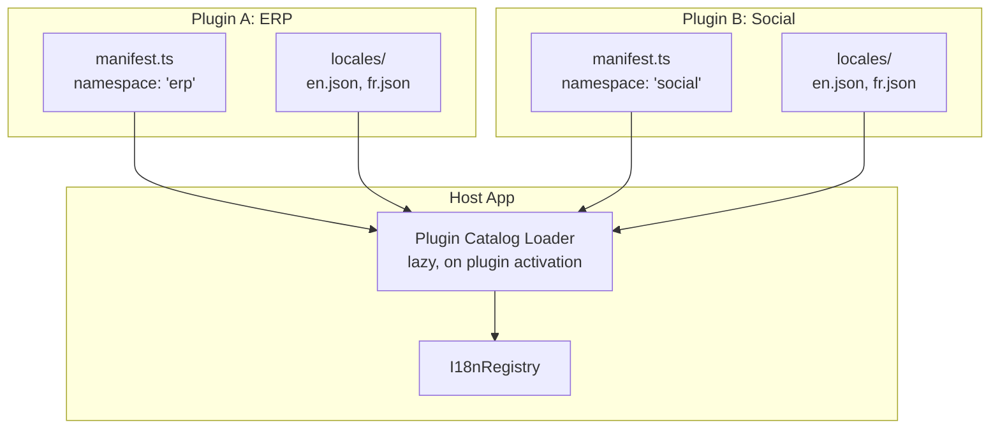
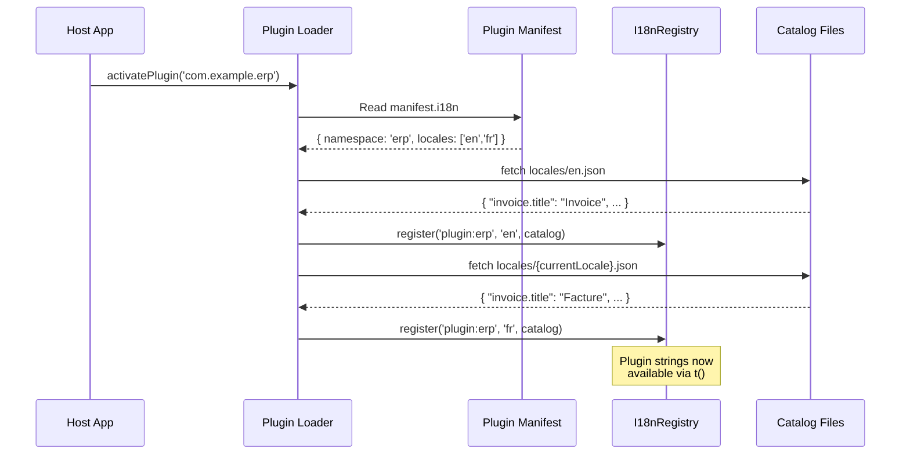

# 05: Plugin Namespaces

> Plugin i18n API: isolated translation namespaces, manifest declaration, and lazy loading

**Duration:** 2-3 days  
**Dependencies:** Steps 01, 03

## Overview

Each plugin gets an isolated translation namespace so its strings never collide with the core app or other plugins. Plugins declare translations in their manifest and the host app loads them lazily.



## Plugin Manifest i18n Declaration

```typescript
// plugins/erp/manifest.ts
import type { PluginManifest } from '@xnetjs/plugin-api'

const manifest: PluginManifest = {
  id: 'com.example.erp',
  name: 'ERP Suite',
  version: '1.0.0',

  i18n: {
    /** Namespace for this plugin's translations */
    namespace: 'erp',
    /** Path to locales directory (relative to plugin root) */
    localesDir: './locales',
    /** Source locale */
    sourceLocale: 'en',
    /** Available locales */
    locales: ['en', 'fr', 'de', 'es']
  }
}

export default manifest
```

## Plugin Locale Files

```json
// plugins/erp/locales/en.json
{
  "invoice.title": "Invoice",
  "invoice.total": "{count, plural, one {# item} other {# items}} — {amount, number, ::currency/USD}",
  "invoice.status.draft": "Draft",
  "invoice.status.sent": "Sent",
  "invoice.status.paid": "Paid",
  "order.create": "Create Order",
  "order.ship": "Ship Order",
  "customer.title": "Customer",
  "customer.count": "{count, plural, one {# customer} other {# customers}}"
}
```

```json
// plugins/erp/locales/fr.json
{
  "invoice.title": "Facture",
  "invoice.total": "{count, plural, one {# article} other {# articles}} — {amount, number, ::currency/EUR}",
  "invoice.status.draft": "Brouillon",
  "invoice.status.sent": "Envoyée",
  "invoice.status.paid": "Payée",
  "order.create": "Créer une commande",
  "order.ship": "Expédier la commande",
  "customer.title": "Client",
  "customer.count": "{count, plural, one {# client} other {# clients}}"
}
```

## usePluginTranslation Hook

```typescript
// packages/react/src/i18n/usePluginTranslation.ts
import { useContext, useCallback, useEffect, useState } from 'react'
import { I18nContext } from './I18nProvider'
import type { MessageValues } from '@xnetjs/i18n'

export interface UsePluginTranslationResult {
  /** Translate a key within the plugin's namespace */
  t: (key: string, values?: MessageValues) => string
  /** Current locale */
  locale: string
  /** Whether the plugin's catalog is loaded */
  isLoading: boolean
}

export function usePluginTranslation(pluginId: string): UsePluginTranslationResult {
  const ctx = useContext(I18nContext)
  if (!ctx) throw new Error('usePluginTranslation must be used within an I18nProvider')

  const [isLoading, setIsLoading] = useState(false)
  const namespace = `plugin:${pluginId}`

  // Ensure plugin catalog is loaded for current locale
  useEffect(() => {
    const loaded = ctx.registry.getLocales(namespace).includes(ctx.locale)
    if (!loaded) {
      setIsLoading(true)
      // Catalog loader handles fetching
      ctx.registry.getLocales(namespace) // trigger load
      setIsLoading(false)
    }
  }, [ctx.locale, namespace])

  const t = useCallback(
    (key: string, values?: MessageValues) => ctx.t(key, values, namespace),
    [ctx.t, namespace]
  )

  return { t, locale: ctx.locale, isLoading }
}
```

## Plugin Registration Flow



## Plugin Catalog Loader

```typescript
// packages/react/src/i18n/pluginCatalogLoader.ts

export interface PluginI18nConfig {
  namespace: string
  localesDir: string
  sourceLocale: string
  locales: string[]
}

export class PluginCatalogLoader {
  constructor(
    private registry: I18nRegistry,
    private fetchCatalog: (pluginId: string, locale: string) => Promise<Record<string, string>>
  ) {}

  /** Load all catalogs for a plugin */
  async loadPlugin(
    pluginId: string,
    config: PluginI18nConfig,
    currentLocale: string
  ): Promise<void> {
    const namespace = `plugin:${pluginId}`

    // Always load source locale
    const sourceCatalog = await this.fetchCatalog(pluginId, config.sourceLocale)
    this.registry.register(namespace, config.sourceLocale, sourceCatalog)

    // Load current locale if different from source
    if (currentLocale !== config.sourceLocale && config.locales.includes(currentLocale)) {
      const localeCatalog = await this.fetchCatalog(pluginId, currentLocale)
      this.registry.register(namespace, currentLocale, localeCatalog)
    }
  }

  /** Unload a plugin's catalogs */
  unloadPlugin(pluginId: string): void {
    this.registry.unregister(`plugin:${pluginId}`)
  }
}
```

## Plugin Usage Example

```tsx
// Inside a plugin component
import { usePluginTranslation } from '@xnetjs/react/i18n'

function InvoiceList({ invoices }: Props) {
  const { t } = usePluginTranslation('com.example.erp')

  return (
    <div>
      <h1>{t('invoice.title')}</h1>
      <p>{t('customer.count', { count: invoices.length })}</p>
      {invoices.map((inv) => (
        <div key={inv.id}>
          <span>{t(`invoice.status.${inv.status}`)}</span>
          <span>{t('invoice.total', { count: inv.items.length, amount: inv.total })}</span>
        </div>
      ))}
    </div>
  )
}
```

## Shared Terms

Plugins can reference core translations for common terms without re-declaring them:

```typescript
// The fallback chain handles this automatically:
// 1. Look in plugin:erp namespace
// 2. If missing, look in core namespace
// 3. If missing, return key as-is

// So plugins don't need to translate "Save", "Cancel", "Delete" etc.
// unless they want to override the core translations
```

## Tests

```typescript
describe('usePluginTranslation', () => {
  it('should resolve keys from plugin namespace')
  it('should fall back to core namespace for shared terms')
  it('should fall back to source locale when translation missing')
  it('should handle plugin activation/deactivation')
  it('should load catalog for current locale on mount')
  it('should reload catalog when locale changes')
})

describe('PluginCatalogLoader', () => {
  it('should register source locale catalog')
  it('should register current locale catalog')
  it('should skip loading unsupported locales')
  it('should unregister catalogs on plugin unload')
})
```

## Acceptance Criteria

- [ ] Plugins declare i18n config in manifest
- [ ] Plugin catalogs are loaded lazily on activation
- [ ] `usePluginTranslation` resolves plugin-scoped keys
- [ ] Fallback to core namespace works for shared terms
- [ ] Plugin unload removes its translations
- [ ] Multiple plugins with different namespaces coexist
