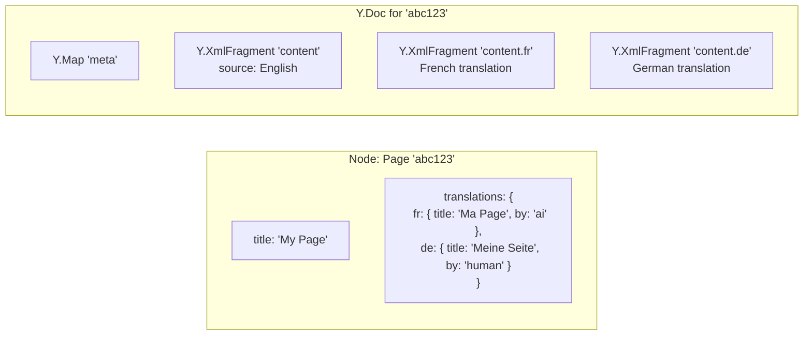
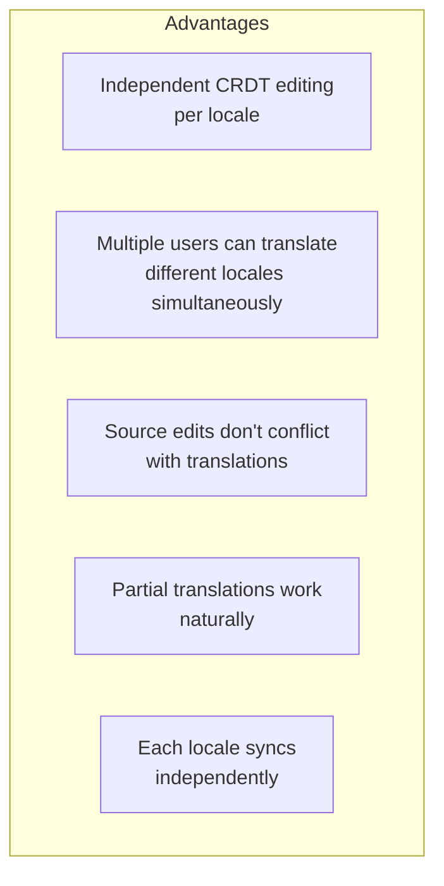
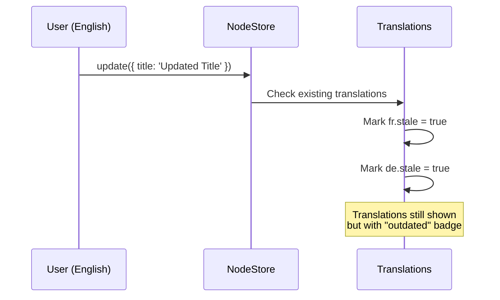
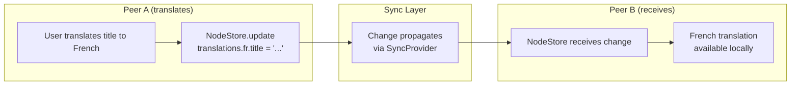

# 08: Multilingual Node Content

> Storing translations as Node properties and rich text as locale-specific Y.Doc fragments

**Duration:** 2-3 days  
**Dependencies:** Steps 03, 07, `@xnetjs/data`

## Overview

User-generated content (page titles, descriptions, rich text) can have translations stored directly on the Node. Structured properties use a `translations` map; rich text uses separate `Y.XmlFragment` per locale.



## Schema Extension

```typescript
// Translation metadata stored per-locale on a Node
export interface NodeTranslation {
  /** Translated field values */
  [field: string]: string | undefined
  /** Who produced this translation */
  translatedBy?: 'ai' | 'human'
  /** When it was translated */
  translatedAt?: number
  /** Model used (if AI) */
  model?: string
  /** Whether source has changed since translation */
  stale?: boolean
}

// Stored on Node.properties.translations
export type TranslationsMap = Record<string, NodeTranslation>
// Key is locale code: { 'fr': { title: '...', translatedBy: 'ai' }, ... }
```

### Adding translations field to existing schemas

```typescript
// All translatable schemas include a translations property
const PageSchema = defineSchema({
  name: 'Page',
  namespace: 'xnet://xnet.dev/',
  properties: {
    title: text({ required: true }),
    icon: text(),
    cover: text(),
    translations: json<TranslationsMap>() // Locale → translated properties
  }
})
```

## Rich Text (Y.Doc) Translation

Each locale gets its own `Y.XmlFragment` in the document's Y.Doc, named with a locale suffix:

```typescript
// Reading/writing translated rich text
function getContentFragment(doc: Y.Doc, locale?: string): Y.XmlFragment {
  const key = locale ? `content.${locale}` : 'content'
  return doc.getXmlFragment(key)
}

// Source content (English)
const sourceContent = doc.getXmlFragment('content')

// French translation
const frenchContent = doc.getXmlFragment('content.fr')

// German translation
const germanContent = doc.getXmlFragment('content.de')
```

### Benefits of Separate Fragments



## Stale Detection

When the source text changes, translations are marked as stale:



### Implementation

```typescript
// In useMutate or NodeStore middleware
async function onPropertyUpdate(nodeId: string, field: string, newValue: any) {
  const node = await store.get(nodeId)
  const translations = node.properties.translations as TranslationsMap | undefined

  if (translations) {
    // Mark translations for this field as stale
    const updated = { ...translations }
    for (const [locale, trans] of Object.entries(updated)) {
      if (trans[field] !== undefined) {
        updated[locale] = { ...trans, stale: true }
      }
    }
    await store.update(nodeId, { translations: updated })
  }
}
```

## useNodeTranslation Hook

```typescript
// packages/react/src/i18n/useNodeTranslation.ts

export interface UseNodeTranslationResult {
  /** Translated title (or source if no translation exists) */
  title: string
  /** All translated properties for the target locale */
  properties: Record<string, string>
  /** Whether a translation exists for this locale */
  isTranslated: boolean
  /** Whether the translation is stale (source changed) */
  isStale: boolean
  /** Who produced the translation */
  translatedBy: 'ai' | 'human' | null
  /** Trigger AI translation */
  translate: (fields?: string[]) => Promise<void>
  /** Whether translation is in progress */
  isTranslating: boolean
  /** Translated rich text fragment (or source if none) */
  contentFragment: Y.XmlFragment | null
}

export function useNodeTranslation(
  nodeId: string,
  targetLocale: string
): UseNodeTranslationResult {
  const { data: node } = useQuery(/* schema */, nodeId)
  const { doc } = useDocument(/* schema */, nodeId)
  const [isTranslating, setIsTranslating] = useState(false)
  const { mutate } = useMutate()

  const translations = node?.translations as TranslationsMap | undefined
  const localeTranslation = translations?.[targetLocale]

  const translate = async (fields?: string[]) => {
    if (!node) return
    setIsTranslating(true)

    try {
      const engine = new TranslationOrchestrator()
      const fieldsToTranslate = fields ?? ['title']
      const results: Record<string, string> = {}

      for (const field of fieldsToTranslate) {
        const sourceText = node[field] as string
        if (!sourceText) continue

        const result = await engine.translate({
          text: sourceText,
          sourceLang: 'auto',
          targetLang: targetLocale,
          contentType: field === 'title' ? 'title' : 'paragraph'
        })
        results[field] = result.translated
      }

      // Store translation on Node
      const updatedTranslations: TranslationsMap = {
        ...translations,
        [targetLocale]: {
          ...results,
          translatedBy: 'ai',
          translatedAt: Date.now(),
          model: results.model,
          stale: false
        }
      }
      await mutate.update(/* schema */, nodeId, { translations: updatedTranslations })
    } finally {
      setIsTranslating(false)
    }
  }

  // Rich text fragment for target locale
  const contentFragment = doc
    ? getContentFragment(doc, targetLocale === node?.sourceLocale ? undefined : targetLocale)
    : null

  return {
    title: localeTranslation?.title ?? node?.title ?? '',
    properties: localeTranslation ?? {},
    isTranslated: !!localeTranslation,
    isStale: localeTranslation?.stale ?? false,
    translatedBy: localeTranslation?.translatedBy ?? null,
    translate,
    isTranslating,
    contentFragment
  }
}
```

## Syncing Translations

Translations are regular Node properties — they sync via the existing Change/CRDT infrastructure:



No special sync logic needed — translations are just properties.

## Tests

```typescript
describe('useNodeTranslation', () => {
  it('should return source text when no translation exists')
  it('should return translated text when available')
  it('should mark translations as stale when source changes')
  it('should trigger AI translation and store result')
  it('should provide correct content fragment for locale')
})

describe('Stale detection', () => {
  it('should mark all locale translations as stale on source edit')
  it('should clear stale flag when re-translated')
  it('should not mark as stale for unrelated field changes')
})
```

## Acceptance Criteria

- [ ] Translations stored as Node properties (TranslationsMap)
- [ ] Rich text uses locale-specific Y.XmlFragment
- [ ] Stale detection marks translations when source changes
- [ ] useNodeTranslation provides translated properties
- [ ] AI translation stores results on Node
- [ ] Translations sync to peers via existing infrastructure
- [ ] Multiple locales can coexist on a single Node
