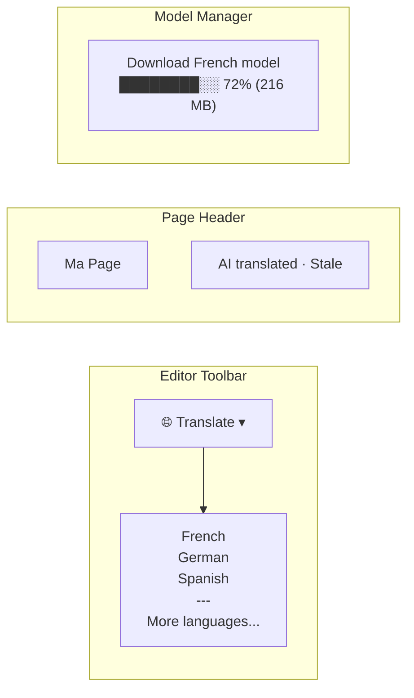
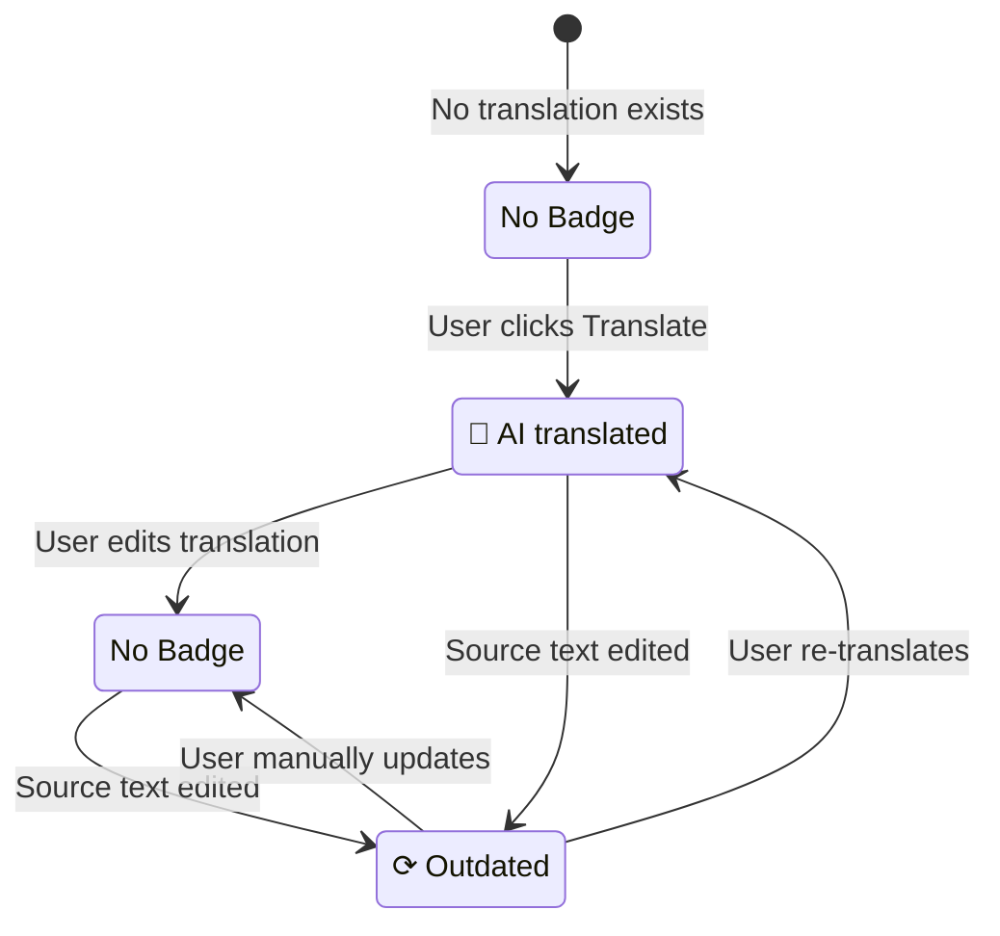

# 09: Translation UX

> Editor integration, translate buttons, AI badges, stale indicators, and model download flow

**Duration:** 2-3 days  
**Dependencies:** Steps 07, 08, `@xnetjs/editor`

## Overview

The translation UX surfaces AI translation in the editor and page views — users can translate Nodes with one click, see quality indicators, and manage model downloads.



## Translate Button (Editor Toolbar)

```tsx
// packages/editor/src/components/TranslateButton.tsx
import { useNodeTranslation, useLocale } from '@xnetjs/react/i18n'
import { useTranslation } from '@xnetjs/react/i18n'

interface TranslateButtonProps {
  nodeId: string
  schema: DefinedSchema<any>
}

function TranslateButton({ nodeId, schema }: TranslateButtonProps) {
  const { t } = useTranslation('editor')
  const currentLocale = useLocale()
  const [targetLocale, setTargetLocale] = useState<string | null>(null)
  const [showMenu, setShowMenu] = useState(false)

  const TARGET_LOCALES = SUPPORTED_LOCALES.filter((l) => l.code !== currentLocale)

  return (
    <div className="translate-button">
      <button onClick={() => setShowMenu(!showMenu)} title={t('toolbar.translate')}>
        🌐
      </button>

      {showMenu && (
        <menu className="translate-menu">
          {TARGET_LOCALES.map((locale) => (
            <TranslateMenuItem key={locale.code} nodeId={nodeId} locale={locale} />
          ))}
        </menu>
      )}
    </div>
  )
}

function TranslateMenuItem({ nodeId, locale }: { nodeId: string; locale: LocaleInfo }) {
  const { isTranslated, isStale, translate, isTranslating } = useNodeTranslation(
    nodeId,
    locale.code
  )

  return (
    <button onClick={() => translate()} disabled={isTranslating}>
      <span>{locale.name}</span>
      {isTranslating && <Spinner size="sm" />}
      {isTranslated && !isStale && <span className="badge-translated">✓</span>}
      {isTranslated && isStale && <span className="badge-stale">⟳</span>}
    </button>
  )
}
```

## Translation Badge

Shows on translated content to indicate provenance:

```tsx
// packages/ui/src/components/TranslationBadge.tsx

interface TranslationBadgeProps {
  translatedBy: 'ai' | 'human'
  isStale: boolean
  model?: string
  translatedAt?: number
}

function TranslationBadge({ translatedBy, isStale, model, translatedAt }: TranslationBadgeProps) {
  const { t } = useTranslation()

  if (isStale) {
    return (
      <span className="translation-badge stale" title={t('translation.staleHint')}>
        {t('translation.outdated')}
      </span>
    )
  }

  if (translatedBy === 'ai') {
    return (
      <span className="translation-badge ai" title={model ?? ''}>
        {t('translation.aiTranslated')}
      </span>
    )
  }

  return null // Human translations don't show a badge
}
```

### Badge States



## Model Download Flow

First translation triggers a model download. Show progress and allow cancellation.

```tsx
// packages/react/src/i18n/ModelDownloadDialog.tsx

function ModelDownloadDialog({ sourceLang, targetLang, onComplete, onCancel }: Props) {
  const { t } = useTranslation()
  const [progress, setProgress] = useState({ loaded: 0, total: 0 })
  const [status, setStatus] = useState<'estimating' | 'downloading' | 'ready'>('estimating')

  useEffect(() => {
    const engine = new TranslationOrchestrator()
    engine.getStatus().then((s) => {
      if (s.available) {
        setStatus('ready')
        onComplete()
      }
    })
  }, [])

  const startDownload = async () => {
    setStatus('downloading')
    const engine = new TransformersTranslationEngine()
    await engine.downloadModel(sourceLang, targetLang, (loaded, total) => {
      setProgress({ loaded, total })
    })
    setStatus('ready')
    onComplete()
  }

  const sizeEstimate = formatBytes(progress.total || 300 * 1024 * 1024)

  return (
    <dialog open>
      <h3>{t('translation.downloadTitle')}</h3>
      <p>{t('translation.downloadDescription', { size: sizeEstimate })}</p>

      {status === 'downloading' && (
        <div className="progress-bar">
          <div
            className="progress-fill"
            style={{ width: `${(progress.loaded / progress.total) * 100}%` }}
          />
          <span>
            {formatBytes(progress.loaded)} / {sizeEstimate}
          </span>
        </div>
      )}

      <footer>
        <button onClick={onCancel}>{t('action.cancel')}</button>
        {status === 'estimating' && (
          <button onClick={startDownload}>
            {t('translation.download', { size: sizeEstimate })}
          </button>
        )}
      </footer>
    </dialog>
  )
}
```

## Language Switcher (Page View)

For pages with translations, show a language toggle:

```tsx
// apps/web/src/components/PageLanguageSwitcher.tsx

function PageLanguageSwitcher({ nodeId }: { nodeId: string }) {
  const { data: node } = useQuery(PageSchema, nodeId)
  const translations = node?.translations as TranslationsMap | undefined
  const [viewLocale, setViewLocale] = useState<string | null>(null)

  if (!translations || Object.keys(translations).length === 0) return null

  const availableLocales = Object.keys(translations)

  return (
    <div className="language-switcher">
      <button className={!viewLocale ? 'active' : ''} onClick={() => setViewLocale(null)}>
        Source
      </button>
      {availableLocales.map((locale) => (
        <button
          key={locale}
          className={viewLocale === locale ? 'active' : ''}
          onClick={() => setViewLocale(locale)}
        >
          {LOCALE_FLAGS[locale]} {LOCALE_NAMES[locale]}
          {translations[locale].stale && <span className="stale-dot" />}
        </button>
      ))}
    </div>
  )
}
```

## Batch Translation

Translate multiple Nodes at once (e.g., all pages in a database):

```tsx
function BatchTranslateButton({ nodeIds, targetLocale }: Props) {
  const { t } = useTranslation()
  const [progress, setProgress] = useState({ done: 0, total: 0 })
  const [isRunning, setIsRunning] = useState(false)

  const translateAll = async () => {
    setIsRunning(true)
    setProgress({ done: 0, total: nodeIds.length })

    const engine = new TranslationOrchestrator()
    for (let i = 0; i < nodeIds.length; i++) {
      await translateNode(nodeIds[i], targetLocale, engine)
      setProgress({ done: i + 1, total: nodeIds.length })
    }

    setIsRunning(false)
  }

  return (
    <button onClick={translateAll} disabled={isRunning}>
      {isRunning
        ? t('translation.batchProgress', { done: progress.done, total: progress.total })
        : t('translation.batchTranslate', { count: nodeIds.length })}
    </button>
  )
}
```

## Acceptance Criteria

- [ ] Translate button appears in editor toolbar
- [ ] Language menu shows available target locales
- [ ] Translation badge shows AI/stale status
- [ ] Model download dialog with progress bar
- [ ] Language switcher shows available translations on page
- [ ] Stale indicator when source text changes after translation
- [ ] Batch translation for multiple Nodes
- [ ] Human edits to translation remove AI badge
