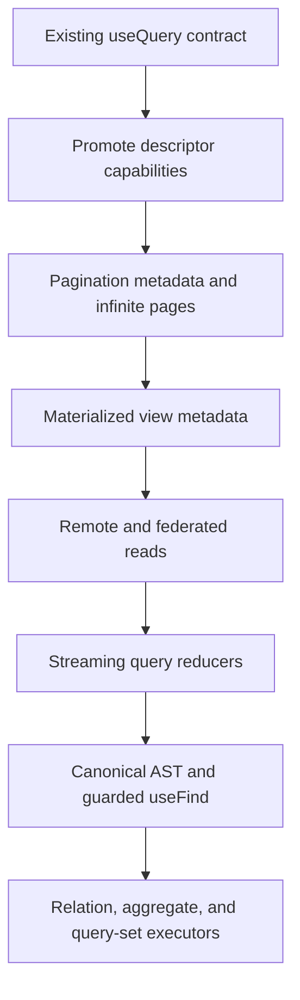
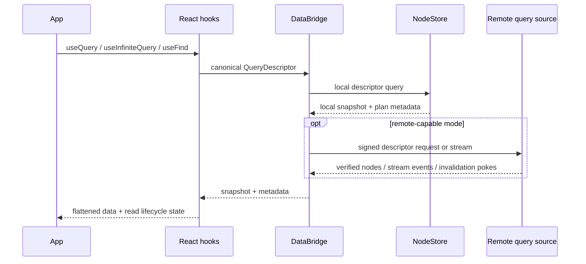

# useQuery API Roadmap Implementation Plan

Source exploration: [0139 Improving The useQuery API](../../explorations/0139_[x]_IMPROVING_THE_USEQUERY_API.md)

## Goal

Turn `useQuery` into the universal xNet read surface while keeping existing calls source-compatible. The implementation should advance in small, testable slices that preserve the local-first contract and expose richer metadata instead of replacing the current hook shape.

## Current Checkpoint

- [x] `search`, `spatial`, `materializedView`, `mode`, and `source` are public `useQuery` options.
- [x] Query results expose pagination, plan, materialized, remote completeness, staleness, verification, and stream metadata.
- [x] `useInfiniteQuery()` wraps cursor-page reads over the same descriptor runtime.
- [x] The data bridge supports local, local-then-remote, remote, stream, remote invalidation, and routed auto execution modes.
- [x] The data package exposes a canonical `QueryAST`, planner validation, relation requirements, aggregate planning, query sets, and `SavedView` descriptors.
- [x] `useFind()` is available as a guarded AST adapter for node-query subsets that lower to the current descriptor executor.

## Execution Model

## Remaining Work

- [ ] Add relation include execution after reverse relation indexes and auth checks are validated end-to-end.
- [ ] Add aggregate execution and result metadata for `count`, `countDistinct`, `sum`, `avg`, `min`, `max`, `groupBy`, and `having`.
- [ ] Add query-set/dashboard execution for multi-query pages and dashboards.
- [ ] Add worker remote transport and hub-side authorization enforcement for remote Node queries.
- [ ] Add encrypted-search and encrypted-materialized-view strategy before promoting those paths for encrypted node stores.
- [ ] Add dedicated reference pages for pagination, materialized views, remote reads, streaming, query planning, and AST reads.

## Validation Checklist

- [ ] Existing `useQuery(Schema)`, `useQuery(Schema, id)`, and `useQuery(Schema, filter)` call sites compile unchanged after every slice.
- [ ] `pnpm --filter @xnetjs/react typecheck` passes.
- [ ] `pnpm --filter @xnetjs/data-bridge typecheck` passes when bridge behavior changes.
- [ ] Focused hook and bridge tests cover every new descriptor or metadata path.
- [ ] Full `pnpm typecheck && pnpm test` passes before push.
