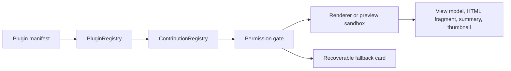
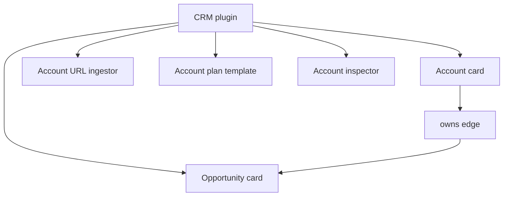
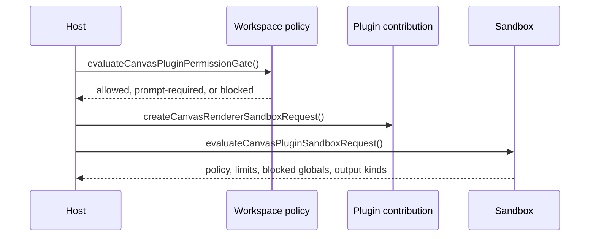

# Canvas Plugin Authoring

This guide describes the current canvas plugin surface in `@xnetjs/plugins`. Canvas plugins declare what they can render, ingest, inspect, lay out, connect, or template through `manifest.contributes`. The host app owns execution, permission prompts, sandboxing, and fallback rendering.

The model is intentionally declarative: plugin authors describe card capabilities and sandbox entrypoints; xNet decides when to run them and how much access they receive.



## Contribution Types

Canvas contributions live under `contributes`:

| Field              | Purpose                                                                          |
| ------------------ | -------------------------------------------------------------------------------- |
| `canvasCards`      | Render schema, provider, or canvas-kind objects as cards.                        |
| `canvasIngestors`  | Convert URLs, files, text, data transfers, or custom inputs into canvas objects. |
| `canvasTools`      | Add toolbar tools such as create, connect, annotate, or layout modes.            |
| `canvasLayouts`    | Arrange selections, frames, query results, mind maps, or whole canvases.         |
| `canvasEdges`      | Define semantic relationship types and edge presentation defaults.               |
| `canvasInspectors` | Add contextual popovers, side panels, or bottom-panel inspectors.                |
| `canvasTemplates`  | Instantiate reusable canvas workspaces, plans, or domain diagrams.               |

## Minimal Card Plugin

```typescript
import { defineExtension } from '@xnetjs/plugins'

export const crmCanvasPlugin = defineExtension({
  id: 'com.example.crm-canvas',
  name: 'CRM Canvas',
  version: '1.0.0',
  permissions: {
    schemas: {
      read: ['xnet://example.crm/account'],
      create: ['xnet://example.crm/account']
    },
    capabilities: {
      storage: 'local'
    }
  },
  contributes: {
    canvasCards: [
      {
        id: 'crm.account-card',
        type: 'canvas.card',
        name: 'Account Card',
        description: 'Shows owner, health, renewal date, and pipeline.',
        icon: 'Building2',
        schemaId: 'xnet://example.crm/account',
        provider: 'crm',
        canvasKinds: ['record', 'database-row'],
        previewTiers: ['summary', 'thumbnail', 'shell'],
        rendererEntrypoint: 'canvas/cards/account.render',
        previewEntrypoint: 'canvas/cards/account.preview',
        fallbackLabel: 'CRM account'
      }
    ]
  }
})
```

Entry points are stable string identifiers. They are validated before sandbox execution, so keep them lowercase, deterministic, and plugin-scoped.

## Full Domain Plugin Shape

A useful canvas plugin usually contributes more than one card. For example, a CRM plugin might include account and opportunity cards, an account URL ingestor, account-plan templates, and semantic edges.



```typescript
export const crmContributes = {
  canvasCards: [
    {
      id: 'crm.account-card',
      type: 'canvas.card',
      name: 'CRM Account Card',
      provider: 'crm',
      schemaId: 'xnet://example.crm/account',
      canvasKinds: ['record', 'database-row'],
      previewTiers: ['summary', 'thumbnail', 'shell'],
      rendererEntrypoint: 'crm/cards/account.render',
      previewEntrypoint: 'crm/cards/account.preview'
    },
    {
      id: 'crm.opportunity-card',
      type: 'canvas.card',
      name: 'CRM Opportunity Card',
      provider: 'crm',
      schemaId: 'xnet://example.crm/opportunity',
      canvasKinds: ['record', 'timeline-item'],
      previewTiers: ['summary', 'thumbnail', 'shell'],
      rendererEntrypoint: 'crm/cards/opportunity.render',
      previewEntrypoint: 'crm/cards/opportunity.preview'
    }
  ],
  canvasIngestors: [
    {
      id: 'crm.account-url-ingestor',
      type: 'canvas.ingestor',
      name: 'CRM Account URL Ingestor',
      input: 'url',
      urlPatterns: ['https://crm.example.com/accounts/*'],
      matchEntrypoint: 'crm/ingestors/account.match',
      ingestEntrypoint: 'crm/ingestors/account.ingest'
    }
  ],
  canvasEdges: [
    {
      id: 'crm.owns',
      type: 'canvas.edge',
      name: 'Owns',
      label: 'owns',
      directed: true,
      allowedSourceSchemas: ['xnet://example.crm/account'],
      allowedTargetSchemas: ['xnet://example.crm/opportunity'],
      style: 'solid'
    }
  ],
  canvasTemplates: [
    {
      id: 'crm.account-plan-template',
      type: 'canvas.template',
      name: 'Account Plan',
      category: 'planning',
      tags: ['crm', 'sales', 'renewal'],
      instantiateEntrypoint: 'crm/templates/account-plan.instantiate',
      previewEntrypoint: 'crm/templates/account-plan.preview'
    }
  ]
}
```

## Permissions And Sandbox

Canvas contributions may request fine-grained contribution permissions such as `canvas.render`, `canvas.layout`, `canvas.ingest`, `network`, `storage`, or `clipboard`. The host evaluates those requests against workspace policy before rendering.



```typescript
import {
  createCanvasRendererSandboxRequest,
  evaluateCanvasPluginPermissionGate,
  evaluateCanvasPluginSandboxRequest
} from '@xnetjs/plugins'

const card = crmCanvasPlugin.contributes?.canvasCards?.[0]

if (card) {
  const permission = evaluateCanvasPluginPermissionGate({
    pluginId: crmCanvasPlugin.id,
    contributionId: card.id,
    contributionName: card.name,
    requestedPermissions: card.permissions ?? [],
    policy: {
      trustedPluginIds: [crmCanvasPlugin.id],
      allowedPermissions: ['canvas.read', 'canvas.render']
    }
  })

  const request = createCanvasRendererSandboxRequest({
    pluginId: crmCanvasPlugin.id,
    contribution: card
  })

  const sandbox = evaluateCanvasPluginSandboxRequest(request)

  console.log(permission.status, sandbox.allowed)
}
```

Renderer sandboxes are short-lived and constrained:

| Sandbox  | DOM access      | Network                 | Mutation | Output                                   |
| -------- | --------------- | ----------------------- | -------- | ---------------------------------------- |
| Renderer | Isolated iframe | Workspace-approved only | None     | `view-model`, `html-fragment`            |
| Preview  | None            | None                    | None     | `summary`, `thumbnail`, `template-draft` |

HTML fragment outputs are rejected if they contain script tags, event handlers, JavaScript URLs, nested iframes, objects, or embeds.

## Fallback Behavior

Missing, disabled, outdated, blocked, or crashing plugin renderers should not destroy user work. Canvas fallback cards preserve source data and expose recovery actions.

Use the editor fallback helpers when rendering recoverable plugin-card shells:

```typescript
import {
  CanvasPluginFallbackCard,
  createCanvasMissingPluginFallback
} from '@xnetjs/editor/react'

const fallback = createCanvasMissingPluginFallback({
  reason: 'plugin-not-installed',
  pluginId: 'com.example.crm-canvas',
  pluginName: 'CRM Canvas',
  contributionId: 'crm.account-card',
  contributionName: 'Account Card',
  sourceLabel: 'ACME account',
  sourceUrl: 'xnet://object/account/acme'
})

export function MissingCrmCard() {
  return <CanvasPluginFallbackCard fallback={fallback} themeMode="light" />
}
```

The rendered fallback exposes stable attributes such as `data-canvas-plugin-fallback`, `data-canvas-missing-plugin-reason`, `data-canvas-plugin-id`, and `data-canvas-plugin-preserves-source`.

## Fixtures

`@xnetjs/plugins` ships fake canvas plugin fixtures for development and tests:

```typescript
import { createCanvasPluginFixtureCards, createCanvasPluginFixtureManifests } from '@xnetjs/plugins'

for (const manifest of createCanvasPluginFixtureManifests()) {
  await registry.install(manifest)
}

const sampleCards = createCanvasPluginFixtureCards()
```

The fixture set includes:

| Fixture        | Manifest ID               | Example cards                   |
| -------------- | ------------------------- | ------------------------------- |
| CRM            | `com.xnet.fixtures.crm`   | Account, opportunity            |
| ERP            | `com.xnet.fixtures.erp`   | Purchase order, inventory item  |
| Media provider | `com.xnet.fixtures.media` | YouTube video, Spotify playlist |

## Author Checklist

- [ ] Use a reverse-domain plugin ID, such as `com.example.crm-canvas`.
- [ ] Declare every canvas contribution under `contributes`, not a separate plugin field.
- [ ] Keep entrypoints deterministic and plugin-scoped.
- [ ] Add `schemaId`, `provider`, or `canvasKinds` so the host can route objects correctly.
- [ ] Request only the permissions needed by each contribution.
- [ ] Provide summary or thumbnail preview entrypoints for expensive live cards.
- [ ] Treat renderer output as disposable and source node data as canonical.
- [ ] Test missing-plugin, disabled-plugin, permission-required, and sandbox-blocked fallbacks.

## Validation Checklist

- [ ] `validateManifest(plugin)` accepts the manifest.
- [ ] `PluginRegistry.install(plugin)` registers each contribution.
- [ ] Permission decisions match trusted, unknown, blocked, and network-domain policies.
- [ ] Renderer and preview sandbox requests are allowed only for safe entrypoints and permissions.
- [ ] HTML fragment outputs pass `validateCanvasPluginSandboxOutput`.
- [ ] Fixture or app-level sample cards resolve to existing `canvasCards` IDs.
- [ ] Fallback cards preserve enough source metadata to recover the object after plugin install.
