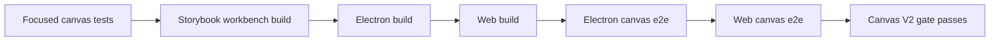

# Canvas V2 Release Gates

> Recorded on **March 10, 2026** for `plan03_9_83CanvasV2`.

This document is the committed proof artifact for the Canvas V2 cycle. It defines the repeatable
Electron-first gate, the thresholds that matter, and the validation runs required before treating
the current canvas shell as the release bar for broader parity work.

## Gate Decision

Canvas V2 is green on the current automated Electron-first gate.

- the Electron shell is already running Canvas V2 as the active canvas-home path,
- the focused renderer tests, Storybook workbench build, Electron build, and web build all clear,
- the Electron canvas suite and shared web canvas suite both clear on the current object model,
- large-scene frame, DOM, minimap, query, and zoom assertions stay inside the current thresholds.



## Repeatable Procedure

Run the gate with one command:

```bash
pnpm validate:canvas-v2
```

That command expands to:

1. focused renderer/runtime tests in `@xnetjs/canvas`
2. `pnpm build:stories`
3. `pnpm --filter xnet-desktop build`
4. `pnpm --filter xnet-web build`
5. `pnpm --filter @xnetjs/e2e-tests exec playwright test src/electron-canvas.spec.ts --project=chromium`
6. fixed-port web dev server plus
   `PLAYWRIGHT_TEST_BASE_URL=http://127.0.0.1:4174 pnpm --filter @xnetjs/e2e-tests exec playwright test src/web-canvas-ingestion.spec.ts --project=chromium`

The script lives at [`scripts/validate-canvas-v2-release-gate.sh`](../../scripts/validate-canvas-v2-release-gate.sh)
and is responsible for:

- using a fixed web gate port,
- waiting for the web gate server before Playwright starts,
- cleaning up the server process and open port on exit.

## Current Thresholds

The automated gate currently treats these as the non-negotiable runtime checks:

| Area                   | Threshold                                                                                                                             |
| ---------------------- | ------------------------------------------------------------------------------------------------------------------------------------- |
| Dense home-surface DOM | under `120` locally and under `180` in CI                                                                                             |
| Active query count     | at or below `5` on the dense scene gate                                                                                               |
| Home-surface editors   | no `contenteditable` or table mounts on the seeded home canvas                                                                        |
| Large-scene fixture    | shared `72 x 54` seeded fixture with cluster groups (`3,969` total nodes) spanning more than `70,000 x 40,000` canvas units           |
| Frame pacing           | web sweeps stay under `24/55ms` average/max locally (`40/90ms` CI); Electron large pan stays under `24/100ms` locally (`40/140ms` CI) |
| Minimap responsiveness | minimap hide/show and click navigation stay responsive under the dense-scene harness                                                  |
| Theme integrity        | shared canvas chrome remains correct in both light and dark themes                                                                    |

## Validation Runs

| Category                 | Command                                                                                                                                                       | Current result                                    |
| ------------------------ | ------------------------------------------------------------------------------------------------------------------------------------------------------------- | ------------------------------------------------- |
| Focused renderer/runtime | `pnpm --filter @xnetjs/canvas exec vitest run src/__tests__/canvas-navigation-shell.test.tsx src/__tests__/minimap.test.ts src/__tests__/performance.test.ts` | passes                                            |
| Storybook/workbench      | `pnpm build:stories`                                                                                                                                          | passes                                            |
| Electron build           | `pnpm --filter xnet-desktop build`                                                                                                                            | passes                                            |
| Web build                | `pnpm --filter xnet-web build`                                                                                                                                | passes                                            |
| Electron shell proof     | `pnpm --filter @xnetjs/e2e-tests exec playwright test src/electron-canvas.spec.ts --project=chromium`                                                         | passes, including remote collaboration regression |
| Web shell proof          | `PLAYWRIGHT_TEST_BASE_URL=http://127.0.0.1:4174 pnpm --filter @xnetjs/e2e-tests exec playwright test src/web-canvas-ingestion.spec.ts --project=chromium`     | passes                                            |
| Push gate                | `pnpm typecheck` and full `pnpm test`                                                                                                                         | passes                                            |

## Gate Mapping

| Gate                     | Evidence                                                      | Status |
| ------------------------ | ------------------------------------------------------------- | ------ |
| Active Electron shell    | Canvas V2 canvas-home path plus Electron canvas suite         | Pass   |
| Minimal UX and shortcuts | Electron canvas hotkey and command tests                      | Pass   |
| Content editing          | inline page editing, peek, database preview/open flows        | Pass   |
| Collaboration boundaries | Electron remote-peer move regression plus undo-boundary suite | Pass   |
| Shared chrome parity     | Electron and web light/dark regressions                       | Pass   |
| Large-scene performance  | Electron and web wide-scene minimap/frame/query/zoom gates    | Pass   |
| Web smoke parity         | shared web canvas ingestion suite                             | Pass   |

## Manual Visual Review

Manual visual review was completed on **March 10, 2026** against the saved Electron artifacts from
the passing gate runs. The review focused on:

- editing surfaces in
  [`docs/pr-artifacts/canvas-v2/2026-03-10-electron-canvas-shell.png`](../pr-artifacts/canvas-v2/2026-03-10-electron-canvas-shell.png)
  and
  [`tmp/playwright/electron-canvas-inline-page.png`](../../tmp/playwright/electron-canvas-inline-page.png),
- collaboration overlays and anchored comments in
  [`docs/pr-artifacts/canvas-v2/2026-03-10-electron-canvas-collaboration.png`](../pr-artifacts/canvas-v2/2026-03-10-electron-canvas-collaboration.png)
  and
  [`docs/pr-artifacts/canvas-v2/2026-03-10-electron-canvas-comments.png`](../pr-artifacts/canvas-v2/2026-03-10-electron-canvas-comments.png),
- dense-scene navigation, minimap, and quiet chrome in
  [`docs/pr-artifacts/canvas-v2/2026-03-10-electron-canvas-performance-scene.png`](../pr-artifacts/canvas-v2/2026-03-10-electron-canvas-performance-scene.png)
  and
  [`tmp/playwright/electron-canvas-large-scene-performance.png`](../../tmp/playwright/electron-canvas-large-scene-performance.png).

That review confirmed the current shell stays visually minimal, keeps the grid/minimap on the
canvas path, and preserves readable selection, collaboration, and editing affordances in the
active dark-mode workspace.

## Notes

- The Electron collaboration gate now includes a remote-peer Yjs regression that moves a canvas
  object while a local inline page edit stays active.
- The current large-scene gate now seeds a `3,969`-node-wide scene and explicitly validates
  long-span pan plus zoom passes on both Electron and web before treating Canvas V2 as green.
- The current gate is automated first, with the artifact review above acting as the current manual
  sign-off for editing, navigation, collaboration, and shortcut feel.
- Future parity work should keep using this Electron-first gate as the stability bar rather than
  broadening the web shell opportunistically.
