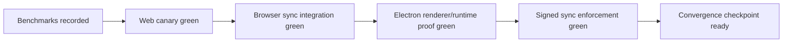

# Core Platform Convergence Release Gates

> Recorded on **March 7, 2026** for `plan03_9_82CorePlatformConvergence`.

This document is the committed proof artifact for the convergence cycle. It captures the benchmark procedure, the current baseline numbers, and the validation runs used before treating the current platform slice as release-ready.

## Gate Decision

The convergence cycle is ready to merge as the current platform checkpoint.

- The web runtime, live-query invalidation, signed sync defaults, database editing path, and observability stack all cleared their current gates.
- The lifecycle matrix remains intentionally conservative: `@xnetjs/data/database` and `@xnetjs/data-bridge` stay labeled `experimental`, so no further relabel is needed yet.
- The Electron multi-profile proving path now boots cleanly with separate Local API ports per profile.



## Repeatable Procedure

Run the convergence gate in this order:

1. `pnpm exec tsx scripts/collect-core-platform-baselines.ts`
2. `pnpm exec vitest run packages/react/src/sync/WebSocketSyncProvider.test.ts packages/react/src/sync/sync-manager.test.ts packages/sqlite/src/browser-support.test.ts packages/hub/test/relay.test.ts`
3. `pnpm exec vitest run --root tests/integration --config vitest.config.ts src/document-sync.test.tsx --browser.headless=true`
4. `pnpm --filter @xnetjs/e2e-tests exec playwright test src/database-undo.spec.ts --project=chromium`
5. Start the public web app: `pnpm --filter xnet-web dev -- --host 127.0.0.1 --port 5173`
6. Run the web canary: `PLAYWRIGHT_TEST_BASE_URL=http://localhost:5173 pnpm --filter @xnetjs/e2e-tests exec playwright test src/pages-crud.spec.ts --project=chromium`
7. Run Electron renderer/runtime proof: `pnpm --filter xnet-desktop exec vitest run src/main/local-api-config.test.ts src/renderer/lib/ipc-sync-manager.test.ts src/renderer/lib/ipc-node-storage.test.ts src/renderer/lib/database-yjs-undo.test.ts`
8. Start Electron multi-profile proving:
   `pnpm --filter xnet-desktop run dev:hub`
   `ELECTRON_CDP_PORT=9223 pnpm --filter xnet-desktop run dev:electron`
   `XNET_PROFILE=user2 VITE_PORT=5174 ELECTRON_CDP_PORT=9224 pnpm --filter xnet-desktop run dev:user2`
9. Confirm CDP endpoints and profile-specific Local API ports:
   `curl http://127.0.0.1:9223/json/version`
   `curl http://127.0.0.1:9224/json/version`

## Benchmark Baselines

Command:

```bash
pnpm exec tsx scripts/collect-core-platform-baselines.ts
```

Environment:

- `recordedAt`: `2026-03-07T14:27:47.699Z`
- `node`: `v23.11.1`
- `platform`: `darwin`
- `arch`: `arm64`

| Metric                      | Iterations | Avg (ms) | Min (ms) | Max (ms) |
| --------------------------- | ---------: | -------: | -------: | -------: |
| `query-window-1000`         |         10 |     0.15 |     0.00 |     1.31 |
| `query-filtered-1000`       |         10 |     0.10 |     0.00 |     0.89 |
| `query-update-fanout-1000`  |         10 |     1.15 |     0.87 |     1.61 |
| `query-window-10000`        |         10 |     0.61 |     0.00 |     6.07 |
| `query-filtered-10000`      |         10 |     0.33 |     0.00 |     3.29 |
| `query-update-fanout-10000` |         10 |     6.89 |     6.44 |     7.54 |
| `global-search-1000`        |         25 |     1.47 |     1.06 |     4.43 |
| `global-search-10000`       |         25 |    15.48 |    13.55 |    22.37 |
| `database-create-row`       |         15 |     1.13 |     1.01 |     1.50 |
| `database-update-row`       |         20 |     0.36 |     0.31 |     0.75 |
| `database-reorder-row`      |         20 |     0.34 |     0.31 |     0.45 |

### Updated baselines — June 11, 2026 (exploration 0163 hot-path work)

Recorded after the 0163 phases landed: bounded-query incremental deltas,
adapter diagnostics gating, identity-stable React layer, two-round-trip
singular writes, and optimistic cache apply. `query-update-fanout-*` is now
end-to-end (durable write + cache fan-out); `query-update-perceived-*`
measures cache-visible latency from the optimistic apply. The 50k fan-out
average is dominated by the first iteration's cold initial query (~58 ms);
its warm iterations match the 10k numbers. `global-search-*` (untouched by 0163) measured ~33 ms at 10k on this machine both before and after the
changes — the difference from the March numbers is environment drift, not
a regression.

Environment:

- `recordedAt`: `2026-06-11T20:47:41.874Z`
- `node`: `v23.11.1`
- `platform`: `darwin`
- `arch`: `arm64`

| Metric                          | Iterations | Avg (ms) | Min (ms) | Max (ms) |
| ------------------------------- | ---------: | -------: | -------: | -------: |
| `query-window-1000`             |         10 |     0.28 |     0.01 |     2.63 |
| `query-filtered-1000`           |         10 |     0.12 |     0.00 |     1.10 |
| `query-update-fanout-1000`      |         10 |     0.66 |     0.48 |     1.41 |
| `query-update-perceived-1000`   |         10 |     0.46 |     0.18 |     0.88 |
| `query-window-10000`            |         10 |     0.49 |     0.00 |     4.78 |
| `query-filtered-10000`          |         10 |     0.76 |     0.00 |     7.54 |
| `query-update-fanout-10000`     |         10 |     0.55 |     0.38 |     1.26 |
| `query-update-perceived-10000`  |         10 |     0.37 |     0.07 |     0.52 |
| `query-update-fanout-50000`     |         10 |     7.66 |     0.37 |    72.92 |
| `query-update-fanout-10000-x10` |         10 |     0.71 |     0.49 |     1.18 |
| `global-search-1000`            |         25 |     3.26 |     2.54 |     6.50 |
| `global-search-10000`           |         25 |    35.82 |    32.64 |    46.83 |
| `database-create-row`           |         15 |     1.37 |     1.18 |     2.07 |
| `database-update-row`           |         20 |     0.39 |     0.31 |     0.87 |
| `database-reorder-row`          |         20 |     0.36 |     0.31 |     0.51 |

## Validation Runs

| Category                        | Command                                                                                                                                                                                                       | Result                                                                              |
| ------------------------------- | ------------------------------------------------------------------------------------------------------------------------------------------------------------------------------------------------------------- | ----------------------------------------------------------------------------------- |
| Signed sync + recovery          | `pnpm exec vitest run packages/react/src/sync/WebSocketSyncProvider.test.ts packages/react/src/sync/sync-manager.test.ts packages/sqlite/src/browser-support.test.ts packages/hub/test/relay.test.ts`         | `4` files passed, `16` tests passed, `1.77s` duration                               |
| Browser multi-device sync       | `pnpm exec vitest run --root tests/integration --config vitest.config.ts src/document-sync.test.tsx --browser.headless=true`                                                                                  | `1` file passed, `4` tests passed, `2.23s` duration                                 |
| Database correctness / undo     | `pnpm --filter @xnetjs/e2e-tests exec playwright test src/database-undo.spec.ts --project=chromium`                                                                                                           | `1` test passed, `11.0s` duration                                                   |
| Web canary                      | `PLAYWRIGHT_TEST_BASE_URL=http://localhost:5173 pnpm --filter @xnetjs/e2e-tests exec playwright test src/pages-crud.spec.ts --project=chromium`                                                               | `1` test passed, `7.1s` duration                                                    |
| Electron renderer/runtime proof | `pnpm --filter xnet-desktop exec vitest run src/main/local-api-config.test.ts src/renderer/lib/ipc-sync-manager.test.ts src/renderer/lib/ipc-node-storage.test.ts src/renderer/lib/database-yjs-undo.test.ts` | `4` files passed, `32` tests passed, `780ms` duration                               |
| Electron multi-profile boot     | `dev:hub` + `dev:electron` + `dev:user2` with CDP on `9223` / `9224`                                                                                                                                          | both instances booted, CDP reachable, secondary profile served Local API on `31417` |

## Gate Mapping

| Gate                  | Evidence                                                   | Status |
| --------------------- | ---------------------------------------------------------- | ------ |
| Runtime bootstrap     | Web canary + Electron CDP boot                             | Pass   |
| Query fanout          | `query-update-fanout-*` baselines                          | Pass   |
| Search responsiveness | `global-search-*` baselines                                | Pass   |
| Database editing      | database benchmark + Playwright undo suite                 | Pass   |
| Sync recovery         | browser sync integration + Electron IPC sync manager tests | Pass   |
| Security enforcement  | signed provider + hub relay tests                          | Pass   |
| Web durability        | persistent-storage state surfaced in canary UI             | Pass   |

## Notes

- The web canary now follows the current onboarding copy by matching `Get started with ...` instead of the older `Touch ID` text.
- Electron multi-profile development no longer collides on the Local API port; `user2` now resolves to `31417` by default.
- This gate clears the convergence checkpoint without relabeling additional package surfaces as `stable`. The current lifecycle matrix already reflects the conservative contract we want to keep.
