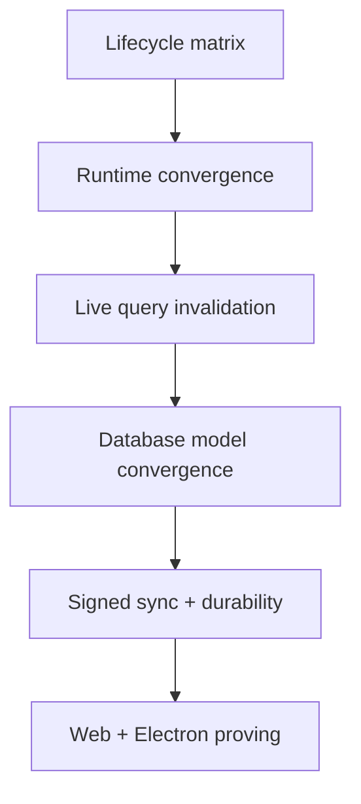

# Core Platform Convergence Release Notes

> Release note draft for the convergence checkpoint recorded on **March 7, 2026**.

## Summary

This cycle tightens xNet around one clearer contract:

- the public API surface is now explicitly tiered,
- the web runtime defaults to the intended worker-first path with visible fallback,
- live queries refresh through canonical descriptors instead of schema-wide churn,
- database editing stays on the hook-driven canonical path,
- sync is signed by default across production-facing paths,
- and durability/sync/runtime state is visible in both the app UI and devtools.



## What Changed

### Public API and lifecycle clarity

- `packages/README.md` and package READMEs now point to the current lifecycle matrix instead of implying that every root barrel is equally stable.
- `docs/reference/api-lifecycle-matrix.md` now includes a `New App Start Here` path so new adopters can find the stable React/data/identity entrypoints quickly.
- `@xnetjs/react`, `@xnetjs/data`, and `@xnetjs/identity` keep compatibility barrels, but new examples now prefer the narrower subpaths where appropriate.

### Runtime and query behavior

- `XNetProvider` exposes explicit runtime mode and fallback state.
- `useQuery()` now uses canonical descriptors and a real reload path.
- query invalidation now targets affected descriptors instead of reloading every query for a schema.
- search, backlinks, and related navigation now ride the same converged query/search surface.

### Database model and editing

- web and Electron database views now compose through the hook layer instead of writing whole arrays into the document directly.
- legacy database materialization is explicit, idempotent, and status-tracked.
- structured undo/redo is separated from document-level rich-text undo.
- database correctness is now backed by focused row-operation tests and the Playwright undo suite.

### Sync, durability, and observability

- sync lifecycles now share the same `idle` / `starting` / `local-ready` / `connecting` / `healthy` / `degraded` / `replaying` / `stopped` phases.
- signed Yjs replication is now the default path across web, Electron, and hub relay code.
- unsigned replication is only accepted when `compatibility.allowUnsignedReplication` is set explicitly.
- the web app requests persistent storage where supported and explains the result in-app.
- devtools now surface runtime mode, sync lifecycle, query descriptors, and storage durability state.

## Migration Guidance

### Preferred imports

For new code, start with:

- `@xnetjs/react`
- `@xnetjs/data/schema`
- `@xnetjs/data/store`
- `@xnetjs/data/updates`
- `@xnetjs/identity/did`
- `@xnetjs/identity/key-bundle`
- `@xnetjs/identity/passkey`

Keep treating these as narrower or still-converging surfaces:

- `@xnetjs/react/database`
- `@xnetjs/data/database`
- `@xnetjs/data/auth`
- `@xnetjs/data-bridge`

### Signed replication

If an older environment still depends on unsigned Yjs payloads, opt in explicitly and treat it as temporary:

```ts
replication: {
  compatibility: {
    allowUnsignedReplication: true
  }
}
```

Do not rely on omitted config silently allowing unsigned payloads anymore.

### Database documents

- legacy array-backed database docs are still readable,
- migration/materialization is explicit and status-tracked,
- and active web/Electron views now operate through the converged hook layer.

If you have custom code that writes directly into legacy database `data` arrays, move it onto the database hooks or row operations instead.

### Electron multi-profile development

Local API ports now derive from profile name by default:

- `default` profile: `31415`
- `user2` profile: `31417`

Use `XNET_LOCAL_API_PORT` to override the port explicitly when needed.

## Operator Notes

- The current release gate artifact lives in `docs/reference/core-platform-convergence-release-gates.md`.
- The lifecycle matrix remains intentionally conservative after this checkpoint. Clearing the convergence gate does not automatically promote every experimental surface to `stable`.
- The next product-focused work should build on this converged base rather than reopening runtime/query/database contract drift.
