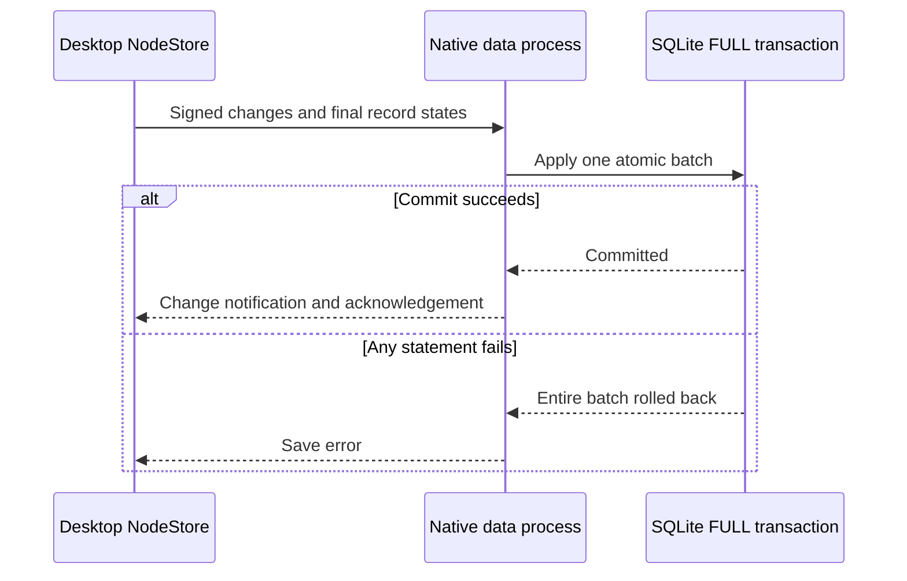
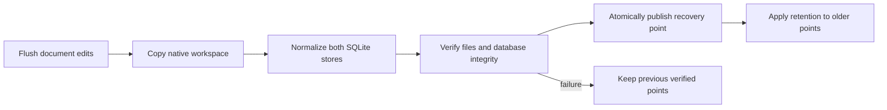
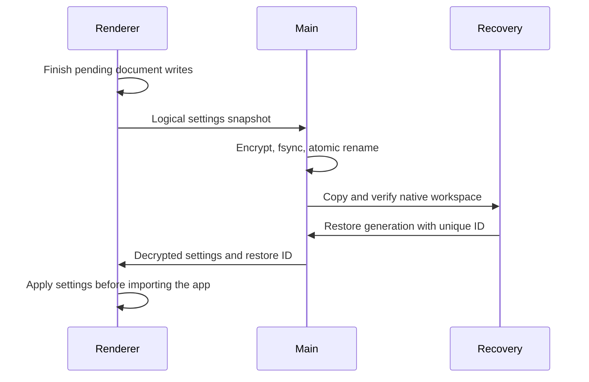

# Desktop storage and recovery

This inventory describes the Electron paths inspected for exploration 0466. A
native recovery copy covers `xnet-data`, including an encrypted logical copy of
known desktop settings. Device-bound sign-in sessions, unlisted browser state,
and external files remain outside that claim. The Settings screen states this limit. Native copies remain local. The separate encrypted export below supports portable recovery of the covered files.

## Data locations

`src/main/profile.ts` resolves Electron's `userData` before taking the instance
lock. The packaged default keeps its existing directory. Source builds prefix
their profile with `dev-`; packaged builds reject that reserved prefix. The
workspace directory is `<userData>/xnet-data`, and recovery copies live beside
it in `<userData>/xnet-recovery`.

| Location                                                          | Contents                                                                                                   | Current recovery coverage                                                     |
| ----------------------------------------------------------------- | ---------------------------------------------------------------------------------------------------------- | ----------------------------------------------------------------------------- |
| `xnet-data/data.db` and its WAL                                   | Nodes, properties, signed changes, Yjs state/history, sync state, indexes, and the data-process blob table | Required; copied and normalized into a standalone database                    |
| `xnet-data/xnet.db` and its WAL                                   | Main-process blob service bytes, including editor attachments                                              | Required; copied and normalized                                               |
| `xnet-data/identity-seed.json`                                    | Desktop signing seed, normally encrypted by Electron `safeStorage`                                         | Required outside explicit test mode; same Mac key store needed                |
| `xnet-data/seed-recovery.json`                                    | Optional encrypted recovery mnemonic                                                                       | Included when present; same Mac key store needed                              |
| `xnet-data/import-sources/<sha256>/`                              | Exact source export bytes retained before an import writes nodes                                           | Included recursively, including unselected source categories                  |
| `xnet-data/import-jobs/`                                          | Reviewed import selections, adapter versions, and acknowledged batch cursors; no signing keys              | Included with retained source evidence; interrupted jobs reopen paused        |
| Other files under `xnet-data`, including tunnel state             | Native persisted configuration and future files                                                            | Included recursively; symlinks and special files fail the copy                |
| `xnet-data/desktop-settings.json`                                 | Encrypted logical copy of known settings, provider key, workspace layout, and unfinished capture draft     | Included after the renderer save barrier; portable export rewraps it          |
| Chromium `Local Storage`, `IndexedDB`, `Preferences`, and cookies | Original settings, device-bound sessions, and caches                                                       | Raw files excluded; only the explicit logical settings contract above travels |
| macOS Keychain                                                    | The OS secret used by `safeStorage`; platform sign-in credentials                                          | Not copied; a file copy alone cannot recover these on another Mac             |
| `<userData>/library-helpers`                                      | Verified downloadable video helper; no workspace data or keys                                              | Excluded; reinstall through Library after restore                             |
| `<userData>/dictation`                                            | Downloaded local transcription models                                                                      | Excluded; models can be downloaded again                                      |
| `<userData>/agent-bridge-mcp.json`                                | Generated agent connection configuration                                                                   | Excluded; regenerate it after restoring                                       |
| System temporary recording directories                            | In-progress screen/audio recordings                                                                        | Not a saved attachment yet; quit stops capture before checkpointing           |
| Files selected from outside the workspace                         | Export inputs, capture sources, published output                                                           | Only a source explicitly retained under `xnet-data` is covered                |
| `<userData>/xnet-recovery`                                        | Verified generations, pinned pre-upgrade points, preserved originals, and restore journals                 | Kept outside the source to prevent recursive backups; still on the same disk  |

The renderer currently supplies its desktop signing identity directly to
`XNetProvider` and uses IPC-backed node and blob storage. Shared browser identity
and session code also exists in the repository, but is not the desktop signing
identity. Browser passkey credentials and non-extractable session wrapping keys
are not exported. AI vector indexes, downloaded models, and telemetry buffers are
rebuildable or disposable. Never replace a failed or missing identity with a
fresh one just to get the app open. A real daily-profile inventory is still needed
before claiming coverage for arbitrary plugins or future browser stores.

### Existing local profile observation (2026-09-30)

The existing `xnet-desktop` profile has storage version 9, 207 node records,
20 saved Yjs states, both native databases, and Chromium local/IndexedDB stores.
It has no `identity-seed.json`. These are metadata observations, not a claim that
all records belong to one recoverable identity. No migration or identity
replacement was attempted. The new startup guard refuses this combination.

Preserve the whole legacy profile before investigating its identity history.
Do not enable the deterministic test identity to make it open, generate a new
seed over it, or treat this profile as a successful installed-upgrade fixture.
Legacy ownership recovery remains a separate prerequisite for using it with the
new daily build. Development profiles continue to use separate directories.

## Atomic record saves

Desktop `NodeStore` creates, updates, deletes, restores, and explicit multi-record
transactions use the native SQLite batch operation. The materialized records,
property indexes, signed changes, and logical clock commit together. IPC returns
success and broadcasts changes only after that commit. A rejected write rolls the
batch back and remains an error to its caller. History reads use the shared
storage decoder, including records written by imports; change IDs, signatures,
protocol versions, and batch positions survive reopening.

A disposable real Electron profile verified a deliberately rejected transaction,
retry, signed batch history after a direct exit that bypassed the quit barrier,
and a final acknowledged edit after normal quit and restart. A local synthetic
sample of 100 creates and 100 updates on 2026-09-30 measured median 4.3/5.3 ms and
95th-percentile 8.6/10.0 ms respectively, through the renderer and native IPC with
the configured `FULL` writer. This is a small warm sample, not a full-corpus
benchmark or a physical power-loss test.

This does not yet cover every mutation path. Document and blob operations have
separate persistence paths; concurrent writers can still need reconciliation
between reading a record and submitting its batch. A renderer operation still
signing or waiting in an application debounce has not reached this commit
boundary. Do not interpret atomic batches as a global save barrier.

## Native checkpoint contract

`xnet-desktop-checkpoint/1` records each retained file's path, size, and SHA-256,
the creating app version, profile, identity mode, and capture time. New points
also record the workspace fingerprint and known storage version. A point is
visible only after file hashes, required files, and both databases pass checks.
An interrupted copy stays incomplete. A changed source, unreadable file, or
missing identity fails visibly. An older point with an unreadable manifest stays
on disk and appears as a warning in Settings. It is excluded from retention
deletion and does not block fresh copies or safe quit. Restore still verifies
every file, even when the manifest can be listed.

The scheduler checks once a minute and creates a point when changed data is at
least fifteen minutes overdue. A successful manual or quit copy resets that
age. Retention keeps one point per fifteen-minute bucket for a day, per day for
a week, and per week for four weeks, plus the latest two. Pinned pre-upgrade
points and replaced original workspaces are not pruned automatically. Their disk
use must remain visible; this is not a total storage cap.

Restore verifies the chosen point, stages a complete copy, and writes a durable
journal before renaming anything. Startup completes that journal before opening
normal stores. The replaced workspace is retained under `preserved/`. Automatic
sync, the local API, and the agent bridge remain paused until review and explicit
reconnection.

## Supported storage upgrades

The candidate migration path currently supports version 8 through the current
version 9. Its version-8 fixture is captured from `6650c1f39^`, before the pin
registry migration. Earlier, unversioned, future, or unreadable formats stop in
recovery. That is preservation, not a claim of migration support.

An upgrade validates the identity first, pins a verified original, and applies
each registered SQL migration to a separate copy. It checks the resulting column
contract, existing table row counts, foreign keys, and database integrity before
promotion through the restore journal. Missing migration steps fail. Both the
pinned original and the replaced workspace remain available after promotion.
The next format change must bring its own historical fixture and migration
validation; a higher version number alone is not proof of compatibility.

Native tests and source-app runs do not establish cross-Mac recovery, signed
installer continuity, or a power-loss guarantee for the underlying hardware.
Those remain separate acceptance checks in exploration 0466.

## Encrypted export

Settings → Data can export a verified native point into a password-encrypted
`.xnetbackup` folder. Keep the entire folder and password separately. Export
verifies all encrypted objects before publishing the folder. Restore verifies
all files in a new private directory and rewraps the actual signing seed with
the destination key store before replacing anything. The current workspace
remains preserved and the recovered workspace opens offline for review.

The original Keychain secret is unnecessary for these encrypted exports. The
app does not save the recovery password. It does not claim off-device protection
merely because a folder was chosen: the user must retain a copy on another disk
or device. Version 2 adds the logical desktop settings and rewraps them with the
destination key store. Version-1 exports remain readable, with their original
coverage; they do not gain settings retroactively. Device-bound sessions remain
excluded.
Only the current storage version can be restored through this control today.
See ADR-40 and ADR-45 for format details and the limits of the cross-Mac evidence.

## Library captures

Library → Save a link creates a private Page with your note and optional
excerpt, linked to a source resource. The source and your writing remain separate.
The Library indexes the saved Page body and refreshes it when you return from the
editor. Matching source URLs reuse the existing resource while keeping each
explicitly requested note independent.

Before native writes begin, `library.db` retains a versioned capture intent and
the original text. Startup retries incomplete intents with the same record IDs;
it never replaces a saved Page body during retry. These intents are currently
retained, including completed ones, so the original captured text remains in
local storage and recovery copies even after the Page changes. The Library database
is included in native checkpoints and encrypted exports when present.

The unsubmitted form draft lives in Chromium local storage. The save barrier
now includes it in the encrypted settings copy before checkpoints, export, and
normal quit. Text entered after the last completed copy is not protected by that
copy. A successful save clears the draft only after
native acknowledgement. Failed attempts retain their original payload for retry.
The desktop shortcut reads the clipboard only when explicitly invoked.

## Desktop settings recovery

The versioned list in `src/shared/desktop-settings.ts` covers the workspace
layout and queued pins, theme and token overrides, selected hub, AI provider key
and preferences, meeting settings, consent choices, dismissed data suggestions,
and capture draft. Absent values are recorded too, so restoring an older point
can clear a setting introduced later. Unknown keys are not silently added to the
contract. Debug switches, test bypasses, temporary OAuth verifiers, and bridge
pairing tokens are excluded. Bridge pairing and sign-in may need to be repeated.

The renderer snapshots these values only after document writes finish. Main
encrypts them with `safeStorage`, writes a private temporary file, fsyncs it, and
renames it into place. A locked key store or damaged prior settings copy fails
the operation and keeps the existing bytes. Unchanged settings do not rewrite
the file. The periodic checkpoint check captures settings before comparing the
workspace fingerprint, so a settings-only change can trigger an overdue copy.

A boot module restores settings before theme, consent, and workspace stores
hydrate. Each restore has a unique receipt; ordinary restarts keep later edits.
An interrupted application leaves no completed receipt and retries on the next
launch. Losing the entire browser profile also triggers recovery from the native
settings copy. This is checkpoint recovery, not a claim that every keystroke in
an unfinished form has already reached a backup.
