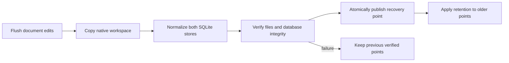

# Desktop storage and recovery

This inventory describes the Electron paths inspected for exploration 0466. A
native recovery copy covers `xnet-data`. It does not yet cover every preference,
browser credential, or external file the desktop can use. The Settings screen
states this limit. Native copies remain local. The separate encrypted export below supports portable recovery of the covered files.

## Data locations

`src/main/profile.ts` resolves Electron's `userData` before taking the instance
lock. The packaged default keeps its existing directory. Source builds prefix
their profile with `dev-`; packaged builds reject that reserved prefix. The
workspace directory is `<userData>/xnet-data`, and recovery copies live beside
it in `<userData>/xnet-recovery`.

| Location                                                          | Contents                                                                                                          | Current recovery coverage                                                    |
| ----------------------------------------------------------------- | ----------------------------------------------------------------------------------------------------------------- | ---------------------------------------------------------------------------- |
| `xnet-data/data.db` and its WAL                                   | Nodes, properties, signed changes, Yjs state/history, sync state, indexes, and the data-process blob table        | Required; copied and normalized into a standalone database                   |
| `xnet-data/xnet.db` and its WAL                                   | Main-process blob service bytes, including editor attachments                                                     | Required; copied and normalized                                              |
| `xnet-data/identity-seed.json`                                    | Desktop signing seed, normally encrypted by Electron `safeStorage`                                                | Required outside explicit test mode; same Mac key store needed               |
| `xnet-data/seed-recovery.json`                                    | Optional encrypted recovery mnemonic                                                                              | Included when present; same Mac key store needed                             |
| `xnet-data/import-sources/<sha256>/`                              | Exact source export bytes retained before an import writes nodes                                                  | Included recursively, including unselected source categories                 |
| `xnet-data/import-jobs/`                                          | Reviewed import selections, adapter versions, and acknowledged batch cursors; no signing keys                     | Included with retained source evidence; interrupted jobs reopen paused       |
| Other files under `xnet-data`, including tunnel state             | Native persisted configuration and future files                                                                   | Included recursively; symlinks and special files fail the copy               |
| Chromium `Local Storage`, `IndexedDB`, `Preferences`, and cookies | Shell/theme preferences, selected hub, provider settings, browser credentials, and caches used by shared packages | Excluded; a complete logical settings/key export remains work                |
| macOS Keychain                                                    | The OS secret used by `safeStorage`; platform sign-in credentials                                                 | Not copied; a file copy alone cannot recover these on another Mac            |
| `<userData>/dictation`                                            | Downloaded local transcription models                                                                             | Excluded; models can be downloaded again                                     |
| `<userData>/agent-bridge-mcp.json`                                | Generated agent connection configuration                                                                          | Excluded; regenerate it after restoring                                      |
| System temporary recording directories                            | In-progress screen/audio recordings                                                                               | Not a saved attachment yet; quit stops capture before checkpointing          |
| Files selected from outside the workspace                         | Export inputs, capture sources, published output                                                                  | Only a source explicitly retained under `xnet-data` is covered               |
| `<userData>/xnet-recovery`                                        | Verified generations, pinned pre-upgrade points, preserved originals, and restore journals                        | Kept outside the source to prevent recursive backups; still on the same disk |

The renderer currently supplies its desktop signing identity directly to
`XNetProvider` and uses IPC-backed node and blob storage. Shared browser identity
and settings code also exists in the repository. Before broadening the backup
claim, inventory its active stores in a real daily profile and export any
non-reconstructible keys and preferences explicitly. Never replace a failed or
missing identity with a fresh one just to get the app open.

## Native checkpoint contract

`xnet-desktop-checkpoint/1` records each retained file's path, size, and SHA-256,
the creating app version, profile, identity mode, and capture time. New points
also record the workspace fingerprint and known storage version. A point is
visible only after file hashes, required files, and both databases pass checks.
An interrupted copy stays incomplete. A changed source, unreadable file, or
missing identity fails visibly.

The scheduler checks once a minute and creates a point when changed data is at
least fifteen minutes overdue. A successful manual or quit copy resets that
age. Retention keeps one point per fifteen-minute bucket for a day, per day for
a week, and per week for four weeks, plus the latest two. Pinned pre-upgrade
points and replaced original workspaces are not pruned automatically. Their disk
use must remain visible; this is not a total storage cap.

Restore verifies the chosen point, stages a complete copy, and writes a durable
journal before renaming anything. Startup completes that journal before opening
normal stores. The replaced workspace is retained under `preserved/`. Automatic
sync, the local API, and the agent bridge remain paused until review and explicit
reconnection.

## Supported storage upgrades

The candidate migration path currently supports version 8 through the current
version 9. Its version-8 fixture is captured from `6650c1f39^`, before the pin
registry migration. Earlier, unversioned, future, or unreadable formats stop in
recovery. That is preservation, not a claim of migration support.

An upgrade validates the identity first, pins a verified original, and applies
each registered SQL migration to a separate copy. It checks the resulting column
contract, existing table row counts, foreign keys, and database integrity before
promotion through the restore journal. Missing migration steps fail. Both the
pinned original and the replaced workspace remain available after promotion.
The next format change must bring its own historical fixture and migration
validation; a higher version number alone is not proof of compatibility.

Native tests and source-app runs do not establish cross-Mac recovery, signed
installer continuity, or a power-loss guarantee for the underlying hardware.
Those remain separate acceptance checks in exploration 0466.

## Encrypted export

Settings → Data can export a verified native point into a password-encrypted
`.xnetbackup` folder. Keep the entire folder and password separately. Export
verifies all encrypted objects before publishing the folder. Restore verifies
all files in a new private directory and rewraps the actual signing seed with
the destination key store before replacing anything. The current workspace
remains preserved and the recovered workspace opens offline for review.

The original Keychain secret is unnecessary for these encrypted exports. The
app does not save the recovery password. It does not claim off-device protection
merely because a folder was chosen: the user must retain a copy on another disk
or device. Browser preferences and sign-in sessions remain outside this format.
Only the current storage version can be restored through this control today.
See ADR-40 for format details and the limits of the cross-Mac evidence.

## Library captures

Library → Save a link creates a private Page with your note and optional
excerpt, linked to a source resource. The source and your writing remain separate.
The Library indexes the saved Page body and refreshes it when you return from the
editor. Matching source URLs reuse the existing resource while keeping each
explicitly requested note independent.

Before native writes begin, `library.db` retains a versioned capture intent and
the original text. Startup retries incomplete intents with the same record IDs;
it never replaces a saved Page body during retry. These intents are currently
retained, including completed ones, so the original captured text remains in
local storage and recovery copies even after the Page changes. The Library database
is included in native checkpoints and encrypted exports when present.

The unsubmitted form draft lives in Chromium local storage and falls outside
the native recovery contract. A successful save clears that draft only after
native acknowledgement. Failed attempts retain their original payload for retry.
The desktop shortcut reads the clipboard only when explicitly invoked.
