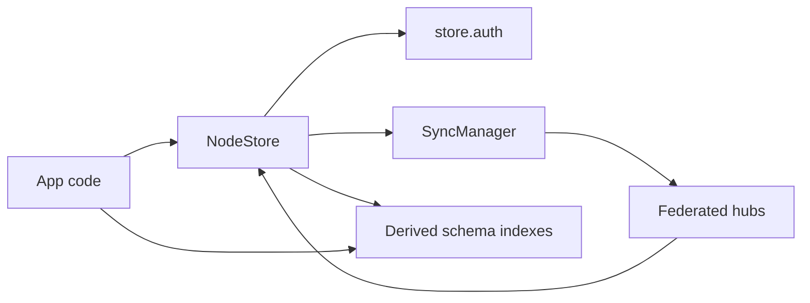
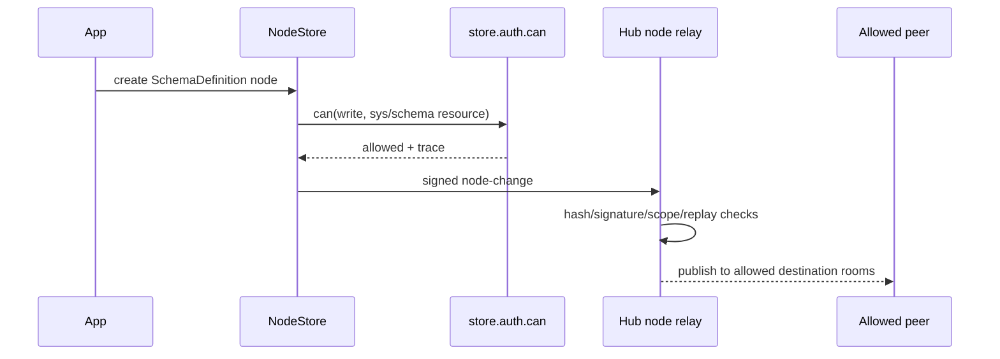
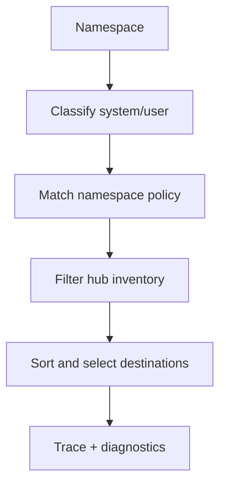

# Node-Native System Schema Federation

This guide describes the app-facing model for global schema federation after the
`sys/*` control-plane work. The short version: schemas, policies, presence, and
grants are all ordinary signed nodes. App code should not learn a second
metadata protocol.



## One Primitive

Use the node graph for both user data and federation metadata.

| Concern                | Node primitive            | Schema                |
| ---------------------- | ------------------------- | --------------------- |
| Publish a schema       | Signed control-plane node | `SchemaDefinition`    |
| Declare compatibility  | Signed control-plane node | `SchemaCompatibility` |
| Route replication      | Policy node               | `SyncPolicy`          |
| Advertise availability | Derived summary node      | `PresenceSummary`     |
| Authorize access       | Grant node                | `Grant`               |

Control-plane writes still pass through the same local and relay gates as user
content:



## SDK Flow

Use `createSchemaDiscovery` to query the replicated node graph, then request or
grant access through `store.auth`.

```ts
import { createSchemaDiscovery } from '@xnetjs/sdk'
import { describeGrantConsent, useAuthTrace, useGrants } from '@xnetjs/react'

const discovery = await createSchemaDiscovery({
  store,
  registry
})

const schemaIri = 'xnet://example.app/Task@1.0.0'
const schema = await discovery.resolveSchema(schemaIri)
const definition = discovery.listSchemas().find((record) => record.schemaIri === schemaIri)

if (!schema || !definition) {
  throw new Error('Schema not found')
}

const consent = describeGrantConsent(
  {
    to: 'did:key:z6MkPeer',
    actions: ['read'],
    resource: definition.nodeId,
    expiresIn: '7d'
  },
  definition.nodeId
)

console.info('Grant preview', {
  what: consent.what,
  where: consent.where,
  howLong: consent.howLong
})

await store.auth.grant({
  to: 'did:key:z6MkPeer',
  actions: ['read'],
  resource: definition.nodeId,
  expiresIn: '7d'
})
```

React surfaces the same trace data for developer panels or consent screens:

```tsx
function AccessTrace({ nodeId }: { nodeId: string }) {
  const { summary } = useAuthTrace({ nodeId, action: 'share' })

  return <pre>{JSON.stringify(summary, null, 2)}</pre>
}
```

## Multi-Hub Routing

`XNetProvider` now passes every configured `signalingServers` URL to
`SyncManager`. The manager subscribes and publishes through a logical
multi-hub connection instead of treating the array as a fallback list.

Replication policy planning lives in `@xnetjs/sync`:

```ts
import { planReplicationDestinations } from '@xnetjs/sync'

const plan = planReplicationDestinations({
  namespace: 'xnet://did:key:zAlice/sys/schema/',
  config: {
    federation: {
      hubs: [
        { id: 'local', url: 'ws://localhost:4444' },
        { id: 'public', url: 'wss://hub.example.net', kinds: ['system'] }
      ],
      defaultSystemHubIds: ['local', 'public'],
      defaultUserHubIds: ['local']
    }
  }
})

console.info(plan.destinations, plan.trace)
```



## Error Taxonomy

Use stable lower-case federation codes in app UX and telemetry. Hub wire errors
may also include legacy upper-case auth codes; map them to these categories at
the UI boundary.

| Code                        | Meaning                                                           | Typical user/developer action                    |
| --------------------------- | ----------------------------------------------------------------- | ------------------------------------------------ |
| `missing_scope`             | The signer lacks the required hub or `sys/*` capability.          | Request a narrower grant or refresh hub auth.    |
| `policy_denied`             | A local policy or federation exposure rule blocked the operation. | Inspect `store.auth.explain` or planner trace.   |
| `invalid_signature`         | A change or envelope signature failed verification.               | Reject the payload and inspect signer identity.  |
| `replay_rejected`           | A duplicate control-plane change hash was seen.                   | Treat as already processed or suspicious replay. |
| `invalid_hash`              | The signed hash does not match the payload.                       | Reject before persistence.                       |
| `invalid_schema_definition` | A schema definition failed structural validation.                 | Show schema diagnostics to the publisher.        |
| `invalid_authority`         | Schema authority does not match DID/domain policy.                | Re-publish under the correct authority.          |

## Operational Checks

- Schema publication should create a `SchemaDefinition` node and rely on
  multi-hub fan-out for allowed destinations.
- Policy previews should call `simulateSyncPolicyRevision` before writing a new
  `SyncPolicy` node.
- Repair UI should call `syncManager.reconcile({ reason: 'partition-repair' })`
  after an operator heals a hub partition.
- Consent UI should present `describeGrantConsent(...).what`, `.where`, and
  `.howLong` before calling `grant`.
- Developer panels should show `useAuthTrace(...).summary` and planner
  `trace`/`diagnostics` together.
