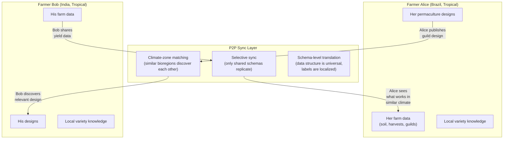

# Research: Decentralized Data Platform as ERP for Regenerative Farming

> Comprehensive exploration of using xNet as infrastructure for permaculture, food forests, and regenerative agriculture management.

**Date**: January 2026

---

## 1. Existing Tools in This Space

### Major Open-Source Platforms

#### farmOS (farmos.org)

- **License**: GPL (GNU General Public License)
- **Stack**: Built on Drupal (PHP), web-based
- **Status**: Active, community-maintained
- **Data Model**: Assets + Logs architecture
  - **Asset types**: Land, Plant, Animal, Equipment, Compost, Structure, Sensor, Water, Material, Product, Group
  - **Log types**: Activity, Observation, Input, Harvest, Lab Test, Maintenance, Medical, Seeding, Transplanting
  - **Quantities**: Attached to logs for harvest totals, input amounts, time tracking
  - **Plans**: For organizing future work
- **Strengths**:
  - Most mature open-source farm management platform
  - Excellent data model with UUID-based assets for interoperability
  - Geometry/GIS support (points, lines, polygons) for spatial mapping
  - Sensor data streams
  - Lab test logs with soil texture
  - Movement tracking (assets can be moved between locations via logs)
  - Modular/extensible via Drupal ecosystem
- **Limitations**:
  - Server-required (Drupal needs hosting) - NOT offline-first
  - Complex setup (LAMP stack, Drupal knowledge needed)
  - No P2P sync capability
  - No native mobile app (web-only)
  - Limited permaculture-specific concepts (no guild/polyculture modeling, no forest layers)
  - Centralized data (whoever hosts the server owns the data)
  - Heavy for smallholders in developing regions

#### OpenFarm (openfarm.cc) - SHUT DOWN April 2025

- **License**: MIT (code) / CC0 Public Domain (data)
- **Stack**: Ruby on Rails, MongoDB, ElasticSearch
- **Status**: ARCHIVED - servers shut down April 2025 after 10+ years
- **What it was**: "Wikipedia for growing plants" - crowd-sourced growing guides
- **Key data**: Seed spacing/depth, watering regimen, soil composition, companion plants, sun/shade requirements
- **Why it failed**: Never achieved critical mass; infrastructure costs; no sustainable funding model
- **Lessons for xNet**:
  - Centralized hosting creates single point of failure
  - CC0/public domain data license was good for adoption
  - A decentralized/P2P approach would have prevented this shutdown
  - "Dwindling usage" suggests engagement problems - need better farmer UX

#### FarmHack (farmhack.org)

- **Status**: Active community, Drupal-based site
- **Focus**: Open-source hardware and tool designs for farmers
- **Philosophy**: "Tinkering, inventing, fabricating, tweaking" - open-source ethic for farm tools
- **Content**: Physical tool designs (autonomous tractors, hemp processing, egg washing machines)
- **Community**: Integrated with GOATech forums
- **Relevance**: Hardware/tool knowledge sharing model; demonstrates farmer-to-farmer knowledge transfer patterns
- **Limitations**: Not a data management platform; no structured data; no farm record-keeping

#### Practical Plants (practicalplants.org)

- **License**: Creative Commons Attribution-NonCommercial-ShareAlike
- **Stack**: MediaWiki + Semantic MediaWiki
- **Status**: Archived/read-only after server failure (Jan 2022), partially recovered
- **Data**: 7,400+ plant articles covering:
  - Edible, medicinal, material uses
  - Propagation and cultivation info
  - Plant associations and polycultures
  - Environmental preferences
  - Functions (nitrogen fixer, ground cover, mineral accumulator, etc.)
- **Origin**: Forked from Plants For A Future (PFAF) database
- **Key Features**:
  - Semantic/structured data embedded in wiki articles (machine-readable)
  - Polyculture/guild documentation (e.g., Three Sisters)
  - Plant interaction records
  - Advanced search by multiple properties
- **Lessons for xNet**:
  - Semantic/structured plant data is extremely valuable
  - Wiki model works for collaboration but fragile for hosting
  - This data should live in a decentralized, replicated system
  - The property-based search is exactly what a Schema-first database enables

#### Plants For A Future (PFAF - pfaf.org)

- **Status**: Active
- **Data**: Extensive database of useful plants (edible, medicinal, material uses)
- **Coverage**: 7,000+ plants with cultivation details
- **License**: Varies
- **Limitations**: Web-only, centralized, limited structured data export

### Commercial/Proprietary Platforms

| Platform              | Focus                  | Offline? | Open Source? | Cost         | Key Limitation                                    |
| --------------------- | ---------------------- | -------- | ------------ | ------------ | ------------------------------------------------- |
| **Tend**              | Farm/garden management | Partial  | No           | Subscription | Vendor lock-in, data owned by company             |
| **Agrivi**            | Commercial farm ERP    | No       | No           | $$$          | Designed for industrial ag, not regenerative      |
| **Cropio**            | Precision agriculture  | No       | No           | $$$          | Satellite-focused, monoculture-oriented           |
| **FarmLogs**          | Field management       | Partial  | No           | Free tier    | Acquired by AGCO; commodity crop focus            |
| **Bushel Farm**       | Grain management       | No       | No           | Free         | US commodity crops only                           |
| **AgriWebb**          | Livestock management   | Partial  | No           | $$           | Livestock-only                                    |
| **Climate FieldView** | Precision ag           | No       | No           | Free tier    | Owned by Bayer/Monsanto; data harvesting concerns |

### Permaculture-Specific Tools

| Tool                          | Type            | Status        | Notes                                               |
| ----------------------------- | --------------- | ------------- | --------------------------------------------------- |
| **PermaDesigner**             | Web design tool | Limited       | Mostly zone layout, not management                  |
| **Permaculture Design Tools** | Various         | Fragmented    | Mostly educational, not operational                 |
| **GIS/QGIS**                  | Mapping         | Active        | Powerful but steep learning curve                   |
| **iNaturalist**               | Species ID      | Active        | Community biodiversity tracking (not farm-specific) |
| **Soil Web**                  | Soil data       | Active (USDA) | US-only soil survey data                            |

### Gap Analysis

**No existing tool provides all of:**

1. Offline-first operation
2. P2P sync between farmers
3. Permaculture-specific data models (guilds, forest layers, zones)
4. Open-source AND decentralized
5. Multi-language/low-literacy support
6. Knowledge sharing without centralized servers
7. User-owned data (not corporate platform)
8. Works on low-end devices with intermittent connectivity

---

## 2. Key Data Entities for Permaculture/Food Forest Management

### Plant Guilds & Polycultures

```
Guild (schema)
├── name: text
├── description: richtext
├── climate_zones: multi-select (USDA zones, Koppen)
├── primary_species: relation → Plant[]  (anchor/keystone trees)
├── support_species: relation → Plant[]
│   ├── nitrogen_fixers: relation → Plant[]
│   ├── dynamic_accumulators: relation → Plant[]
│   ├── pest_confusers: relation → Plant[]
│   ├── pollinator_attractors: relation → Plant[]
│   └── ground_covers: relation → Plant[]
├── companion_interactions: relation → PlantInteraction[]
│   ├── type: select (beneficial, neutral, antagonistic)
│   ├── mechanism: text (nitrogen fixing, pest repel, allelopathy, etc.)
│   └── evidence_level: select (anecdotal, observed, scientific)
├── forest_layer_assignments: map<Plant, ForestLayer>
├── spacing_diagram: geometry/canvas
├── seasonal_timeline: calendar data
├── establishment_sequence: ordered list
└── maturity_timeline: number (years to full production)
```

**Companion Planting Databases (existing sources)**:

- PFAF plant interactions
- Practical Plants polyculture data
- Cornell companion planting charts
- "Gaia's Garden" (Toby Hemenway) guild designs
- Permaculture Research Institute guild database

### Soil Health Tracking

```
SoilTest (schema)
├── location: relation → LandZone
├── date: datetime
├── depth_cm: number
├── ph: number (0-14)
├── organic_matter_percent: number
├── carbon_percent: number
├── nitrogen_ppm: number
├── phosphorus_ppm: number
├── potassium_ppm: number
├── calcium_ppm: number
├── magnesium_ppm: number
├── sulfur_ppm: number
├── micronutrients: {
│   ├── iron_ppm, manganese_ppm, zinc_ppm
│   ├── copper_ppm, boron_ppm, molybdenum_ppm
│   }
├── cation_exchange_capacity: number (CEC)
├── base_saturation: { ca%, mg%, k%, na% }
├── texture: select (sand/silt/clay percentages)
├── bulk_density: number (g/cm³)
├── water_infiltration_rate: number (inches/hour)
├── aggregate_stability: number (%)
├── biological_indicators: {
│   ├── microbial_biomass_carbon: number
│   ├── respiration_rate: number (CO2)
│   ├── mycorrhizal_colonization: number (%)
│   ├── earthworm_count: number (per m²)
│   ├── nematode_diversity: number
│   └── fungal_to_bacterial_ratio: number
│   }
├── carbon_sequestration: {
│   ├── total_organic_carbon_tons_per_ha: number
│   ├── change_from_baseline: number
│   └── measurement_method: select
│   }
├── contaminants: { heavy_metals, pesticide_residues }
├── lab: text (which laboratory)
├── methodology: select (standard soil test, Haney, etc.)
└── images: file[] (soil samples, profile)
```

### Water Management

```
WaterFeature (schema)  [Asset type]
├── type: select (swale, pond, dam, well, spring, rain_garden,
│         irrigation_line, hugelkultur, rain_tank, borehole)
├── geometry: polygon/line
├── capacity_liters: number
├── current_level: number
├── flow_rate: number (liters/min)
├── water_quality: relation → WaterTest[]
└── connected_to: relation → WaterFeature[]

RainfallRecord (schema)  [Log type]
├── date: datetime
├── amount_mm: number
├── duration_hours: number
├── intensity: select (light, moderate, heavy, extreme)
├── location: relation → LandZone
└── source: select (manual, weather_station, forecast)

IrrigationEvent (schema)  [Log type]
├── date: datetime
├── zone: relation → LandZone
├── method: select (drip, sprinkler, flood, hand, swale_fill)
├── volume_liters: number
├── duration_minutes: number
├── source: relation → WaterFeature
└── notes: richtext

WaterBudget (schema)
├── period: select (monthly, seasonal, annual)
├── inputs: { rainfall, irrigation, groundwater, greywater }
├── outputs: { evapotranspiration, runoff, deep_percolation, harvest_water }
├── storage_change: number
└── efficiency_percent: number
```

### Biodiversity Monitoring

```
SpeciesObservation (schema)
├── species: relation → Species
├── date: datetime
├── location: relation → LandZone
├── count: number
├── life_stage: select (egg, larva, juvenile, adult, flowering, fruiting)
├── behavior: text (foraging, nesting, pollinating, etc.)
├── method: select (visual, trap, audio, camera, soil_sample)
├── images: file[]
├── observer: relation → User
└── confidence: select (certain, probable, possible)

BiodiversityIndex (schema)  [Computed/rollup]
├── zone: relation → LandZone
├── period: date_range
├── species_richness: number (total species count)
├── shannon_diversity_index: number
├── simpson_diversity_index: number
├── pollinator_count: number
├── beneficial_insect_count: number
├── pest_species_count: number
├── bird_species: number
├── amphibian_species: number
├── native_vs_introduced_ratio: number
└── trend: select (increasing, stable, declining)

Species (schema)
├── common_name: text (multi-language)
├── scientific_name: text
├── family: text
├── native_range: multi-select (bioregions)
├── ecological_role: multi-select (pollinator, predator, decomposer,
│   pest, nitrogen_fixer, mycorrhizal_partner)
├── conservation_status: select (IUCN categories)
├── interactions: relation → SpeciesInteraction[]
└── images: file[]
```

### Harvest Tracking & Yield Data

```
Harvest (schema)  [Log type]
├── date: datetime
├── plant_asset: relation → Plant
├── crop_type: relation → Species
├── quantity: number
├── unit: select (kg, lbs, bunches, pieces, liters, bushels)
├── quality: select (grade_a, grade_b, damaged, composted)
├── destination: select (home_use, market, seed_saving,
│   processing, barter, community, compost)
├── market_value: number (local currency)
├── labor_hours: number
├── zone: relation → LandZone
├── notes: richtext
└── images: file[]

SeasonalCalendar (schema)
├── bioregion: text
├── climate_zone: select
├── year: number
├── frost_dates: { last_spring, first_fall }
├── planting_windows: map<Species, { start, end, method }>
├── harvest_windows: map<Species, { start, peak, end }>
├── precipitation_pattern: monthly_averages[]
├── traditional_knowledge: richtext (indigenous calendars, bioindicators)
└── phenological_indicators: {
│   first_bloom, bird_arrivals, insect_emergence }

YieldAnalysis (schema)  [Computed]
├── species: relation → Species
├── zone: relation → LandZone
├── period: select (annual, seasonal, lifetime)
├── total_kg: number
├── kg_per_hectare: number
├── kg_per_labor_hour: number
├── caloric_yield: number (kcal/hectare)
├── protein_yield: number (g/hectare)
├── revenue_per_hectare: number
├── year_over_year_trend: number (%)
└── comparison_to_bioregion_average: number (%)
```

### Land Zones (Permaculture Zones 0-5)

```
LandZone (schema)  [Asset type, fixed location]
├── name: text
├── zone_number: select (0, 1, 2, 3, 4, 5)
│   ├── 0: House/dwelling
│   ├── 1: Intensive garden, herbs, frequently visited
│   ├── 2: Orchard, food forest, chicken runs
│   ├── 3: Farm crops, large-scale food production
│   ├── 4: Managed woodland, foraging, grazing
│   └── 5: Wilderness, conservation, minimal intervention
├── geometry: polygon (GIS boundary)
├── area_hectares: number
├── sector_analysis: {
│   ├── sun_path: geometry
│   ├── wind_patterns: { prevailing_direction, seasonal_variation }
│   ├── water_flow: geometry (drainage patterns)
│   ├── fire_risk: geometry
│   ├── noise_sources: geometry
│   └── views: geometry (good and bad)
│   }
├── soil_type: relation → SoilTest
├── slope_percent: number
├── aspect: select (N, NE, E, SE, S, SW, W, NW, flat)
├── microclimate: text (frost pockets, heat sinks, etc.)
├── current_use: text
├── planned_use: text
├── established_date: date
├── plants: relation → Plant[]
├── infrastructure: relation → Structure[]
├── water_features: relation → WaterFeature[]
└── images: file[]
```

### Forest Layers (7-Layer Model)

```
ForestLayer (schema)
├── type: select
│   ├── canopy (tall trees: 30-100ft, e.g., walnut, chestnut, oak)
│   ├── understory (small trees: 10-30ft, e.g., apple, pear, hazel)
│   ├── shrub (3-10ft, e.g., currants, blueberry, elderberry)
│   ├── herbaceous (non-woody, e.g., comfrey, artichoke, rhubarb)
│   ├── ground_cover (<1ft, e.g., clover, strawberry, creeping thyme)
│   ├── vine (vertical, e.g., grape, kiwi, hops, passion fruit)
│   └── root (underground harvest, e.g., potato, garlic, turmeric)
│   [Optional 8th layer]:
│   ├── mycelial (fungi: shiitake, oyster, wine cap)
├── zone: relation → LandZone
├── species: relation → Plant[]
├── target_canopy_coverage_percent: number
├── current_canopy_coverage_percent: number
├── establishment_year: number
├── maturity_year: number (expected)
├── management_notes: richtext
└── succession_stage: select (pioneer, early, mid, climax)

SuccessionPlan (schema)
├── zone: relation → LandZone
├── current_stage: select (bare, pioneer, early_succession,
│   mid_succession, late_succession, climax)
├── target_stage: select
├── timeline_years: number
├── phases: [{
│   ├── year_range: { start, end }
│   ├── actions: text[]
│   ├── species_to_plant: relation → Plant[]
│   ├── species_to_remove: relation → Plant[]
│   └── expected_outputs: text
│   }]
├── cover_crop_rotations: [{
│   ├── season, species, purpose (nitrogen, biomass, weed_suppress)
│   }]
└── monitoring_indicators: text[]
```

---

## 3. Challenges for Farmers Globally

### Connectivity Issues

- **2.9 billion people** still lack internet access (ITU 2024 data)
- Rural areas in Sub-Saharan Africa, South Asia, and Latin America have <30% connectivity
- Even in developed nations, farms are often in cellular dead zones
- Satellite internet (Starlink) is expensive ($120+/month) and requires power
- **Offline-first is not a nice-to-have -- it is a hard requirement**
- Farmers need to record data in the field (no WiFi in a food forest)
- Sync happens when connectivity is available (weekly trips to town, etc.)
- **xNet advantage**: Local-first architecture with P2P sync means the app works entirely offline and syncs when peers are nearby or internet is available

### Language & Literacy Barriers

- 773 million adults are illiterate globally (UNESCO)
- Many farmers speak indigenous/minority languages with no software localization
- Technical agricultural terminology is often only in English/colonial languages
- Icon-based and voice-based interfaces are critical
- **Implications for xNet**:
  - Schema labels need multi-language support
  - UI must work with icons/images as primary navigation
  - Voice input for observations and logs
  - Photo-first data entry (take picture, add minimal metadata)
  - Community-translated interfaces (not just top-10 languages)

### Cost of Existing Solutions

| Solution Type                          | Annual Cost        | Who Can Afford It             |
| -------------------------------------- | ------------------ | ----------------------------- |
| Enterprise Ag platforms (Agrivi, etc.) | $1,000-$10,000+    | Large commercial farms        |
| Mid-tier (FarmLogs, AgriWebb)          | $200-$1,000        | Medium farms, developed world |
| farmOS (self-hosted)                   | $50-$200 (hosting) | Tech-literate farmers         |
| Paper records                          | $0-$20             | Everyone                      |
| **xNet (P2P, local-first)**            | **$0**             | **Everyone with a device**    |

- Even "free" platforms like Climate FieldView extract value through data
- Hosting costs for server-based solutions are prohibitive in developing regions
- Most smallholder farmers (<2 hectares) earn <$2/day - any subscription is impossible
- **xNet advantage**: No server costs, no subscription, runs on existing devices (including older Android phones via PWA)

### Data Ownership Concerns

- **Monsanto/Bayer (Climate FieldView)**: Collects field-level yield and soil data from millions of acres. Terms of service grant broad data usage rights. Farmers concerned about data being used for commodity speculation or land valuation.
- **John Deere**: Tractor telemetry data ownership disputes. "Right to repair" movement.
- **Syngenta, Corteva**: Similar data collection through precision ag platforms.
- **Seed/chemical companies using farm data**: For targeted marketing, pricing decisions, and IP development.
- **Land speculation**: Detailed yield data could be used by investors to target productive land.
- **Insurance**: Granular data could be used to adjust premiums or deny claims.
- **xNet advantage**: Data never leaves the farmer's device unless they explicitly share it. DID-based identity means no corporate account required. UCAN tokens give fine-grained, revocable sharing permissions.

### Knowledge Sharing Across Bioregions

- Climate zones don't respect national borders
- A permaculture designer in Mediterranean Spain has more in common with one in Southern California than one in Northern Scotland
- Traditional ecological knowledge (TEK) is being lost as elders pass
- Language barriers prevent cross-cultural knowledge exchange
- Academic research is paywalled and inaccessible to practitioners
- **Bioregional mapping**: Koppen climate classification, USDA hardiness zones, Holdridge life zones - all relevant for matching techniques across regions

---

## 4. Knowledge Sharing Patterns

### How Permaculture Practitioners Currently Share

| Channel                          | Reach                  | Structure       | Persistence             | Limitations                          |
| -------------------------------- | ---------------------- | --------------- | ----------------------- | ------------------------------------ |
| PDC courses (in-person)          | Local (20-30 people)   | Structured      | Personal notes          | Expensive, geographically limited    |
| Books (Mollison, Holmgren, etc.) | Global                 | Very structured | Permanent               | Slow to update, no local adaptation  |
| YouTube/video                    | Global                 | Semi-structured | Platform-dependent      | No structured data, algorithm-driven |
| Facebook groups                  | Large (100K+ members)  | Unstructured    | Platform-owned          | Data mining, no export, noise        |
| Forums (Permies.com)             | Moderate               | Thread-based    | Fragile (single server) | Search is poor, no structured data   |
| Instagram                        | Visual, broad          | Unstructured    | Platform-owned          | No detailed data, algorithm-driven   |
| Seed swaps/local groups          | Very local             | Personal        | Ephemeral               | Limited reach                        |
| Academic papers                  | Global (theoretically) | Very structured | Permanent               | Paywalled, inaccessible language     |
| Permaculture guilds/networks     | Regional               | Semi-structured | Variable                | Depends on volunteer organizers      |

### What a "Global Soil Health Index" Could Look Like

```
GlobalSoilIndex (decentralized, P2P-synced)
├── Contribution model:
│   ├── Farmers publish anonymized soil test data
│   ├── Location granularity: bioregion level (not exact GPS)
│   ├── Temporal: trends over years (carbon sequestration rates)
│   └── Methodology: standardized test types for comparability
│
├── Query capabilities:
│   ├── "Average organic matter in Mediterranean clay soils"
│   ├── "Carbon sequestration rate under food forests vs tillage"
│   ├── "pH trends in regeneratively managed land over 10 years"
│   └── "Best cover crop species for my soil type and climate"
│
├── Privacy model:
│   ├── Location fuzzing (nearest bioregion, not exact coordinates)
│   ├── Opt-in sharing (farmer chooses what to publish)
│   ├── Aggregated statistics (no individual farm identification)
│   └── DID-based attribution (credit without identity exposure)
│
├── Incentives:
│   ├── Access to aggregated data requires contribution
│   ├── Carbon credit verification (proof of sequestration)
│   ├── Research institution access (data grants)
│   └── Insurance premium reduction (proven soil health)
│
└── Technical implementation (xNet):
    ├── Schema: SoilTest with standardized properties
    ├── Namespace: xnet://public/indexes/soil-health
    ├── Sync: Selective replication (only aggregated data syncs globally)
    ├── Privacy: Local data stays local; only opted-in aggregates publish
    └── Verification: Hash chains for data integrity (no tampering)
```

### What an "Open Plant Database" Could Look Like

```
OpenPlantDB (decentralized, community-maintained)
├── Core data (merged from existing sources):
│   ├── PFAF (7,000+ species)
│   ├── Practical Plants (7,400+ articles)
│   ├── USDA Plants Database (structure)
│   └── Community contributions (local knowledge)
│
├── Per-species information:
│   ├── Taxonomy (scientific name, family, common names in N languages)
│   ├── Climate requirements (hardiness zones, heat zones, rainfall)
│   ├── Soil preferences (pH range, drainage, fertility)
│   ├── Uses (edible parts, medicinal, material, ecosystem function)
│   ├── Cultivation (propagation, spacing, timing, maintenance)
│   ├── Interactions (companions, antagonists, mechanisms)
│   ├── Forest layer assignment
│   ├── Guilds this species participates in
│   ├── Yield data (community-contributed, by climate zone)
│   └── Images (CC-licensed, community-contributed)
│
├── Unique value (vs centralized databases):
│   ├── Local variety data (not just species, but cultivars by region)
│   ├── Indigenous knowledge (with proper attribution and permissions)
│   ├── Real yield data from practitioners (not just research stations)
│   ├── Guild designs that work in specific bioregions
│   └── Failure data (what doesn't work and why)
│
└── Technical implementation (xNet):
    ├── Schema: Plant, Guild, Interaction, YieldReport
    ├── Namespace: xnet://public/databases/plants
    ├── Anyone can fork/extend for their bioregion
    ├── Merge requests for canonical data (like git for plant knowledge)
    └── Local copies work offline, sync when connected
```

### P2P Farmer-to-Farmer Knowledge Transfer



**How P2P sync enables this without centralized servers:**

1. **Discovery**: Farmers in similar climate zones/bioregions find each other through topic-based P2P discovery (similar to BitTorrent DHT, but for agricultural schemas)
2. **Selective replication**: Only explicitly shared data syncs. Private farm data stays private.
3. **Schema-based interoperability**: If both use the same Plant/Guild/Harvest schemas, their data is automatically comparable regardless of language.
4. **Offline-compatible**: Data syncs when devices are in proximity (Bluetooth/local WiFi at markets, community gatherings) or when internet is available.
5. **No middleman**: No company can shut down the knowledge network, extract value from it, or censor content.
6. **Attribution without identity**: DIDs allow proper credit without revealing personal information.

---

## 5. Relevant Standards & Ontologies

### Agricultural Data Standards

#### GODAN (Global Open Data for Agriculture and Nutrition)

- **Website**: godan.info
- **What**: Global initiative promoting open data for agriculture and nutrition
- **Current focus** (GODAN 2.0): 8-pillar framework including:
  - Soil and environmental health
  - Digital traceability (farm-to-fork via ICT Hubs)
  - Youth-led extension services
  - Financial intermediation for agroecological enterprises
  - Agroecology law and policy integration
- **Relevance**: Provides policy framework for open agricultural data; aligns with xNet's open/decentralized philosophy
- **Data format**: No single enforced format, but promotes interoperability standards

#### AgMIP (Agricultural Model Intercomparison and Improvement Project)

- **Website**: agmip.org
- **What**: Columbia University-coordinated global project for agricultural modeling
- **Focus**: Climate change impacts on agriculture, food security, poverty
- **Three pillars**:
  1. Next-Gen Knowledge, Data, and Tools
  2. Coordinated Global and Regional Assessments
  3. Modeling Sustainable Farming Systems
- **Data tools**: ACE (Agricultural Collaborative Environment) for data translation between crop models
- **Relevance**:
  - Standardized crop model data formats (ICASA vocabulary)
  - ACMO (AgMIP Crop Model Output) standard format
  - Translation tools between different agricultural data systems
  - 1200+ members, 50+ teams, 200+ publications
- **Software**: Open source (BSD-3-Clause), available on GitHub

#### CGIAR (Consultative Group on International Agricultural Research)

- **What**: Global partnership of 15 research centers, $900M+ annual portfolio, 9000+ staff in 89 countries
- **Key platforms**:
  - **CGIAR Platform for Big Data in Agriculture**: Data standards and tools for ag research
  - **CGIAR Genebank Platform**: Genetic resource conservation
  - **Excellence in Breeding Platform**: Crop improvement data
- **Research areas relevant to regenerative farming**:
  - Water, Land and Ecosystems (WLE)
  - Forests, Trees, and Agroforestry (FTA)
  - Climate Change, Agriculture and Food Security (CCAFS)
- **Data standards**:
  - MIAPPE (Minimum Information About Plant Phenotyping Experiments)
  - MCPD (Multi-Crop Passport Descriptors)
  - Crop Ontology
- **Relevance**: Massive institutional knowledge, standardized vocabularies, but mostly focused on research/institutional use, not farmer-facing tools

#### ICASA (International Consortium for Agricultural Systems Applications)

- **What**: Standard vocabulary for agricultural experiments and observations
- **Data format**: Defines variables for soil, weather, crop management, crop response
- **Coverage**: 700+ standardized variable names
- **Relevance**: Could inform xNet schema property names for interoperability

#### ISO 11783 (ISOBUS)

- **What**: Standard for agricultural equipment communication
- **Relevance**: Equipment/sensor data integration
- **Limitation**: Focused on large-scale mechanized agriculture

#### OGC (Open Geospatial Consortium) Standards

- **Relevant standards**: GeoJSON, WMS, WFS, SensorThings API
- **Relevance**: Spatial data representation for land zones, mapping

### Plant Databases

| Database                       | Species Count     | Data Richness                           | License       | API?     | Offline?      |
| ------------------------------ | ----------------- | --------------------------------------- | ------------- | -------- | ------------- |
| **USDA Plants**                | 90,000+           | Taxonomy, distribution, characteristics | Public domain | Yes      | Bulk download |
| **Plants For A Future (PFAF)** | 7,000+            | Uses, cultivation, companions           | Varies        | No       | No            |
| **Practical Plants**           | 7,400+            | Uses, polycultures, functions           | CC-NC-SA      | No       | Archived      |
| **World Flora Online**         | 350,000+          | Taxonomy                                | CC-BY         | Yes      | Bulk download |
| **GBIF** (Global Biodiversity) | 2.4B+ occurrences | Distribution, observations              | CC0/CC-BY     | Yes      | Partial       |
| **Kew's Plants of the World**  | 340,000+          | Taxonomy, distribution                  | Varies        | Yes      | No            |
| **Trefle**                     | 400,000+          | Growth data, images                     | Open          | REST API | No            |
| **OpenFarm** (now archived)    | ~1,000            | Growing guides                          | CC0           | Was REST | Dead          |
| **Perennial Vegetables DB**    | ~200              | Permaculture-specific                   | Various       | No       | No            |

### Soil & Environmental Standards

| Standard                       | Organization  | Focus                                       |
| ------------------------------ | ------------- | ------------------------------------------- |
| **Soil Taxonomy**              | USDA          | Soil classification system                  |
| **World Reference Base (WRB)** | FAO/IUSS      | International soil classification           |
| **SSURGO/STATSGO**             | USDA-NRCS     | US soil survey data (spatial)               |
| **SoilGrids**                  | ISRIC         | Global soil property maps (250m resolution) |
| **LUCAS**                      | EU/JRC        | European land use/soil data                 |
| **GlobalSoilMap**              | International | 100m resolution soil properties             |

### Biodiversity Standards

| Standard                                        | Focus                        | Relevance                   |
| ----------------------------------------------- | ---------------------------- | --------------------------- |
| **Darwin Core**                                 | Biodiversity occurrence data | Species observation schema  |
| **ABCD (Access to Biological Collection Data)** | Museum collections           | Taxonomic reference         |
| **EML (Ecological Metadata Language)**          | Ecological datasets          | Dataset description         |
| **Humboldt Core**                               | Biodiversity inventories     | Inventory/monitoring events |

### Agroecology-Specific Ontologies

| Ontology                   | Source      | Coverage                                                  |
| -------------------------- | ----------- | --------------------------------------------------------- |
| **Crop Ontology**          | CGIAR       | Crop traits, methods, scales                              |
| **AgroVoc**                | FAO         | Agricultural vocabulary (40,000+ concepts, 40+ languages) |
| **ENVO**                   | OBO Foundry | Environmental conditions                                  |
| **PATO**                   | OBO Foundry | Phenotypic qualities                                      |
| **Plant Ontology (PO)**    | Planteome   | Plant anatomy and development                             |
| **Environment Ontology**   | OBO Foundry | Environmental features                                    |
| **Food Ontology (FoodOn)** | OBO Foundry | Food products and processing                              |

---

## 6. xNet Fit Analysis

### Why xNet is Uniquely Suited

| xNet Capability               | Farming Need                       | How It Helps                              |
| ----------------------------- | ---------------------------------- | ----------------------------------------- |
| **Local-first / offline**     | No connectivity in fields          | Works without internet, syncs later       |
| **P2P sync**                  | Farmer-to-farmer knowledge         | Direct device sync at markets, gatherings |
| **Schema-first architecture** | Diverse data types                 | Custom schemas for each bioregion's needs |
| **User-owned data (DIDs)**    | Corporate data extraction concerns | Data never leaves farmer's control        |
| **UCAN permissions**          | Selective knowledge sharing        | Share soil data but not GPS coordinates   |
| **Global namespace**          | Universal plant/soil databases     | `xnet://public/databases/plants`          |
| **Yjs CRDT**                  | Collaborative guild designs        | Multiple farmers edit same design         |
| **Event-sourced sync**        | Historical soil/yield data         | Full history with conflict resolution     |
| **Module/plugin system**      | Regional customization             | Bioregion-specific modules                |
| **Open source (MIT)**         | Cost barrier                       | Free forever, community-maintained        |

### Proposed Schema Namespace

```
xnet://xnet.dev/schemas/farming/
├── Plant
├── Guild
├── PlantInteraction
├── ForestLayer
├── LandZone
├── SoilTest
├── WaterFeature
├── RainfallRecord
├── IrrigationEvent
├── Harvest
├── SeasonalCalendar
├── SpeciesObservation
├── BiodiversityIndex
├── SuccessionPlan
├── CoverCropRotation
├── CompostBatch
├── SeedInventory
├── MarketRecord
├── WeatherObservation
└── CarbonAccount
```

### Mapping to farmOS Data Model

| farmOS Concept  | xNet Equivalent                    | Notes                               |
| --------------- | ---------------------------------- | ----------------------------------- |
| Asset           | Node (with schema)                 | Same concept, different terminology |
| Log             | Node (with schema, timestamped)    | Logs are just time-stamped nodes    |
| Quantity        | Property on a Node                 | Built into schema definition        |
| Term/Vocabulary | Schema enum/select values          | Or separate taxonomy Nodes          |
| Plan            | Node with relations to future Logs | Planning as data                    |
| Location        | LandZone Node (is_location=true)   | Spatial assets                      |
| Movement        | Relation change on a Node          | Event-sourced, so history preserved |
| Group           | Node with member relations         | Guilds, herds, etc.                 |

### Implementation Priority

1. **Phase 1**: Core schemas (Plant, LandZone, Harvest, SoilTest) + offline-capable mobile app
2. **Phase 2**: Guild/polyculture designer + seasonal calendar + water tracking
3. **Phase 3**: Community knowledge sharing (P2P plant database, soil index) + biodiversity
4. **Phase 4**: Carbon accounting, market integration, regenerative certification data

---

## Sources & Further Reading

- farmOS documentation: https://farmos.org/model/
- OpenFarm (archived): https://github.com/openfarmcc/OpenFarm
- FarmHack community: https://farmhack.org
- Practical Plants: https://practicalplants.org
- GODAN: https://godan.info
- AgMIP: https://agmip.org
- CGIAR: https://cgiar.org
- USDA Plants Database: https://plants.usda.gov
- AgroVoc (FAO): https://agrovoc.fao.org
- Darwin Core: https://dwc.tdwg.org
- Crop Ontology: https://cropontology.org
- ICASA: https://dssat.net/icasa
- Toby Hemenway, "Gaia's Garden" (guild design reference)
- Bill Mollison, "Permaculture: A Designers' Manual"
- David Holmgren, "Permaculture: Principles & Pathways Beyond Sustainability"
