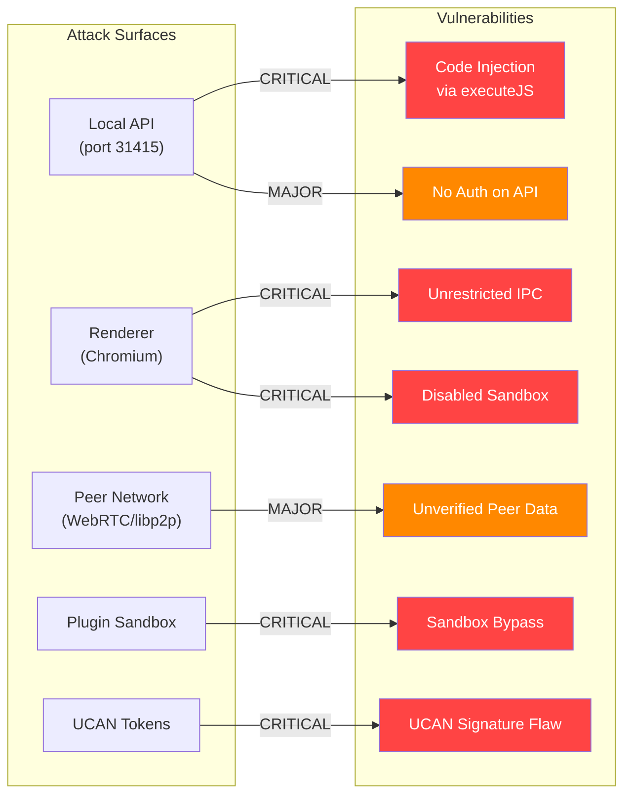
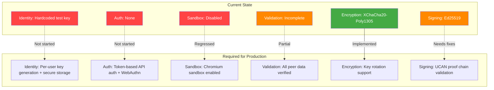

# 01 - Security Vulnerabilities

## Overview

This document catalogs security vulnerabilities found across the xNet codebase, organized by severity and attack surface.



---

## Critical Vulnerabilities

### SEC-01: JavaScript Injection via `executeJavaScript` in Local API

**Package:** `apps/electron`
**File:** `src/main/local-api.ts:42-143`
**CVSS estimate:** 9.8 (Critical)

The Local API proxy uses `win.webContents.executeJavaScript()` with unsanitized string interpolation of user-controlled parameters:

```typescript
// local-api.ts:46 - id is user-controlled via HTTP request
const node = await store.get('${id}');

// local-api.ts:120 - id from URL parameter
const node = await store.update('${id}', ...);

// local-api.ts:141 - id from URL parameter
await store.delete('${id}');
```

**Attack vector:** Any local process can send:

```
GET http://127.0.0.1:31415/api/nodes/'; require('child_process').exec('rm -rf /'); '
```

The `id` value is injected directly into JavaScript that executes in the renderer context. With `sandbox: false` (see SEC-02), this grants full Node.js access.

**Fix:** Use IPC messages instead of `executeJavaScript`. Pass parameters as structured data, never as code strings.

---

### SEC-02: Chromium Sandbox Disabled

**Package:** `apps/electron`
**File:** `src/main/index.ts:47`

```typescript
webPreferences: {
    sandbox: false,          // CRITICAL: Sandbox disabled
    contextIsolation: true,  // Good, but insufficient alone
    nodeIntegration: false,  // Good, but insufficient alone
}
```

The Chromium sandbox is the primary security boundary in Electron. Disabling it means:

- Preload scripts run with full Node.js access
- Any renderer-side vulnerability (XSS, injection) gains system-level access
- `contextIsolation` alone cannot prevent exploitation

**Fix:** Enable `sandbox: true` and restructure preload code to avoid direct Node.js API usage. Use IPC for all main-process operations.

---

### SEC-03: Unrestricted IPC Channel Forwarding

**Package:** `apps/electron`
**File:** `src/preload/index.ts:146-153`

```typescript
contextBridge.exposeInMainWorld('xnetServices', {
  invoke: <T>(channel: string, ...args: unknown[]): Promise<T> =>
    ipcRenderer.invoke(channel, ...args)
  // ...
})
```

This exposes an unrestricted `ipcRenderer.invoke()` to the renderer. Any code in the renderer (including injected scripts) can invoke ANY IPC channel -- there is no allowlist.

**Fix:** Add a channel allowlist:

```typescript
const ALLOWED_CHANNELS = new Set(['xnet:node:create', 'xnet:node:get', ...])
invoke: (channel, ...args) => {
    if (!ALLOWED_CHANNELS.has(channel)) throw new Error(`Blocked channel: ${channel}`)
    return ipcRenderer.invoke(channel, ...args)
}
```

---

### SEC-04: Plugin Sandbox Cannot Stop Infinite Loops

**Package:** `@xnet/plugins`
**File:** `src/sandbox/sandbox.ts:219-241`

```typescript
async executeWithTimeout(code, context, timeout) {
    return new Promise((resolve, reject) => {
        const timer = setTimeout(() => reject(new Error('Timeout')), timeout)
        try {
            const result = fn(ctx)  // Synchronous execution blocks event loop
            clearTimeout(timer)
            resolve(result)
        } catch (e) { /* ... */ }
    })
}
```

The `setTimeout` callback can never fire while `fn(ctx)` is executing synchronously. An infinite loop (`while(true){}`) will freeze the entire application permanently.

**Fix:** Execute untrusted code in a Web Worker or separate process with `worker_threads`. This is the only reliable way to enforce timeouts on synchronous JavaScript.

---

### SEC-05: UCAN Signature Computed Over Wrong Data

**Package:** `@xnet/identity`
**File:** `src/ucan.ts:50-56`

```typescript
// Signs raw JSON (order-dependent)
const payloadBytes = new TextEncoder().encode(JSON.stringify(payload))
const signature = sign(payloadBytes, issuerKey)

// Encodes separately (may produce different JSON)
const body = toBase64Url(JSON.stringify(payload))
```

The UCAN/JWT spec requires signatures over `base64url(header).base64url(payload)`. This implementation signs the raw JSON payload separately from the encoded token. During verification, the payload is re-parsed and re-serialized -- if `JSON.parse` + `JSON.stringify` produces different key ordering, the signature will fail or, worse, a tampered token could verify.

**Fix:** Sign the encoded `header.body` string (canonical JWT approach):

```typescript
const header = toBase64Url(JSON.stringify(headerObj))
const body = toBase64Url(JSON.stringify(payload))
const signingInput = `${header}.${body}`
const signature = sign(new TextEncoder().encode(signingInput), issuerKey)
```

---

### SEC-06: Hardcoded Test Private Key in Production Code

**Package:** `apps/electron`
**File:** `src/renderer/main.tsx:24-30`

```typescript
const TEST_PRIVATE_KEY = new Uint8Array([1, 2, 3, 4, 5, 6, 7, 8, ...])
const TEST_IDENTITY = identityFromPrivateKey(TEST_PRIVATE_KEY)
```

Every instance of the app uses the same deterministic private key. This means:

- All users share the same DID (no real identity)
- Any user can forge signatures as any other user
- Ed25519 signing provides zero security guarantees
- UCAN tokens are meaningless (same issuer everywhere)

---

## Major Vulnerabilities

### SEC-07: No Authentication on Local API

**File:** `apps/electron/src/main/local-api.ts:217`

The HTTP API on `127.0.0.1:31415` has authentication commented out:

```typescript
// token: process.env.XNET_API_TOKEN // Optional auth
```

Any local process or browser tab (via localhost CSRF) can read/write/delete all data.

### SEC-08: Unverified Peer Data in Network Sync

**File:** `packages/network/src/protocols/sync.ts:42-64`

```typescript
const msg = decode(data.subarray()) as SyncMessage
// ...
Y.applyUpdate(doc.ydoc, msg.payload) // No validation
```

Peer messages are decoded and applied to Yjs documents without:

- Validating the message structure
- Verifying signatures
- Checking message type
- Sanitizing the Yjs update

A malicious peer can corrupt any document by sending crafted binary data.

### SEC-09: Unverified Blob Data from Peers

**File:** `apps/electron/src/main/bsm.ts:739-752`

```typescript
const cid = data.cid as string
const blobData = fromBase64(data.data as string)
await config.blobStorage.setBlob(cid, blobData) // Stored without CID verification
```

The received blob data is stored under the claimed CID without verifying the content hash matches. A malicious peer can replace any blob with arbitrary data.

### SEC-10: Passkey Storage Stores Encryption Key in Plaintext

**File:** `packages/identity/src/passkey.ts:43`

```typescript
salt: key, // In real impl, this would be derived from credential
```

`BrowserPasskeyStorage` stores the raw encryption key in the `StoredKey.salt` field. Anyone with access to the stored data can decrypt the key bundle without authentication.

### SEC-11: UCAN Proof Chain Never Validated

**File:** `packages/identity/src/ucan.ts:64-108`

The `prf` (proofs) field is accepted but never validated recursively. Without proof chain verification, UCAN capability delegation is security theater -- any issuer can claim any capability.

### SEC-12: `hexToBytes` Silent Data Corruption

**File:** `packages/crypto/src/utils.ts:28`

```typescript
bytes[i] = parseInt(hex.slice(i * 2, i * 2 + 2), 16)
```

`parseInt("zz", 16)` returns `NaN`, which becomes `0` in a `Uint8Array`. Invalid hex input silently produces wrong key/hash material without any error.

---

## Security Architecture Assessment



## Recommendations

> **Roadmap note:** Phase 1 is web-first (the Electron local API is dev-only). Most Electron security issues are Phase 2+ concerns. UCAN auth is Phase 2.2. Plugin sandboxing is deferred beyond the 6-month horizon. Items are tagged with their roadmap phase.

### Phase 1 (Daily Driver) -- Fix during dog-fooding

- [ ] **SEC-12:** Add hex character validation to `hexToBytes` in `@xnet/crypto` -- silent corruption affects hashing everywhere
- [ ] **SEC-06:** Add TODO/warning comment on hardcoded test key with link to Phase 2.2 auth plan

### Phase 2 (Hub MVP) -- Fix before hub launch

- [ ] **SEC-01:** Remove `executeJavaScript` from `local-api.ts`, replace with structured IPC messages
- [ ] **SEC-02:** Enable Chromium sandbox (`sandbox: true`) and restructure preload
- [ ] **SEC-03:** Add IPC channel allowlist to `xnetServices` preload bridge
- [ ] **SEC-07:** Implement token-based authentication on local API (uncomment + wire up `XNET_API_TOKEN`)
- [ ] **SEC-06:** Implement per-user key generation and secure storage (replaces hardcoded test key)
- [ ] **SEC-05:** Fix UCAN signature to compute over encoded `header.body` string (required for Phase 2.2 auth)
- [ ] **SEC-10:** Integrate real WebAuthn PRF into `BrowserPasskeyStorage` or remove from public API

### Phase 3 (Multiplayer) -- Fix before multi-user sync

- [ ] **SEC-08:** Validate all peer-received sync messages (structure, signatures, Yjs update integrity)
- [ ] **SEC-09:** Verify blob CID matches content hash before storing peer data
- [ ] **SEC-11:** Implement UCAN proof chain recursive validation
- [ ] **SEC-04:** Move plugin script execution to Web Workers for true timeout isolation
