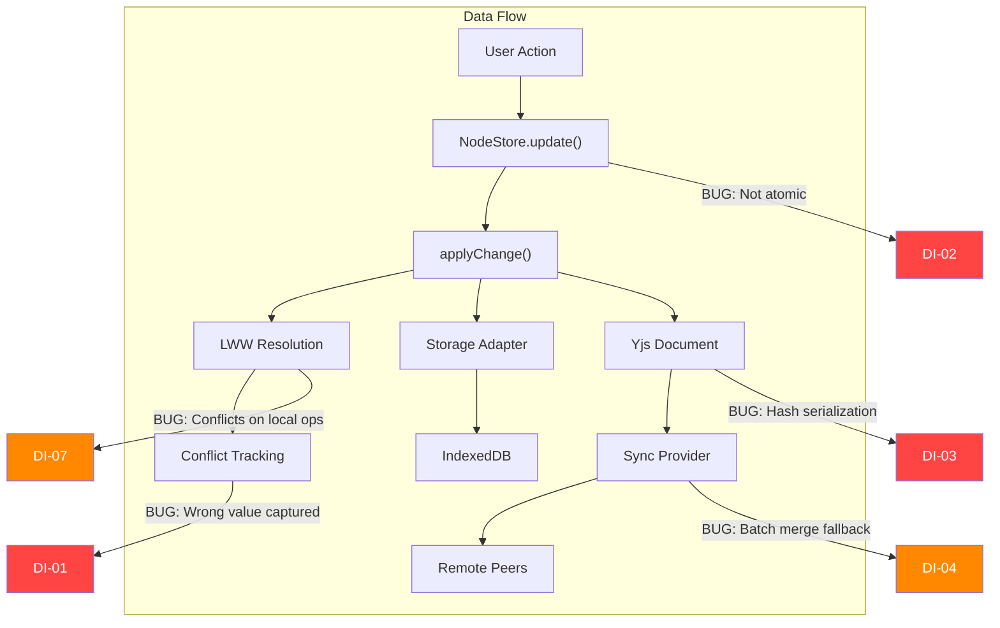
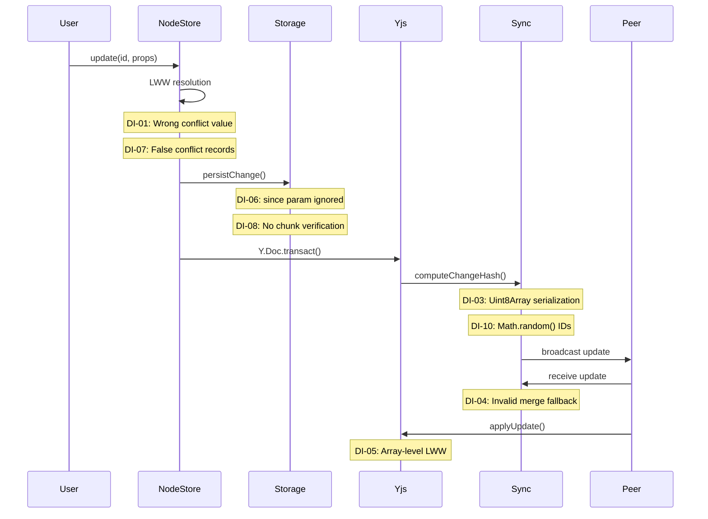

# 02 - Data Integrity Issues

## Overview

This document covers bugs and design issues that can cause data corruption, silent data loss, or incorrect conflict resolution in the xNet data layer.



---

## Critical Issues

### DI-01: Conflict Tracking Records Wrong Value

**Package:** `@xnet/data`
**File:** `packages/data/src/store/store.ts:616-628`

When resolving a LWW conflict where the remote value wins, the conflict record captures the wrong "local" value:

```typescript
// Line 619: Value is overwritten FIRST
node.properties[key] = value

// Line 626-628: Then conflict records the current (now remote) value as "local"
localValue: node.properties[key],  // BUG: This is the remote value, not the original
```

**Impact:** Conflict resolution UI will display incorrect data. Users cannot meaningfully review or undo conflicts because the "local" value shown is actually the remote value that won.

**Fix:**

```typescript
const oldLocalValue = node.properties[key]
node.properties[key] = value
// ...
localValue: oldLocalValue,
```

---

### DI-02: Transactions Are Not Atomic

**Package:** `@xnet/data`
**File:** `packages/data/src/store/store.ts:255-378`

The `transaction()` method claims to provide atomic operations but applies changes sequentially without rollback:

```typescript
async transaction(operations: NodeOperation[]): Promise<TransactionResult> {
    for (const op of operations) {
        // Each operation is applied immediately
        // If op 3 of 5 fails, ops 1-2 are already persisted
        await this.applyChange(change)
    }
}
```

**Impact:** Partial transactions leave the data store in an inconsistent state. For example, moving a node between databases (delete + create) could succeed on delete but fail on create, losing data.

**Fix:** Buffer all changes, validate them all, then apply in a single batch. Store a pre-transaction snapshot for rollback on failure.

---

### DI-03: `computeChangeHash` Cannot Serialize Uint8Array Payloads

**Package:** `@xnet/sync`
**File:** `packages/sync/src/change.ts:167-173`

```typescript
const json = JSON.stringify(sortObjectKeys(unsigned))
```

`JSON.stringify` on a `Uint8Array` produces `{"0":1,"1":2,...}` (an object with numeric string keys). This representation is:

- Platform-dependent (not standardized across engines)
- Lost after deserialization (becomes a plain object, not Uint8Array)
- Different from the original when round-tripped through JSON

**Impact:** Hash verification of Yjs changes breaks after data passes through any serialization boundary (storage, network sync, IPC). This silently invalidates the entire change hash chain.

**Fix:** Convert `Uint8Array` to a stable format before hashing:

```typescript
function prepareForHashing(obj: unknown): unknown {
  if (obj instanceof Uint8Array) return bytesToHex(obj)
  if (Array.isArray(obj)) return obj.map(prepareForHashing)
  if (typeof obj === 'object' && obj !== null) {
    return Object.fromEntries(Object.entries(obj).map(([k, v]) => [k, prepareForHashing(v)]))
  }
  return obj
}
```

---

### DI-04: Default Yjs Batch Merge Produces Invalid Updates

**Package:** `@xnet/sync`
**File:** `packages/sync/src/yjs-batcher.ts:56-72`

```typescript
function defaultMergeUpdates(updates: Uint8Array[]): Uint8Array {
  // Simple concatenation fallback
  const totalLength = updates.reduce((sum, u) => sum + u.length, 0)
  const result = new Uint8Array(totalLength)
  // ...concatenates raw bytes...
}
```

Concatenating Yjs update buffers does **not** produce a valid Yjs update. `Y.applyUpdate()` on the result will either throw or corrupt document state.

**Impact:** Silent document corruption if `YjsBatcher` is used without explicitly providing `Y.mergeUpdates`.

**Fix:** Make `mergeUpdates` a required parameter, or throw an error if not provided.

---

## Major Issues

### DI-05: DatabaseView Bypasses CRDT Conflict Resolution

**Package:** `apps/electron`
**File:** `src/renderer/components/DatabaseView.tsx:244-246`

```typescript
const currentColumns = (dataMap.get('columns') as StoredColumn[]) || []
const updatedColumns = [...currentColumns, newColumn]
dataMap.set('columns', updatedColumns) // Last-writer-wins on entire array
```

The database view reads entire arrays from Yjs, modifies them in JavaScript, and writes back as a single value. This is a last-writer-wins pattern on the whole array -- concurrent edits (two users adding columns simultaneously) will lose one user's additions.

**Fix:** Use `Y.Array` for lists and `Y.Map` for individual entries instead of storing serialized arrays as single Y.Map values.

---

### DI-06: `getUpdates` Ignores `since` Parameter

**Package:** `@xnet/storage`
**Files:** `src/adapters/indexeddb.ts:97`, `src/adapters/memory.ts:50`

Both storage adapters accept `since?: string` but ignore it, always returning all updates. The snapshot system (`SnapshotManager.loadDocument`) calls `getUpdates(docId)` without `since`, meaning snapshots provide no performance benefit -- all updates are loaded every time.

**Impact:** Document load time scales linearly with edit history, even when snapshots exist. For frequently-edited documents, this causes progressively slower load times.

---

### DI-07: Conflicts Recorded for Non-Conflicting Local Updates

**Package:** `@xnet/data`
**File:** `packages/data/src/store/store.ts:606-646`

Every property update through `applyChange` -- including sequential local-only changes -- pushes to `this.conflicts[]`. A user editing their own document in sequence generates "conflict" records for every keystroke.

**Impact:** `getRecentConflicts()` returns false positives, making conflict resolution UI unusable.

---

### DI-08: Chunk Reassembly Has No Integrity Verification

**Package:** `@xnet/storage`
**File:** `packages/storage/src/chunk-manager.ts:200-214`

The `store()` method computes a Merkle `rootHash` and stores it in the manifest, but `reassembleChunks()` never verifies it. Corrupted or tampered chunks are silently reassembled.

**Impact:** File corruption goes undetected. A single bit flip in any chunk produces a corrupted file with no error.

---

### DI-09: `DocumentType` Name Collision

**Package:** `@xnet/data`
**Files:** `src/types.ts:21`, `src/schema/types.ts:71`

Two different types with the same name are exported:

- `types.ts:21` -- `DocumentType = 'page' | 'task' | 'database' | 'canvas'` (content category)
- `schema/types.ts:71` -- `DocumentType = 'yjs' | 'automerge'` (CRDT backing type)

Both are re-exported from the package, causing ambiguity for consumers.

---

### DI-10: `createChangeId` Uses `Math.random()`

**Package:** `@xnet/sync`
**File:** `packages/sync/src/change.ts:242-246`

Change IDs are generated with `Math.random()`, providing only ~52 bits of entropy. In a collaborative system with many concurrent changes, collisions are possible and would corrupt the hash chain.

---

### DI-11: `captureUpdate` Only Captures Last Yjs Update

**Package:** `@xnet/data`
**File:** `packages/data/src/updates.ts:93-101`

```typescript
const handler = (update: Uint8Array) => {
  capturedUpdate = update // Overwrites on each call
}
```

If a callback generates multiple Yjs updates, only the last one is captured. Earlier updates are silently lost.

---

## Data Flow Integrity Assessment



## Recommendations

1. **Immediate:** Fix DI-01 (conflict value capture) -- simple one-line fix with high impact
2. **Immediate:** Fix DI-03 (Uint8Array hashing) -- required for hash chain integrity
3. **Short-term:** Fix DI-04 (batch merge fallback) -- make `mergeUpdates` required
4. **Short-term:** Fix DI-02 (atomic transactions) -- implement rollback mechanism
5. **Medium-term:** Implement `since` parameter in storage adapters (DI-06)
6. **Medium-term:** Add Merkle root verification to chunk reassembly (DI-08)
7. **Medium-term:** Migrate DatabaseView to proper Yjs data structures (DI-05)
