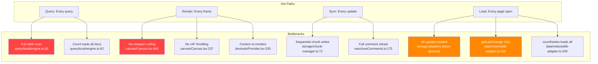
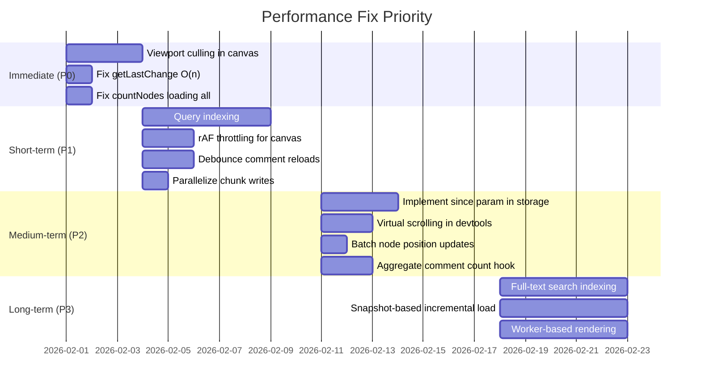

# 03 - Performance Bottlenecks

## Overview

This document identifies performance issues across the codebase that will become problematic as data volume and user count grow.



---

## Query Performance

### PERF-01: Every Query Performs a Full Table Scan (Critical)

**Package:** `@xnet/query`
**File:** `packages/query/src/local/engine.ts:26-27`

```typescript
const allDocs = await storage.listDocuments()
const documents = await Promise.all(allDocs.map((docId) => this.loadDocument(docId)))
```

Every query loads every document from storage, then filters in JavaScript. There is no indexing, no early termination, and no pagination at the storage level.

**Impact at scale:**
| Documents | Query time (estimated) |
|-----------|----------------------|
| 100 | ~50ms |
| 1,000 | ~500ms |
| 10,000 | ~5s |

**Fix:** Implement a query index (e.g., IndexedDB secondary indexes on common fields) or integrate MiniSearch (already a dependency) for filtered queries.

### PERF-02: `count()` Loads All Documents Just to Count

**File:** `packages/query/src/local/engine.ts:62-65`

```typescript
count(q: Query): Promise<number> {
    return this.query(q).then(r => r.total)
}
```

The `count` operation performs a full query (load, filter, sort, paginate) and discards everything except the count. This should use `IDBObjectStore.count()` for IndexedDB or a simple counter.

### PERF-03: `listDocuments` with Prefix Scans All Keys

**File:** `packages/storage/src/adapters/indexeddb.ts:84-89`

```typescript
const allKeys = await db.getAllKeys('documents')
return allKeys.filter((key) => key.startsWith(prefix))
```

Loads all document keys into memory, then filters. Should use `IDBKeyRange.bound(prefix, prefix + '\uffff')`.

---

## Rendering Performance

### PERF-04: Canvas Renders All Nodes (No Viewport Culling)

**Package:** `@xnet/canvas`
**File:** `packages/canvas/src/renderer/Canvas.tsx:442`

```typescript
{nodes.map((node) => (
    <CanvasNodeComponent key={node.id} node={node} ... />
))}
```

The `SpatialIndex` and `getVisibleNodes()` exist but are never used in the render path. All nodes are rendered regardless of visibility.

**Impact:**
| Nodes | Render cost |
|-------|-------------|
| 50 | Smooth |
| 200 | Noticeable jank |
| 1,000+ | Unusable |

**Fix:**

```typescript
const visibleNodes = useMemo(
    () => canvas.store.spatialIndex.search(viewport.getVisibleBounds()),
    [viewport, nodes]
)
{visibleNodes.map((node) => <CanvasNodeComponent ... />)}
```

### PERF-05: No requestAnimationFrame Throttling for Pan/Zoom

**File:** `packages/canvas/src/renderer/Canvas.tsx:237-258`

Wheel events directly trigger React state updates. On 120Hz displays, this produces 120 re-renders per second during scrolling.

**Fix:** Throttle state updates to `requestAnimationFrame`:

```typescript
const rafRef = useRef<number>()
const handleWheel = useCallback((e) => {
  if (rafRef.current) return
  rafRef.current = requestAnimationFrame(() => {
    rafRef.current = undefined
    // apply pan/zoom
  })
}, [])
```

### PERF-06: DevTools Context Causes Cascading Re-renders

**File:** `packages/devtools/src/provider/DevToolsProvider.tsx:335-347`

The `contextValue` object is recreated every render without `useMemo`. Every state change (panel open/close, tab switch) forces ALL context consumers to re-render.

### PERF-07: Comment Map Recreated Every Canvas Render

**File:** `packages/canvas/src/renderer/Canvas.tsx:469-482`

```typescript
objects={new Map(nodes.map((n) => [...]))}
```

A new `Map` is constructed on every render frame, invalidating downstream memoization.

---

## Storage Performance

### PERF-08: `getLastChange` Loads Entire Change History

**Package:** `@xnet/data`
**File:** `packages/data/src/store/indexeddb-adapter.ts:139-146`

```typescript
async getLastChange(nodeId: NodeId): Promise<NodeChange | null> {
    const changes = await db.getAllFromIndex('changes', 'byNodeId', nodeId)
    changes.sort((a, b) => b.lamport.time - a.lamport.time)
    return changes[0]
}
```

Loads ALL changes for a node, sorts them in memory, and takes the first one. Called on every CRUD operation.

**Fix:** Use a cursor with direction `'prev'` on the Lamport time index, or maintain a separate "latest change" store.

### PERF-09: `countNodes` Loads All Nodes Into Memory

**File:** `packages/data/src/store/indexeddb-adapter.ts:209-226`

Loads all `NodeState` objects just to count them. Should use `db.count('nodes')` or `db.countFromIndex('nodes', 'bySchema', schemaId)`.

### PERF-10: Sequential Chunk Writes

**File:** `packages/storage/src/chunk-manager.ts:72-76`

```typescript
for (const chunk of chunks) {
  const cid = await this.blobStore.put(chunk) // Sequential await
  chunkCids.push(cid)
}
```

For a 10MB file (40 chunks), this means 40 sequential IndexedDB transactions. Could use `Promise.all` since chunk CIDs are content-addressed (deterministic, no ordering dependency).

### PERF-11: Snapshot System Provides No Performance Benefit

**File:** `packages/storage/src/snapshots/manager.ts:45`

`loadDocument()` calls `getUpdates(docId)` without the `since` parameter, which both adapters ignore anyway. Snapshots are created but never leveraged to reduce load times.

---

## Sync/Network Performance

### PERF-12: Full Comment Reload on Every Change

**Package:** `@xnet/react`
**File:** `packages/react/src/hooks/useComments.ts:175-191`

Every single change to any comment triggers a full reload: list all comments from store, filter by target, convert to threads. O(N) per change event.

### PERF-13: Node Drag Creates Per-Node Yjs Transactions

**Package:** `@xnet/canvas`
**File:** `packages/canvas/src/renderer/Canvas.tsx:344-361`

Multi-select drag calls `updateNodePosition` individually for each node instead of using the batch method `updateNodePositions`.

### PERF-14: `useCommentCount` Creates Full Comment Subscription Per Node

**Package:** `@xnet/react`
**File:** `packages/react/src/hooks/useCommentCount.ts:29-31`

Each sidebar item showing a comment badge creates a full `useComments` subscription. For 50 sidebar items, this means 50 independent store subscriptions each doing full comment listing.

### PERF-15: NodeExplorer Devtool Reloads on Every Store Event

**Package:** `@xnet/devtools`
**File:** `packages/devtools/src/panels/NodeExplorer/useNodeExplorer.ts:56-97`

Calls `store.list()` on every `store:create`, `store:update`, `store:delete` event AND polls every 2 seconds. No debouncing.

---

## Performance Optimization Roadmap



## Recommendations

> **Roadmap note:** Phase 1 is a single-user daily-driver wiki. Performance issues that affect page load, canvas usability, and query speed with hundreds of nodes are Phase 1 blockers. Multi-peer sync performance and large-scale indexing are Phase 2+.

### Phase 1 (Daily Driver) -- Noticeable during dog-fooding

- [ ] **PERF-04:** Use `SpatialIndex.search(viewport)` in Canvas renderer instead of rendering all nodes -- canvas unusable at 200+ nodes
- [ ] **PERF-05:** Throttle canvas wheel events via `requestAnimationFrame` -- causes jank on 120Hz displays
- [ ] **PERF-08:** Fix `getLastChange` to use IDB cursor with `'prev'` direction instead of loading all changes -- called on every CRUD op
- [ ] **PERF-09:** Fix `countNodes` to use `db.count()` / `db.countFromIndex()` instead of loading all nodes into memory
- [ ] **PERF-01:** Add query indexing (IDB secondary indexes or MiniSearch) -- every query does a full table scan, ~5s at 10K docs
- [ ] **PERF-03:** Use `IDBKeyRange.bound(prefix, prefix + '\uffff')` in `listDocuments` instead of loading all keys
- [ ] **PERF-06:** Memoize `contextValue` in `DevToolsProvider` with `useMemo` -- causes cascading re-renders
- [ ] **PERF-07:** Memoize comment overlay `Map` in Canvas instead of recreating every render

### Phase 2 (Hub MVP) -- Required for reliable sync at scale

- [ ] **PERF-02:** Implement dedicated `count()` using `IDBObjectStore.count()` instead of full query
- [ ] **PERF-10:** Parallelize chunk writes with `Promise.all` (content-addressed, no ordering dependency)
- [ ] **PERF-11:** Wire snapshot system to actually use `since` parameter for incremental document loads
- [ ] **PERF-12:** Debounce or diff-patch comment reload in `useComments` instead of full O(N) reload on every change
- [ ] **PERF-13:** Use batch `updateNodePositions` for multi-select drag instead of per-node Yjs transactions
- [ ] **PERF-15:** Add debouncing to `NodeExplorer` devtool store event handler and remove 2s polling

### Phase 3 (Multiplayer) -- Required for collaborative scale

- [ ] **PERF-14:** Implement aggregate `useCommentCount` hook (single subscription, shared across sidebar items)
