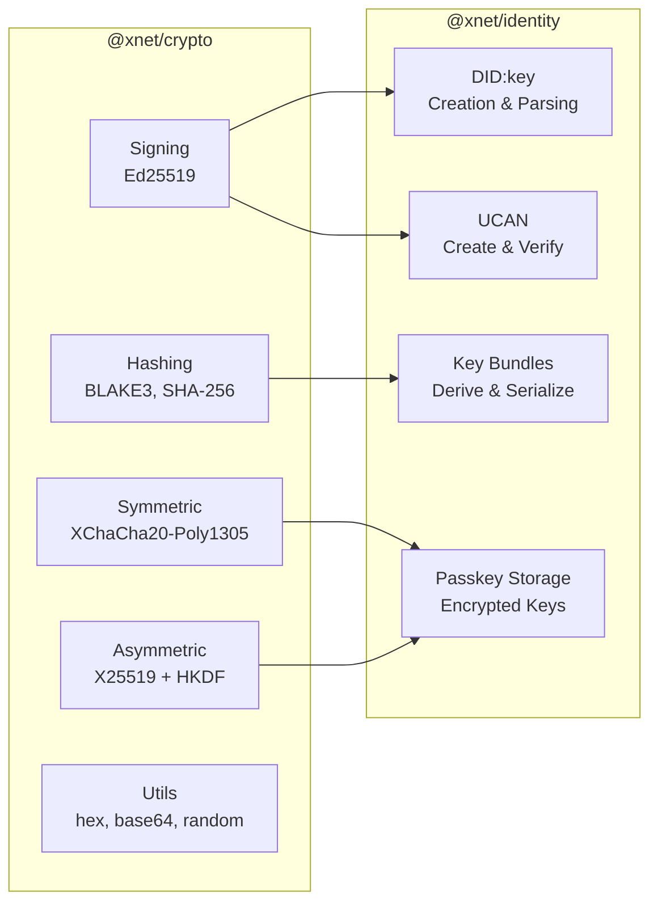
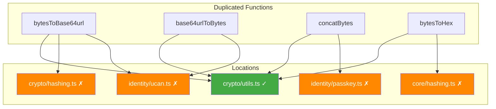

# 04 - Cryptography & Identity

## Overview

Review of `@xnet/crypto` and `@xnet/identity` packages covering cryptographic primitives, key management, DID:key identity, and UCAN token handling.

---

## @xnet/crypto Findings

### Critical

| ID   | Issue                                                                                              | File:Line                      |
| ---- | -------------------------------------------------------------------------------------------------- | ------------------------------ |
| C-01 | `hexToBytes` silently corrupts on invalid hex (NaN -> 0)                                           | `utils.ts:28`                  |
| C-02 | `bytesToBase64` / `bytesToBase64url` throw on inputs > ~65K bytes (spread operator stack overflow) | `utils.ts:42`, `hashing.ts:40` |

### Major

| ID   | Issue                                                                           | File:Line             |
| ---- | ------------------------------------------------------------------------------- | --------------------- |
| M-01 | Duplicate `bytesToBase64url` implementation in `hashing.ts` vs `utils.ts`       | `hashing.ts:39-42`    |
| M-02 | HKDF called without salt in `deriveSharedSecret`                                | `asymmetric.ts:34,47` |
| M-03 | `decrypt` does not validate nonce length                                        | `symmetric.ts:42-48`  |
| M-04 | No input length validation in `sign`/`verify` (32-byte key, 64-byte sig)        | `signing.ts:27-29`    |
| M-05 | No tests for `utils.ts` (8 functions) or `random.ts`                            | --                    |
| M-06 | README references non-existent API (says libsodium, shows wrong function names) | `README.md`           |

### Minor

| ID   | Issue                                                                                         | File:Line         |
| ---- | --------------------------------------------------------------------------------------------- | ----------------- |
| m-01 | `hashBase64` returns base64url, not standard base64 (misleading name)                         | `hashing.ts:32`   |
| m-02 | `randomBytes` doesn't validate input (negative, NaN, Infinity)                                | `random.ts:8`     |
| m-03 | `constantTimeEqual` early-returns on length mismatch (timing leak for variable-length inputs) | `utils.ts:91`     |
| m-04 | Unused dependency `@xnet/core` in `package.json`                                              | `package.json:23` |
| m-05 | No `test` script in `package.json`                                                            | `package.json`    |

### Suggestions

- Use `@noble/hashes/utils` for hex/bytes conversion (eliminates C-01)
- Export key size constants from signing/asymmetric modules
- Add `zeroize(buffer)` utility for key material cleanup
- Add `@example` JSDoc tags per project conventions

---

## @xnet/identity Findings

### Critical

| ID   | Issue                                                                             | File:Line       |
| ---- | --------------------------------------------------------------------------------- | --------------- |
| I-01 | UCAN signature over raw JSON instead of encoded parts (see 01-security.md SEC-05) | `ucan.ts:50-56` |
| I-02 | UCAN header (`alg`) not validated during verification                             | `ucan.ts:66-71` |
| I-03 | Passkey storage stores encryption key in plaintext                                | `passkey.ts:43` |

### Major

| ID   | Issue                                                                   | File:Line         |
| ---- | ----------------------------------------------------------------------- | ----------------- |
| I-04 | UCAN proof chain never validated                                        | `ucan.ts:64-108`  |
| I-05 | `hasCapability` only matches literal strings, not hierarchical paths    | `ucan.ts:113-116` |
| I-06 | `deriveKeyBundle` uses simple hash, not actual HKDF (JSDoc misleading)  | `keys.ts:9-24`    |
| I-07 | `identityFromPrivateKey` sets `created: Date.now()` (non-deterministic) | `did.ts:65`       |
| I-08 | `deserializeKeyBundle` has no input validation                          | `keys.ts:78-90`   |
| I-09 | Unused dependency `@xnet/core`                                          | `package.json:20` |

### Minor

| ID   | Issue                                                                           | File:Line           |
| ---- | ------------------------------------------------------------------------------- | ------------------- |
| I-10 | `toBase64UrlBytes` spread operator stack overflow on large inputs               | `ucan.ts:148`       |
| I-11 | Duplicated base64url utilities (4 functions) already exist in `@xnet/crypto`    | `ucan.ts:134-162`   |
| I-12 | Duplicated `concatBytes` already in `@xnet/crypto`                              | `passkey.ts:95-104` |
| I-13 | UCAN missing `nbf` (not-before) field                                           | `types.ts:44-51`    |
| I-14 | UCAN missing `nnc` (nonce) for replay protection                                | `types.ts:44-51`    |
| I-15 | `verifyUCAN` error leaks internal details                                       | `ucan.ts:106`       |
| I-16 | README examples use wrong type fields (`resource`/`action` vs `with`/`can`)     | `README.md:32`      |
| I-17 | `BrowserPasskeyStorage.isAvailable` checks `crypto` not `navigator.credentials` | `passkey.ts:28-30`  |

---

## Code Duplication Map

**Recommendation:** All packages should import these utilities from `@xnet/crypto` rather than re-implementing them. This eliminates bug duplication (the spread operator issue exists in 3+ copies).

---

## UCAN Compliance Assessment

```mermaid
graph TD
    subgraph "UCAN Spec Features"
        F1["Token format (header.payload.signature)"]
        F2["EdDSA signing algorithm"]
        F3["Issuer / Audience"]
        F4["Expiration (exp)"]
        F5["Capabilities (att)"]
        F6["Proof chain (prf)"]
        F7["Not-before (nbf)"]
        F8["Nonce (nnc)"]
        F9["UCAN version (ucv)"]
        F10["Hierarchical capability matching"]
        F11["Signature over encoded parts"]
    end

    F1 -->|"Implemented"| S1["✓"]
    F2 -->|"Implemented"| S2["✓"]
    F3 -->|"Implemented"| S3["✓"]
    F4 -->|"Implemented"| S4["✓"]
    F5 -->|"Partial"| S5["~"]
    F6 -->|"Not implemented"| S6["✗"]
    F7 -->|"Not implemented"| S7["✗"]
    F8 -->|"Not implemented"| S8["✗"]
    F9 -->|"Not implemented"| S9["✗"]
    F10 -->|"Not implemented"| S10["✗"]
    F11 -->|"Incorrect"| S11["✗✗"]

    style S1 fill:#44aa44,color:#fff
    style S2 fill:#44aa44,color:#fff
    style S3 fill:#44aa44,color:#fff
    style S4 fill:#44aa44,color:#fff
    style S5 fill:#ff8800,color:#fff
    style S6 fill:#ff4444,color:#fff
    style S7 fill:#ff8800,color:#fff
    style S8 fill:#ff8800,color:#fff
    style S9 fill:#ff8800,color:#fff
    style S10 fill:#ff4444,color:#fff
    style S11 fill:#ff4444,color:#fff
```

**Assessment:** The UCAN implementation covers basic token creation and verification but is not spec-compliant. The most critical gap is the signature computation (over raw JSON instead of encoded parts) and the missing proof chain validation. These must be fixed for interoperability with other UCAN implementations.

## Recommendations

> **Roadmap note:** Phase 1 is single-user; crypto correctness bugs (silent corruption, stack overflows) affect daily use. UCAN spec compliance and key management are Phase 2 (auth). Proof chains and passkey storage are Phase 3 (multi-user delegation).

### Phase 1 (Daily Driver) -- Bugs affecting single-user correctness

- [ ] **C-01:** Add hex character validation to `hexToBytes` (reject non-hex, odd-length) -- silent corruption affects all hashing
- [ ] **C-02:** Replace spread-based `bytesToBase64`/`bytesToBase64url` with chunked `String.fromCharCode` to handle >65K inputs
- [ ] **M-01:** Remove duplicate `bytesToBase64url` from `hashing.ts`, import from `utils.ts`
- [ ] **M-05:** Add unit tests for `utils.ts` (8 functions) and `random.ts`
- [ ] **I-11:** Deduplicate base64url/concatBytes from `identity/ucan.ts` and `identity/passkey.ts` -- import from `@xnet/crypto`
- [ ] **I-07:** Make `identityFromPrivateKey` accept optional `created` timestamp for deterministic testing
- [ ] **m-01:** Rename `hashBase64` to `hashBase64Url` to match actual return format
- [ ] **m-04/I-09:** Remove unused `@xnet/core` dependency from both `crypto` and `identity`

### Phase 2 (Hub MVP) -- Required for auth system (Phase 2.2)

- [ ] **I-01:** Fix UCAN signature to compute over `base64url(header).base64url(payload)` per JWT/UCAN spec
- [ ] **I-02:** Validate `alg` header field during UCAN verification (reject `alg: 'none'`)
- [ ] **I-06:** Replace simple hash in `deriveKeyBundle` with proper HKDF (or update JSDoc to not claim HKDF)
- [ ] **I-08:** Add input validation to `deserializeKeyBundle` (check field presence, types, key lengths)
- [ ] **M-02:** Add explicit salt parameter to `deriveSharedSecret` HKDF calls
- [ ] **M-03:** Validate nonce length in `decrypt` before passing to XChaCha20
- [ ] **M-04:** Validate key/signature lengths in `sign`/`verify` (32-byte key, 64-byte sig)
- [ ] **I-05:** Implement hierarchical capability matching in `hasCapability` (e.g., `xnet://*` grants `xnet://docs/123`)
- [ ] **I-10:** Fix `toBase64UrlBytes` spread operator stack overflow (same fix as C-02)
- [ ] **I-13/I-14:** Add `nbf` (not-before) and `nnc` (nonce) fields to UCAN token type

### Phase 3 (Multiplayer) -- Required for multi-user delegation

- [ ] **I-04:** Implement recursive UCAN proof chain validation
- [ ] **I-03:** Integrate real WebAuthn PRF into `BrowserPasskeyStorage` or remove from public API
- [ ] **m-03:** Fix `constantTimeEqual` to pad shorter inputs instead of early-returning on length mismatch
