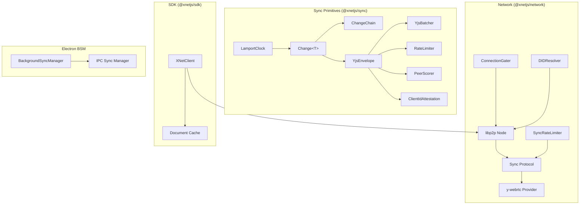
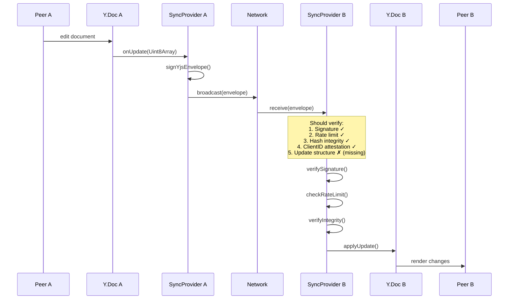

# 05 - Sync & Network Layer

## Overview

Review of `@xnetjs/sync`, `@xnetjs/network`, `@xnetjs/sdk`, and the Electron BSM (Background Sync Manager).

---

## @xnetjs/sync (251 tests, all passing)

### Critical

| ID    | Issue                                                                                          | File:Line           |
| ----- | ---------------------------------------------------------------------------------------------- | ------------------- |
| SY-01 | `computeChangeHash` cannot serialize `Uint8Array` canonically (see 02-data-integrity.md DI-03) | `change.ts:167-173` |
| SY-02 | `createChangeId` / `createBatchId` use `Math.random()` (predictable, collision-prone)          | `change.ts:242-246` |

### Major

| ID    | Issue                                                                             | File:Line               |
| ----- | --------------------------------------------------------------------------------- | ----------------------- |
| SY-03 | `defaultMergeUpdates` in `YjsBatcher` concatenates raw bytes (invalid Yjs update) | `yjs-batcher.ts:56-72`  |
| SY-04 | `SignedYjsEnvelope.authorDID` typed as `string` not `DID` brand                   | `yjs-envelope.ts:18-19` |
| SY-05 | `validateChain` checks hashes but never verifies Ed25519 signatures               | `chain.ts:51-90`        |

### Minor

| ID    | Issue                                                        | File:Line             |
| ----- | ------------------------------------------------------------ | --------------------- |
| SY-06 | `BaseSyncProvider._listeners` uses `Function` type           | `provider.ts:159`     |
| SY-07 | `once()` wrapper can't be removed via `off()` before firing  | `provider.ts:213-220` |
| SY-08 | `sortObjectKeys` doesn't handle Date, Uint8Array, Map, Set   | `change.ts:149-161`   |
| SY-09 | `emit` swallows listener errors (only logs to console.error) | `provider.ts:229-234` |
| SY-10 | No tests for `createBatchId` or batch-related hash fields    | --                    |

---

## @xnetjs/network

### Major

| ID    | Issue                                                                        | File:Line                 |
| ----- | ---------------------------------------------------------------------------- | ------------------------- |
| NW-01 | Sync protocol applies unvalidated peer data to Yjs docs (see 01-security.md) | `protocols/sync.ts:42-64` |
| NW-02 | `createNode` doesn't clean up libp2p on `start()` failure                    | `node.ts:39-54`           |
| NW-03 | `connectToPeer` double type assertion bypasses safety                        | `node.ts:75`              |

### Minor

| ID    | Issue                                                                        | File:Line                         |
| ----- | ---------------------------------------------------------------------------- | --------------------------------- |
| NW-04 | `getConnectedPeers` returns hardcoded 1 or 0, not actual count               | `providers/ywebrtc.ts:47-49`      |
| NW-05 | `onPeersChange` callback always receives empty array                         | `providers/ywebrtc.ts:58-63`      |
| NW-06 | `DefaultConnectionGater` uses `Date.now()` for connectionId (collision risk) | `security/gater.ts:93`            |
| NW-07 | `SyncRateLimiter` never evicts disconnected peers                            | `security/rate-limiter.ts:73-143` |
| NW-08 | `DIDResolver` cache has no maximum size                                      | `resolution/did.ts:21`            |
| NW-09 | `PeerScorer.decayScores` is ineffective (next event snaps back)              | `security/peer-scorer.ts:292-296` |

---

## @xnetjs/sdk

### Major

| ID     | Issue                                            | File:Line           |
| ------ | ------------------------------------------------ | ------------------- |
| SDK-01 | `generateId` uses `Math.random` for document IDs | `client.ts:126-128` |
| SDK-02 | Document cache grows without bound (no eviction) | `client.ts:109`     |

### Minor

| ID     | Issue                                                       | File:Line               |
| ------ | ----------------------------------------------------------- | ----------------------- |
| SDK-03 | `start()` sets `syncStatus = 'synced'` without verifying    | `client.ts:144-148`     |
| SDK-04 | `connectToPeer` body is empty (public API, not implemented) | `client.ts:234-238`     |
| SDK-05 | `peers` getter always returns `[]`                          | `client.ts:137-139`     |
| SDK-06 | Event handler type mismatch (`unknown` vs `string`)         | `client.ts:112,240-245` |

---

## Electron BSM & IPC Sync

### Major

| ID     | Issue                                                                     | File:Line          |
| ------ | ------------------------------------------------------------------------- | ------------------ |
| BSM-01 | Blob data from peers stored without CID verification (see 01-security.md) | `bsm.ts:739-752`   |
| BSM-02 | `before-quit` async handlers may not complete (Electron doesn't await)    | `index.ts:109-121` |

### Minor

| ID     | Issue                                                                               | File:Line                  |
| ------ | ----------------------------------------------------------------------------------- | -------------------------- |
| BSM-03 | `checkAndRequest()` called without await or catch                                   | `bsm.ts:827`               |
| BSM-04 | `acquire` promise never rejects (hangs forever on failure)                          | `preload/index.ts:63-77`   |
| BSM-05 | `xnetServices.off()` doesn't actually remove listeners (wrapper reference mismatch) | `preload/index.ts:151-153` |

---

## Sync Architecture Analysis

**The sync layer has a well-designed security stack**, with signed envelopes, rate limiting, integrity hashing, peer scoring, and clientID attestation. However:

1. **The network layer bypasses all of it.** The sync protocol in `@xnetjs/network` applies raw Yjs updates without going through any of the security layers defined in `@xnetjs/sync`.

2. **The chain validation is incomplete.** `validateChain` checks hashes but not signatures. This means a chain with correct hashes but forged authorship would pass.

3. **The hash chain is fragile.** The `Uint8Array` serialization issue (SY-01) means hashes will break after any serialization round-trip, rendering the entire chain verification system ineffective in practice.

---

## Recommendations

> **Roadmap note:** Phase 1 is single-user (no network sync). Foundational correctness bugs (hash serialization, random IDs) affect local data integrity now. Network security and peer validation are Phase 2+. Stub implementations block Phase 3 multiplayer.

### Phase 1 (Daily Driver) -- Local data correctness

- [ ] **SY-01:** Fix `computeChangeHash` to convert `Uint8Array` to hex/base64 before `JSON.stringify` -- breaks hash chain after any serialization round-trip
- [ ] **SY-02:** Replace `Math.random()` with `crypto.getRandomValues()` in `createChangeId` and `createBatchId` -- collision risk in change history
- [ ] **SY-03:** Make `mergeUpdates` a required parameter in `YjsBatcher` (remove broken byte-concatenation fallback)
- [ ] **SDK-01:** Replace `Math.random` with `crypto.getRandomValues()` in `generateId` for document IDs
- [ ] **SY-04:** Type `SignedYjsEnvelope.authorDID` as branded `DID` type instead of plain `string`
- [ ] **SY-08:** Handle `Date`, `Uint8Array`, `Map`, `Set` in `sortObjectKeys` for canonical hashing
- [ ] **BSM-05:** Fix `xnetServices.off()` wrapper reference mismatch so listeners are actually removed

### Phase 2 (Hub MVP) -- Required for sync server

- [ ] **NW-01:** Wire `YjsEnvelopeHandler`, rate limiter, and peer scorer into the actual network sync protocol -- security stack exists but is bypassed
- [ ] **SY-05:** Add Ed25519 signature verification to `validateChain` (currently only checks hashes)
- [ ] **NW-02:** Add libp2p cleanup on `createNode` `start()` failure
- [ ] **SDK-02:** Add LRU eviction to document cache in `XNetClient`
- [ ] **NW-07:** Add peer eviction to `SyncRateLimiter` when peers disconnect
- [ ] **NW-08:** Add max-size or LRU eviction to `DIDResolver` cache
- [ ] **BSM-02:** Handle Electron `before-quit` async properly (use `event.preventDefault()` + delayed `app.quit()`)
- [ ] **BSM-04:** Add timeout/rejection to `acquire` promise in preload so it doesn't hang forever

### Phase 3 (Multiplayer) -- Required for peer-to-peer sync

- [ ] **BSM-01:** Verify blob CID matches content hash before storing peer data
- [ ] **NW-04/NW-05:** Implement real `getConnectedPeers` and `onPeersChange` in y-webrtc provider
- [ ] **SDK-04:** Implement `connectToPeer` body in XNetClient
- [ ] **NW-09:** Fix `PeerScorer.decayScores` so decay actually persists between events
- [ ] **NW-06:** Replace `Date.now()` with `crypto.randomUUID()` for `connectionId` in gater
