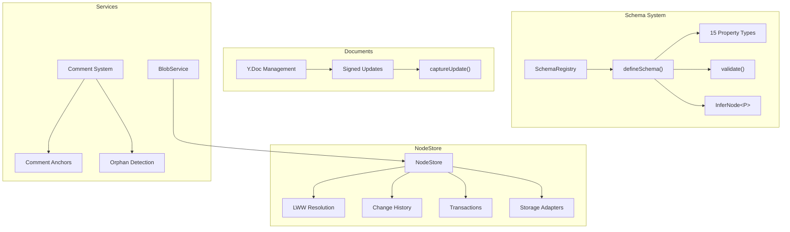
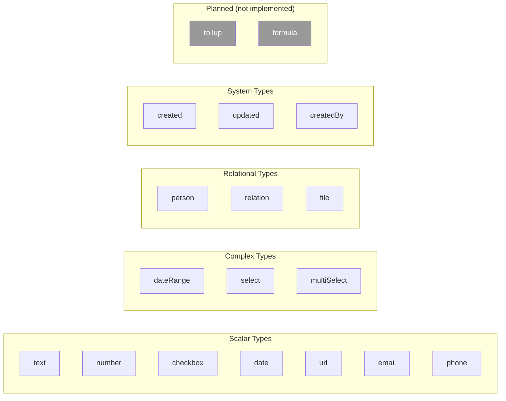
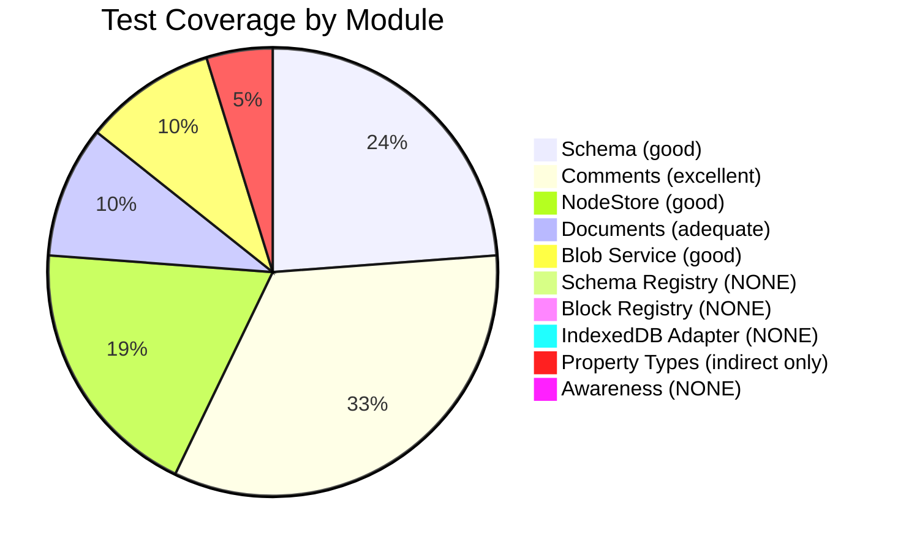

# 06 - Data Package & Schema System

## Overview

Review of `@xnetjs/data` covering the schema system with 15 property types, the event-sourced NodeStore, Yjs document management, blob services, and comment system.



---

## Schema System

### Property Type Validation Bug (Major)

**All 15 property types** have an unsound type predicate in their `validate()` function:

```typescript
// text.ts:41-44
validate(value: unknown): value is string {
    if (value === null || value === undefined) {
        return !options.required  // Returns true, but value is NOT string
    }
```

When `validate` returns `true` for `null`/`undefined` on non-required fields, TypeScript narrows the type to `string`. This is a type-system lie -- consumers will treat `null` as `string` and crash at runtime.

**Affected property types:** text, number, checkbox, date, dateRange, select, multiSelect, person, relation, url, email, phone, file, created, updated, createdBy

### Temporal Representation Inconsistency (Major)

| Property      | Type                              | Format            |
| ------------- | --------------------------------- | ----------------- |
| `date()`      | `number`                          | Unix milliseconds |
| `dateRange()` | `{ start: string, end?: string }` | ISO 8601 strings  |
| `created()`   | `number`                          | Unix milliseconds |
| `updated()`   | `number`                          | Unix milliseconds |

`dateRange` uses ISO strings while all other temporal types use Unix timestamps. This forces consumers to handle two different temporal representations.

### Missing Schema Inheritance

**File:** `packages/data/src/schema/define.ts:86-128`

The `validate()` function only checks properties defined directly on the schema. Properties inherited via `extends` are ignored. Schema B extending Schema A will not validate A's required fields.

### Text Pattern Loses Regex Flags

**File:** `packages/data/src/schema/properties/text.ts:36`

```typescript
pattern: options.pattern?.source,  // Loses i, g, m flags
```

### Number Coerce Ignores Min/Max

**File:** `packages/data/src/schema/properties/number.ts:50-56`

`coerce` returns the raw number without clamping to `min`/`max`. A node created with `value: 100` and `max: 10` passes coercion but fails validation.

---

## Property Type Reference



---

## NodeStore

### Critical: Conflict Value Capture Bug

See [02-data-integrity.md DI-01](./02-data-integrity.md) -- the local value is captured AFTER being overwritten.

### Critical: Non-Atomic Transactions

See [02-data-integrity.md DI-02](./02-data-integrity.md) -- partial application with no rollback.

### Major: False Conflict Records

**File:** `packages/data/src/store/store.ts:606-646`

Every property update records a "conflict" -- even sequential local edits. This makes `getRecentConflicts()` unreliable for displaying actual merge conflicts to users.

**Fix:** Only record conflicts when `change.authorDID !== localDID` and the Lamport comparison actually indicates a concurrent update (both changes have timestamps that didn't see each other).

### Major: IndexedDB Performance

| Operation               | Complexity | Issue                              |
| ----------------------- | ---------- | ---------------------------------- |
| `getLastChange(nodeId)` | O(n log n) | Loads ALL changes, sorts in memory |
| `countNodes()`          | O(n)       | Loads ALL nodes into memory        |
| `listNodes(prefix)`     | O(n)       | Full table scan, filters in JS     |

### Suggestion: `NodeStore.initialize()` Should Be Required Via Factory

```typescript
// Current (two-step, easy to forget):
const store = new NodeStore(options)
await store.initialize() // Must remember this!

// Better (single-step):
const store = await NodeStore.create(options)
```

---

## Comment System

The comment system is one of the best-designed parts of the codebase, with comprehensive support for:

- Multiple anchor types (block, inline, cell, row, range, canvas)
- Orphan detection when anchored content changes
- Thread resolution and hierarchy
- Reference extraction (@mentions, #tags, [[wikilinks]])

### Issues

| Severity | Issue                                                                               | File:Line                         |
| -------- | ----------------------------------------------------------------------------------- | --------------------------------- |
| Minor    | DID_PATTERN duplicated in `person.ts` and `createdBy.ts`                            | `person.ts:15`, `createdBy.ts:17` |
| Minor    | `convertRefsToLinks` constructs HTML without escaping (XSS risk)                    | `commentReferences.ts:266`        |
| Minor    | `created()`/`updated()` coerce silently falls back to `Date.now()` on invalid input | `created.ts:51-64`                |

---

## Type Safety Highlights

### Strengths

The schema type inference system is sophisticated and well-designed:

```typescript
// Schema definition produces compile-time types
const TaskSchema = defineSchema({
  name: 'Task',
  namespace: 'xnet://tasks/',
  properties: {
    title: text({ required: true }),
    done: checkbox(),
    dueDate: date()
  }
})

// InferNode<typeof TaskSchema> correctly infers:
// { title: string; done: boolean; dueDate: number | null }
```

The `RequiredKeys`/`OptionalKeys` conditional type distribution, `InferCreateProps` (which makes system fields optional), and `DefinedSchema<P>` generic propagation are all well-implemented.

### Weaknesses

| Issue                                                          | Impact                                                 |
| -------------------------------------------------------------- | ------------------------------------------------------ |
| `validate()` type predicates are unsound                       | TypeScript narrows `null` to `string`                  |
| `Node` has `[key: string]: unknown` index signature            | Defeats typed property access                          |
| `NodePayload.properties` is `Record<PropertyKey, unknown>`     | Store accepts any properties without schema validation |
| `DocumentType` name collision (two definitions)                | Ambiguous imports for consumers                        |
| `PropertyType` union includes unimplemented `rollup`/`formula` | Misleading type completeness                           |

---

## Test Coverage Gaps



**Critical gaps:**

- No direct tests for any of the 15 property type validators (validation edge cases like NaN, Infinity, empty strings, boundary values)
- No tests for `SchemaRegistry` (registration, lazy loading, clear)
- No tests for `IndexedDBNodeStorageAdapter` (requires fake-indexeddb)
- No tests for schema inheritance (`extends`)

---

## Recommendations

> **Roadmap note:** Phase 1 is a personal wiki. Schema validation bugs, type safety issues, and performance problems with hundreds of nodes directly affect daily use. Comment system issues and advanced schema features (inheritance, rollup/formula) are Phase 2+.

### Phase 1 (Daily Driver) -- Bugs affecting everyday editing

- [ ] **Validate type predicate:** Fix all 15 property type `validate()` functions to return `false` (not `true`) for `null`/`undefined` -- current behavior is a type-system lie
- [ ] **DI-01 (cross-ref):** Capture local value _before_ overwrite in `store.ts:619` conflict tracking
- [ ] **DI-07 (cross-ref):** Only record conflicts when `change.authorDID !== localDID`
- [ ] **Temporal consistency:** Align `dateRange` to use Unix timestamps like `date()`/`created()`/`updated()`, or add conversion helpers
- [ ] **Text pattern flags:** Preserve regex flags in `text()` property serialization (`options.pattern.flags` alongside `.source`)
- [ ] **Number coerce:** Clamp value to `min`/`max` in `number()` coerce function
- [ ] **DocumentType rename:** Rename one of the two `DocumentType` exports (e.g., `ContentCategory` vs `CRDTBackingType`)
- [ ] **DI-11 (cross-ref):** Accumulate Yjs updates in `captureUpdate` instead of overwriting
- [ ] **NodeStore factory:** Add `NodeStore.create(options)` static factory that calls `initialize()` internally
- [ ] **Index signature:** Remove `[key: string]: unknown` from `Node` type to preserve typed property access

### Phase 2 (Hub MVP) -- Required for schema registry and persistence

- [ ] **Schema inheritance:** Fix `validate()` to check properties from `extends` parent schemas
- [ ] **SchemaRegistry tests:** Add tests for registration, lazy loading, clear, duplicate handling
- [ ] **IndexedDB adapter tests:** Add tests using `fake-indexeddb` for CRUD, duplicates, concurrent ops
- [ ] **Property type tests:** Add dedicated edge-case tests for all 15 types (NaN, Infinity, boundaries, type mismatches)
- [ ] **DI-02 (cross-ref):** Implement transaction rollback with pre-transaction snapshots
- [ ] **Comment XSS:** Escape HTML in `convertRefsToLinks` to prevent injection via @mentions

### Phase 3 (Multiplayer) -- Required for collaborative editing

- [ ] **DI-05 (cross-ref):** Migrate `DatabaseView` from array-in-Y.Map to proper `Y.Array`/`Y.Map` per-element CRDT structures
- [ ] **Remove rollup/formula stubs:** Remove unimplemented `rollup`/`formula` from `PropertyType` union until implemented
