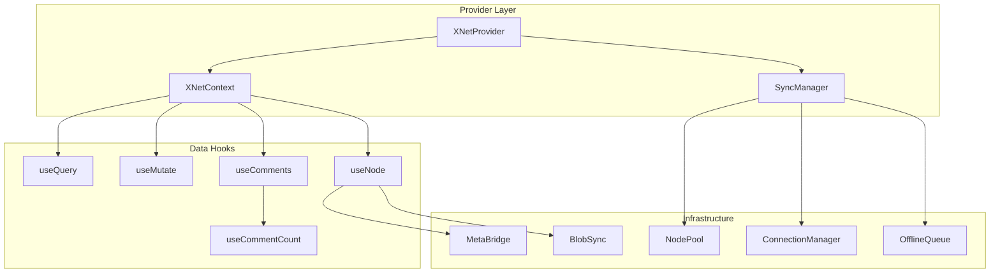
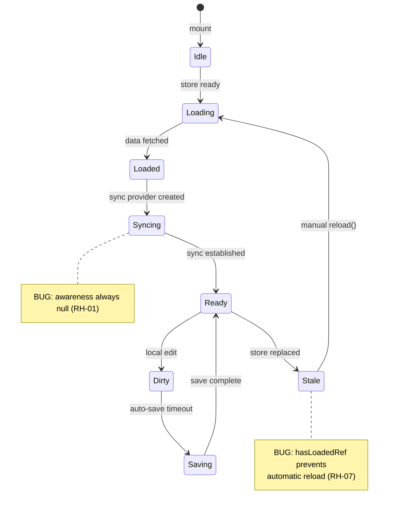

# 07 - React Hooks & State Management

## Overview

Review of `@xnet/react` covering hooks (`useQuery`, `useMutate`, `useNode`, `useComments`), context providers, sync management, and rendering patterns.



---

## Critical Issues

### RH-01: `SyncManager.getAwareness()` Always Returns Null

**File:** `packages/react/src/sync/sync-manager.ts:536-538`

```typescript
getAwareness(nodeId) {
    return awarenessMap.get(nodeId) ?? null
}
```

The `awarenessMap` is declared but **never populated** -- no code calls `awarenessMap.set()`. This means:

- Collaborative cursors don't work
- User presence indicators don't work
- All awareness features are silently broken on the SyncManager path

### RH-02: Module-Level `pendingFlushes` Leaks Across React Trees

**File:** `packages/react/src/hooks/useNode.ts:213`

```typescript
const pendingFlushes = new Map<string, Promise<void>>()
```

This module-level singleton is shared across all React trees. In tests or micro-frontends with multiple `XNetProvider` instances, flush promises from one tree affect another.

### RH-03: `useQuery` Uses `JSON.stringify` in Dependency Arrays

**File:** `packages/react/src/hooks/useQuery.ts:266,355`

```typescript
JSON.stringify(filter.where),
```

If `where` contains properties in different orders (e.g., from different code paths), the stringified result differs, causing unnecessary reloads. If values are `undefined` (stripped by `JSON.stringify`), changes are silently missed.

---

## Major Issues

### RH-04: `useNode` Has 385 Lines of Duplicated Sync Code

**File:** `packages/react/src/hooks/useNode.ts:547-931`

The main effect has two nearly-identical code paths:

- SyncManager path (lines 558-738): ~180 lines
- Fallback path (lines 740-918): ~180 lines

Both implement: update handler, meta map observer, awareness setup, sync timeout, and cleanup. A bug fix in one path is easily missed in the other.

**Fix:** Extract a `setupSync(config: SyncConfig)` function that both paths call with different configurations.

### RH-05: `useComments` Full Reload on Every Change

**File:** `packages/react/src/hooks/useComments.ts:175-191`

Every comment change event triggers a full store listing + filtering + thread conversion. For a node with 100 comments, every keystroke in any comment causes O(100) work.

### RH-06: `useNode` Cleanup Captures Stale `store`

**File:** `packages/react/src/hooks/useNode.ts:934-964`

The cleanup function closes over `store` from the render when the effect was set up. If the store is torn down (e.g., identity change), the cleanup writes to a destroyed store.

### RH-07: `useQuery` `hasLoadedRef` Prevents Data Refresh

**File:** `packages/react/src/hooks/useQuery.ts:149,271-275`

Once set to `true`, the auto-load effect never fires again. A store replacement (e.g., re-authentication) leaves stale data.

### RH-08: `useNode` `update` Missing `schemaId` in Deps

**File:** `packages/react/src/hooks/useNode.ts:526`

The `update` callback references `schemaId` but doesn't list it in the dependency array `[store, isReady, id]`.

### RH-09: `blob-sync.ts` Large Blob Handling is a No-Op

**File:** `packages/react/src/sync/blob-sync.ts:88-103`

The code checks `MAX_INLINE_SIZE` (256KB) but both branches do the same thing -- send the full blob as base64. Chunked transfer is not implemented despite the conditional.

---

## Minor Issues

| ID    | Issue                                                          | File:Line                                   |
| ----- | -------------------------------------------------------------- | ------------------------------------------- |
| RH-10 | `useMutate` `optimistic` option accepted but ignored           | `useMutate.ts:98-105`                       |
| RH-11 | `useCommentCount` creates full subscription per node (perf)    | `useCommentCount.ts:29-31`                  |
| RH-12 | `console.log` left in production code                          | `context.ts:215,228`, `sync-manager.ts:497` |
| RH-13 | `config` object in dep arrays (inline objects cause re-runs)   | `context.ts:246-255`                        |
| RH-14 | `flattenNode` type assertion hides property name collisions    | `flattenNode.ts:80-84`                      |
| RH-15 | No exponential backoff in `WebSocketSyncProvider` reconnect    | `WebSocketSyncProvider.ts:243-251`          |
| RH-16 | `signalingServers` array in dep array (new ref each render)    | `useNode.ts:921`                            |
| RH-17 | `wasCreated` in dep array causes unnecessary provider teardown | `useNode.ts:921-931`                        |

---

## Hook Lifecycle Diagram



---

## Recommendations

### Use `useSyncExternalStore`

The current `useState` + `useEffect` + `store.subscribe` pattern is tear-prone in React 18 concurrent mode. `useSyncExternalStore` is designed specifically for external store subscriptions.

### Split `useNode` Into Smaller Hooks

The 931-line `useNode` hook does too much:

- Data loading
- Y.Doc management
- Sync provider lifecycle
- Awareness
- Auto-save
- Dirty tracking

Each concern should be a separate hook composed together.

### Add Missing Test Coverage

| Module              | Current Tests | Needed                                            |
| ------------------- | ------------- | ------------------------------------------------- |
| `useQuery`          | 3             | Subscription, sorting, filter changes, store swap |
| `useMutate`         | 5             | Error handling, optimistic updates                |
| `useNode`           | 8             | createIfMissing, sync lifecycle, awareness        |
| `useComments`       | 0             | Full coverage needed                              |
| `usePlugins`        | 0             | Full coverage needed                              |
| `SyncManager`       | 0             | Acquire/release, awareness, cleanup               |
| `ConnectionManager` | 0             | Reconnection, backoff                             |
| `OfflineQueue`      | 0             | Queue, replay, persistence                        |
| `NodePool`          | 0             | Reference counting, cleanup                       |
