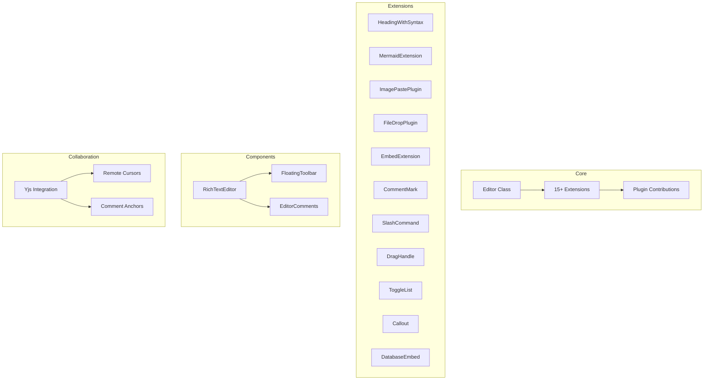
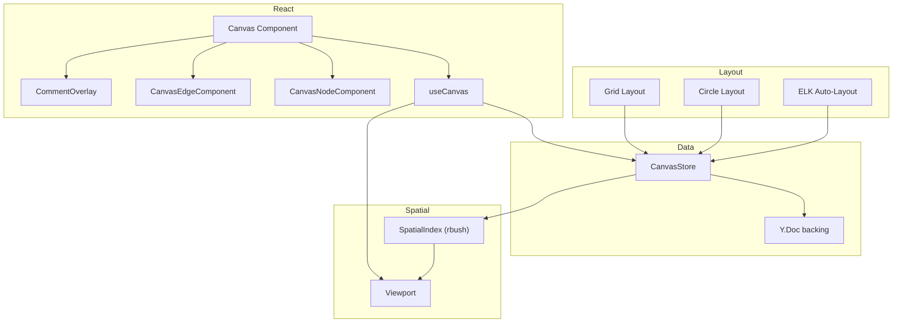
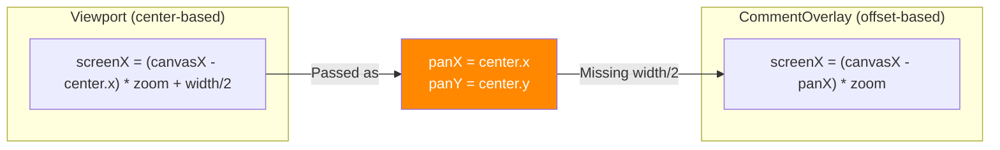
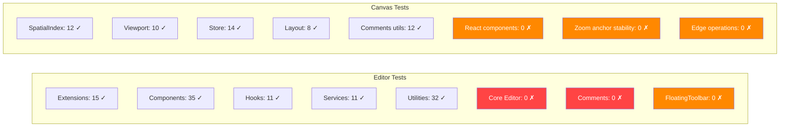

# 08 - Editor & Canvas

## Overview

Review of `@xnet/editor` (TipTap-based rich text editor with Yjs collaboration) and `@xnet/canvas` (infinite canvas with spatial indexing).

---

## Editor



### Critical: Heading Input Rule Creates Wrong Levels

**File:** `packages/editor/src/extensions.ts:150-157`

```typescript
this.options.levels.map((level) =>
  textblockTypeInputRule({
    find: new RegExp(`^(#{1,${level}})\\s$`), // BUG: Range, not exact
    type: this.type,
    getAttributes: { level }
  })
)
```

For levels `[1,2,3,4,5,6]`, the regex for level 6 is `#{1,6}` which matches 1-6 hashes. Since TipTap processes input rules in order and the last match wins, typing `# ` (one hash) triggers H6 instead of H1.

**Fix:** Use `#{${level}}` (exact count) instead of `#{1,${level}}`:

```typescript
find: new RegExp(`^(#{${level}})\\s$`),
```

### Major: Orphan Reattachment Dispatches Per-Comment Transactions

**File:** `packages/editor/src/extensions/comment/useOrphanReattachment.ts:90-99`

Each reattached comment dispatches a separate ProseMirror transaction. After the first dispatch, the editor state changes, so positions for subsequent comments may be wrong. This can corrupt the document.

**Fix:** Batch all mark insertions into a single transaction (like `restoreCommentMarks` correctly does in `textAnchor.ts:137-173`).

### Major: Upload Placeholder Race Condition

**Files:** `extensions/image/ImagePastePlugin.ts:87-146`, `extensions/file/FileDropPlugin.ts:63-119`

Between `await onUpload(file)` and the `descendants` traversal to update the placeholder, the editor state may have changed (typing, collaborative edits). Node positions can shift, causing the wrong node to be updated.

**Fix:** Use a unique ID attribute (e.g., `crypto.randomUUID()`) instead of matching by filename. Store the ID at insertion time and match by ID after upload.

### Minor Issues

| ID    | Issue                                                                          | File:Line                                          |
| ----- | ------------------------------------------------------------------------------ | -------------------------------------------------- |
| ED-01 | Duplicate `ToolbarItemContribution` type in two files                          | `RichTextEditor.tsx:152`, `FloatingToolbar.tsx:20` |
| ED-02 | Dead code: `currentContent` assigned but unused in `applyDelta`                | `core.ts:121`                                      |
| ED-03 | `uint8ArrayToBase64` spread operator stack overflow on large arrays            | `textAnchor.ts:17`                                 |
| ED-04 | Cursor registration rAF loop could run indefinitely                            | `RichTextEditor.tsx:458-465`                       |
| ED-05 | `mousemove` handler calls `elementsFromPoint` on every move (layout thrashing) | `RichTextEditor.tsx:597-630`                       |
| ED-06 | Extensions list rebuilt every render without `useMemo`                         | `RichTextEditor.tsx:344-419`                       |
| ED-07 | `handleCreateComment` missing try/catch                                        | `FloatingToolbar.tsx:206-221`                      |
| ED-08 | Unused `userEvent` import in test                                              | `RichTextEditor.test.tsx:6`                        |
| ED-09 | SlashCommand uses `any` extensively                                            | `slash-command/index.ts:78,87,117,132`             |

---

## Canvas



### Major: Viewport Culling Not Used in Renderer

**File:** `packages/canvas/src/renderer/Canvas.tsx:442`

The `SpatialIndex` provides `search(bounds)` and `getVisibleNodes()` but the renderer maps over ALL nodes. For canvases with hundreds of nodes, this causes significant performance degradation.

### Major: Two Incompatible Coordinate Systems

**Files:** `spatial/index.ts:245-259` vs `hooks/useCanvasComments.ts:328-351`

The `Viewport` class uses a **center-based** model while `CommentOverlay` uses a **pan-offset-based** model. When the Canvas bridges them at line 464-467, it passes center coordinates as pan offsets. **Comment pins will render at incorrect positions.**



### Major: `dispose()` Leaks Y.Map Observer

**File:** `packages/canvas/src/store.ts:395-400`

The constructor registers `this.nodesMap.observe(handler)` but `dispose()` never calls `unobserve()`. The handler continues firing after disposal, and the store cannot be garbage-collected.

### Major: Resize Delta Semantics Inconsistent with Drag

**File:** `packages/canvas/src/nodes/CanvasNodeComponent.tsx:200-227`

The drag handler uses **incremental** deltas (reset `dragStart` each move). The resize handler uses **cumulative** deltas (always from original position). If a consumer applies the delta incrementally, resize overshoots dramatically.

### Minor Issues

| ID    | Issue                                                           | File:Line                                       |
| ----- | --------------------------------------------------------------- | ----------------------------------------------- |
| CV-01 | Comment overlay Map recreated every render                      | `Canvas.tsx:469-482`                            |
| CV-02 | No rAF throttling for wheel events                              | `Canvas.tsx:237-258`                            |
| CV-03 | Grid doesn't track pan offset                                   | `Canvas.tsx:81-115`                             |
| CV-04 | Node drag creates per-node Yjs transactions                     | `Canvas.tsx:344-361`                            |
| CV-05 | `handleNodesChange` emits `node-updated` for new nodes          | `store.ts:337-348`                              |
| CV-06 | `node-added` and `bulk-update` events defined but never emitted | `store.ts`                                      |
| CV-07 | `generateNodeId`/`generateEdgeId` use `Math.random`             | `store.ts:432-441`                              |
| CV-08 | `removeEdge` not wrapped in Yjs transaction                     | `store.ts:256-260`                              |
| CV-09 | Keyboard Delete doesn't check if focus is in an input           | `Canvas.tsx:295-330`                            |
| CV-10 | `hoverTimeoutRef` not cleaned up on unmount                     | `CommentOverlay.tsx:78`                         |
| CV-11 | Default exports alongside named (violates convention)           | `Canvas.tsx:491`, `CanvasNodeComponent.tsx:332` |
| CV-12 | `any` types for ELK instance                                    | `layout/index.ts:15,17,101`                     |
| CV-13 | Listener errors not caught in `emit()`                          | `store.ts:328-332`                              |

---

## Test Coverage Comparison


