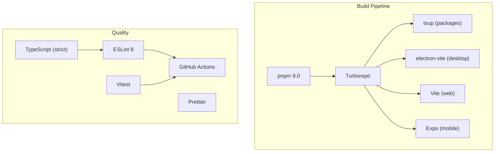
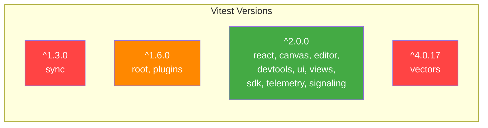
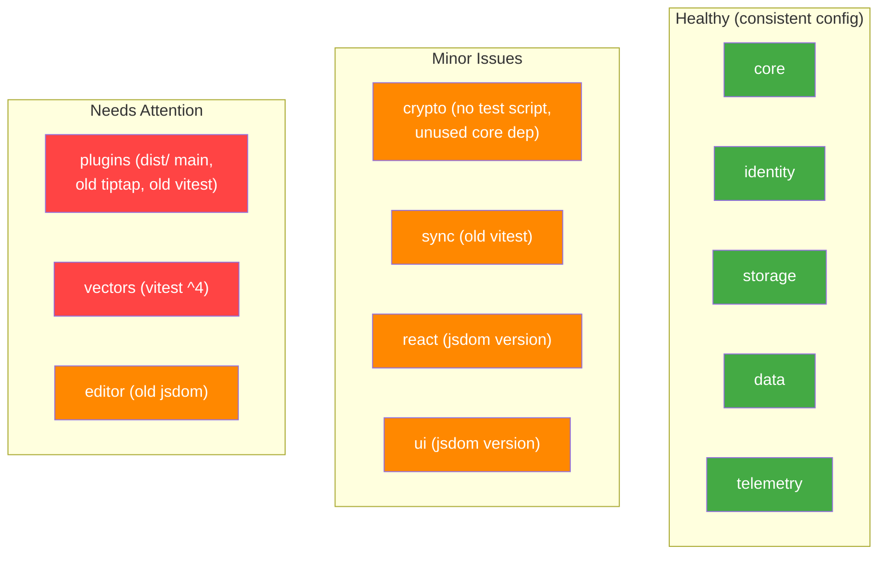

# 09 - Infrastructure & Configuration

## Overview

Review of build tooling, dependency management, configuration consistency, and project infrastructure.



---

## Dependency Issues

### INF-01: Vitest Version Fragmentation (Major)



Four different major versions of vitest across the monorepo. The root declares `^1.6.0` but most packages use `^2.0.0`. The `vectors` package jumps to `^4.0.17`. This can cause runtime conflicts when vitest imports are hoisted.

**Fix:** Align all packages to the same vitest major version. Use pnpm workspace overrides if needed.

### INF-02: TipTap Major Version Mismatch (Major)

| Package         | TipTap Version          |
| --------------- | ----------------------- |
| `@xnet/editor`  | `@tiptap/core: ^3.15.3` |
| `@xnet/plugins` | `@tiptap/core: ^2.0.0`  |

Plugins that depend on TipTap 2 APIs may break when used alongside the editor's TipTap 3.

### INF-03: React Version Spread (Minor)

| Location             | React Version          |
| -------------------- | ---------------------- |
| Most packages        | `^18.2.0` (devDeps)    |
| `apps/web`           | `^18.3.0`              |
| `apps/expo`          | `18.3.1` (pinned)      |
| Peer deps (most)     | `^18.0.0 \|\| ^19.0.0` |
| Peer deps (devtools) | `>=18.0.0`             |
| Peer deps (plugins)  | `^18.0.0`              |

### INF-04: jsdom Version Inconsistency (Minor)

| Package                                | Version   |
| -------------------------------------- | --------- |
| `@xnet/editor`                         | `^25.0.0` |
| `@xnet/canvas`, `react`, `ui`, `views` | `^26.0.0` |

### INF-05: `@testing-library/react` Version Split (Minor)

| Package                   | Version                |
| ------------------------- | ---------------------- |
| `@xnet/integration-tests` | `^14.0.0`              |
| All other packages        | `^16.0.0` or `^16.2.0` |

### INF-06: Unused Dependencies

| Package          | Unused Dependency                                           |
| ---------------- | ----------------------------------------------------------- |
| `@xnet/crypto`   | `@xnet/core` (never imported)                               |
| `@xnet/identity` | `@xnet/core` (never imported)                               |
| `apps/electron`  | `@tanstack/react-router` (never used, manual state instead) |

---

## Configuration Issues

### INF-07: `@xnet/plugins` Points to `dist/` (Major)

Every package uses `"main": "./src/index.ts"` for development (workspace protocol), but `@xnet/plugins` uses `"main": "./dist/index.js"`. This means plugins must be built before any consuming package works, unlike all other packages.

### INF-08: Missing `test` Scripts (Minor)

| Package        | Has `test` script? |
| -------------- | ------------------ |
| `@xnet/core`   | No                 |
| `@xnet/crypto` | No                 |

These packages rely on the root vitest config to discover their tests. `turbo run test` for these packages will no-op.

### INF-09: ESLint Legacy Config Format (Minor)

`.eslintrc.cjs` uses ESLint 8's legacy format. ESLint 9 requires flat config (`eslint.config.js`). This works today but blocks future upgrades.

### INF-10: AGENTS.md Dependency Diagram Inaccurate (Minor)

The documented dependency chain:

```
crypto -> identity -> storage -> sync -> data -> react -> sdk
```

Actual differences:

- `storage` does NOT depend on `identity`
- `react` depends on `plugins` (not shown)
- `sdk` depends on `network` and `query` (not shown)
- `canvas`, `editor`, `devtools`, `views`, `ui`, `vectors`, `telemetry`, `plugins`, `formula` not shown

### INF-11: Coverage Config Excludes Package-Specific Tests (Minor)

The root vitest config sets 80/75/80/80 coverage thresholds but excludes `apps/` and `packages/editor/`. Packages with their own vitest configs (editor, react, canvas, views) may not contribute to root coverage.

---

## Package Health Matrix



---

## Recommendations

> **Roadmap note:** Phase 1 is a single-user daily-driver. Build consistency and test reliability directly affect development velocity. Dependency version fragmentation causes subtle test failures and runtime bugs. Infrastructure cleanup is foundational for all phases.

### Phase 1 (Daily Driver) -- Unblocks reliable development

- [ ] **INF-01:** Align all vitest versions to `^2.0.0` using `pnpm.overrides` in root `package.json` -- 4 different major versions cause hoisting conflicts
- [ ] **INF-07:** Fix `@xnet/plugins` main field to `"./src/index.ts"` like all other packages -- currently requires build before dev works
- [ ] **INF-08:** Add `"test": "vitest run"` script to `@xnet/core` and `@xnet/crypto` -- `turbo run test` currently no-ops for these
- [ ] **INF-06:** Remove unused `@xnet/core` dependency from `@xnet/crypto` and `@xnet/identity`
- [ ] **INF-10:** Update AGENTS.md dependency diagram to reflect actual package relationships
- [ ] **INF-04:** Align jsdom versions across packages (`^25.0.0` vs `^26.0.0`)
- [ ] **INF-05:** Align `@testing-library/react` versions (`^14.0.0` vs `^16.0.0`)

### Phase 2 (Hub MVP) -- Required before plugin system launches

- [ ] **INF-02:** Align TipTap versions -- upgrade `@xnet/plugins` to TipTap 3 or document the API boundary
- [ ] **INF-03:** Standardize React peer dependency ranges across all packages
- [ ] **INF-09:** Migrate `.eslintrc.cjs` to ESLint flat config (`eslint.config.js`) before ESLint 9 becomes standard
- [ ] **INF-11:** Add per-package coverage thresholds (start at 60%, ramp to 80%)

### Phase 3 (Multiplayer) -- Housekeeping

- [ ] **INF-06 (electron):** Remove unused `@tanstack/react-router` from Electron app
