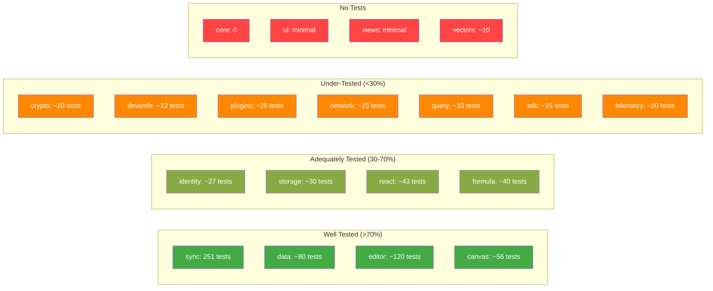

# 10 - Test Coverage Analysis

## Overview

The xNet monorepo has approximately **350+ tests** across its packages. Coverage is strong for core data primitives but sparse for UI layers, infrastructure, and integration paths.

---

## Coverage by Package



---

## Critical Coverage Gaps

These are areas where missing tests pose the highest risk of undetected bugs:

### 1. Security-Critical Code Without Tests

| Module                             | Why Critical                                                                    | Tests                          |
| ---------------------------------- | ------------------------------------------------------------------------------- | ------------------------------ |
| `crypto/utils.ts` (8 functions)    | `hexToBytes` has silent corruption bug, `constantTimeEqual` has timing concerns | **0 tests**                    |
| `crypto/random.ts`                 | Foundation for all randomness                                                   | **0 tests**                    |
| `identity/deserializeKeyBundle`    | Handles untrusted key material                                                  | **0 edge case tests**          |
| `identity/ucan.ts` malformed input | UCAN verification with adversarial tokens                                       | **0 malformed input tests**    |
| `plugins/sandbox`                  | Code execution sandboxing                                                       | **Timeout bypass untested**    |
| `network/protocols/sync.ts`        | Processes peer messages                                                         | **No malformed message tests** |

### 2. Data Integrity Code Without Tests

| Module                             | Why Critical                                      | Tests                           |
| ---------------------------------- | ------------------------------------------------- | ------------------------------- |
| `data/SchemaRegistry`              | Schema registration, resolution, caching          | **0 tests**                     |
| `data/BlockRegistry`               | Block type registration                           | **0 tests**                     |
| `data/IndexedDBNodeStorageAdapter` | Primary production storage adapter                | **0 tests**                     |
| `data/property types` (15 types)   | Validation edge cases (NaN, Infinity, boundaries) | **0 direct tests**              |
| `storage/since parameter`          | Incremental update loading                        | **Not implemented, not tested** |
| `sync/batch hash fields`           | Batch integrity verification                      | **0 tests**                     |

### 3. React Hooks Without Tests

| Hook                   | Complexity                            | Tests       |
| ---------------------- | ------------------------------------- | ----------- |
| `useComments`          | Full thread management, subscriptions | **0 tests** |
| `useCommentCount`      | Per-node subscription                 | **0 tests** |
| `usePlugins` (4 hooks) | Plugin registry, contributions        | **0 tests** |
| `SyncManager`          | Acquire/release, Y.Doc lifecycle      | **0 tests** |
| `ConnectionManager`    | WebSocket reconnection logic          | **0 tests** |
| `NodePool`             | Reference counting, cleanup           | **0 tests** |
| `OfflineQueue`         | Queue persistence, replay             | **0 tests** |

### 4. Infrastructure Without Tests

| Module                                                            | Tests       |
| ----------------------------------------------------------------- | ----------- |
| All devtools instrumentation (store, sync, yjs, telemetry, query) | **0 tests** |
| Devtools formatters and platform utils                            | **0 tests** |
| Vectors: `VectorIndex`, `SemanticSearch`                          | **Minimal** |
| Core: `mergeStateVectors`, `buildBranch`, `verifyUpdateChain`     | **0 tests** |

---

## Test Quality Assessment

### Strengths

- **Sync package (251 tests):** Excellent coverage of Lamport clocks, change chains, Yjs security layers, rate limiting, peer scoring, and client attestation. Includes distributed scenario tests.
- **Data comment system (~70 tests):** Comprehensive coverage of anchor encoding/decoding, type guards, reference extraction, orphan detection. Well-structured with clear test names.
- **Editor extensions (~120 tests):** Good coverage of extension configuration, toolbar rendering, accessibility, and mobile behavior.

### Weaknesses

- **No adversarial/fuzz testing:** Security-critical code (crypto, identity, network) has no tests with malicious or malformed inputs.
- **No integration tests for sync flow:** The full path from user edit -> NodeStore -> Yjs -> network -> peer -> merge is untested end-to-end (the integration-tests package exists but focuses on CRUD and persistence, not sync).
- **No concurrent operation tests:** Multi-user scenarios (simultaneous edits, conflict resolution, CRDT merge) are untested.
- **Property type coverage is indirect:** The 15 property types are only tested through schema-level tests, not with dedicated edge-case testing.

---

## Recommended Test Plan

### Priority 1: Security Tests

```
packages/crypto/src/utils.test.ts (NEW)
  - hexToBytes: invalid hex characters, odd length, empty string
  - bytesToBase64: large arrays (>65K)
  - constantTimeEqual: timing consistency, different lengths
  - concatBytes: zero arrays, single array, many arrays

packages/identity/src/ucan.test.ts (EXTEND)
  - Malformed token strings (wrong part count, invalid base64)
  - Token with alg: 'none'
  - Expired token edge cases (exact boundary)
  - Extremely large payloads

packages/network/src/protocols/sync.test.ts (NEW)
  - Malformed binary messages
  - Messages exceeding size limits
  - Invalid Yjs updates
  - Message replay attacks
```

### Priority 2: Data Integrity Tests

```
packages/data/src/schema/registry.test.ts (NEW)
  - Register, resolve, lazy load, unregister, clear
  - Duplicate registration handling
  - Missing schema resolution

packages/data/src/schema/properties/*.test.ts (NEW)
  - Each of 15 property types: validate and coerce with:
    - null, undefined, NaN, Infinity, -Infinity
    - Empty string, whitespace
    - Boundary values (min, max, minLength, maxLength)
    - Type mismatches (string where number expected, etc.)
    - Pattern matching for text, email, phone, url

packages/data/src/store/indexeddb-adapter.test.ts (NEW)
  - Using fake-indexeddb
  - CRUD operations
  - Duplicate update handling (db.add vs db.put)
  - Concurrent operations
  - Large dataset performance
```

### Priority 3: React Hook Tests

```
packages/react/src/hooks/useComments.test.ts (NEW)
  - Comment loading and threading
  - Real-time subscription updates
  - Resolve/unresolve behavior

packages/react/src/sync/sync-manager.test.ts (NEW)
  - Acquire/release lifecycle
  - Awareness map population (fix the bug first!)
  - Concurrent acquisitions
  - Cleanup on destroy
```

### Priority 4: Integration Tests

```
tests/integration/sync-flow.test.ts (NEW)
  - Two peers editing same document
  - Conflict resolution (LWW)
  - Offline edit + reconnect merge
  - Large document sync
  - Concurrent canvas operations
```

---

## Coverage Threshold Assessment

The root vitest config sets these thresholds:

- Statements: 80%
- Functions: 80%
- Lines: 80%
- Branches: 75%

Given the gaps identified above, the project likely **does not meet these thresholds** across all packages. The thresholds are aspirational rather than enforced per-package.

---

## Type Safety Issues Found by LSP

During this review, the LSP reported several real TypeScript errors that indicate tests may not be passing strict type checking:

| File                                             | Error                                                        |
| ------------------------------------------------ | ------------------------------------------------------------ |
| `storage/snapshots/manager.test.ts:22`           | `timeSinceLastSnapshot` does not exist on `SnapshotTriggers` |
| `sync/yjs-change.test.ts:32+` (15 errors)        | `string` not assignable to `` `did:key:${string}` ``         |
| `editor/extensions.test.ts:89`                   | `parseHTML` does not exist on `ExtensionConfig`              |
| `editor/RichTextEditor.test.tsx:28+` (18 errors) | `toBeInTheDocument` not on Vitest's `Assertion` type         |

These suggest:

1. The storage test uses wrong field names (bug in test, not caught because tests may be skipped)
2. The sync tests use plain strings where branded DID types are expected
3. The editor tests need vitest-dom type declarations

---

## Recommendations

> **Roadmap note:** Phase 1 is single-user daily-driver. Security and data integrity tests are the highest priority -- bugs in crypto/sync can silently corrupt data. UI/hook tests matter more in Phase 2+ when the codebase grows and refactors are frequent.

### Phase 1 (Daily Driver) -- Tests that catch data corruption

- [ ] **Security tests:** Create `crypto/src/utils.test.ts` -- test `hexToBytes` with invalid hex, `bytesToBase64` with >65K inputs, `constantTimeEqual` timing, `concatBytes` edge cases
- [ ] **Security tests:** Extend `identity/src/ucan.test.ts` with malformed tokens, `alg: 'none'`, exact expiration boundaries, oversized payloads
- [ ] **Data integrity tests:** Create `data/src/schema/registry.test.ts` -- register, resolve, lazy load, unregister, clear, duplicate handling
- [ ] **Data integrity tests:** Create `data/src/schema/properties/*.test.ts` -- validate all 15 types with null, NaN, Infinity, boundaries, type mismatches
- [ ] **Data integrity tests:** Create `data/src/store/indexeddb-adapter.test.ts` using `fake-indexeddb` -- CRUD, duplicates, concurrent ops
- [ ] **Fix type errors:** Fix `storage/snapshots/manager.test.ts` wrong field name, `sync/yjs-change.test.ts` branded DID types, `editor` vitest-dom declarations
- [ ] **Add test scripts:** Add `"test": "vitest run"` to `@xnetjs/core` and `@xnetjs/crypto` package.json

### Phase 2 (Hub MVP) -- Tests for sync and network reliability

- [ ] **Network tests:** Create `network/src/protocols/sync.test.ts` -- malformed binary messages, size limits, invalid Yjs updates, replay attacks
- [ ] **React hook tests:** Create `react/src/hooks/useComments.test.ts` -- loading, threading, real-time subscription
- [ ] **React hook tests:** Create `react/src/sync/sync-manager.test.ts` -- acquire/release lifecycle, awareness, concurrent acquisitions, cleanup
- [ ] **Coverage thresholds:** Add per-package coverage thresholds (start at 60%, ramp to 80%)
- [ ] **Coverage thresholds:** Use `istanbul ignore` sparingly for genuinely untestable browser-specific APIs

### Phase 3 (Multiplayer) -- Integration and adversarial tests

- [ ] **Integration tests:** Create `tests/integration/sync-flow.test.ts` -- two peers editing same doc, LWW conflict resolution, offline+reconnect merge
- [ ] **Adversarial tests:** Add fuzz testing for crypto, identity, and network protocol handlers
- [ ] **Concurrent tests:** Test multi-user scenarios (simultaneous edits, CRDT merge correctness, canvas operations)
