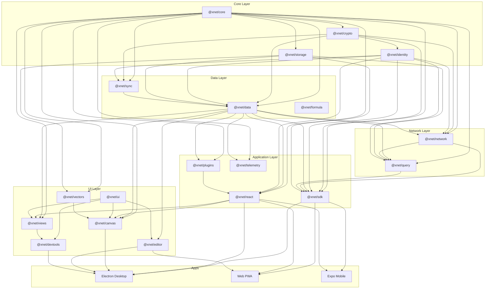

# xNet Codebase Review - January 30, 2026

## Executive Summary

This document presents a comprehensive code review of the xNet monorepo -- a local-first data platform built on CRDTs, Ed25519 cryptography, and peer-to-peer sync. The review covers **19 packages**, **3 applications**, and **2 infrastructure services** comprising approximately **50,000+ lines** of TypeScript.

**Overall assessment: The architecture is well-designed and the code quality is high for an early-stage project.** The layered package structure, strong typing patterns, and consistent conventions demonstrate thoughtful engineering. The core data pipeline (crypto -> identity -> storage -> sync -> data -> network -> query -> react -> sdk) is fully built and the hybrid sync model (Yjs + event sourcing) is a sound architectural choice.

> **Important context:** This review is calibrated against the [6-month roadmap](../../ROADMAP.md) and [project vision](../../VISION.md). Phase 1 ("Daily Driver") is the current priority -- making xNet a personal wiki you actually use daily. Many findings relate to features explicitly deferred to Phase 2 (Hub) and Phase 3 (Multiplayer). Findings are tagged with their roadmap relevance.

### Findings Summary

| Severity       | Count | Description                                                      |
| -------------- | ----- | ---------------------------------------------------------------- |
| **Critical**   | 14    | Security vulnerabilities, data corruption risks, silent failures |
| **Major**      | 38    | Bugs, significant design issues, performance problems            |
| **Minor**      | 67    | Code quality, minor bugs, inconsistencies                        |
| **Suggestion** | 45    | Improvements, best practices, future considerations              |

### Phase 1 Priority: What Blocks Daily Use

These are the issues that directly impact the "Daily Driver" milestone -- the things that will bite you during dog-fooding:

| #   | Severity | Package  | Issue                                                             | Why it matters for Phase 1                   |
| --- | -------- | -------- | ----------------------------------------------------------------- | -------------------------------------------- |
| 1   | Critical | editor   | Heading input rule regex creates wrong heading levels             | `# ` creates H6 instead of H1. Broken UX.    |
| 2   | Critical | data     | Conflict tracking records wrong value (overwrites before capture) | Conflict UI shows wrong data                 |
| 3   | Major    | editor   | Orphan reattachment dispatches per-comment transactions           | Can corrupt document on comment restore      |
| 4   | Major    | editor   | Upload placeholder race condition (filename match)                | Image/file uploads can update wrong node     |
| 5   | Major    | react    | `useComments` full reload on every change event                   | Sluggish editor with comments                |
| 6   | Major    | query    | Every query performs full table scan (no indexing)                | Slow search, blocks Phase 1.3 (Local Search) |
| 7   | Major    | data     | `getLastChange` loads ALL changes, sorts in memory                | Progressively slower as you edit more        |
| 8   | Major    | data     | `countNodes` loads all nodes into memory                          | Sidebar/navigation slows with more content   |
| 9   | Minor    | devtools | Panel ID validation out of sync with actual panels                | DevTools panel state not restored properly   |
| 10  | Minor    | infra    | Vitest version fragmentation (4 different major versions)         | CI reliability, test runner conflicts        |

### Phase 2/3 Priority: What Can Wait

These are real issues but relate to features the roadmap explicitly defers:

| Issue                                           | Deferred because                                               |
| ----------------------------------------------- | -------------------------------------------------------------- |
| Electron security (sandbox, IPC, local API)     | Phase 1 is web-first; Electron local API is dev-only           |
| UCAN spec compliance (signatures, proof chains) | UCAN auth is Phase 2.2                                         |
| Network peer validation                         | Hub uses plain WebSocket, not libp2p (Phase 2)                 |
| Plugin sandbox isolation                        | Plugins explicitly deferred beyond 6-month horizon             |
| `SyncManager.getAwareness()` always null        | Real-time presence is Phase 3.2                                |
| `computeChangeHash` Uint8Array serialization    | Hash chain verification is infrastructure, not user-facing yet |
| Hardcoded test private key                      | Real identity management is Phase 2.2                          |

### Architecture Strengths

- Clean layered dependency graph with no circular dependencies
- Consistent naming conventions and code style across packages
- Strong TypeScript inference patterns (especially the schema system)
- Well-designed hybrid sync model (Yjs CRDT + event sourcing with LWW) -- exactly the right tradeoff per TRADEOFFS.md
- Comprehensive test suite (~350 tests) with good coverage of core paths
- Thoughtful API design with factory functions, named exports, and code-first schemas
- The four primitives (Node, Schema, Sync, Identity) map cleanly to the micro-to-macro vision

### Architecture Concerns

- **Phase 1 blockers:** Editor bugs (heading levels, upload races) and query performance (full table scans) will prevent daily use
- **Technical debt accruing:** Several packages have stub implementations exposed as public API (SDK `connectToPeer`, network `onPeersChange`, query `routeToRemote`)
- **Test coverage uneven:** Core sync (251 tests) is excellent; UI/integration layers are sparse
- **Performance not yet optimized:** No viewport culling in canvas, no query indexing, sequential I/O in storage -- acceptable for MVP but will need attention as content grows

## Review Documents

| #   | Document                                         | Scope                                                  |
| --- | ------------------------------------------------ | ------------------------------------------------------ |
| 1   | [01-security.md](./01-security.md)               | Security vulnerabilities across all packages           |
| 2   | [02-data-integrity.md](./02-data-integrity.md)   | Data corruption, CRDT, and sync correctness issues     |
| 3   | [03-performance.md](./03-performance.md)         | Performance bottlenecks and optimization opportunities |
| 4   | [04-crypto-identity.md](./04-crypto-identity.md) | Cryptography and identity package review               |
| 5   | [05-sync-network.md](./05-sync-network.md)       | Sync primitives and network layer review               |
| 6   | [06-data-schema.md](./06-data-schema.md)         | Data package and schema system review                  |
| 7   | [07-react-hooks.md](./07-react-hooks.md)         | React hooks, state management, and rendering           |
| 8   | [08-editor-canvas.md](./08-editor-canvas.md)     | Editor and canvas package review                       |
| 9   | [09-infrastructure.md](./09-infrastructure.md)   | Build tooling, dependencies, and configuration         |
| 10  | [10-test-coverage.md](./10-test-coverage.md)     | Test coverage analysis and gaps                        |

## Dependency Graph

## Methodology

This review was conducted by reading every source file and test file across all packages. Each finding includes:

- Specific file path and line number references
- Severity classification (Critical/Major/Minor/Suggestion)
- Description of the issue and its impact
- Recommended fix where applicable

The review focuses on: security, correctness, performance, type safety, error handling, test coverage, API design, and adherence to the project's own conventions (AGENTS.md).
