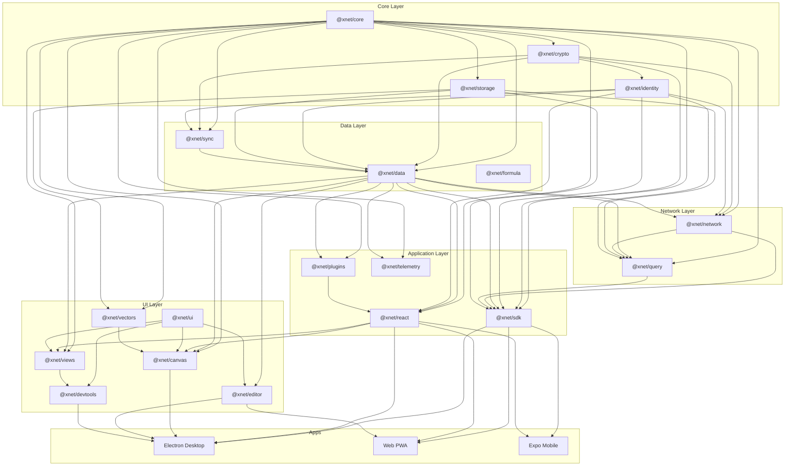

# xNet Codebase Review - January 30, 2026

## Executive Summary

This document presents a comprehensive code review of the xNet monorepo -- a local-first data platform built on CRDTs, Ed25519 cryptography, and peer-to-peer sync. The review covers **19 packages**, **3 applications**, and **2 infrastructure services** comprising approximately **50,000+ lines** of TypeScript.

**Overall assessment: The architecture is well-designed and the code quality is high for an early-stage project.** The layered package structure, strong typing patterns, and consistent conventions demonstrate thoughtful engineering. However, several critical security vulnerabilities, data integrity bugs, and performance concerns must be addressed before production use.

### Findings Summary

| Severity       | Count | Description                                                      |
| -------------- | ----- | ---------------------------------------------------------------- |
| **Critical**   | 14    | Security vulnerabilities, data corruption risks, silent failures |
| **Major**      | 38    | Bugs, significant design issues, performance problems            |
| **Minor**      | 67    | Code quality, minor bugs, inconsistencies                        |
| **Suggestion** | 45    | Improvements, best practices, future considerations              |

### Top 10 Most Urgent Issues

| #   | Severity | Package  | Issue                                                                         |
| --- | -------- | -------- | ----------------------------------------------------------------------------- |
| 1   | Critical | electron | `executeJavaScript` injection in local-api.ts allows arbitrary code execution |
| 2   | Critical | electron | Chromium sandbox disabled (`sandbox: false`)                                  |
| 3   | Critical | electron | Unrestricted IPC channel forwarding via `xnetServices`                        |
| 4   | Critical | data     | Conflict tracking records wrong value (overwrites before capture)             |
| 5   | Critical | identity | UCAN signature computed over raw JSON, not encoded token parts                |
| 6   | Critical | sync     | `computeChangeHash` cannot canonically serialize `Uint8Array` payloads        |
| 7   | Critical | react    | `SyncManager.getAwareness()` always returns null (awareness broken)           |
| 8   | Critical | plugins  | `executeWithTimeout` doesn't actually stop infinite loops                     |
| 9   | Major    | network  | Sync protocol applies unvalidated data from peers to Yjs documents            |
| 10  | Major    | editor   | Heading input rule regex creates wrong heading levels                         |

### Architecture Strengths

- Clean layered dependency graph with no circular dependencies
- Consistent naming conventions and code style across packages
- Strong TypeScript inference patterns (especially the schema system)
- Well-designed CRDT integration with both structured data (LWW) and rich text (Yjs)
- Comprehensive test suite (~350 tests) with good coverage of core paths
- Thoughtful API design with factory functions and named exports

### Architecture Concerns

- Security model is incomplete (hardcoded test keys, no auth on local API)
- Several packages have stub implementations exposed as public API
- Test coverage is uneven (core packages well-tested, UI/integration layers sparse)
- Performance optimizations deferred (no viewport culling, no query indexing, sequential I/O)

## Review Documents

| #   | Document                                         | Scope                                                  |
| --- | ------------------------------------------------ | ------------------------------------------------------ |
| 1   | [01-security.md](./01-security.md)               | Security vulnerabilities across all packages           |
| 2   | [02-data-integrity.md](./02-data-integrity.md)   | Data corruption, CRDT, and sync correctness issues     |
| 3   | [03-performance.md](./03-performance.md)         | Performance bottlenecks and optimization opportunities |
| 4   | [04-crypto-identity.md](./04-crypto-identity.md) | Cryptography and identity package review               |
| 5   | [05-sync-network.md](./05-sync-network.md)       | Sync primitives and network layer review               |
| 6   | [06-data-schema.md](./06-data-schema.md)         | Data package and schema system review                  |
| 7   | [07-react-hooks.md](./07-react-hooks.md)         | React hooks, state management, and rendering           |
| 8   | [08-editor-canvas.md](./08-editor-canvas.md)     | Editor and canvas package review                       |
| 9   | [09-infrastructure.md](./09-infrastructure.md)   | Build tooling, dependencies, and configuration         |
| 10  | [10-test-coverage.md](./10-test-coverage.md)     | Test coverage analysis and gaps                        |

## Dependency Graph

## Methodology

This review was conducted by reading every source file and test file across all packages. Each finding includes:

- Specific file path and line number references
- Severity classification (Critical/Major/Minor/Suggestion)
- Description of the issue and its impact
- Recommended fix where applicable

The review focuses on: security, correctness, performance, type safety, error handling, test coverage, API design, and adherence to the project's own conventions (AGENTS.md).
