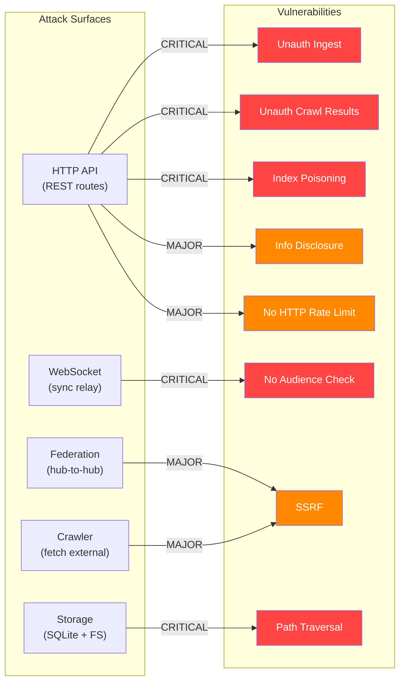

# 01 - Security Vulnerabilities

## Overview

The Hub Phase 1 implementation introduces a significant public-facing attack surface: HTTP endpoints, WebSocket connections, federation with remote hubs, and a web crawler. This document catalogs security vulnerabilities across the new code.



---

## Critical Vulnerabilities

### SEC-01: Unauthenticated Shard Ingest

**File:** `packages/hub/src/routes/shards.ts:49-93`

The `POST /shards/ingest` endpoint accepts document submissions into the search index with **zero authentication**. Any client can inject poisoned term frequencies, fake document metadata, or spam the index.

```typescript
// shards.ts:49 -- NO auth middleware, NO auth check in handler
app.post('/ingest', async (c) => {
  const payload = await c.req.json()
  // ... validates shape but not identity
  await ingest.ingestDocument(doc)
})
```

**Impact:** Complete search index corruption. An attacker can make any document appear (or disappear) in search results.

**Fix:** Require `hub/admin` or `index/write` UCAN capability on the ingest endpoint.

---

### SEC-02: Unauthenticated Crawl Results

**File:** `packages/hub/src/routes/crawl.ts:86-96`

The `POST /crawl/results` endpoint accepts crawl results with no authentication. Combined with SEC-01 (crawl results feed into shard ingest), an attacker can inject arbitrary web content into the search index by submitting fake crawl results.

```typescript
// crawl.ts:86 -- NO auth check
app.post('/results', async (c) => {
  const payload = await c.req.json()
  if (!Array.isArray(payload)) return c.json({ error: 'Expected array' }, 400)
  // ... filters with isRecord, then passes to coordinator
})
```

The `POST /crawl/seed` endpoint is also unprotected -- anyone can seed internal network URLs for crawling (SSRF).

**Fix:** Require crawler registration DID in results submission. Verify the submitter matches a registered crawler.

---

### SEC-03: Path Traversal in Blob/File Storage

**File:** `packages/hub/src/storage/sqlite.ts:762,822`

Blob and file keys are used directly in filesystem paths without sanitization:

```typescript
// sqlite.ts:762
const blobPath = join(dataDir, 'blobs', key)
writeFileSync(blobPath, Buffer.from(data))

// sqlite.ts:822
const filePath = join(dataDir, 'files', cid)
writeFileSync(filePath, Buffer.from(data))
```

If `key` or `cid` contains `../`, the file can be written outside the data directory. A malicious client could overwrite system files or the SQLite database itself.

**Fix:** Validate that the resolved path is within the expected directory:

```typescript
const resolved = resolve(dataDir, 'blobs', key)
if (!resolved.startsWith(resolve(dataDir, 'blobs'))) throw new Error('Path traversal')
```

---

### SEC-04: No UCAN Audience Verification

**File:** `packages/hub/src/auth/ucan.ts:84-88`

The UCAN token's `aud` (audience) field is not checked against the hub's own DID. A token issued for a different service (e.g., `aud: "did:key:otherHub"`) would be accepted by this hub.

```typescript
// ucan.ts:84-88
const result = verifyUCAN(token)
if (!result.valid || !result.payload) {
  ws.close(4001, 'Invalid UCAN')
  return
}
// aud is NEVER checked against this hub's DID
```

**Impact:** Cross-service token reuse. If a user has a UCAN for Hub A, it works on Hub B.

**Fix:** Add `if (result.payload.aud !== hubDid) { ws.close(4001, 'Wrong audience') }`.

---

### SEC-05: Capability Authorization Inconsistency

**Files:** `packages/hub/src/auth/ucan.ts:29-36` vs `packages/hub/src/auth/capabilities.ts:18-19`

Two different `actionAllows` functions exist with different semantics:

| File                    | Supports prefix match (`hub/*`) | Supports exact match | Supports wildcard `*` |
| ----------------------- | ------------------------------- | -------------------- | --------------------- |
| `ucan.ts:29-36`         | Yes                             | Yes                  | Yes                   |
| `capabilities.ts:18-19` | No                              | Yes                  | Yes                   |

A UCAN with `can: 'hub/*'` will pass the general auth context check but fail room-level `hasHubCapability` checks. This creates confusing authorization behavior where a token appears valid at connection time but is denied specific operations.

**Fix:** Unify into a single `actionAllows` function used by both modules.

---

## Major Vulnerabilities

### SEC-06: SSRF via Federation/Crawl/Shard URLs

**Files:** Multiple

Unvalidated `fetch()` calls to user/config-controlled URLs exist across 6 files:

| File                            | Line | Context                     |
| ------------------------------- | ---- | --------------------------- |
| `services/federation.ts`        | 319  | Federated query to peer URL |
| `services/federation-health.ts` | 41   | Health check to peer URL    |
| `services/crawl-robots.ts`      | 34   | Robots.txt fetch            |
| `services/shard-router.ts`      | 97   | Remote shard query          |
| `services/shard-ingest.ts`      | 96   | Remote shard ingest         |
| `services/index-shards.ts`      | 112  | Registry refresh            |

An attacker can register a federation peer with URL `http://169.254.169.254/latest/meta-data/` (AWS/GCP metadata endpoint) or `http://localhost:6379/` (internal Redis) and the hub will dutifully fetch it.

**Fix:** Add URL validation that rejects:

- Private IP ranges (10.x, 172.16-31.x, 192.168.x, 127.x, 169.254.x)
- Non-HTTP(S) schemes
- Localhost and link-local addresses

---

### SEC-07: No HTTP Rate Limiting

**File:** `packages/hub/src/middleware/rate-limit.ts`

The rate limiter only covers WebSocket connections. All HTTP endpoints (backup, files, schemas, federation, crawl, shards) have zero rate limiting. An attacker can:

- DoS the search index with rapid query requests
- Exhaust disk space with backup/file uploads (only per-user quota, no global rate)
- Overwhelm federation with rapid peer registrations

**Fix:** Add Hono middleware for HTTP rate limiting (per-IP or per-auth-DID).

---

### SEC-08: Information Disclosure

**Files:** Multiple

| Endpoint                  | Data Exposed                                                                    | File                         |
| ------------------------- | ------------------------------------------------------------------------------- | ---------------------------- |
| `GET /health`             | `process.memoryUsage()`, uptime, connection counts, machineId, region, platform | `server.ts:274-303`          |
| `GET /metrics`            | All Prometheus counters/gauges                                                  | `server.ts:274-303`          |
| `GET /federation/status`  | `hubDid`, peer count, exposed schemas, rate limit config                        | `routes/federation.ts:76-84` |
| `GET /shards/assignments` | Internal hub topology, URLs, DIDs                                               | `routes/shards.ts:34-47`     |

All are unauthenticated. An attacker can profile the server before attacking.

**Fix:** Add authentication or move to a separate internal port for `/metrics` and `/health`. Consider whether `/federation/status` and `/shards/assignments` need to be public.

---

### SEC-09: Anonymous Mode Grants Full Capabilities

**File:** `packages/hub/src/auth/ucan.ts:23-27`

When `config.auth` is false, all connections receive:

```typescript
{ with: '*', can: '*' }  // Full wildcard capabilities
```

This is by design for development, but if accidentally deployed with `auth: false`, every endpoint is fully open. There is no warning or safeguard.

**Fix:** Log a prominent warning at startup when auth is disabled. Consider requiring an explicit `--dangerously-disable-auth` flag.

---

### SEC-10: Remote Shard Endpoints Have Zero Auth

**Files:** `services/shard-ingest.ts:66-75`, `services/shard-router.ts:97-101`

Remote shard queries and ingest operations use plain `fetch()` with no authentication headers. Any host in the shard assignment table can be queried, and the remote endpoint accepts requests from anyone.

**Fix:** Include a hub-to-hub UCAN token in remote shard requests (similar to federation signing).

---

## Auth Model Checklist

| Endpoint                    | Current Auth             | Required Auth           | Status   |
| --------------------------- | ------------------------ | ----------------------- | -------- |
| `PUT /backup/:docId`        | UCAN `backup/write`      | Correct                 | OK       |
| `GET /backup/:docId`        | UCAN `backup/read`       | Correct                 | OK       |
| `DELETE /backup/:docId`     | UCAN `backup/delete`     | Correct                 | OK       |
| `PUT /files/:cid`           | UCAN `files/write`       | Correct                 | OK       |
| `GET /files/:cid`           | UCAN `files/read`        | Correct                 | OK       |
| `POST /schemas`             | UCAN (conditional)       | Correct                 | OK       |
| `GET /schemas/resolve/*`    | Public                   | Correct (read-only)     | OK       |
| `POST /dids/register`       | UCAN (conditional)       | Correct                 | OK       |
| `GET /dids/:did`            | Public                   | Correct (read-only)     | OK       |
| `POST /federation/query`    | Service-level UCAN       | Needs review            | WARN     |
| `POST /federation/register` | Conditional              | Needs review            | WARN     |
| `POST /shards/ingest`       | **None**                 | UCAN `index/write`      | **FAIL** |
| `POST /shards/query`        | **None**                 | At minimum rate-limited | **FAIL** |
| `POST /shards/search`       | **None**                 | At minimum rate-limited | **FAIL** |
| `POST /shards/register`     | Weak (auth optional)     | UCAN `hub/admin`        | **FAIL** |
| `POST /crawl/results`       | **None**                 | Registered crawler DID  | **FAIL** |
| `POST /crawl/seed`          | **None**                 | UCAN `hub/admin`        | **FAIL** |
| `GET /crawl/next`           | Optional (DID spoofable) | Registered crawler DID  | **FAIL** |
| `GET /health`               | Public                   | Consider internal-only  | WARN     |
| `GET /metrics`              | Public                   | Token or internal-only  | WARN     |
