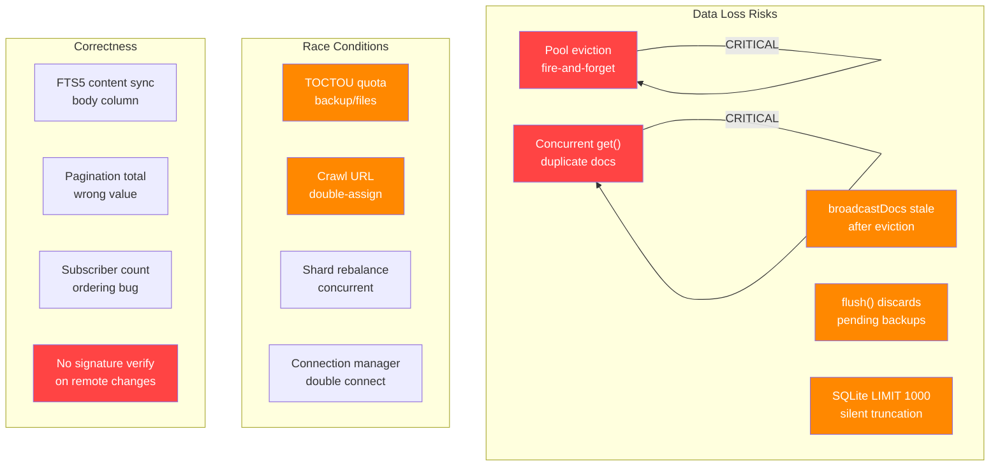

# 02 - Data Integrity & Correctness

## Overview

This document covers data loss risks, race conditions, and correctness issues in the hub implementation. The hub manages persistent state for sync documents, backups, files, schemas, awareness, and search indexes -- any data loss here directly impacts users.



---

## Critical: Data Loss Risks

### DI-01: Fire-and-Forget Persistence During Pool Eviction

**File:** `packages/hub/src/pool/node-pool.ts:152-155`

When the Yjs document pool evicts a dirty document, the persistence call is fire-and-forget:

```typescript
// node-pool.ts:152-155
void this.storage.setDocState(docId, state) // Promise discarded!
entry.doc.destroy() // Doc destroyed immediately
this.entries.delete(docId)
```

If `setDocState` fails (disk full, SQLite lock, I/O error), the dirty document data is **permanently lost**. The doc is destroyed and removed from the pool, so there is no recovery path.

**Fix:** Await persistence before destroying:

```typescript
try {
  await this.storage.setDocState(docId, state)
} catch (err) {
  console.error(`Failed to persist ${docId}`, err)
  // Keep entry in pool for retry instead of destroying
  return
}
entry.doc.destroy()
this.entries.delete(docId)
```

---

### DI-02: Concurrent `get()` Creates Duplicate Documents

**File:** `packages/hub/src/pool/node-pool.ts:39-55`

Two concurrent `get(docId)` calls for the same docId that is not in the pool will both:

1. Create a new `Y.Doc`
2. Load state from storage
3. Apply the stored state
4. Set the entry in the map

The second call overwrites the first in the map. The first caller holds a reference to a Y.Doc that is no longer tracked by the pool. Any updates applied to that doc are silently lost.

**Fix:** Use a loading-promise cache (similar to what `SchemaRegistry` does):

```typescript
if (this.loading.has(docId)) return this.loading.get(docId)!
const promise = this.loadDoc(docId)
this.loading.set(docId, promise)
promise.finally(() => this.loading.delete(docId))
return promise
```

---

### DI-03: Subscriber Count Lost Due to Call Ordering

**Files:** `services/relay.ts:148-150` + `pool/node-pool.ts:58-63`

In the relay service, `addSubscriber` is called before `get`:

```typescript
// relay.ts:148-150
this.pool.addSubscriber(room) // No-op if doc not in pool!
const doc = await this.pool.get(room)
```

But `addSubscriber` does nothing if the doc is not already in the pool:

```typescript
// node-pool.ts:58-63
addSubscriber(docId: string): void {
  const entry = this.entries.get(docId)
  if (!entry) return  // <-- silent no-op
  entry.subscriberCount++
}
```

This means the subscriber count remains 0 even though there is an active subscriber. Documents may be incorrectly evicted while still in use.

**Fix:** Either reverse the call order (`get` then `addSubscriber`), or have `addSubscriber` return a boolean indicating success so the caller can handle the miss.

---

### DI-04: No Signature Verification on Remote Changes

**Files:** `packages/data/src/store/store.ts:399`, `packages/react/src/sync/node-store-sync-provider.ts:146`

Remote node changes relayed through the hub are applied without verifying their Ed25519 signatures:

```typescript
// store.ts:399 - applyRemoteChange
applyChange(change) // No signature verification
```

The `NodeChange` object contains `signature` bytes, but they are never checked in the receive path. A compromised hub or man-in-the-middle could inject arbitrary property changes.

**Fix:** Verify signature before applying:

```typescript
if (!verifySignature(change.hash, change.signature, change.authorPublicKey)) {
  throw new Error('Invalid change signature')
}
```

---

## Major: Race Conditions

### DI-05: TOCTOU Quota Checks (Backup + Files)

**Files:** `services/backup.ts:38-45`, `services/files.ts:49-55`

Both services check quota before writing:

```typescript
// backup.ts:38-45
const blobs = await this.storage.listBlobs(ownerDid)
const totalUsed = blobs.reduce((sum, b) => sum + b.size, 0)
if (totalUsed + data.byteLength > this.maxStoragePerUser) {
  throw new BackupError('QUOTA_EXCEEDED', '...')
}
await this.storage.putBlob(...)  // Concurrent call could also pass check
```

Two concurrent uploads for the same user can both pass the quota check and exceed the limit.

**Fix:** Use an atomic compare-and-swap or pessimistic lock in the storage layer.

---

### DI-06: Crawl URL Double-Assignment

**File:** `services/crawl.ts:119-142`

The check `this.activeUrls.has(candidate.url)` and the subsequent `this.activeUrls.set(candidate.url, ...)` are not atomic. Concurrent calls to `getNextTasks` could assign the same URL to different crawlers, wasting resources and potentially causing duplicate index entries.

---

### DI-07: Connection Manager Double-Connect

**File:** `packages/react/src/sync/connection-manager.ts:151-195`

If `connect()` is called twice rapidly, two WebSocket connections are created since `doConnect` is async and doesn't check if a connection is already pending. The second overwrites `ws`, orphaning the first.

---

### DI-08: Shard Rebalance Race

**File:** `services/shard-rebalancer.ts:59`

`registerHost` triggers `rebalance()` which modifies global shard assignments. Concurrent host registrations trigger concurrent rebalances that can overwrite each other.

---

## Major: Correctness Issues

### DI-09: SQLite `getNodeChangesSince` Has Hardcoded LIMIT 1000

**File:** `packages/hub/src/storage/sqlite.ts:731-735`

```sql
SELECT * FROM node_changes WHERE room = ? AND lamport > ? ORDER BY lamport LIMIT 1000
```

The memory implementation has no limit. A room with >1000 changes will silently truncate results. Clients requesting a full sync will miss changes and have an inconsistent state with no error indication.

**Fix:** Either remove the limit (and add pagination), or document it as a contract and add pagination support in the sync protocol.

---

### DI-10: FTS5 Content-Sync Body Column Not Maintained

**File:** `packages/hub/src/storage/sqlite.ts:272-291`

The FTS5 `search_index` table uses `content='doc_meta'` for external content sync. However, the `body` column in `doc_meta` is always inserted as empty string `''`. The actual body text is added later via `updateSearchBody`. But the FTS5 triggers sync inserts/updates/deletes based on the `doc_meta` table -- and the body text is only in the FTS5 virtual table, not in `doc_meta.body`.

If the FTS5 index is rebuilt (`INSERT INTO search_index(search_index) VALUES('rebuild')`), all body text would be lost because it's not stored in the content table.

---

### DI-11: Query Pagination `total` Returns Page Size, Not True Total

**File:** `packages/hub/src/services/query.ts:75`

```typescript
total: results.length // Count of current page, not true total
```

This makes client-side pagination unusable -- the client cannot determine if there are more pages.

---

### DI-12: `broadcastDocs` Set Not Cleared on Pool Eviction

**File:** `packages/react/src/sync/sync-manager.ts:479-498`

When a doc is evicted from the pool and later re-acquired, the `broadcastDocs` Set still has the old entry. `setupDocBroadcast` won't register a new `doc.on('update')` handler on the new Y.Doc instance. Local updates to the re-acquired doc are **not broadcast** to peers.

---

## Minor: Consistency Issues

### DI-13: Search Semantics Differ Between Backends

**Files:** `storage/memory.ts:114` vs `storage/sqlite.ts:1406`

The memory backend uses `String.includes()` (substring match) while SQLite uses FTS5 `MATCH` (boolean query syntax). A query like `"foo OR bar"` produces different results on each backend.

### DI-14: Shard Term Distribution Bug for Large Shard Counts

**File:** `services/index-shards.ts:138`

`hashTerm(term) % totalShards` uses the first byte of a BLAKE3 hash (0-255 range). For `totalShards > 256`, some shards will never receive terms. No validation prevents this.

### DI-15: Shard Rebalancer Resets docCount to Zero

**File:** `services/shard-rebalancer.ts:95`

Every rebalance operation sets `docCount: 0` for all assignments, losing the actual document count.

### DI-16: `computeRange` Duplicated Between Files

**Files:** `services/index-shards.ts:59-63` and `services/shard-rebalancer.ts:18-22`

Identical function duplicated. If one is fixed (e.g., for large shard counts), the other would remain broken.

---

## Checklist

- [ ] **DI-01** -- Await persistence in pool eviction
- [ ] **DI-02** -- Add loading-promise deduplication to pool `get()`
- [ ] **DI-03** -- Fix subscriber count call ordering in relay
- [ ] **DI-04** -- Add signature verification for remote node changes
- [ ] **DI-05** -- Add atomic quota enforcement
- [ ] **DI-06** -- Add URL assignment locking in crawl coordinator
- [ ] **DI-07** -- Add pending-connection guard in connection manager
- [ ] **DI-09** -- Remove or document LIMIT 1000 in `getNodeChangesSince`
- [ ] **DI-10** -- Store body text in `doc_meta` table for FTS5 rebuild safety
- [ ] **DI-11** -- Return true total count from search/query
- [ ] **DI-12** -- Clear `broadcastDocs` entries on pool eviction
- [ ] **DI-13** -- Document search semantics difference or unify
- [ ] **DI-14** -- Validate `totalShards <= 256`
- [ ] **DI-15** -- Preserve docCount during shard rebalance
- [ ] **DI-16** -- Extract `computeRange` to shared utility
