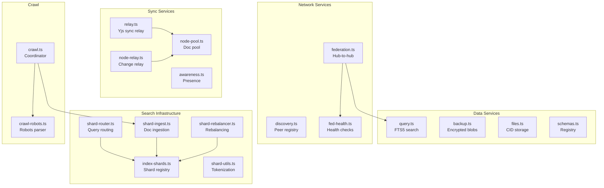

# 03 - Hub Services Layer

## Overview

The hub has 18 service files implementing the core business logic. This document reviews each service for bugs, memory leaks, resource management, and design concerns.

---

## Service-by-Service Analysis

### 1. relay.ts -- Yjs Sync Relay

**Lines:** 234 | **Severity:** Medium

| Issue                                                                               | Line    | Type                   |
| ----------------------------------------------------------------------------------- | ------- | ---------------------- |
| `fromBase64(data.sv)` can throw on malformed base64 -- no try-catch                 | 98-100  | Missing error handling |
| `Y.applyUpdate` can throw on corrupted updates -- no try-catch                      | 124-127 | Missing error handling |
| Double size check (`isUpdateTooLarge` at 195, again inside `verifyEnvelope` at 227) | 195/227 | Minor inefficiency     |
| Default `requireSignedUpdates: false` allows unsigned Yjs updates                   | 81      | Security (by design)   |

### 2. query.ts -- Query Engine

**Lines:** 130 | **Severity:** Medium

| Issue                                                                             | Line     | Type            |
| --------------------------------------------------------------------------------- | -------- | --------------- |
| `total: results.length` returns page size, not true total                         | 75       | Bug (see DI-11) |
| `sanitizeFtsQuery` doesn't strip `"`, `*`, `(`, `)`, `^` -- FTS5 syntax injection | 125-130  | Security        |
| Duck-typing `'updateSearchBody' in this.storage` instead of optional chaining     | 113, 119 | Style           |
| Duplicate of `sanitizeFtsQuery` exists in `schemas.ts:73-78`                      | 125      | Duplication     |

### 3. backup.ts -- Encrypted Backup Service

**Lines:** 98 | **Severity:** Low

| Issue                                                            | Line  | Type                       |
| ---------------------------------------------------------------- | ----- | -------------------------- |
| `listBlobs` called on every `put` to compute usage -- no caching | 38-39 | Performance                |
| TOCTOU race on quota check                                       | 38-45 | Race condition (see DI-05) |
| `get` returns first blob matching docId -- no version handling   | 62-64 | Design limitation          |

### 4. files.ts -- File Storage

**Lines:** 126 | **Severity:** Low

| Issue                                                                             | Line  | Type           |
| --------------------------------------------------------------------------------- | ----- | -------------- |
| `referenceCount` field exists but is never incremented on dedup                   | 62-63 | Bug            |
| TOCTOU quota race                                                                 | 49-55 | Race condition |
| MIME type check uses exact match -- `text/html; charset=utf-8` bypasses blocklist | 44    | Security       |

### 5. schemas.ts -- Schema Registry

**Lines:** 321 | **Severity:** Medium

| Issue                                                                            | Line    | Type              |
| -------------------------------------------------------------------------------- | ------- | ----------------- |
| Non-DID, non-built-in authorities have **no authorization check**                | 213     | Security gap      |
| `version <= 0` check allows floats like `1.5` despite "positive integer" comment | 220-221 | Validation        |
| Uses `interface` instead of `type` for `SchemaDefinitionInput`                   | 25      | Style (AGENTS.md) |
| `sanitizeSearchQuery` duplicates `sanitizeFtsQuery` from query.ts                | 73-78   | Duplication       |

### 6. awareness.ts -- Awareness/Presence Persistence

**Lines:** 221 | **Severity:** High (memory)

| Issue                                                                     | Line    | Type        |
| ------------------------------------------------------------------------- | ------- | ----------- |
| `this.rooms` map grows unboundedly -- Y.Doc per room, never evicted       | 60      | Memory leak |
| Each room creates `Y.Doc({ gc: false })` -- tombstones accumulate forever | 149     | Memory leak |
| Sequential `await` in for loop for concurrent awareness updates           | 182-196 | Performance |
| Uses `interface` instead of `type`                                        | 9       | Style       |

### 7. discovery.ts -- Peer Discovery

**Lines:** 170 | **Severity:** Medium

| Issue                                                                | Line | Type        |
| -------------------------------------------------------------------- | ---- | ----------- |
| Anonymous users can register as any DID when auth is disabled        | 78   | Security    |
| No URL/endpoint validation -- `javascript:`, `file://` URIs accepted | 46   | Security    |
| `getStats` loads ALL peers into memory to count active ones          | 148  | Performance |
| Uses `interface` instead of `type`                                   | 7    | Style       |

### 8. node-relay.ts -- Node Change Relay

**Lines:** 115 | **Severity:** Low

| Issue                                                                              | Line  | Type                   |
| ---------------------------------------------------------------------------------- | ----- | ---------------------- |
| Error message interpolates caught error as `${err}` -- produces `[object Object]`  | 63    | Bug                    |
| `base64ToBytes` can throw on invalid base64 in `deserializeChange` -- no try-catch | 106   | Missing error handling |
| `room` field passed to storage without validation                                  | 73-76 | Validation             |

### 9. federation.ts -- Hub Federation

**Lines:** 483 | **Severity:** High

| Issue                                                                           | Line    | Type                  |
| ------------------------------------------------------------------------------- | ------- | --------------------- |
| Mutates `this.config.peers` directly -- shared reference with federation-health | 120     | Side effect           |
| `rateLimiters` map grows unboundedly -- entries never evicted                   | 90      | Memory leak           |
| Inconsistent default scoring: `1` (line 161) vs `0` (line 241) for missing rank | 161/241 | Bug                   |
| Auto-re-enable unhealthy peers after 60s creates infinite retry loop            | 405-408 | Design issue          |
| SSRF via peer URLs (no validation)                                              | 319     | Security (see SEC-06) |
| Uses 6+ `interface` declarations instead of `type`                              | 13-69   | Style                 |

### 10. federation-health.ts -- Federation Health

**Lines:** 59 | **Severity:** Low

| Issue                                                | Line  | Type     |
| ---------------------------------------------------- | ----- | -------- |
| Unexplained 50ms sleep before marking peer unhealthy | 53-54 | Clarity  |
| SSRF via peer health check URLs                      | 41    | Security |

### 11. index-shards.ts -- Shard Registry

**Lines:** 175 | **Severity:** Medium

| Issue                                                           | Line    | Type              |
| --------------------------------------------------------------- | ------- | ----------------- |
| No validation that `totalShards <= 256` -- breaks distribution  | 60      | Bug               |
| Remote registry response trusted without signature verification | 112-114 | Security          |
| `hashTerm(term) % totalShards` -- first byte only (0-255 range) | 138     | Design limitation |

### 12. crawl.ts -- Crawl Coordinator

**Lines:** 298 | **Severity:** High

| Issue                                                                                      | Line  | Type           |
| ------------------------------------------------------------------------------------------ | ----- | -------------- |
| `seedUrls(result.outLinks)` causes exponential queue growth -- no maxQueueSize enforcement | 198   | Bug            |
| `domainLastCrawl` map grows unboundedly                                                    | 59    | Memory leak    |
| `activeUrls` / `activeTasks` not cleaned if crawler disappears                             | 57-58 | Resource leak  |
| URL assignment race condition (check-then-set not atomic)                                  | 119   | Race condition |
| No SSRF protection on seeded URLs                                                          | 267   | Security       |
| Uses generic `Error` instead of domain-specific error class                                | 107   | Style          |

### 13. crawl-robots.ts -- Robots.txt Parser

**Lines:** 78 | **Severity:** Critical (correctness)

| Issue                                                                               | Line  | Type           |
| ----------------------------------------------------------------------------------- | ----- | -------------- |
| **`Disallow: /` rules are IGNORED** -- `rule !== '/'` filters out the root disallow | 24    | Critical bug   |
| User-agent sections are merged instead of most-specific-match per spec              | 64-65 | Spec violation |
| Cache grows unboundedly (TTL on read, no proactive eviction)                        | 16    | Memory leak    |
| SSRF via robots.txt fetch                                                           | 34    | Security       |

### 14. shard-router.ts -- Query Routing

**Lines:** 218 | **Severity:** Medium

| Issue                                                                     | Line   | Type         |
| ------------------------------------------------------------------------- | ------ | ------------ |
| Falls back to replica when primary returns empty results (valid response) | 80-81  | Inefficiency |
| No auth, timeout, or SSRF protection on remote shard queries              | 97-101 | Security     |
| No upper bound on query terms                                             | 43     | DoS risk     |

### 15. shard-ingest.ts -- Document Ingestion

**Lines:** 144 | **Severity:** Medium

| Issue                                                             | Line   | Type     |
| ----------------------------------------------------------------- | ------ | -------- |
| Remote shard `fetch` has no error handling -- unhandled rejection | 96-114 | Bug      |
| No auth on remote ingest requests                                 | 96     | Security |
| `ingestShard` accepts unvalidated term frequencies from network   | 66-75  | Security |

### 16. shard-rebalancer.ts -- Rebalancing

**Lines:** 103 | **Severity:** Low

| Issue                                                  | Line  | Type           |
| ------------------------------------------------------ | ----- | -------------- |
| `docCount: 0` hardcoded -- rebalance resets all counts | 95    | Bug            |
| `computeRange` duplicated from index-shards.ts         | 18-22 | Duplication    |
| Concurrent rebalances can overwrite each other         | 59    | Race condition |

### 17. shard-utils.ts -- Tokenization

**Lines:** 80 | **Severity:** Low

| Issue                                                                     | Line | Type          |
| ------------------------------------------------------------------------- | ---- | ------------- |
| `STOP_WORDS_SET` exported as mutable Set -- consumers can modify it       | 80   | Encapsulation |
| `\w` regex includes underscore -- `__proto__`, `constructor` pass through | 66   | Edge case     |

### 18. pool/node-pool.ts -- Yjs Doc Pool

**Lines:** 159 | **Severity:** Critical (data loss)

| Issue                                                        | Line    | Type                 |
| ------------------------------------------------------------ | ------- | -------------------- |
| **Fire-and-forget persistence during eviction -- data loss** | 152-153 | Critical (see DI-01) |
| **Concurrent `get()` creates duplicate docs -- data loss**   | 39-55   | Critical (see DI-02) |
| `addSubscriber` no-op if doc not in pool                     | 58-63   | Bug (see DI-03)      |
| Persist timer can fire after entry is deleted                | 82-84   | Minor                |

---

## Unbounded In-Memory Maps Summary

| Service              | Map                      | Risk Level     | Mitigation              |
| -------------------- | ------------------------ | -------------- | ----------------------- |
| `awareness.ts:60`    | `rooms` (Y.Doc per room) | **High**       | Add LRU eviction or TTL |
| `federation.ts:90`   | `rateLimiters`           | Medium         | Add periodic cleanup    |
| `crawl.ts:59`        | `domainLastCrawl`        | Medium         | Add LRU cap             |
| `crawl-robots.ts:16` | `cache`                  | Medium         | Add proactive eviction  |
| `memory.ts:277`      | `federationLogs`         | Low (dev only) | Add max length          |

---

## Duplicate Code Summary

| Function                                   | Files                                                                            | Recommendation                       |
| ------------------------------------------ | -------------------------------------------------------------------------------- | ------------------------------------ |
| `sanitizeFtsQuery` / `sanitizeSearchQuery` | `query.ts:125`, `schemas.ts:73`                                                  | Extract to `src/utils/fts.ts`        |
| `computeRange`                             | `index-shards.ts:59`, `shard-rebalancer.ts:18`                                   | Move to `shard-utils.ts`             |
| `toBase64` / `fromBase64`                  | `relay.ts:36`, `federation.ts:85`                                                | Extract to `src/utils/encoding.ts`   |
| `isRecord`                                 | `crawl.ts:16`, `dids.ts:15`, `federation.ts:14`, `schemas.ts:15`, `shards.ts:21` | Extract to `src/utils/validation.ts` |
| `toStringArray`                            | `crawl.ts:19`, `federation.ts:17`, `shards.ts:24`                                | Extract to `src/utils/validation.ts` |
