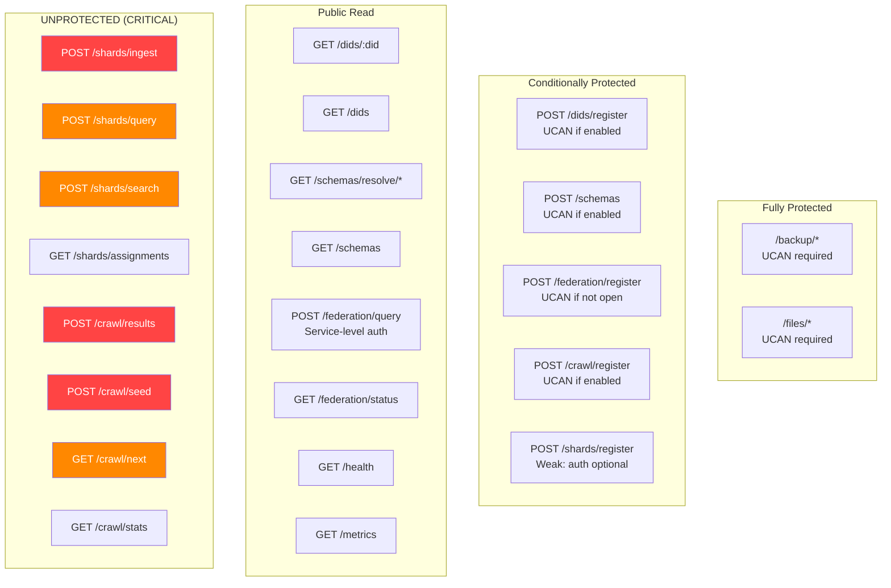

# 04 - Routes & Middleware

## Overview

The hub has 7 route files and 2 middleware modules. This document reviews input validation, auth coverage, error handling, and the relationship between routes and services.

---

## Route Architecture

Routes are generally **thin wrappers** that:

1. Extract and validate input from request
2. Check UCAN capabilities
3. Delegate to the service layer
4. Map service errors to HTTP status codes

This is the correct pattern. Two exceptions where business logic leaked into routes:

- **`routes/backup.ts:73-79`** -- DELETE handler performs list-then-find to check existence before calling `backup.delete()`. Should be in the service.
- **`routes/crawl.ts:93`** -- `as Parameters<...>` cast trusts unvalidated input after only an `isRecord` filter.

---

## Auth Coverage Map

---

## Per-Route Analysis

### backup.ts (84 lines)

| Aspect           | Assessment                                                   |
| ---------------- | ------------------------------------------------------------ |
| Auth             | All routes protected (global middleware)                     |
| Input validation | `docId` not format-validated; body size delegated to service |
| Error handling   | Good -- maps `BackupError` codes to HTTP status              |
| Style            | Inline import type assertion is unconventional               |

### crawl.ts (126 lines)

| Aspect           | Assessment                                                                      |
| ---------------- | ------------------------------------------------------------------------------- |
| Auth             | `/register` conditional; `/results`, `/seed`, `/next`, `/stats` **unprotected** |
| Input validation | `/next` limit has no upper bound; `/seed` URLs not validated (SSRF)             |
| Error handling   | No try-catch on any coordinator calls                                           |
| Style            | `isRecord`/`toStringArray` duplicated                                           |

### dids.ts (77 lines)

| Aspect           | Assessment                                                               |
| ---------------- | ------------------------------------------------------------------------ |
| Auth             | `/register` has defense-in-depth (middleware + handler check). Good.     |
| Input validation | DID format constrained by Hono path regex. `body as any` cast at line 37 |
| Error handling   | Good -- maps `DiscoveryError` codes                                      |
| Style            | `body as any` violates AGENTS.md (`unknown` preferred)                   |

### federation.ts (117 lines)

| Aspect           | Assessment                                                                                                |
| ---------------- | --------------------------------------------------------------------------------------------------------- |
| Auth             | `/query` relies on service-level UCAN; `/register` conditional                                            |
| Input validation | No URL validation on peer registration (SSRF); no `rateLimit` bounds                                      |
| Error handling   | **Fragile** -- relies on exact error message text matching. Raw error messages leaked to client (line 72) |
| Style            | No explicit return types                                                                                  |

### files.ts (101 lines)

| Aspect           | Assessment                                                           |
| ---------------- | -------------------------------------------------------------------- |
| Auth             | All routes protected (global middleware)                             |
| Input validation | CID format not validated; MIME and CID integrity checked by service  |
| Error handling   | Comprehensive `FileError` code mapping. HEAD returns bare responses. |
| Style            | Import ordering wrong (value import before type imports)             |

### schemas.ts (100 lines)

| Aspect           | Assessment                                                                  |
| ---------------- | --------------------------------------------------------------------------- |
| Auth             | POST conditional; GET public                                                |
| Input validation | IRI extraction uses hardcoded path prefix (fragile). `limit` capped at 100. |
| Error handling   | Good `SchemaError` code mapping                                             |
| Style            | `isRecord` duplicated                                                       |

### shards.ts (152 lines)

| Aspect           | Assessment                                                                       |
| ---------------- | -------------------------------------------------------------------------------- |
| Auth             | `/register` weak; `/ingest`, `/query`, `/search`, `/assignments` **unprotected** |
| Input validation | `/ingest` has thorough field validation. No upper bound on `limit`.              |
| Error handling   | Minimal -- no try-catch blocks                                                   |
| Style            | `isRecord`/`toStringArray` duplicated                                            |

---

## Middleware Analysis

### rate-limit.ts (96 lines)

**WebSocket-only rate limiter.** Does not cover HTTP routes.

| Feature                     | Status                        |
| --------------------------- | ----------------------------- |
| Per-connection message rate | 100/s window                  |
| Max connections             | 500                           |
| Max message size            | 5 MB                          |
| Violation tracking          | 3 strikes then suggests close |
| Actually closes connection  | No -- caller's responsibility |
| HTTP rate limiting          | **None**                      |
| IP-based limiting           | **None**                      |

The violation counter resets to 0 when a message is within the rate (line 86). A slow-drip attacker alternating between bursts and pauses would never accumulate 3 violations.

**Missing:** Factory function (`createRateLimiter()`) per AGENTS.md convention.

### metrics.ts (69 lines)

Prometheus-compatible counter/gauge/summary collector.

| Feature                  | Status                       |
| ------------------------ | ---------------------------- |
| WebSocket metrics        | Defined                      |
| HTTP request metrics     | **Not defined**              |
| File/backup metrics      | **Not defined**              |
| Federation/crawl metrics | **Not defined**              |
| Histogram buckets        | Not supported (summary only) |
| Integration with routes  | Routes don't call metrics    |

---

## Input Validation Gaps

| Route                 | Parameter      | Missing Validation                         |
| --------------------- | -------------- | ------------------------------------------ |
| All                   | JSON body size | No max body size middleware                |
| `backup/:docId`       | `docId`        | No format validation                       |
| `files/:cid`          | `cid`          | No CID format validation                   |
| `shards/query`        | `limit`        | No upper bound                             |
| `shards/search`       | `limit`        | No upper bound                             |
| `crawl/next`          | `limit`        | No upper bound (`Math.max(limit, 1)` only) |
| `crawl/seed`          | URLs           | No URL format/SSRF validation              |
| `federation/register` | `url`          | No URL format/SSRF validation              |
| `shards/register`     | `url`          | No URL format/SSRF validation              |

---

## Checklist

- [ ] Add auth to `POST /shards/ingest`
- [ ] Add auth to `POST /crawl/results`
- [ ] Add auth to `POST /crawl/seed`
- [ ] Add auth or rate-limiting to `POST /shards/query` and `/search`
- [x] Add HTTP rate limiting middleware
- [ ] Add JSON body size limit middleware
- [x] Add upper bounds on all `limit` params (cap at 100-500)
- [x] Add URL validation for federation/crawl/shard registration
- [ ] Replace `body as any` with `body as Record<string, unknown>` in dids.ts
- [ ] Fix fragile error-message matching in federation route
- [ ] Stop leaking raw error messages to clients
- [ ] Extract `isRecord` and `toStringArray` to shared utility
- [ ] Add explicit return types to all route factory functions
- [ ] Move backup DELETE existence check to service layer
