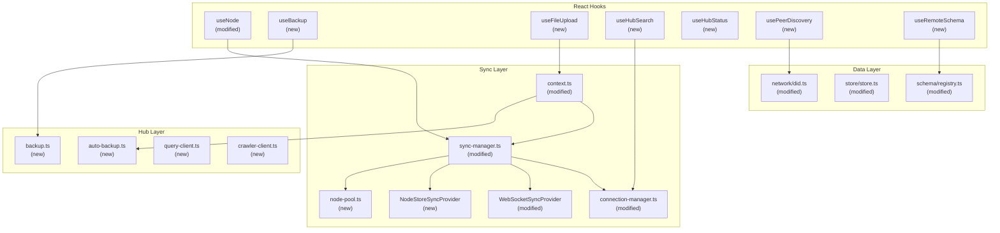

# 05 - Client-Side Integration

## Overview

The hub client integration spans 25+ files across `@xnetjs/react`, `@xnetjs/data`, `@xnetjs/network`, and `@xnetjs/hub/client`. This document reviews the React hooks, sync providers, and data layer changes that connect the client to the hub.



---

## Critical Issues

### CLI-01: `fromBase64` Returns Empty Array in Browser

**File:** `packages/network/src/resolution/did.ts:32`

```typescript
const fromBase64 = (value: string): Uint8Array =>
  typeof Buffer !== 'undefined' ? new Uint8Array(Buffer.from(value, 'base64')) : new Uint8Array() // <-- ALWAYS empty in browser!
```

In browser environments without `Buffer`, every public key resolved from the hub will be an empty `Uint8Array`. This silently breaks DID resolution for the web app.

**Fix:** Use `atob()` in the browser path:

```typescript
: new Uint8Array(atob(value).split('').map(c => c.charCodeAt(0)))
```

---

### CLI-02: Missing `phone` Import in Schema Registry

**File:** `packages/data/src/schema/registry.ts:337`

```typescript
case 'phone':
  return phone({ ... })  // 'phone' is NOT imported!
```

The `phone` property builder is used in `parseSchemaDefinition` but not imported at the top of the file (lines 28-42 list all other property builders). Any schema with a `phone` property will crash at runtime.

---

### CLI-03: No Signature Verification in NodeStoreSyncProvider

**File:** `packages/react/src/sync/node-store-sync-provider.ts:146`

Remote node changes are applied without signature verification. The `NodeChange` object has `signature` and `authorDid` fields, but the sync provider trusts whatever the hub relays.

---

### CLI-04: `broadcastDocs` Not Cleared on Pool Eviction

**File:** `packages/react/src/sync/sync-manager.ts:479-498`

When a Y.Doc is evicted from the pool and later re-acquired, `broadcastDocs` still contains the docId. The `setupDocBroadcast` guard (`if (broadcastDocs.has(nodeId)) return`) prevents re-registering the `doc.on('update')` handler on the new doc instance. Local edits to the re-acquired doc are **not broadcast**.

---

## Major Issues

### CLI-05: Overly Broad Hook Dependencies

**Files:** `hooks/useBackup.ts:26`, `hooks/useFileUpload.ts:89`

Both hooks depend on the entire `context` object in `useMemo`/`useCallback`:

```typescript
// useBackup.ts:26
}, [context])  // Should be [context?.hubUrl, context?.encryptionKey, ...]
```

Since `context` contains frequently-changing state like `hubStatus`, these memos recompute on every status change.

---

### CLI-06: `remotePeerIds` Never Shrinks

**File:** `packages/react/src/sync/WebSocketSyncProvider.ts:108,287`

Peers are added to `remotePeerIds` on message receipt but never removed on disconnect. `peerCount` monotonically increases during a session.

---

### CLI-07: Connection Manager Double-Connect

**File:** `packages/react/src/sync/connection-manager.ts:151-195`

If `connect()` is called twice rapidly, two WebSocket connections are created since `doConnect` is async and doesn't check if a connection is already pending.

---

### CLI-08: Unhandled Promise Rejections in SyncManager

**File:** `packages/react/src/sync/sync-manager.ts:332,558`

```typescript
pool.acquire(nodeId).then((doc) => {
  // ... no .catch()
})
```

If `pool.acquire` throws, the rejection is unhandled.

---

### CLI-09: `publish` Ignores Response Status in DID Resolver

**File:** `packages/network/src/resolution/did.ts:91-103`

The `publish` function fires a `fetch` to the hub but never checks `res.ok`. A failed publish is silently ignored, and the public key is hardcoded to empty string (`publicKeyB64: ''`).

---

## Minor Issues

### CLI-10: Unconditional `console.log` in Production Code

**Files:** `context.ts:290,338`, `sync-manager.ts:606`

These should use the debug `log()` function gated by `localStorage.getItem('xnet:sync:debug')`.

### CLI-11: Inline Styles Instead of Tailwind

**File:** `components/HubStatusIndicator.tsx:19-32`

AGENTS.md says "Prefer Tailwind over custom CSS." Uses inline `style` attributes.

### CLI-12: Duplicated `toHubHttpUrl` Helper

**Files:** `useFileUpload.ts:21`, `usePeerDiscovery.ts:16`, `useRemoteSchema.ts:25`

Same helper in 3+ files with slightly different implementations. Extract to `src/hub/utils.ts`.

### CLI-13: Arrow Function Export Inconsistency

**Files:** `usePeerDiscovery.ts:19`, `useRemoteSchema.ts:30`

These hooks use `export const useX = (): ... => {` while other hooks use `export function useX(): ... {`. Should be consistent.

### CLI-14: Fake Progress in useFileUpload

**File:** `hooks/useFileUpload.ts:46-77`

Progress jumps 0 -> 0.3 -> 0.5 -> 0.9 -> 1 based on sequential steps, not actual upload progress. Could mislead users about upload speed.

### CLI-15: auto-backup `flush()` Discards Pending Backups

**File:** `hub/auto-backup.ts:57-62`

`flush()` clears timers but does not trigger the actual backup for dirty docs. Pending backups are silently lost.

### CLI-16: No Encryption Format Version

**File:** `hub/backup.ts:36`

`encodeEncrypted` concatenates nonce+ciphertext with no format version marker. If the encryption scheme changes, old backups can't be distinguished from new ones.

### CLI-17: `lastSyncedLamport` Starts at 0

**File:** `sync/node-store-sync-provider.ts:36`

On first connect, `syncLocalChanges()` retrieves ALL local changes since lamport 0. For large stores, this is expensive. Should persist `lastSyncedLamport`.

### CLI-18: Unbounded DID Resolution Cache

**File:** `network/resolution/did.ts:51`

The `cache` Map grows without bound. Should have LRU eviction.

### CLI-19: `SyncStatus` vs `SyncManagerStatus` Naming Confusion

**File:** `react/src/index.ts:85,231`

Both types are exported. `SyncStatus` is `'offline'|'connecting'|'connected'|'error'` while `SyncManagerStatus` is `ConnectionStatus = 'disconnected'|'connecting'|'connected'|'error'`. Similar but different.

---

## Offline-First Behavior Assessment

| Feature              | Hub Unavailable Behavior     | Assessment |
| -------------------- | ---------------------------- | ---------- |
| Search index updates | Silently skipped             | OK         |
| Backup uploads       | Throws (no retry queue)      | Needs work |
| File uploads         | Throws (no retry queue)      | Needs work |
| Node sync            | Falls back to local-only     | OK         |
| Schema resolution    | Falls back to local registry | OK         |
| DID resolution       | Returns cached or null       | OK         |
| Peer discovery       | Returns empty list           | OK         |

---

## Checklist

- [ ] **CLI-01** -- Fix `fromBase64` browser path in DID resolver
- [ ] **CLI-02** -- Add missing `phone` import in schema registry
- [ ] **CLI-03** -- Add signature verification in NodeStoreSyncProvider
- [ ] **CLI-04** -- Clear `broadcastDocs` on pool eviction
- [ ] **CLI-05** -- Narrow `useMemo`/`useCallback` dependencies
- [ ] **CLI-06** -- Remove peers from `remotePeerIds` on disconnect
- [ ] **CLI-07** -- Add pending-connection guard in connection manager
- [ ] **CLI-08** -- Add `.catch()` to all `pool.acquire().then()` calls
- [ ] **CLI-09** -- Check response status in DID publish
- [ ] **CLI-10** -- Replace `console.log` with debug `log()` function
- [ ] **CLI-11** -- Convert inline styles to Tailwind
- [ ] **CLI-12** -- Extract `toHubHttpUrl` to shared utility
- [ ] **CLI-15** -- Make `flush()` trigger pending backups before clearing
- [ ] **CLI-17** -- Persist `lastSyncedLamport` across sessions
- [ ] **CLI-18** -- Add LRU eviction to DID resolution cache
