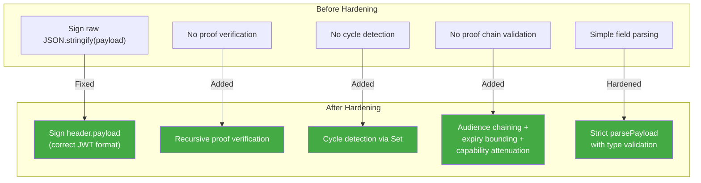

# 06 - Identity & UCAN Hardening

## Overview

Commit `061a418` ("fix(identity): harden UCAN verification") introduced significant improvements to UCAN token handling. This document analyzes the changes, the resulting test failure, and remaining gaps.

---

## Test Failure Root Cause

**Test:** `packages/identity/src/ucan.test.ts:73-89` -- "should include proofs"

**Status:** FAILING -- `expected false to be true`

### What the test does:

```typescript
const proofToken = 'parent.token.here' // Dummy string, NOT a real UCAN
const token = createUCAN({
  proofs: [proofToken]
})
const result = verifyUCAN(token)
expect(result.valid).toBe(true) // FAILS HERE
```

### Why it fails:

The hardening commit introduced **recursive proof verification** at `ucan.ts:195`:

```typescript
const proofResults = payload.prf.map((proof) => verifyUCANInternal(proof, stack))
```

The dummy string `'parent.token.here'` is now parsed as a UCAN token. It splits into 3 parts (`['parent', 'token', 'here']`), passes the length check, but `JSON.parse(fromBase64Url('parent'))` produces garbage, causing `parseUCAN` to return `null`. The parent token's verification then fails because it has an invalid proof.

### Fix:

Update the test to use a real, properly-signed UCAN as the proof (matching the pattern already used at line 91 in "should validate proof chain and attenuation"):

```typescript
const proofToken = createUCAN({
  issuer: parentDid,
  audience: issuerDid, // Proof must be issued TO the child's issuer
  capabilities: [{ with: '*', can: '*' }],
  expiration: exp,
  signingKey: parentKey
})
```

The test is wrong; the hardening is correct.

---

## Hardening Changes Analysis



### Change Details

| Change                                        | Location          | Correctness                             |
| --------------------------------------------- | ----------------- | --------------------------------------- |
| Sign `base64url(header).base64url(payload)`   | `ucan.ts:148-150` | Correct per JWT/UCAN spec               |
| Verify using same signing input from token    | `ucan.ts:190`     | Correct -- no re-serialization mismatch |
| Recursive proof verification                  | `ucan.ts:195`     | Correct per UCAN spec                   |
| Cycle detection via `Set<string>` stack       | `ucan.ts:163-167` | Correct -- prevents infinite loops      |
| Audience chaining (`proof.aud === child.iss`) | `ucan.ts:110`     | Correct per UCAN spec                   |
| Expiry bounding (child <= min(proofs))        | `ucan.ts:115-118` | Correct                                 |
| Capability attenuation                        | `ucan.ts:120-127` | Correct                                 |
| Strict `parsePayload` with `Number.isFinite`  | `ucan.ts:67-83`   | Correct                                 |
| Wildcard prefix matching (`/*` suffix)        | `ucan.ts:87-101`  | Correct                                 |

**All hardening changes are correctly implemented.**

---

## Remaining Gaps

### UCAN-01: No Audience Verification in Hub Auth

**File:** `packages/hub/src/auth/ucan.ts:84-88`

The hub accepts any valid UCAN regardless of its `aud` field. A token issued for Hub A will work on Hub B. This is the **most significant remaining UCAN issue**.

### UCAN-02: No `nbf` (Not-Before) Support

**File:** `packages/identity/src/ucan.ts`

The `nbf` field is optional per UCAN spec and is not implemented. Tokens cannot be created with a future activation time.

### UCAN-03: No Clock Skew Tolerance

**File:** `packages/identity/src/ucan.ts:177`

```typescript
if (payload.exp < Math.floor(Date.now() / 1000))
```

Zero tolerance for clock drift. A token that expired 1 second ago is rejected. Consider adding a 30-60 second grace period for distributed systems.

### UCAN-04: `actionAllows` Inconsistency

**Files:** `auth/ucan.ts:29-36` vs `auth/capabilities.ts:18-19`

The hub-side `actionAllows` function in `capabilities.ts` does NOT support prefix matching (`hub/*`), while the one in `ucan.ts` does. This creates confusing authorization behavior where tokens appear valid at connection time but are denied specific operations.

### UCAN-05: Token Format Missing Optional Fields

The current format includes: `iss`, `aud`, `exp`, `att`, `prf`

Missing optional fields per UCAN spec:

- `nbf` (not-before time)
- `nnc` (nonce for replay prevention)
- `fct` (facts -- arbitrary claims)

These are optional and can be added later without breaking compatibility.

---

## Checklist

- [ ] Fix the "should include proofs" test to use a real UCAN proof token
- [ ] Add audience verification in hub UCAN auth (`auth/ucan.ts`)
- [ ] Unify `actionAllows` between `ucan.ts` and `capabilities.ts`
- [ ] Consider adding clock skew tolerance (30-60 seconds)
- [ ] Consider adding `nbf` support for future-dated tokens
- [ ] Consider adding `nnc` (nonce) for replay prevention
