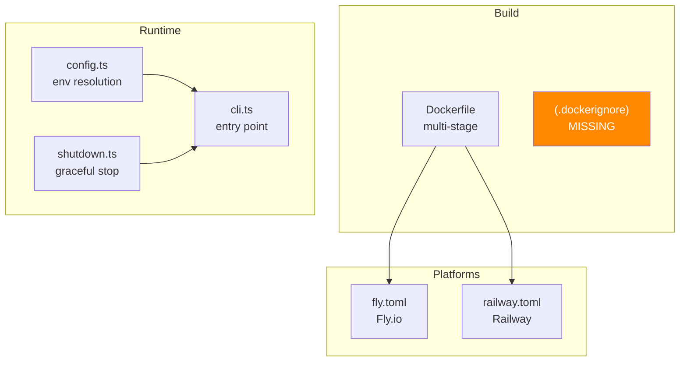

# 08 - Deploy Infrastructure

## Overview

The hub includes deployment configs for Docker, Fly.io, and Railway. This document reviews the Dockerfile, platform configs, and config resolution.



---

## Dockerfile Analysis

### Critical Issues

**DEPLOY-01: `@xnet/data` Package Missing**

The Dockerfile copies workspace packages for the hub's dependencies but omits `@xnet/data`:

```dockerfile
# These are copied:
COPY packages/core/package.json packages/core/
COPY packages/crypto/package.json packages/crypto/
COPY packages/identity/package.json packages/identity/
COPY packages/sync/package.json packages/sync/
COPY packages/hub/package.json packages/hub/
# @xnet/data is MISSING
```

The `package.json` declares `"@xnet/data": "workspace:*"`. The `pnpm install --frozen-lockfile` step will fail with an unresolved workspace dependency.

**DEPLOY-02: Container Runs as Root**

No `USER node` directive. The plan doc (07-docker-deploy.md) includes it, but the actual Dockerfile omits it. All application code runs as root, expanding the blast radius of any vulnerability.

**Fix:** Add `USER node` before `ENTRYPOINT`.

### Minor Issues

**DEPLOY-03: No `.dockerignore`**

The build context is the monorepo root (required for workspace resolution). Without `.dockerignore`, the entire repo including `node_modules`, `.git`, `apps/`, `site/` is sent to the Docker daemon.

**DEPLOY-04: HEALTHCHECK Port Variable**

```dockerfile
HEALTHCHECK CMD wget -qO- http://localhost:${PORT:-4444}/health || exit 1
```

Works because shell form is used (not exec form). But `PORT` is not set as `ENV` in the Dockerfile -- only `HUB_PORT=4444` is set. Falls back to 4444, which is correct for the default case.

### Strengths

- Multi-stage build with proper layer ordering
- Virtual packages for native deps (installed then cleaned)
- Proper `HEALTHCHECK` with reasonable intervals

---

## fly.toml Analysis

### Issues

**DEPLOY-05: Build Context Mismatch**

`fly.toml` is in `packages/hub/`. If `fly deploy` is run from that directory, the build context is `packages/hub/`, not the monorepo root. The Dockerfile expects the root.

**Fix:** Run `fly deploy` from the repo root with `--config packages/hub/fly.toml --dockerfile packages/hub/Dockerfile`.

**DEPLOY-06: Auto-Suspend Configuration**

```toml
auto_stop_machines = "suspend"
min_machines_running = 0
```

The hub will suspend when idle. First reconnecting client experiences ~2-3s cold start. WebSocket connections are dropped on suspend. Acceptable for personal use but problematic for team scenarios.

### Strengths

- Health checks every 15s with 5s timeout
- Prometheus metrics enabled
- Persistent volume at `/data`
- Connection limits (hard: 1000, soft: 800)
- Force HTTPS enabled

---

## railway.toml Analysis

### Issues

**DEPLOY-07: `startCommand` Bypasses Dockerfile ENTRYPOINT**

```toml
startCommand = "node packages/hub/dist/cli.js"
```

This means Railway ignores the Dockerfile's `--port 4444 --data /data` arguments. The hub relies entirely on env var resolution (`PORT` from Railway, `RAILWAY_VOLUME_MOUNT_PATH` for data dir).

**DEPLOY-08: Monorepo Build Context Unclear**

Railway needs to be configured to use the repo root as the build context. The `dockerfilePath = "Dockerfile"` is relative to the service root, which may or may not be the monorepo root depending on Railway configuration.

### Strengths

- `restartPolicyType = "on_failure"` with `maxRetries = 5`
- Health check path configured

---

## Config Resolution (config.ts)

### Precedence Chain

```
Platform env (PORT, RAILWAY_VOLUME_MOUNT_PATH)
  ↓
Generic env (HUB_PORT, HUB_DATA_DIR, HUB_STORAGE, ...)
  ↓
CLI options (--port, --data, --storage, ...)
  ↓
DEFAULT_CONFIG
```

### Issues

**DEPLOY-09: No Validation for `HUB_STORAGE`**

```typescript
const storage = process.env.HUB_STORAGE as HubConfig['storage'] | undefined
```

Cast without validation. `HUB_STORAGE=redis` passes through unchecked.

**DEPLOY-10: No Validation for `HUB_LOG_LEVEL`**

Same pattern -- cast without validation.

**DEPLOY-11: No Port Range Validation**

`toNumber` accepts any finite number, including negative numbers and ports above 65535.

### Strengths

- Platform detection for Fly.io and Railway is clean and extensible
- Platform-aware grace periods (4s for Fly, 8s default)
- `RAILWAY_GRACE_MS` env var override

---

## Shutdown (shutdown.ts)

### Issues

**DEPLOY-12: Always Exits with Code 0**

```typescript
} catch (err) {
  console.error('Shutdown error:', err)
} finally {
  process.exit(0)  // Even after failed shutdown!
}
```

Should exit with code 1 after a failed shutdown.

**DEPLOY-13: Async `uncaughtException` Handler**

```typescript
process.on('uncaughtException', async (err) => {
  await shutdown(...)  // Node.js does not await async exception handlers
})
```

The `await` may not complete before the process exits. However, `shutdown` itself calls `process.exit(0)` in `finally`, so it works in practice.

---

## Health & Monitoring

| Layer      | Endpoint       | Auth | Coverage           |
| ---------- | -------------- | ---- | ------------------ |
| Dockerfile | `wget /health` | None | Container liveness |
| Fly.io     | `GET /health`  | None | Proxy routing      |
| Railway    | `GET /health`  | None | Deploy validation  |
| Prometheus | `GET /metrics` | None | Observability      |

**Missing:** No readiness probe. The `/health` endpoint doesn't verify storage writability. If the SQLite database is corrupted or the volume is full, health still returns 200.

**Recommendation:** Add `/ready` endpoint that performs `SELECT 1` on SQLite.

---

## Checklist

- [ ] **DEPLOY-01** -- Add `@xnet/data` to Dockerfile copy steps
- [ ] **DEPLOY-02** -- Add `USER node` to Dockerfile
- [ ] **DEPLOY-03** -- Create `.dockerignore` at repo root
- [ ] **DEPLOY-05** -- Document/script `fly deploy` from repo root
- [ ] **DEPLOY-07** -- Ensure Railway `startCommand` works with correct env vars
- [ ] **DEPLOY-09** -- Validate `HUB_STORAGE` against allowed values
- [ ] **DEPLOY-10** -- Validate `HUB_LOG_LEVEL` against allowed values
- [ ] **DEPLOY-11** -- Validate port is in range 1-65535
- [ ] **DEPLOY-12** -- Exit with code 1 on shutdown failure
- [ ] Add `/ready` endpoint with storage health check
- [ ] Add secret management documentation for UCAN signing keys
