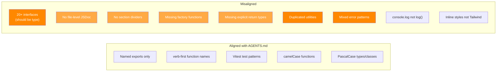

# 10 - Style & Coherence

## Overview

The hub code was written by a different AI agent and has consistent patterns that diverge from the existing codebase conventions defined in AGENTS.md. This document catalogs style deviations and coherence issues to guide alignment.

---

## Import Ordering

AGENTS.md specifies:

1. Type-only imports first
2. External packages
3. Internal `@xnet/*` packages
4. Local relative imports

### Violations

| File              | Line | Issue                                                                                     |
| ----------------- | ---- | ----------------------------------------------------------------------------------------- |
| `auth/ucan.ts`    | 8    | Mixed type and value import: `import { getCapabilities, type UCANToken, verifyUCAN }`     |
| `routes/files.ts` | 4-6  | Value import `Hono` before type imports `AuthContext`, `FileService`                      |
| `index.ts`        | 6    | Uses `'fs'` instead of `'node:fs'` (inconsistent with `sqlite.ts` which uses `'node:fs'`) |

**Most files follow the convention.** These are isolated violations.

---

## `type` vs `interface`

AGENTS.md: "Prefer `type` over `interface` for object shapes."

### `interface` Usage (Should Be `type`)

| File              | Line                   | Name                                                              |
| ----------------- | ---------------------- | ----------------------------------------------------------------- |
| `awareness.ts`    | 9                      | `AwarenessConfig`                                                 |
| `discovery.ts`    | 7, 22                  | `DiscoveryConfig`, `RegisterInput`                                |
| `federation.ts`   | 13, 30, 31, 43, 57, 69 | 6 interfaces                                                      |
| `index-shards.ts` | 9, 19                  | `ShardAssignment`, `ShardConfig`                                  |
| `shard-router.ts` | 9, 15, 28              | `GlobalSearchRequest`, `ShardQueryResult`, `GlobalSearchResponse` |
| `shard-ingest.ts` | 9, 21                  | `IndexableDocument`, `IngestResult`                               |
| `schemas.ts`      | 25                     | `SchemaDefinitionInput`                                           |

**Total: ~20 interfaces that should be types.** This is the most pervasive style deviation.

---

## Named Exports & Factory Functions

AGENTS.md: "Factory functions for classes: `createFoo()` alongside `class Foo`"

### Missing Factory Functions

| File                       | Class               | Missing Factory             |
| -------------------------- | ------------------- | --------------------------- |
| `middleware/rate-limit.ts` | `RateLimiter`       | `createRateLimiter()`       |
| `middleware/metrics.ts`    | `MetricsCollector`  | `createMetricsCollector()`  |
| `services/federation.ts`   | `FederationService` | Has constructor, no factory |
| `services/awareness.ts`    | `AwarenessService`  | Has constructor, no factory |
| `services/crawl.ts`        | `CrawlCoordinator`  | Has constructor, no factory |

Most services are instantiated directly with `new` in `server.ts`. The existing codebase pattern uses factory functions (e.g., `createNodeStore()`, `createSyncManager()`).

---

## Explicit Return Types on Exported Functions

AGENTS.md: "Use explicit return types on exported functions."

### Missing Return Types

Every route factory function is missing an explicit return type:

| File                   | Function                 |
| ---------------------- | ------------------------ |
| `routes/backup.ts`     | `createBackupRoutes`     |
| `routes/crawl.ts`      | `createCrawlRoutes`      |
| `routes/dids.ts`       | `createDiscoveryRoutes`  |
| `routes/federation.ts` | `createFederationRoutes` |
| `routes/files.ts`      | `createFileRoutes`       |
| `routes/schemas.ts`    | `createSchemaRoutes`     |
| `routes/shards.ts`     | `createShardRoutes`      |

The return type for all is `Hono`, which should be declared explicitly.

Also missing on:

- `hub/backup.ts`: `uploadBackup`, `downloadBackup`
- React hooks: `useBackup`, `useFileUpload`, `useHubSearch`, `usePeerDiscovery`, `useRemoteSchema`

---

## Constants Naming

AGENTS.md: "Constants use SCREAMING_SNAKE."

### Violations

| File                          | Line     | Name                     | Should Be             |
| ----------------------------- | -------- | ------------------------ | --------------------- |
| `usePeerDiscovery.ts`         | 46       | `5 * 60 * 1000` (inline) | `ONLINE_THRESHOLD_MS` |
| `node-store-sync-provider.ts` | 36       | `lastSyncedLamport = 0`  | `INITIAL_LAMPORT`     |
| `useNode.ts`                  | 743, 875 | `10_000` (timeout)       | `SYNC_TIMEOUT_MS`     |
| `useHubSearch.ts`             | 108      | `5000` (timeout)         | `SEARCH_TIMEOUT_MS`   |

---

## Error Handling Patterns

The existing codebase uses `{ valid: boolean, errors: [] }` for validation (not exceptions). The hub code uses typed error classes (`BackupError`, `FileError`, `SchemaError`, `DiscoveryError`) with error codes. This is a **deliberate design choice** that works well for the hub's HTTP API (error codes map cleanly to HTTP status codes), but diverges from the established pattern.

### Inconsistency Within Hub Code

| Service         | Error Pattern                                  |
| --------------- | ---------------------------------------------- |
| `backup.ts`     | `BackupError` with codes                       |
| `files.ts`      | `FileError` with codes                         |
| `schemas.ts`    | `SchemaError` with codes                       |
| `discovery.ts`  | `DiscoveryError` with codes                    |
| `node-relay.ts` | `NodeRelayError` with codes                    |
| `crawl.ts`      | Generic `Error` (inconsistent!)                |
| `federation.ts` | String comparison on error messages (fragile!) |

---

## JSDoc / Comments

AGENTS.md requires file-level JSDoc headers and section dividers.

### Missing File-Level JSDoc

**Every hub file** is missing the file-level JSDoc header:

```typescript
/**
 * @xnet/hub - [description]
 */
```

### Missing Section Dividers

No hub files use the section divider pattern:

```typescript
// ─── Section Name ────────────────────────────────────────
```

---

## Duplicated Utilities

Code that should be extracted to shared modules:

| Utility                             | Duplicated In                            | Recommended Location          |
| ----------------------------------- | ---------------------------------------- | ----------------------------- |
| `isRecord(v)`                       | 5 route files                            | `src/utils/validation.ts`     |
| `toStringArray(v)`                  | 3 route files                            | `src/utils/validation.ts`     |
| `sanitizeFtsQuery(q)`               | `query.ts`, `schemas.ts`                 | `src/utils/fts.ts`            |
| `computeRange(idx, total)`          | `index-shards.ts`, `shard-rebalancer.ts` | `src/services/shard-utils.ts` |
| `toBase64(buf)` / `fromBase64(str)` | `relay.ts`, `federation.ts`              | `src/utils/encoding.ts`       |
| `toHubHttpUrl(wsUrl)`               | 3+ React hook files                      | `react/src/hub/utils.ts`      |

---

## `any` Usage

AGENTS.md: "No `any` without justification (use `unknown` instead)."

| File              | Line     | Usage                         | Fix                                   |
| ----------------- | -------- | ----------------------------- | ------------------------------------- |
| `routes/dids.ts`  | 37       | `body as any`                 | Use `body as Record<string, unknown>` |
| `routes/crawl.ts` | 93       | `as Parameters<...>`          | Validate shape before cast            |
| Various tests     | Multiple | `Promise<any>`, `(r: any) =>` | Use proper types                      |

---

## React Hook Style

| Convention    | Existing Hooks                | New Hub Hooks                                   |
| ------------- | ----------------------------- | ----------------------------------------------- |
| Declaration   | `export function useX()`      | `export const useX = () =>` (inconsistent)      |
| Error state   | Usually exposed               | Often missing (`usePeerDiscovery`, `useBackup`) |
| Debug logging | `log()` via localStorage flag | `console.log` (unconditional)                   |
| CSS approach  | Tailwind                      | Inline styles (`HubStatusIndicator`)            |

---

## Coherence Summary



---

## Alignment Checklist

### High Priority (Functional Impact)

- [ ] Extract duplicated utilities to shared modules
- [ ] Unify error handling pattern (typed error classes are fine, but use them everywhere)
- [ ] Fix `body as any` casts to `unknown`
- [ ] Add `.catch()` to all fire-and-forget promises
- [ ] Replace `console.log` with `log()` debug function

### Medium Priority (Convention Compliance)

- [ ] Convert ~20 `interface` declarations to `type`
- [ ] Add explicit return types to all exported functions
- [ ] Add factory functions for service/middleware classes
- [ ] Add file-level JSDoc headers to all hub files
- [ ] Standardize React hook declaration style (`export function` not `export const`)

### Low Priority (Polish)

- [ ] Add section dividers to large files
- [ ] Extract magic numbers to named `SCREAMING_SNAKE` constants
- [ ] Convert `HubStatusIndicator` inline styles to Tailwind
- [ ] Use `'node:fs'` consistently (not `'fs'`)
