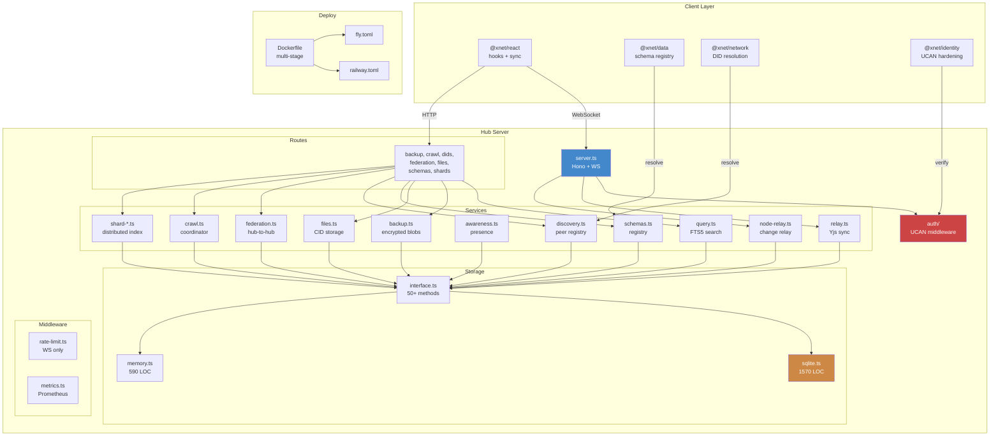

# Hub Phase 1 VPS Code Review - February 4, 2026

## Executive Summary

This review covers **49 commits** (c6d780a..e591775) implementing the Hub Phase 1 VPS milestone from `docs/plans/plan03_8HubPhase1VPS/`. The work adds a complete Hono-based hub server with WebSocket sync relay, REST APIs, federation, crawling, shard-based search, schema registry, awareness persistence, peer discovery, and deployment infrastructure for Railway and Fly.io. Client-side integration spans the `@xnet/react`, `@xnet/data`, `@xnet/network`, and `@xnet/identity` packages.

**Scope:** ~16,500 lines added/modified across 127 files. 18 new hub test files. 3 deployment configs (Dockerfile, fly.toml, railway.toml).

**Overall assessment: Ambitious and structurally sound, but has critical gaps that must be addressed before deployment.** The architecture correctly separates services, storage, routes, and middleware. The service layer is well-designed with clear responsibilities. However, the code was written by a different agent and has consistent style deviations, several security vulnerabilities (unauthenticated endpoints, missing input validation, SSRF vectors), data loss risks (fire-and-forget persistence), and **all 18 hub tests fail** due to missing dependency installation and Vitest configuration.

### Test Results

```
Test Files  22 failed | 80 passed (102)
     Tests   2 failed | 1581 passed | 5 skipped (1588)
```

| Failure Category             | Count | Root Cause                                                   |
| ---------------------------- | ----- | ------------------------------------------------------------ |
| Hub test suites fail to load | 18    | Missing `node_modules` -- deps not installed for `@xnet/hub` |
| UCAN proof test regression   | 1     | Hardening broke test that used dummy proof string            |
| Flaky perf test              | 1     | BLAKE3 1MB hashing threshold too tight (50ms)                |

### Findings Summary

| Severity       | Count | Description                                                |
| -------------- | ----- | ---------------------------------------------------------- |
| **Critical**   | 11    | Data loss, security bypass, broken builds, runtime crashes |
| **Major**      | 22    | Auth gaps, race conditions, memory leaks, SSRF vectors     |
| **Minor**      | 31    | Style deviations, code duplication, missing validation     |
| **Suggestion** | 18    | Improvements, refactoring, missing features                |

### Critical Issues (Must Fix)

| #   | Severity | Area     | Issue                                                                      | File:Line                      |
| --- | -------- | -------- | -------------------------------------------------------------------------- | ------------------------------ |
| 1   | Critical | Tests    | All 18 hub tests fail -- deps not installed, no vitest config              | `packages/hub/test/*.ts`       |
| 2   | Critical | Data     | Fire-and-forget persistence during pool eviction silently loses dirty docs | `pool/node-pool.ts:152`        |
| 3   | Critical | Security | Unauthenticated shard ingest -- anyone can poison search index             | `routes/shards.ts:49`          |
| 4   | Critical | Security | Unauthenticated crawl result submission -- poisoned search results         | `routes/crawl.ts:86`           |
| 5   | Critical | Security | Path traversal in blob/file storage via unsanitized keys                   | `storage/sqlite.ts:762,822`    |
| 6   | Critical | Crawl    | `Disallow: /` in robots.txt is ignored -- crawls everything                | `services/crawl-robots.ts:24`  |
| 7   | Critical | Client   | `fromBase64` returns empty array in browser -- public keys always empty    | `network/resolution/did.ts:32` |
| 8   | Critical | Client   | `phone` property builder used but not imported -- runtime crash            | `data/schema/registry.ts:337`  |
| 9   | Critical | Deploy   | `@xnet/data` package missing from Dockerfile -- build fails                | `hub/Dockerfile:9-53`          |
| 10  | Critical | Deploy   | Container runs as root (no `USER node`)                                    | `hub/Dockerfile`               |
| 11  | Critical | Auth     | No UCAN audience verification -- tokens for other services accepted        | `auth/ucan.ts:84`              |

### Architecture Diagram



## Review Documents

| #   | Document                                                     | Scope                                                                                  |
| --- | ------------------------------------------------------------ | -------------------------------------------------------------------------------------- |
| 1   | [01-security.md](./01-security.md)                           | Security vulnerabilities: auth bypass, SSRF, path traversal, unauthenticated endpoints |
| 2   | [02-data-integrity.md](./02-data-integrity.md)               | Data loss risks, race conditions, persistence correctness                              |
| 3   | [03-hub-services.md](./03-hub-services.md)                   | All 18 service files: bugs, memory leaks, resource management                          |
| 4   | [04-routes-middleware.md](./04-routes-middleware.md)         | Route handlers, auth model, input validation, rate limiting                            |
| 5   | [05-client-integration.md](./05-client-integration.md)       | React hooks, data/network changes, sync providers                                      |
| 6   | [06-identity-ucan.md](./06-identity-ucan.md)                 | UCAN hardening analysis, test failure root cause                                       |
| 7   | [07-storage-layer.md](./07-storage-layer.md)                 | SQLite + memory storage: interface compliance, SQL correctness                         |
| 8   | [08-deploy-infrastructure.md](./08-deploy-infrastructure.md) | Dockerfile, fly.toml, railway.toml, config resolution                                  |
| 9   | [09-test-coverage.md](./09-test-coverage.md)                 | Test suite analysis: failures, quality, gaps                                           |
| 10  | [10-style-coherence.md](./10-style-coherence.md)             | Code style vs AGENTS.md conventions, coherence with existing codebase                  |

## Fix Priority Checklist

### Immediate (Before Any Testing)

- [x] Run `pnpm install` and verify hub deps resolve
- [x] Add `vitest.config.ts` to `packages/hub/` with `server.deps.external: ['better-sqlite3', 'ws']`
- [x] Fix port conflicts in test files (14451, 14452 used twice each)
- [x] Fix UCAN proof test to use real token instead of dummy string

### Before First Deploy

- [x] Add auth to shard ingest endpoint (`routes/shards.ts:49`)
- [x] Add auth to crawl results endpoint (`routes/crawl.ts:86`)
- [x] Sanitize blob/file keys against path traversal (`storage/sqlite.ts:762,822`)
- [x] Add UCAN audience verification (`auth/ucan.ts:84`)
- [x] Fix `Disallow: /` handling in robots.txt parser (`services/crawl-robots.ts:24`)
- [x] Add `@xnet/data` to Dockerfile copy steps
- [x] Add `USER node` to Dockerfile
- [x] Await persistence in pool eviction (`pool/node-pool.ts:152`)
- [x] Fix `fromBase64` browser path (`network/resolution/did.ts:32`)
- [x] Add missing `phone` import in schema registry (`data/schema/registry.ts:337`)

### Before Production

- [x] Add HTTP rate limiting (currently WS-only)
- [x] Add SSRF protection for federation/crawl/shard URLs
- [x] Add `.dockerignore` for faster builds
- [x] Fix `actionAllows` inconsistency between `ucan.ts` and `capabilities.ts`
- [x] Add readiness probe (`/ready` endpoint with storage health check)
- [x] Extract duplicated utilities (`isRecord`, `toStringArray`, `toHubHttpUrl`, `sanitizeFtsQuery`)
- [x] Add upper bounds on all pagination `limit` params
- [x] Fix unbounded in-memory maps (awareness rooms, federation rate limiters, domain cooldowns)
