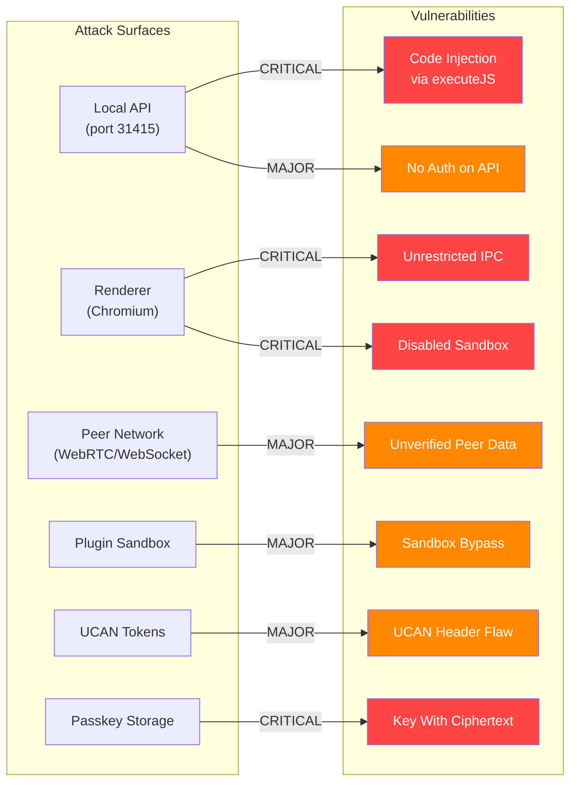
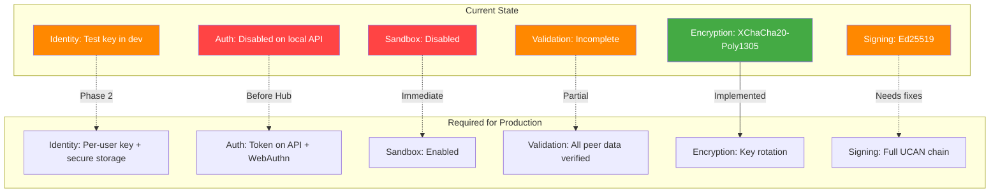

# 01 - Security Vulnerabilities

## Overview

This document catalogs security vulnerabilities found across the xNet codebase, organized by severity and attack surface.



---

## Critical Vulnerabilities

### SEC-01: Chromium Sandbox Disabled

**Package:** `apps/electron`
**File:** `src/main/index.ts:55`

```typescript
webPreferences: {
  preload: join(__dirname, '../preload/index.mjs'),
  sandbox: false,          // CRITICAL: Sandbox disabled
  contextIsolation: true,  // Good, but insufficient alone
  nodeIntegration: false,  // Good, but insufficient alone
}
```

The Chromium sandbox is the primary security boundary in Electron. Disabling it means:

- Preload scripts run with full Node.js access
- Any renderer-side vulnerability (XSS, injection) gains system-level access
- `contextIsolation` alone cannot prevent exploitation

**Fix:** Enable `sandbox: true` and restructure preload code to use IPC for all main-process operations.

---

### SEC-02: Unrestricted IPC Channel Forwarding

**Package:** `apps/electron`
**File:** `src/preload/index.ts:145-154`

```typescript
contextBridge.exposeInMainWorld('xnetServices', {
  invoke: <T>(channel: string, ...args: unknown[]): Promise<T> =>
    ipcRenderer.invoke(channel, ...args),
  on: (channel: string, handler: (...args: unknown[]) => void): void => {
    ipcRenderer.on(channel, (_event, ...args) => handler(...args))
  }
})
```

This exposes an unrestricted `ipcRenderer.invoke()` to the renderer. Any code in the renderer (including injected scripts) can invoke ANY IPC channel.

**Fix:** Add a channel allowlist:

```typescript
const ALLOWED_CHANNELS = new Set(['xnet:node:create', 'xnet:node:get', ...])
invoke: (channel, ...args) => {
    if (!ALLOWED_CHANNELS.has(channel)) throw new Error(`Blocked: ${channel}`)
    return ipcRenderer.invoke(channel, ...args)
}
```

---

### SEC-03: Code Injection via `executeJavaScript` in Local API

**Package:** `apps/electron`
**File:** `src/main/local-api.ts:41-156`

```typescript
return win.webContents.executeJavaScript(`
  (async () => {
    const store = window.__xnetNodeStore;
    if (!store) return null;
    const node = await store.get('${id}');  // User input interpolated
    // ...
  })()
`)
```

The Local API proxy uses `executeJavaScript` with string interpolation of user-provided IDs.

**Attack vector:** Any local process can send:

```
GET http://127.0.0.1:31415/api/nodes/'); require('child_process').exec('rm -rf /'); ('
```

**Fix:** Use IPC messages instead of `executeJavaScript`. Pass parameters as structured data.

---

### SEC-04: Passkey Fallback Stores Encryption Key with Ciphertext

**Package:** `@xnetjs/identity`
**File:** `packages/identity/src/passkey.ts:32-45`

```typescript
async store(keyBundle: KeyBundle, credentialId: string): Promise<StoredKey> {
  const key = generateKey()
  const serialized = serializeKeyBundle(keyBundle)
  const encrypted = encrypt(serialized, key)
  return {
    id: credentialId,
    encryptedKey: concatBytes(encrypted.nonce, encrypted.ciphertext),
    salt: key, // CRITICAL: Encryption key stored alongside encrypted data
    created: Date.now()
  }
}
```

The encryption key is stored in the `salt` field alongside the encrypted data. Anyone with IndexedDB access can decrypt private keys.

**Fix:** Either remove this class or clearly mark as test-only. In production, derive key from WebAuthn PRF output.

---

## Major Vulnerabilities

### SEC-05: No Authentication on Local API

**Package:** `apps/electron`
**File:** `src/main/local-api.ts:211-217`

```typescript
apiServer = createLocalAPI({
  port: 31415,
  host: '127.0.0.1',
  store: nodeStoreProxy,
  schemas: schemaRegistryProxy
  // token: process.env.XNET_API_TOKEN // Optional auth COMMENTED OUT
})
```

The HTTP API has authentication commented out. Any local process can read/write/delete all data.

**Fix:** Enable token authentication by default.

---

### SEC-06: CORS Wildcard on Local API

**Package:** `@xnetjs/plugins`
**File:** `src/services/local-api.ts:218`

```typescript
res.setHeader('Access-Control-Allow-Origin', '*')
```

Combined with no authentication, this enables CSRF attacks from malicious websites.

**Fix:** Remove CORS headers or restrict to specific origins.

---

### SEC-07: Plugin Process Manager Arbitrary Command Execution

**Package:** `@xnetjs/plugins`
**File:** `src/services/process-manager.ts:73-82`

```typescript
const { command, args = [], cwd, env, shell } = this.definition.process

this.process = spawn(command, args, {
  cwd,
  env: { ...process.env, ...env },
  shell: shell ?? false
})
```

Plugins can execute arbitrary system commands without validation.

**Fix:** Implement an allowlist of permitted commands.

---

### SEC-08: Plugin Sandbox Timeout Not Enforced for Sync Execution

**Package:** `@xnetjs/plugins`
**File:** `src/sandbox/sandbox.ts:117-137`

```typescript
executeSync(code: string, context: ScriptContext): unknown {
  const fn = this.createIsolatedFunction(code)
  try {
    const result = fn(context)  // Can run forever - no timeout
    return this.sanitizeOutput(result)
  }
}
```

The `executeSync` method has no timeout protection. An infinite loop (`while(true){}`) freezes the UI.

**Fix:** Use a web worker with `setTimeout` termination.

---

### SEC-09: Yjs Updates Applied Without Signature Verification (Network)

**Package:** `@xnetjs/network`
**File:** `packages/network/src/protocols/sync.ts:112`

```typescript
Y.applyUpdate(doc.ydoc, msg.payload) // Applied without signature check
```

The network layer applies Yjs updates without using the signed envelope verification from `@xnetjs/sync`.

**Fix:** Wire `verifyYjsEnvelope()` into the sync protocol.

---

### SEC-10: Yjs Updates Applied Without Signature Verification (IPC)

**Package:** `apps/electron`
**File:** `src/main/ipc.ts:142-143`

```typescript
const update = new Uint8Array(data.content)
Y.applyUpdate(existingDoc.ydoc, update) // Applied without verification
```

Same issue in the IPC path - updates from renderer are trusted.

**Fix:** Verify signatures before applying Yjs updates.

---

### SEC-11: UCAN Header Algorithm Not Validated

**Package:** `@xnetjs/identity`
**File:** `packages/identity/src/ucan.ts:284-305`

```typescript
function parseUCAN(token: string): ParsedToken | null {
  const header = JSON.parse(fromBase64Url(headerPart)) as UCANHeader
  // header.alg is NOT validated - could be 'none' or anything
  const payload = parsePayload(payloadRaw)
}
```

An attacker could set `alg: "none"` in the header. While verification uses Ed25519 regardless, this violates JWT best practices.

**Fix:** Validate `header.alg === 'EdDSA'` and `header.typ === 'JWT'`.

---

### SEC-12: UCAN Proof Chain Only Checks Immediate Parents

**Package:** `@xnetjs/identity`
**File:** `packages/identity/src/ucan.ts:104-131`

The capability attenuation check only considers the immediate parent level, not the full chain.

**Fix:** Aggregate capabilities from all proofs in the chain.

---

### SEC-13: parseShareLink Returns Unverified Claims

**Package:** `@xnetjs/identity`
**File:** `packages/identity/src/sharing/parse-share.ts:86-97`

```typescript
// Parse the UCAN to extract metadata (NO VERIFICATION!)
payload = JSON.parse(fromBase64Url(ucanParts[1]))
```

The function returns `issuer`, `audience`, `permissions` directly from unverified token.

**Fix:** Rename to `parseShareLinkUNSAFE` or require verification before exposing claims.

---

## Minor Vulnerabilities

### SEC-14: Timing-Safe Comparison Not Used for Token

**Package:** `@xnetjs/plugins`
**File:** `src/services/local-api.ts:230-235`

```typescript
if (!auth || auth !== `Bearer ${this.config.token}`) {  // Direct comparison
```

Token comparison is vulnerable to timing attacks.

**Fix:** Use `constantTimeEqual` from `@xnetjs/crypto`.

---

### SEC-15: innerHTML Usage in Editor

**Package:** `@xnetjs/editor`
**File:** `src/extensions/embed/EmbedLinkPlugin.ts:37`

```typescript
tooltip.innerHTML = `<button type="button" ...>`
```

Pattern is risky if user content is added.

**Fix:** Use DOM APIs instead.

---

### SEC-16: Rate Limiter State Not Persisted

**Package:** `@xnetjs/network`
**File:** `src/security/rate-limiter.ts`

Rate limit state is in-memory only. Restart or peer ID rotation bypasses limits.

**Fix:** Persist state and track by IP address.

---

### SEC-17: SSRF Protection Incomplete for DNS Rebinding

**Package:** `@xnetjs/hub`
**File:** `src/utils/url.ts:21-25`

Hostname validation doesn't prevent DNS rebinding attacks.

**Fix:** Validate resolved IP at connection time.

---

## Security Architecture Assessment



## Recommendations

### Immediate (Before Daily Use)

- [x] **SEC-01:** Enable Chromium sandbox (`sandbox: true`) _(fixed bdada0a)_
- [x] **SEC-02:** Add IPC channel allowlist _(fixed bdada0a)_
- [x] **SEC-03:** Replace `executeJavaScript` with structured IPC _(fixed 93d07a1)_
- [x] **SEC-04:** Remove or mark BrowserPasskeyStorage as test-only _(fixed 93d07a1)_

### Before Hub Launch

- [x] **SEC-05:** Enable token authentication on Local API _(fixed a190622)_
- [x] **SEC-06:** Remove CORS wildcard from Local API _(fixed - configurable allowedOrigins)_
- [x] **SEC-09/10:** Wire signature verification into all Yjs update paths _(fixed a190622)_
- [x] **SEC-11:** Validate UCAN header algorithm field _(fixed f378ef6)_

### Before Production

- [ ] **SEC-07:** Implement plugin command allowlist
- [ ] **SEC-08:** Move plugin execution to Web Workers
- [ ] **SEC-12:** Fix UCAN proof chain validation
- [x] **SEC-14:** Use constant-time token comparison _(fixed bdada0a)_
