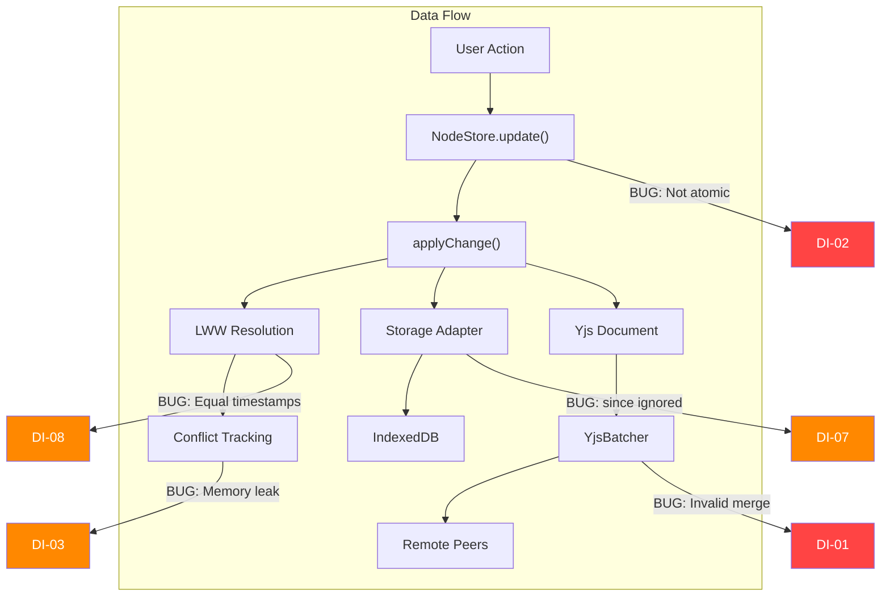
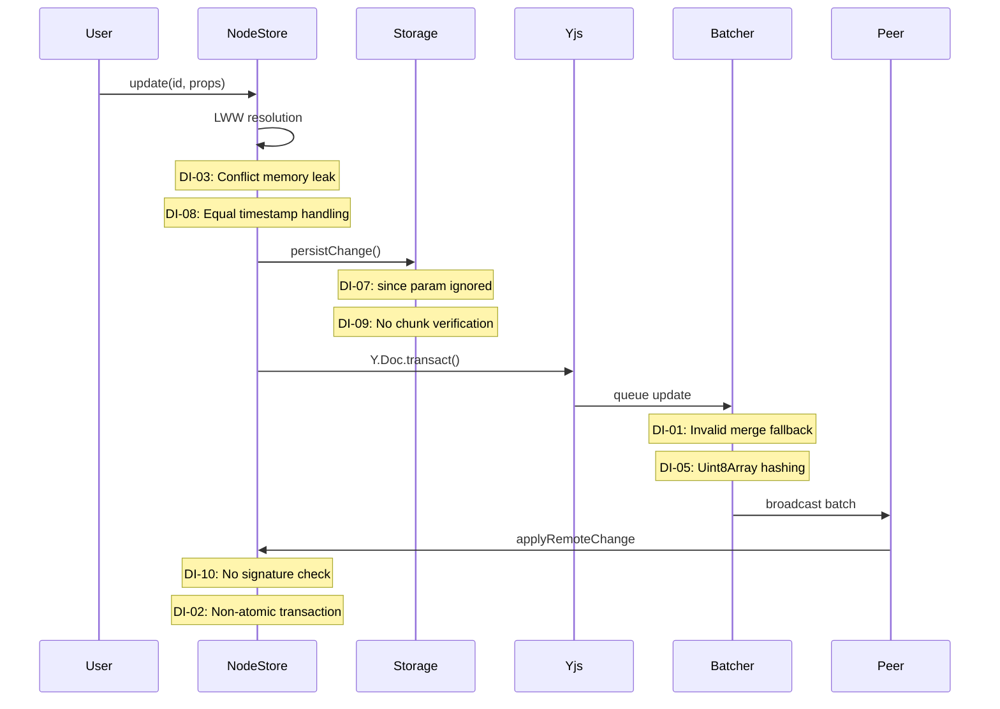

# 02 - Data Integrity Issues

## Overview

This document covers bugs and design issues that can cause data corruption, silent data loss, or incorrect conflict resolution in the xNet data layer.



---

## Critical Issues

### DI-01: YjsBatcher defaultMergeUpdates Produces Invalid Yjs Data

**Package:** `@xnet/sync`
**File:** `packages/sync/src/yjs-batcher.ts:56-72`

```typescript
function defaultMergeUpdates(updates: Uint8Array[]): Uint8Array {
  // Simple concatenation fallback
  const totalLength = updates.reduce((sum, u) => sum + u.length, 0)
  const result = new Uint8Array(totalLength)
  let offset = 0
  for (const update of updates) {
    result.set(update, offset)
    offset += update.length
  }
  return result
}
```

Concatenating Yjs update buffers does **not** produce a valid Yjs update. `Y.applyUpdate()` on the result will either throw or corrupt document state.

**Impact:** Silent document corruption if `YjsBatcher` is used without explicitly providing `Y.mergeUpdates`.

**Fix:** Make `mergeUpdates` a required parameter, or throw an error if not provided.

---

### DI-02: Transactions Are Not Atomic

**Package:** `@xnet/data`
**File:** `packages/data/src/store/store.ts:358-465`

```typescript
async transaction(operations: TransactionOperation[]): Promise<TransactionResult> {
  for (let i = 0; i < resolvedOps.length; i++) {
    // Each operation is applied immediately
    // If op 3 of 5 fails, ops 1-2 are already persisted
    await this.applyChange(change)
  }
}
```

**Impact:** Partial transactions leave the data store in an inconsistent state. Moving a node between databases (delete + create) could succeed on delete but fail on create.

**Fix:** Buffer all changes, validate, then apply in a single batch with rollback on failure.

---

## Major Issues

### DI-03: Memory Leak in Conflict Tracking

**Package:** `@xnet/data`
**File:** `packages/data/src/store/store.ts:530-532`

```typescript
getRecentConflicts(): MergeConflict[] {
  return this.conflicts.slice(-100)  // But array keeps growing!
}
```

Conflicts are pushed indefinitely but only the last 100 are returned.

**Impact:** Long-running applications with sync activity experience memory growth.

**Fix:** Trim array when size exceeds threshold.

---

### DI-04: getChangesSince Uses Exclusive Comparison

**Package:** `@xnet/data`
**File:** `packages/data/src/store/indexeddb-adapter.ts:152-157`

```typescript
const range = IDBKeyRange.lowerBound(sinceLamport, true) // Exclusive
```

If two changes have the same Lamport time, the change exactly at `sinceLamport` is missed.

**Impact:** Lost changes during delta sync with concurrent changes.

**Fix:** Use inclusive comparison and deduplicate at caller.

---

### DI-05: Hash Computation Non-Deterministic for Uint8Array

**Package:** `@xnet/sync`
**File:** `packages/sync/src/change.ts:211-216`

```typescript
const json = JSON.stringify(sortObjectKeys(toHash))
```

`JSON.stringify` on `Uint8Array` produces `{"0":1,"1":2,...}` which is not canonical across environments.

**Impact:** Hash verification fails after data passes through serialization boundary.

**Fix:** Convert `Uint8Array` to hex/base64 before hashing.

---

### DI-06: Memory Adapter Allows Duplicate Changes

**Package:** `@xnet/data`
**File:** `packages/data/src/store/memory-adapter.ts:38-48`

Unlike IndexedDB (which uses `put()` for idempotent upserts), memory adapter uses `push()`.

**Impact:** Duplicate changes accumulate during sync.

**Fix:** Check hash before appending.

---

### DI-07: Snapshot Loading Ignores `since` Parameter

**Package:** `@xnet/storage`
**File:** `packages/storage/src/adapters/indexeddb.ts:99-103`

```typescript
async getUpdates(docId: string, _since?: string): Promise<SignedUpdate[]> {
  // _since is ignored - always returns all updates
}
```

**Impact:** Document load time scales linearly with edit history even when snapshots exist.

**Fix:** Implement `since` parameter filtering.

---

### DI-08: LWW Doesn't Handle Equal Timestamps Deterministically

**Package:** `@xnet/data`
**File:** `packages/data/src/store/store.ts:786-788`

```typescript
private shouldReplace(existing: PropertyTimestamp, incoming: PropertyTimestamp): boolean {
  const cmp = compareLamportTimestamps(incoming.lamport, existing.lamport)
  return cmp > 0  // When equal (0), first-seen wins - not deterministic
}
```

**Impact:** Different replicas may see different values when timestamps are exactly equal.

**Fix:** Add deterministic tiebreaker (e.g., compare `wallTime` or DID).

---

### DI-09: Chunk Reassembly Has No Integrity Verification

**Package:** `@xnet/storage`
**File:** `packages/storage/src/chunk-manager.ts:216-229`

`reassembleChunks()` never verifies the `rootHash` from the manifest.

**Impact:** Corrupted chunks are silently reassembled.

**Fix:** Verify Merkle root after reassembly.

---

### DI-10: Remote Change Applied Without Signature Verification

**Package:** `@xnet/data`
**File:** `packages/data/src/store/store.ts:474-484`

```typescript
async applyRemoteChange(change: NodeChange): Promise<void> {
  // No signature verification before applying
  await this.applyChange(change)
}
```

**Impact:** Malicious/corrupted remote changes applied to local store.

**Fix:** Call `verifyChange()` before applying.

---

## Minor Issues

### DI-11: Schema Migration Warnings Not Surfaced

**Package:** `@xnet/data`
**File:** `packages/data/src/store/store.ts:182-199`

Lossy migration warnings in `_migrationInfo` are not persisted or surfaced to users.

---

### DI-12: Timestamp Parsing Fragile for DIDs with Dashes

**Package:** `@xnet/sync`
**File:** `packages/sync/src/clock.ts:127-142`

`parseTimestamp()` uses `indexOf('-')` to split, but custom DIDs might contain dashes.

---

### DI-13: verifyChangeHash Field Reconstruction Fragile

**Package:** `@xnet/sync`
**File:** `packages/sync/src/change.ts:275-301`

Manual reconstruction must be updated when new fields are added.

---

### DI-14: Lens BFS Doesn't Prefer Lossless Paths

**Package:** `@xnet/data`
**File:** `packages/data/src/schema/lens.ts:282-317`

BFS finds shortest path, not most lossless path.

---

### DI-15: Snapshot Signature Doesn't Include stateVector

**Package:** `@xnet/storage`
**File:** `packages/storage/src/snapshots/manager.ts:79-87`

Attacker could modify stateVector without invalidating signature.

---

## Data Flow Integrity Assessment



## Recommendations

### Phase 1 (Daily Driver)

- [x] **DI-01:** Make `mergeUpdates` required in YjsBatcher (critical - corrupts documents) _(fixed f378ef6)_
- [x] **DI-03:** Trim conflicts array when size exceeds threshold _(already implemented)_
- [x] **DI-08:** Add deterministic tiebreaker for equal Lamport timestamps _(already implemented via author DID comparison)_
- [x] **DI-10:** Add signature verification to `applyRemoteChange` _(fixed 3b16835)_

### Phase 2 (Hub MVP)

- [ ] **DI-02:** Implement transaction rollback with pre-transaction snapshot
- [ ] **DI-04:** Use inclusive comparison in `getChangesSince` and deduplicate
- [ ] **DI-05:** Convert `Uint8Array` to hex/base64 before hash computation
- [ ] **DI-06:** Check hash before appending in memory adapter
- [ ] **DI-07:** Implement `since` parameter in storage adapters

### Phase 3 (Production)

- [ ] **DI-09:** Verify Merkle root after chunk reassembly
- [ ] **DI-14:** Implement weighted graph search preferring lossless lens paths
- [ ] **DI-15:** Include stateVector in snapshot signature
