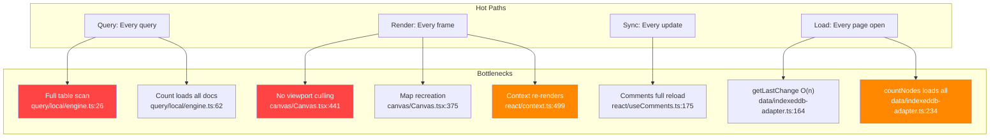
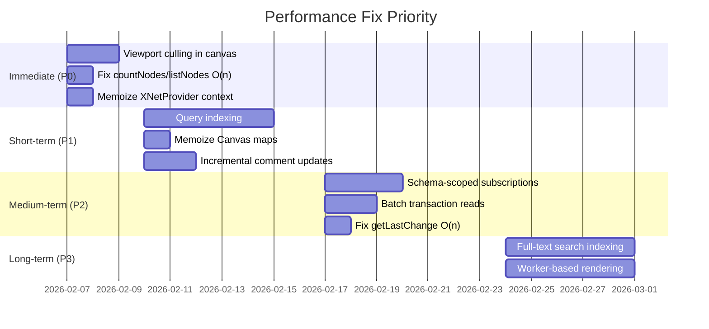

# 03 - Performance Bottlenecks

## Overview

This document identifies performance issues across the codebase that will become problematic as data volume grows.



---

## Critical Performance Issues

### PERF-01: Every Query Performs a Full Table Scan

**Package:** `@xnet/query`
**File:** `packages/query/src/local/engine.ts:25-42`

```typescript
const docIds = await storage.listDocuments()
for (const docId of docIds) {
  const doc = await getDocument(docId) // Sequential I/O for EVERY doc
  // ... filter in memory
}
```

Every query loads every document, then filters in JavaScript.

**Impact at scale:**

| Documents | Query time (estimated) |
| --------- | ---------------------- |
| 100       | ~50ms                  |
| 1,000     | ~500ms                 |
| 10,000    | ~5s                    |

**Fix:** Implement IndexedDB secondary indexes or integrate MiniSearch.

---

### PERF-02: `count()` Loads All Documents Just to Count

**Package:** `@xnet/query`
**File:** `packages/query/src/local/engine.ts:62-65`

```typescript
async count(q: Query): Promise<number> {
  const result = await this.query(q)  // Full table scan!
  return result.total
}
```

**Fix:** Use `IDBObjectStore.count()` with index filtering.

---

### PERF-03: Canvas Renders ALL Nodes (No Viewport Culling)

**Package:** `@xnet/canvas`
**File:** `packages/canvas/src/renderer/Canvas.tsx:441-456`

```typescript
{nodes.map((node) => (  // Renders ALL nodes!
  <CanvasNodeComponent key={node.id} node={node} ... />
))}
```

The `SpatialIndex` exists but is never used in the render path.

**Impact:**

| Nodes  | Render cost     |
| ------ | --------------- |
| 50     | Smooth          |
| 200    | Noticeable jank |
| 1,000+ | Unusable        |

**Fix:**

```typescript
const visibleNodes = useMemo(() => {
  const rect = viewportState.getVisibleRect()
  return store.getVisibleNodes(rect)
}, [store, viewportState])

{visibleNodes.map((node) => <CanvasNodeComponent ... />)}
```

---

### PERF-04: `countNodes` Loads All Nodes Into Memory

**Package:** `@xnet/data`
**File:** `packages/data/src/store/indexeddb-adapter.ts:234-251`

```typescript
async countNodes(options?: CountNodesOptions): Promise<number> {
  let nodes: NodeState[]
  if (options?.schemaId) {
    nodes = await db.getAllFromIndex('nodes', 'bySchema', options.schemaId)
  } else {
    nodes = await db.getAll('nodes')  // Loads ALL nodes!
  }
  if (!options?.includeDeleted) {
    nodes = nodes.filter((n) => !n.deleted)
  }
  return nodes.length
}
```

**Fix:** Use IDB's native `count()` method with indexes.

---

### PERF-05: N+1 Query Pattern in Transactions

**Package:** `@xnet/data`
**File:** `packages/data/src/store/store.ts:358-404`

Each transaction operation sequentially calls `storage.getNode()` and `storage.getLastChange()`.

**Impact:** A 10-update transaction makes 20+ sequential IndexedDB reads.

**Fix:** Batch-fetch all node IDs at start of transaction.

---

## Major Performance Issues

### PERF-06: XNetProvider Context Value Not Memoized

**Package:** `@xnet/react`
**File:** `packages/react/src/context.ts:499-512`

```typescript
return (
  <XNetContext.Provider
    value={{  // New object every render!
      store,
      identity,
      sync,
      // ...
    }}
  >
```

**Impact:** Every render of XNetProvider triggers re-renders of all context consumers.

**Fix:** Wrap context value in `useMemo`.

---

### PERF-07: Map Recreation on Every Canvas Render

**Package:** `@xnet/canvas`
**File:** `packages/canvas/src/renderer/Canvas.tsx:375`

```typescript
const nodeMap = new Map(nodes.map((n) => [n.id, n])) // New Map every render
```

**Fix:** Use `useMemo`.

---

### PERF-08: Comment Object Map Recreation

**Package:** `@xnet/canvas`
**File:** `packages/canvas/src/renderer/Canvas.tsx:469-480`

```typescript
<CommentOverlay
  objects={new Map(nodes.map((n) => [...]))}  // New Map every render
/>
```

**Fix:** Memoize the Map.

---

### PERF-09: Comments Hook Reloads All on Any Change

**Package:** `@xnet/react`
**File:** `packages/react/src/hooks/useComments.ts:175-194`

Any comment change triggers full `loadComments()` reload.

**Fix:** Update state incrementally instead of full reload.

---

### PERF-10: `getLastChange` Loads Entire History

**Package:** `@xnet/data`
**File:** `packages/data/src/store/indexeddb-adapter.ts:164-171`

```typescript
const changes = await db.getAllFromIndex('changes', 'byNodeId', nodeId)
changes.sort((a, b) => b.lamport.time - a.lamport.time)
return changes[0]
```

**Impact:** A node with 100 edits loads 100 records just to get the latest.

**Fix:** Use IDB cursor with direction `'prev'`.

---

### PERF-11: `listNodes` Loads All Then Paginates

**Package:** `@xnet/data`
**File:** `packages/data/src/store/indexeddb-adapter.ts:207-232`

```typescript
nodes = await db.getAll('nodes') // Load ALL
nodes.sort((a, b) => b.createdAt - a.createdAt) // Sort in memory
return nodes.slice(offset, offset + limit) // Slice after loading
```

**Fix:** Use IDB cursor with `advance()` for offset.

---

### PERF-12: useQuery Subscribes to ALL Store Changes

**Package:** `@xnet/react`
**File:** `packages/react/src/hooks/useQuery.ts:332-403`

Every `useQuery` hook subscribes globally and filters events in callback.

**Impact:** 50 useQuery hooks = 50 callbacks per NodeStore change.

**Fix:** Add schema-scoped subscription API.

---

### PERF-13: DevTools NodeExplorer Polling (2s Interval)

**Package:** `@xnet/devtools`
**File:** `packages/devtools/src/panels/NodeExplorer/useNodeExplorer.ts:56-64`

```typescript
const interval = setInterval(loadNodes, 2000)
```

**Fix:** Remove polling, rely on `store.subscribe()`.

---

## Minor Performance Issues

### PERF-14: Viewport Clone on Every Pan/Zoom

**Package:** `@xnet/canvas`
**File:** `packages/canvas/src/hooks/useCanvas.ts:254-265`

Creates new Viewport object on every pan/zoom.

---

### PERF-15: LRU Eviction Sorts All Warm Entries

**Package:** `@xnet/react`
**File:** `packages/react/src/sync/node-pool.ts:97-113`

**Fix:** Use proper LRU data structure.

---

### PERF-16: NodeStore Conflict Array Grows Unbounded

**Package:** `@xnet/data`
**File:** `packages/data/src/store/store.ts:530-531`

Memory leak - `conflicts` array never trimmed.

---

### PERF-17: Sequential Thread Deletion

**Package:** `@xnet/react`
**File:** `packages/react/src/hooks/useComments.ts:379-386`

```typescript
for (const reply of thread.replies) {
  await store.delete(reply.id) // Sequential!
}
```

**Fix:** Use `Promise.all()` or single transaction.

---

### PERF-18: OfflineQueue Saves on Every Enqueue

**Package:** `@xnet/react`
**File:** `packages/react/src/sync/offline-queue.ts:73-75`

**Fix:** Debounce save operation.

---

## Performance Optimization Roadmap



## Recommendations

### Phase 1 (Daily Driver)

- [x] **PERF-03:** Use `SpatialIndex.search(viewport)` in Canvas renderer _(fixed 93d07a1)_
- [x] **PERF-04:** Fix `countNodes` to use `db.count()` / cursor _(fixed bdada0a)_
- [x] **PERF-06:** Memoize `contextValue` in `XNetProvider` _(fixed f378ef6)_
- [x] **PERF-07/08:** Memoize Canvas Maps _(fixed a190622)_

### Phase 2 (Hub MVP)

- [ ] **PERF-01:** Add query indexing (IDB secondary indexes or MiniSearch)
- [ ] **PERF-02:** Implement dedicated `count()` using IDB count
- [ ] **PERF-05:** Batch IndexedDB operations in transactions
- [ ] **PERF-09:** Incremental comment state updates
- [x] **PERF-10:** Use cursor with `'prev'` for `getLastChange` _(fixed a190622)_
- [ ] **PERF-11:** Use cursor pagination for `listNodes`

### Phase 3 (Production)

- [ ] **PERF-12:** Add schema-scoped subscription API to NodeStore
- [ ] **PERF-13:** Remove DevTools polling
- [ ] **PERF-15:** Implement proper LRU data structure
