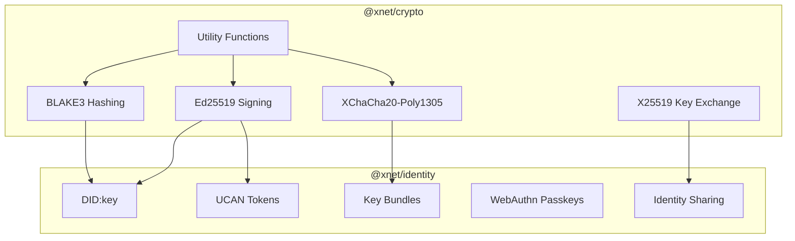

# 04 - Crypto & Identity Packages

## Overview

Review of `@xnet/crypto` and `@xnet/identity` - the security-critical foundation packages.



---

## Critical Issues

### CRYPTO-01: BrowserPasskeyStorage Stores Key with Ciphertext

**Package:** `@xnet/identity`
**File:** `packages/identity/src/passkey.ts:32-45`

```typescript
return {
  id: credentialId,
  encryptedKey: concatBytes(encrypted.nonce, encrypted.ciphertext),
  salt: key, // CRITICAL: Encryption key stored alongside encrypted data
  created: Date.now()
}
```

**Security Impact:** Anyone with IndexedDB access (XSS, extension, malware) can decrypt private keys.

**Fix:** Remove class or mark as test-only. Use WebAuthn PRF in production.

---

## Major Issues

### CRYPTO-02: hexToBytes Doesn't Validate Hex Characters

**Package:** `@xnet/crypto`
**File:** `packages/crypto/src/utils.ts:22-30`

```typescript
export function hexToBytes(hex: string): Uint8Array {
  if (hex.length % 2 !== 0) {
    throw new Error('Hex string must have even length')
  }
  const bytes = new Uint8Array(hex.length / 2)
  for (let i = 0; i < bytes.length; i++) {
    bytes[i] = parseInt(hex.slice(i * 2, i * 2 + 2), 16)
  }
  return bytes
}
```

`parseInt("zz", 16)` returns `NaN`, which becomes `0` in Uint8Array. Invalid hex silently produces corrupted data.

**Fix:**

```typescript
if (!/^[0-9a-fA-F]*$/.test(hex)) {
  throw new Error('Invalid hex characters')
}
```

---

### CRYPTO-03: bytesToBase64 Fails on Large Arrays

**Package:** `@xnet/crypto`
**File:** `packages/crypto/src/utils.ts:41-43`

```typescript
export function bytesToBase64(bytes: Uint8Array): string {
  return btoa(String.fromCharCode(...bytes)) // Stack overflow for >65K bytes
}
```

Spread operator has stack size limit (~65K-125K elements).

**Fix:**

```typescript
export function bytesToBase64(bytes: Uint8Array): string {
  let binary = ''
  for (let i = 0; i < bytes.length; i++) {
    binary += String.fromCharCode(bytes[i])
  }
  return btoa(binary)
}
```

---

### CRYPTO-04: deriveKeyBundle Uses Weak Key Derivation

**Package:** `@xnet/identity`
**File:** `packages/identity/src/keys.ts:16-44`

```typescript
const signingContext = new TextEncoder().encode('xnet-signing-key')
const signingInput = new Uint8Array(masterSeed.length + signingContext.length)
signingInput.set(masterSeed)
signingInput.set(signingContext, masterSeed.length)
const signingKey = hash(signingInput) // Just hash(seed || context)
```

Simple `hash(seed || context)` is not HKDF and lacks entropy extraction.

**Fix:**

```typescript
import { hkdf } from '@noble/hashes/hkdf.js'
import { sha256 } from '@noble/hashes/sha2.js'

const signingKey = hkdf(sha256, masterSeed, undefined, 'xnet-signing-key', 32)
```

---

### CRYPTO-05: UCAN parseUCAN Doesn't Validate Algorithm Header

**Package:** `@xnet/identity`
**File:** `packages/identity/src/ucan.ts:284-305`

```typescript
const header = JSON.parse(fromBase64Url(headerPart)) as UCANHeader
// header.alg is NOT validated - could be 'none'
```

**Fix:**

```typescript
if (header.alg !== 'EdDSA' || header.typ !== 'JWT') {
  return null
}
```

---

### CRYPTO-06: UCAN Proof Chain Only Checks Immediate Parents

**Package:** `@xnet/identity`
**File:** `packages/identity/src/ucan.ts:104-131`

Capability attenuation only considers immediate parent, not full chain.

**Fix:** Aggregate capabilities from all proofs.

---

### CRYPTO-07: Fallback Storage Encryption Key Exposed

**Package:** `@xnet/identity`
**File:** `packages/identity/src/passkey/types.ts:62-84`

```typescript
export type FallbackStorage = {
  encryptedBundle: Uint8Array
  nonce: Uint8Array
  encKey: Uint8Array // Stored alongside ciphertext
}
```

Same issue as CRYPTO-01 but in type system.

**Fix:** Derive key from user input or use non-extractable Web Crypto keys.

---

### CRYPTO-08: parseShareLink Returns Unverified Claims

**Package:** `@xnet/identity`
**File:** `packages/identity/src/sharing/parse-share.ts:86-97`

Returns `issuer`, `audience`, `permissions` from unverified token payload.

**Fix:** Rename to `parseShareLinkUNSAFE` or require verification.

---

## Minor Issues

### CRYPTO-09: constantTimeEqual Length Check Timing Leak

**Package:** `@xnet/crypto`
**File:** `packages/crypto/src/utils.ts:90-96`

```typescript
if (a.length !== b.length) return false // Early return
```

Leaks length information via timing.

---

### CRYPTO-10: randomBytes No Input Validation

**Package:** `@xnet/crypto`
**File:** `packages/crypto/src/random.ts:8-12`

Negative/non-integer length not validated.

---

### CRYPTO-11: Duplicate bytesToBase64url in hashing.ts

**Package:** `@xnet/crypto`
**File:** `packages/crypto/src/hashing.ts:32-42`

Reimplements with same spread issue.

---

### CRYPTO-12: createUCAN Doesn't Validate DID Formats

**Package:** `@xnet/identity`
**File:** `packages/identity/src/ucan.ts:136-155`

Invalid DIDs will create tokens that fail verification later.

---

### CRYPTO-13: identityFromPrivateKey Misleading Created Timestamp

**Package:** `@xnet/identity`
**File:** `packages/identity/src/did.ts:60-67`

Sets `created: Date.now()` when recreating from existing key.

---

### CRYPTO-14: discoverExistingPasskey Swallows All Errors

**Package:** `@xnet/identity`
**File:** `packages/identity/src/passkey/discovery.ts:57-85`

All errors caught silently, hiding security issues.

---

### CRYPTO-15: Storage Migration Creates Empty Key on Corruption

**Package:** `@xnet/identity`
**File:** `packages/identity/src/passkey/storage.ts:117-122`

Missing key data creates empty encryption key instead of throwing.

---

## Test Coverage

| Module                  | Tests | Coverage |
| ----------------------- | ----- | -------- |
| signing.test.ts         | 8     | HIGH     |
| symmetric.test.ts       | 8     | HIGH     |
| hashing.test.ts         | 5     | HIGH     |
| asymmetric.test.ts      | 6     | HIGH     |
| ucan.test.ts            | 13    | MEDIUM   |
| did.test.ts             | 8     | HIGH     |
| keys.test.ts            | 7     | MEDIUM   |
| passkey/\*.test.ts      | ~50   | MEDIUM   |
| sharing/sharing.test.ts | 39    | HIGH     |

**Gaps:**

- `utils.ts` - No tests for hexToBytes validation
- `random.ts` - No tests
- `passkey/fallback.ts` - No tests (security critical)

---

## Recommendations

### Immediate

- [x] **CRYPTO-01/07:** Remove or mark BrowserPasskeyStorage as test-only _(fixed 93d07a1)_
- [x] **CRYPTO-02:** Add hex character validation to hexToBytes _(fixed f378ef6)_
- [x] **CRYPTO-03:** Fix bytesToBase64 for large arrays _(fixed f378ef6)_

### Before Hub Launch

- [x] **CRYPTO-04:** Use proper HKDF in deriveKeyBundle _(fixed a190622)_
- [x] **CRYPTO-05:** Validate UCAN header algorithm _(fixed f378ef6)_
- [ ] **CRYPTO-06:** Fix proof chain capability aggregation
- [ ] **CRYPTO-08:** Rename parseShareLink or require verification

### Production

- [x] **CRYPTO-10:** Add input validation to randomBytes _(this session)_
- [x] **CRYPTO-11:** Remove duplicate bytesToBase64url _(this session)_
- [ ] Add tests for utils.ts and random.ts
