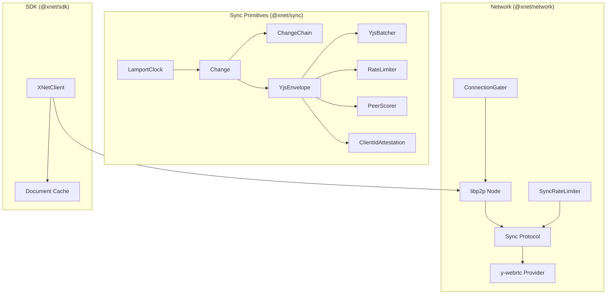
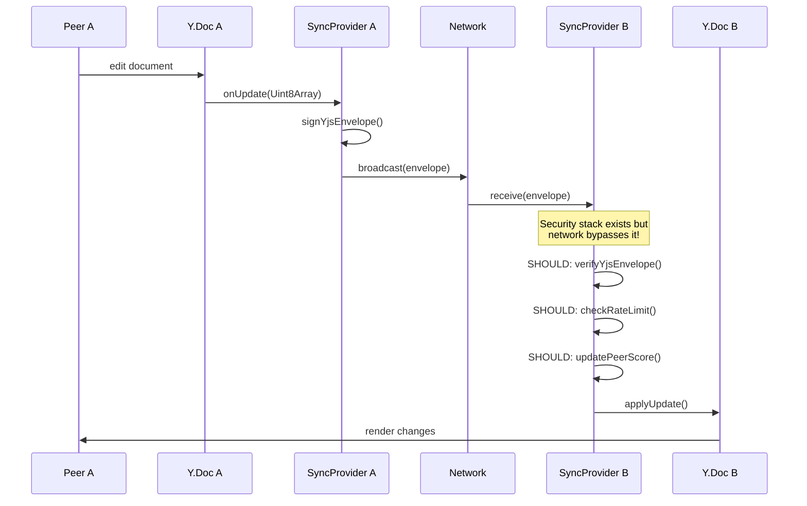

# 05 - Sync & Network Layer

## Overview

Review of `@xnet/sync`, `@xnet/network`, and `@xnet/sdk` - the synchronization and networking stack.



---

## Critical Issues

### SY-01: Weak Change ID Generation Uses Math.random()

**Package:** `@xnet/sync`
**File:** `packages/sync/src/change.ts:308-311`

```typescript
export function createChangeId(): string {
  return Math.random().toString(36).slice(2)
}
```

Not cryptographically secure. Predictable IDs could enable targeted attacks.

**Fix:** Use `crypto.randomUUID()` or `nanoid`.

---

### SY-02: Weak Batch ID Generation Uses Math.random()

**Package:** `@xnet/sync`
**File:** `packages/sync/src/change.ts:162-166`

Same issue for batch identifiers.

---

### SY-03: YjsBatcher defaultMergeUpdates Corrupts Data

**Package:** `@xnet/sync`
**File:** `packages/sync/src/yjs-batcher.ts:56-72`

```typescript
function defaultMergeUpdates(updates: Uint8Array[]): Uint8Array {
  // Simple concatenation - NOT valid Yjs format!
  const result = new Uint8Array(totalLength)
  // ...concatenates raw bytes...
}
```

Concatenated bytes are not a valid Yjs update.

**Fix:** Make `mergeUpdates` required or throw error.

---

### NW-01: Sync Protocol Bypasses Signature Verification

**Package:** `@xnet/network`
**File:** `packages/network/src/protocols/sync.ts:112`

```typescript
Y.applyUpdate(doc.ydoc, msg.payload) // No signature check!
```

The entire signed envelope security stack in `@xnet/sync` is bypassed.

**Fix:** Wire `verifyYjsEnvelope()` into sync protocol.

---

## Major Issues

### SY-04: Rate Limiter Memory Leak

**Package:** `@xnet/sync`
**File:** `packages/sync/src/yjs-limits.ts:69-142`

Per-peer windows stored in Maps but only cleaned via `remove()`. Long-running servers accumulate stale entries.

**Fix:** Add periodic cleanup or LRU cache.

---

### SY-05: ClientIdMap Cleanup in size() - Side Effect

**Package:** `@xnet/sync`
**File:** `packages/sync/src/clientid-attestation.ts:261-264`

```typescript
size(): number {
  this.cleanup()  // Mutates state!
  return this.ownerMap.size
}
```

Getter modifies state unexpectedly.

**Fix:** Remove cleanup from size().

---

### SY-06: Timestamp Parsing Fragile for DIDs with Dashes

**Package:** `@xnet/sync`
**File:** `packages/sync/src/clock.ts:127-142`

Uses `indexOf('-')` to split timestamp-author.

**Fix:** Use fixed-length time portion.

---

### NW-02: Denylist Timeout Not Cleaned Up

**Package:** `@xnet/network`
**File:** `packages/network/src/security/gater.ts:115-119`

`setTimeout` handle not stored, can't be cancelled on destroy.

**Fix:** Store and clear in destroy().

---

### NW-03: PeerScorer Decay Timer Not Stopped

**Package:** `@xnet/network`
**File:** `packages/network/src/security/peer-scorer.ts:104`

Interval continues even after all peers removed.

---

### NW-04: Connection Tracker Unbounded Array

**Package:** `@xnet/network`
**File:** `packages/network/src/security/tracker.ts:124-126`

`recentConnections` array can spike during connection flood.

---

### SDK-01: Document Cache Never Evicted

**Package:** `@xnet/sdk`
**File:** `packages/sdk/src/client.ts:108`

Simple Map with no eviction policy.

**Fix:** Implement LRU cache.

---

### SDK-02: Network Initialization Swallows Errors

**Package:** `@xnet/sdk`
**File:** `packages/sdk/src/client.ts:102-105`

```typescript
} catch (error) {
  console.warn('[XNetClient] Network initialization failed:', error)
}
```

Silent degradation makes debugging difficult.

---

## Minor Issues

### SY-07: Lamport Time Padding Limits to 10^16

**Package:** `@xnet/sync`
**File:** `packages/sync/src/clock.ts:119-121`

JavaScript safe integer limit could cause overflow.

---

### SY-08: IntegrityMonitor Division by Zero

**Package:** `@xnet/sync`
**File:** `packages/sync/src/integrity.ts:442`

`(report.valid / report.checked) * 100` when checked is 0.

---

### SY-09: Chain Validation Silent on Missing Parents

**Package:** `@xnet/sync`
**File:** `packages/sync/src/chain.ts:72-76`

Missing parent is not an error - could mask sync issues.

---

### NW-05: ywebrtc getConnectedPeers Returns Hardcoded Values

**Package:** `@xnet/network`
**File:** `packages/network/src/providers/ywebrtc.ts:47-49`

Returns 1 or 0 instead of actual count.

---

### NW-06: AutoBlocker Event Counts Never Pruned

**Package:** `@xnet/network`
**File:** `packages/network/src/security/auto-blocker.ts:220-228`

Peer IDs never removed from eventCounts.

---

### NW-07: Node Creation Ignores Private Key

**Package:** `@xnet/network`
**File:** `packages/network/src/node.ts:28-55`

`privateKey` parameter accepted but not used.

---

### SDK-03: connectToPeer Not Implemented

**Package:** `@xnet/sdk`
**File:** `packages/sdk/src/client.ts:233-237`

Throws "Network not enabled" even when enabled.

---

### SY-10: V1/V2 Serializer Base64 Stack Overflow

**Package:** `@xnet/sync`
**File:** `packages/sync/src/serializers/v1.ts:33-40`, `v2.ts:34-39`

Same spread operator issue as crypto package.

---

## Sync Architecture Assessment



**Key finding:** The sync layer has excellent security primitives (signed envelopes, rate limiting, peer scoring, attestation), but **the network layer bypasses all of them**.

---

## Test Coverage

| Module                       | Tests | Coverage |
| ---------------------------- | ----- | -------- |
| clock.test.ts                | 24    | HIGH     |
| change.test.ts               | 14    | HIGH     |
| chain.test.ts                | 24    | HIGH     |
| yjs-integrity.test.ts        | 23    | HIGH     |
| yjs-envelope.test.ts         | 20    | HIGH     |
| yjs-peer-scoring.test.ts     | 30    | HIGH     |
| yjs-limits.test.ts           | 28    | HIGH     |
| clientid-attestation.test.ts | 36    | HIGH     |
| security/\*.test.ts          | ~100  | HIGH     |

**The sync package is the best-tested package in the codebase (251+ tests).**

---

## Recommendations

### Phase 1 (Daily Driver)

- [x] **SY-01/02:** Replace `Math.random()` with `crypto.randomUUID()` _(already in codebase)_
- [x] **SY-03:** Make `mergeUpdates` required in YjsBatcher _(fixed f378ef6)_
- [x] **SY-10:** Fix V1/V2 serializer base64 for large arrays _(this session)_

### Phase 2 (Hub MVP)

- [x] **NW-01:** Wire signed envelope verification into network sync protocol _(fixed a190622)_
- [ ] **SY-04:** Add periodic cleanup to rate limiter
- [ ] **SY-05:** Remove cleanup side effect from size()
- [ ] **SDK-01:** Add LRU eviction to document cache
- [ ] **NW-02/03:** Clean up timers on destroy

### Phase 3 (Multiplayer)

- [ ] **NW-04:** Cap recentConnections array
- [ ] **NW-05:** Implement real peer counting in y-webrtc
- [ ] **SDK-03:** Implement connectToPeer
